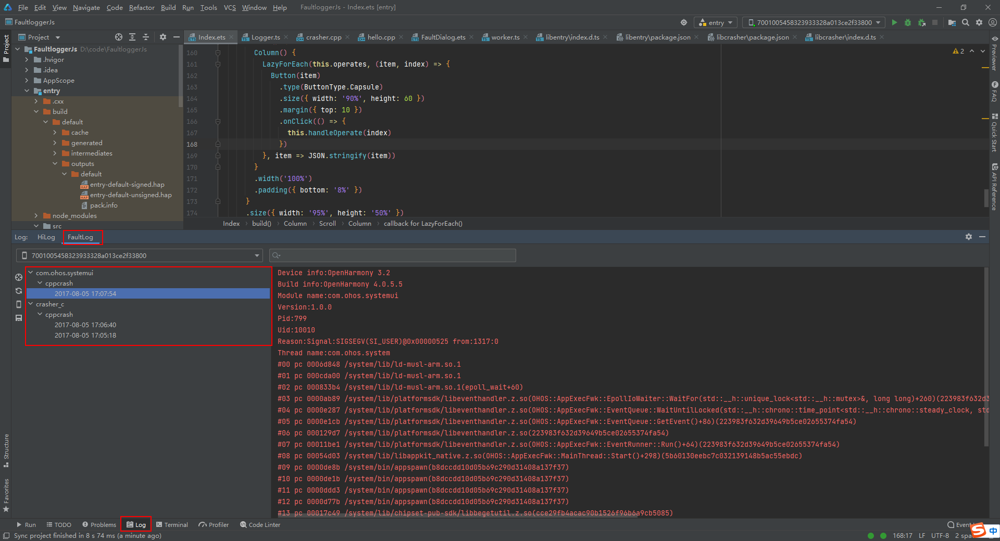

# cppcrash Log Analysis

## Introduction

A process crash refers to a C/C++ runtime crash. The FaultLogger module of OpenHarmony provides capabilities such as process crash detection, log collection, log storage, and log reporting, helping you to locate faults more effectively.

In this document, you'll be guided through how to implement process crash detection, crash log collection, and crash log analysis. Before getting started, make sure you have basic knowledge about C/C++ program stacks.

## Process Crash Detection

Process crash detection is implemented based on the Linux signal mechanism. Currently, C/C++ crash exception signals listed in the following table are supported.

| Signal Value| Signal| Description| Trigger Cause|
| ------ | --------- | --------------- | ------------------------------------------- |
| 4      | SIGILL    | Invalid instruction       | An invalid, incorrectly formatted, unknown, or privileged instruction is executed.|
| 5      | SIGTRAP   | Breakpoint or trap | An exception occurs or a trap instruction is executed.|
| 6      | SIGABRT   | Process abort       | The process is aborted abnormally. Generally, this problem occurs if the process calls the `abort()` function of the standard function library.|
| 7      | SIGBUS    | Illegal memory access   | The process accesses an aligned or nonexistent physical address.|
| 8      | SIGFPE    | Floating-point exception       | The process performs an incorrect arithmetic operation, for example, a 0 divisor, floating point overflow, or integer overflow.|
| 11     | SIGSEGV   | Invalid memory access   | The process accesses an invalid memory reference.|
| 16     | SIGSTKFLT | Stack error         | The processor performs an incorrect stack operation, such as a pop when the stack is empty or a push when the stack is full.|
| 31     | SIGSYS    | Incorrect system call | An incorrect or invalid parameter is used in a system call.|

## Crash Log Collection

Process crash log is the fault log managed together with the app freeze and JS application crash logs by the FaultLogger module. You can collect process crash logs in any of the following ways:

### Collecting Logs by Using Shell

- Fault logs in the `/data/log/faultlog/faultlogger/` directory of the device. The log files are named in the format of `cppcrash-process name-process UID-time (seconds level)`. They contain only information such as the device name, system version, and process crash call stack.

    

- Fault logs in the `/data/log/faultlog/temp/` directory of the device. The log files are named in the format of `cppcrash-process name-process PID-system timestamp (seconds level)`. In addition to basic information, they also contain information such as the stack memory and process maps at the time of process crash.

    

### Collecting Logs by Using DevEco Studio

DevEco Studio collects process crash logs from `/data/log/faultlog/faultlogger/` to FaultLog, where logs are displayed by process name, fault, and time.



### Collecting Logs by Using faultLogger APIs

The FaultLogger module provides APIs to query various fault information. For details, see [@ohos.faultLogger](../reference/apis/js-apis-faultLogger.md).

## Process Crash Log Analysis

### Log Format

The following is an example process crash log archived by DevEco Studio in FaultLog:

```
Generated by HiviewDFX@OpenHarmony
==================================================================
Device info:OpenHarmony 3.2     <- Device information
Build info:OpenHarmony 4.0.5.5  <- Version information
Module name:crasher_c   <- Module name
Pid:1205  <- Process ID
Uid:0  <- User ID
Reason:Signal:SIGSEGV(SEGV_ACCERR)@0x0042d33d   <- Exception information
Thread name:crasher <- Abnormal thread
#00 pc 0000332c /data/crasher(TriggerSegmentFaultException+15)(8bc37ceb8d6169e919d178fdc7f5449e)  <- Call stack
#01 pc 000035c7 /data/crasher(ParseAndDoCrash+277)(8bc37ceb8d6169e919d178fdc7f5449e)
#02 pc 00003689 /data/crasher(main+39)(8bc37ceb8d6169e919d178fdc7f5449e)
#03 pc 000c3b08 /system/lib/ld-musl-arm.so.1(__libc_start_main+116)
#04 pc 000032f8 /data/crasher(_start_c+112)(8bc37ceb8d6169e919d178fdc7f5449e)
#05 pc 00003284 /data/crasher(_start+32)(8bc37ceb8d6169e919d178fdc7f5449e)
...
```

### Locating Faults Through Logs

1. Determine the faulty module and fault type based on fault logs.

    Generally, you can identify the faulty module based on the crash process name and identify the crash cause based on the signal. Besides, you can restore the function call chain of the crash stack based on the method name in the stack.

    In the example, **SIGSEGV** is thrown by the Linux kernel because of access to an invalid memory address. The problem occurs in the **TriggerSegmentFaultException** function.

    In most scenarios, a crash is caused by the top layer of the crash stack, such as null pointer access and proactive program abort.

    If the cause cannot be located through the call stack, you need to check for other faults, for example, memory corruption or stack overflow.

2. Use the addr2line tool of Linux to parse the code line number to restore the call stack at the time of process crash.

    When using the addr2line tool to parse the code line number of the crash stack, make sure that binary files with debugging information is used. Generally, such files are generated during version build or application build.

    Application binary files are located in DevEco Studio's temporary directory for application build, for example, `build/default/intermediates/libs`.

    System binary files are stored in the directories listed below. For versions that are directly obtained, the binary files are archived in the image package.
    ```
    \code root directory\out\product\lib.unstripped
    \code root directory\out\product\exe.unstripped
    ```

    You can run `apt-get install addr2line` to install the addr2line tool on Linux.

    On On DevEco Studio, you can also use the llvm-addr2line tool archived in the SDK to parse code line numbers. The usage method is the same.

    The following example shows how to use the addr2line tool to parse the code line number based on the offset address:

    ```
    root:~/OpenHarmony/out/rk3568/exe.unstripped/hiviewdfx/faultloggerd$ addr2line -e crasher 0000332c
    base/hiviewdfx/faultloggerd/tools/crasher/dfx_crasher.c:57
    ```

    In this example, the crash is caused by assignment of a value to an unwritable area. It is in code line 57 in the **dfx_crasher.c** file. You can modify it to avoid the crash.

    If the obtained code line number is seemingly incorrect, you can fine-tune the address (for example, subtract the address by 1) or disable some compilation optimization items. It is known that the obtained code line number may be incorrect when Link Time Optimization (LTO) is enabled.
