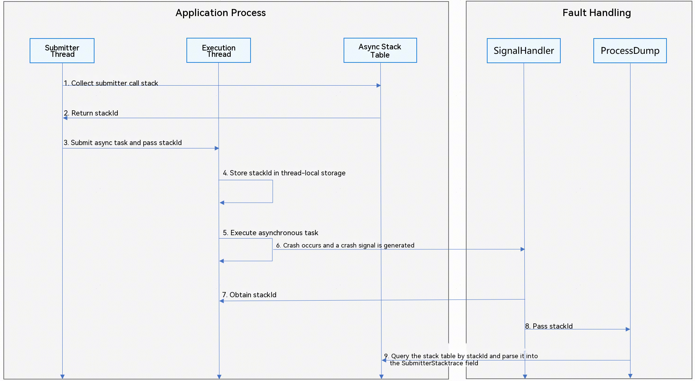

# C++ Crash (Process Crash) Detection

<!--Kit: Performance Analysis Kit-->
<!--Subsystem: HiviewDFX-->
<!--Owner: @chenshi51-->
<!--Designer: @Maplestory91-->
<!--Tester: @gcw_KuLfPSbe-->
<!--Adviser: @jinqiuheng-->
<!-- md-trans-meta sourceCommit=2127b60c8b93aed6c0fbd46139186a0afec1bcc8 translatedAt=2026-07-29T04:12:35.504Z pushedAt=2026-07-29T07:09:36.757Z -->

## Overview

After a process crashes, the system detects the crash, captures crash information, generates crash logs, and reports crash events, providing detailed maintenance and debugging logs for you to locate faults. This topic describes the CppCrash detection methods provided by the system in terms of basic concepts, implementation principles, restrictions, log obtaining, and log specifications.

## Basic Concepts

- **Signal**

  A mechanism for inter-process communication in POSIX-compliant operating systems.

- **Signal handler**

  A function that defines a series of processing operations executed by a process after receiving a signal. The signal handler must specify the signals it needs to handle.

- **pc**

  Program Counter (PC) stores the address of the instruction that is being executed by the program.

- **lr**

  Link Register stores the return address of the subprogram.

- **sp**

  Stack Pointer stores the address of the top of the stack for the current function.

- **fp**

  Frame Pointer stores the address of the bottom of the stack for the current function.

- **Call stack**

  Records the sequence of function calls for each thread, from its start up to the current point (such as the crash site).

- **Register**

  High-speed storage unit in the CPU, which are used to store data, instruction addresses, or status information required during the execution of computer programs. In this topic, register information refers to the data, instruction addresses, or status information stored in the register when a crash occurs.

## Implementation Principles

The system detects a process crash as follows:

- After a process crashes, it receives a crash signal from the kernel, which is processed by the signal handling module registered by the process during startup.

- After receiving the crash signal, the process saves the current process context and forks a child process to execute the **ProcessDump** command to capture crash information.

3. The **ProcessDump** process writes the crash log data to a temporary directory for storage.

4. After collecting crash logs, the **ProcessDump** process reports the logs to the HiView process, supplements some information (such as the system memory status and app page switching history) that can be obtained only by HiView, stores the crash logs in the **/data/log/faultlog/faultlogger** directory, and generates a fault event.

### Crash Signals

Based on the POSIX signal mechanism, the system's process crash detection capability supports the following crash signals.

| Signo| Signal| Description| Trigger Cause|
| -------- | -------- | -------- | -------- |
| 4 | SIGILL | Invalid instruction| An invalid, incorrectly formatted, unknown, or privileged instruction is executed.|
| 5 | SIGTRAP | Breakpoint or trap| An exception occurs or a trap instruction is executed.|
| 6 | SIGABRT | Process abort| The process is aborted abnormally. Generally, this exception occurs when the process calls **abort()** in the Standard Function Library.|
| 7 | SIGBUS | Illegal memory access| The process accesses an unaligned or nonexistent physical address.|
| 8 | SIGFPE | Floating-point exception| An incorrect arithmetic operation is executed, for example, a 0 divisor, floating point overflow, or integer overflow.|
| 11 | SIGSEGV | Invalid memory access | The process accesses an invalid memory region. |
| 16 | SIGSTKFLT | Stack error | The processor executes an incorrect stack operation, such as popping from an empty stack or pushing onto a full stack.<br>The SIGSTKFLT signal does not support minidump generation. |
| 31 | SIGSYS | Incorrect system call| An incorrect or invalid parameter is used in a system call.|

Crash signals are classified by error code (**code**) as follows:

### SIGILL

**SIGILL** indicates an invalid instruction exception in Unix and Unix-like operating systems. The trigger causes of **SIGILL** are as follows.

| Error Code (**code**)| Value| Description| Trigger Cause|
| -------- | -------- | -------- | -------- |
| 1 | ILL_ILLOPC | Illegal operation code| An instruction not supported by the CPU or an invalid instruction is executed.|
| 2 | ILL_ILLOPN | Illegal operand| An incorrect operand or improper operand type is used.|
| 3 | ILL_ILLADR | Illegal address| The program accesses an invalid memory address or an unaligned memory address.|
| 4 | ILL_ILLTRP | Illegal trap| The program performs an illegal trap instruction or an undefined operation.|
| 5 | ILL_PRVOPC | Illegal privileged operation code| A common user executes a privileged instruction.|
| 6 | ILL_PRVREG | Illegal privileged register|  A common user accesses a privileged register.|
| 7 | ILL_COPROC | Illegal coprocessor| The program performs an undefined coprocessor instruction.|
| 8 | ILL_BADSTK | Illegal stack| The program performs an operation at an invalid stack address, or when the stack overflows.|
| 0xacac | ILL_ILLPACCFI | Illegal pointer authentication| The program fails to verify a pointer.|

### SIGTRAP

**SIGTRAP** usually occurs in debugging and tracking. The trigger causes of **SIGTRAP** are as follows.

| Error Code (**code**)| Value| Description| Trigger Cause|
| -------- | -------- | -------- | -------- |
| 1 | TRAP_BRKPT | Software breakpoint| The program reaches the software breakpoint. When debugging a program, a software breakpoint at the key position can be used to pause the program execution and check information such as variable values.|
| 2 | TRAP_TRACE | Single-step debugging| The program executes a single instruction. Single instruction can be used to check the execution result of each instruction.|
| 3 | TRAP_BRANCH | Branch tracing| The program executes a branch instruction. Branch instruction can be used to control the execution process of a program, such as if statements and loop statements.|
| 4 | TRAP_HWBKPT | Hardware breakpoint| The program reaches the hardware breakpoint. When debugging a program, a hardware breakpoint at the key position can be used to pause the program execution and check information such as variable values. Unlike a software breakpoint, a hardware breakpoint is implemented in CPU hardware. Therefore, whether a hardware breakpoint is triggered can be detected in real time during program execution.|

### SIGBUS

The **SIGBUS** signal is sent by the operating system to a process. It usually indicates a memory access error. The trigger causes of **SIGBUS** are as follows.

| Error Code (**code**)| Value| Description| Trigger Cause|
| -------- | -------- | -------- | -------- |
| 1 | BUS_ADRALN | Unaligned memory address| The program accesses an unaligned memory address, for example, a non-even address of a 4-byte integer.|
| 2 | BUS_ADRERR | Invalid memory address| The program accesses a memory address that does not exist in the process address space, such as a null pointer.|
| 3 | BUS_OBJERR | Invalid object access| The program accesses a deleted or uninitialized object.|
| 4 | BUS_MCEERR_AR | Hardware memory error requiring immediate handling| The program accesses memory and encountered a hardware memory error requiring immediate handling.|
| 5 | BUS_MCEERR_AO | Hardware memory error requiring waiting or delayed handling| The program accesses memory and encountered a hardware memory error requiring waiting or delayed handling.|

### SIGFPE

The **SIGFPE** signal indicates a floating-point exception or an arithmetic exception. The trigger causes of **SIGFPE** are as follows.

| Error Code (**code**)| Value| Description| Trigger Cause|
| -------- | -------- | -------- | -------- |
| 1 | FPE_INTDIV | Invalid integer division|  The program performs an integer division operation while the divisor is zero.|
| 2 | FPE_INTOVF | Integer overflow|  The program performs an integer operation and the result exceeds the integer range.|
| 3 | FPE_FLTDIV | Invalid floating-point division|  The program performs a floating-point division operation while the divisor is zero.|
| 4 | FPE_FLTOVF | Floating-point overflow|  The program performs a floating-point operation and the result exceeds the upper limit of the floating-point number.|
| 5 | FPE_FLTUND | Floating-point underflow|  The program performs a floating-point operation and the result is less than the lower limit of the floating-point number.|
| 6 | FPE_FLTRES | Invalid floating-point result|  The program performs a floating-point operation and the result is undefined.|
| 7 | FPE_FLTINV | Invalid floating-point operation|  The program performs an invalid floating-point operation.|
| 8 | FPE_FLTSUB | Invalid floating-point operation result|  The program attempts to perform a floating-point operation and the floating-point result is out of range.|

### SIGSEGV

**SIGSEGV** occurs when a process accesses a non-existent memory address or an inaccessible address. The trigger causes of the **SIGSEGV** signal are described as follows:

| Error Code (**code**)| Value| Description| Trigger Cause|
| -------- | -------- | -------- | -------- |
| 1 | SEGV_MAPERR | Non-existent memory address| The process accesses a memory address that does not exist or that is not mapped to the process address space. This exception is usually caused by pointer errors or memory leaks.|
| 2 | SEGV_ACCERR | Inaccessible memory address| The process accesses an inaccessible memory address marked by the operating system, for example, writing data to read-only memory or executing memory without execution permission. This exception is usually caused by buffer overflow or modifying read-only memory.|

### Signal Causes

In addition to the preceding classification by **signo**, signals can also be classified by causes. The code values classified by causes are as follows.

| Error Code (**code**)| Value| Description| Trigger Cause|
| -------- | -------- | -------- | -------- |
| 0 | SI_USER | User space signal| Sent from a process in user space to another process, usually using **kill()**. For example, when a user presses **Ctrl+C** on the terminal, a **SIGINT** signal is sent to all foreground processes.|
| 0x80 | SI_KERNEL | Kernel signal| Sent from the kernel to a process when the kernel detects an error or exception. For example, when a process accesses an invalid memory address or executes an invalid instruction, the kernel sends a **SIGSEGV** signal to the process.|
| -1 | SI_QUEUE | **sigqueue()** signal| Sent from **sigqueue()**, with an additional integer value and a pointer can be carried. It is usually used for advanced communication between processes, such as transferring data or notifying a process that an event occurs.|
| -2 | SI_TIMER | Timer signal| Sent from a timer for executing scheduled tasks or periodic tasks. For example, when a timer expires, the kernel sends a **SIGALRM** signal to the process.|
| -3 | SI_MESGQ | Message queue signal| Sent from a message queue for inter-process communication. For example, when a process sends a message to a message queue, the kernel sends a **MESGQ** signal to the receiving process.|
| -4 | SI_ASYNCIO | Asynchronous I/O signal| Sent from an asynchronous I/O operation for non-blocking I/O operations. For example, when an I/O operation on a file descriptor is complete, the kernel sends an **ASYNCIO** signal to the process.|
| -5 | SI_SIGIO | Synchronous I/O signal| Sent from a synchronous I/O operation for blocking I/O operations. For example, when an I/O operation on a file descriptor is complete, the kernel sends a **SIGIO** signal to the process.|
| -6 | SI_TKILL | **tkill()** signal| Sent from the function **tkill()**, which is similar to the function **kill()**. Moreover, you can specify the ID of the thread that sends the signal using **tkill()**. It is usually used to send a signal to a specified thread in a multithreaded program.|

## Restrictions

- Processes are not advised to register signal handlers by themselves. After a process crashes, its exit may be delayed. If handling takes more than 5 seconds, the system may report the process as not responding.

- The **/data/log/faultlog/faultlogger** directory stores a maximum of 10 CppCrash logs for a process or application. If the upper limit is reached, the earliest CppCrash logs of the process or application will be deleted. It is recommended that you view the CppCrash logs in a timely manner during development and debugging to prevent crash information loss due to log deletion.

- The system has registered signal handlers for the preceding crash signals and signals **35**, **38**, and **42**. It is recommended that you do not register signal handlers for these signals in applications. Otherwise, the system detection capability may fail.

- By default, the asynchronous thread stack tracing functionality is enabled only in the ARM 64-bit system. For versions earlier than API version 22, the functionality of submitting asynchronous tasks by third-party and system applications through [libuv](../reference/native-lib/libuv.md) and [ffrt](../reference/apis-ffrt-kit/capi-ffrt.md) is enabled only in the debug version by default. Since API version 22, the functionality of submitting asynchronous tasks by third-party applications through **libuv** is enabled by default in both debug and release versions. The functionality of submitting asynchronous tasks by third-party and system applications through **ffrt** is enabled by default only in the debug version. For details about the crash log specifications, see [Asynchronous Thread Stack Tracing Faults](#asynchronous-thread-stack-tracing-faults).

## Obtaining Logs

Process crash logs are a type of fault logs. You can obtain them in any of the following ways:

**Method 1: DevEco Studio**

DevEco Studio collects process crash logs from **/data/log/faultlog/faultlogger/** to FaultLog, where logs are displayed by process name and fault type. For details about how to obtain logs, see [DevEco Studio User Guide-Fault Log](https://developer.huawei.com/consumer/en/doc/harmonyos-guides/ide-fault-log).

**Method 2: HiAppEvent APIs**

HiAppEvent provides APIs for subscribing to faults. For details, see [Introduction to HiAppEvent](hiappevent-intro.md). You can subscribe to the crash event by referring to [Subscribing to Crash Events (ArkTS)](hiappevent-watcher-crash-events-arkts.md) or [Subscribing to Crash Events (C/C++)](hiappevent-watcher-crash-events-ndk.md), and read the fault log file content based on the [external_log](hiappevent-watcher-crash-events.md#fields) field of the event.

**Method 3: hdc**

Enable **Developer options** and run the hdc file recv /data/log/faultlog/faultlogger D:\ command to export fault logs to the local device. The fault log file name is in the format of **cppcrash-process name-process UID-millisecond-level timestamp.log**.

## Log Specifications

The following table describes the fields in a fault log.

|Field|Description|Initial API Version|Mandatory|Optional|
|---|---|---|---|---|
| Device info | Device information.| 8 | Yes| - |
| Build info | Build information.| 8 | Yes| - |
| DeviceDebuggable | Whether the system version of the device can be debugged, which is irrelevant to **Developer options**.| 23 | Yes| - |
| Fingerprint | Fault fingerprint. A hash value used to cluster similar issues. If different logs have the same value, they share the same fault cause. | 8 | Yes | - |
| Enabled app log configs | List of enabled configuration parameters.| 20 | No| This field is displayed only when it is configured by users. For details, see [Application Crash Log Configured by HiAppEvent](#application-crash-log-configured-by-hiappevent).|
| Module name | Module name.| 8 | Yes| - |
| ReleaseType | Application version type.| 23 | No| This field is displayed only for application processes. The value **release** indicates that the application is a [release-type application](https://developer.huawei.com/consumer/en/doc/harmonyos-guides/ide-hvigor-compilation-options-customizing-guide#section192461528194916), and the value **debug** indicates that the application is a [debug-type application](https://developer.huawei.com/consumer/en/doc/harmonyos-guides/ide-hvigor-compilation-options-customizing-guide#section192461528194916).|
| CpuAbi | ABI type.| 23 | No| This field is displayed only for application processes.|
| Version | App version (in dotted format). | 8 | No | Provided only in the application process. |
| VersionCode | App version (in integer format). | 8 | No | Provided only in the application process. |
| IsSystemApp | Whether the application is a system application.| 23 | No| This field is displayed only for application processes.|
| PreInstalled | Whether the app is preinstalled. | 8 | No | Provided only in the application process. |
| Foreground | Foreground/Background status.| 8 | No| This field is displayed only for application processes.|
| Page switch history | Page switching history.| 20 | No| If the maintenance and debugging service process is faulty or the switching history is not cached, this field is not displayed. For details, see [Implementation Principles](#implementation-principles).|
| Timestamp | Fault occurrence timestamp.| 8 | Yes| - |
| Pid | Process ID.| 8 | Yes| - |
| Uid | User ID.| 8 | Yes| - |
| HiTraceId | HiTraceChain ID.| 20 | No| This field is provided only when the HiTraceChain feature is enabled for the faulty thread. For details, see [Introduction to HiTraceChain](hitracechain-intro.md).|
| Process name | Name of the faulty process.| 8 | Yes| - |
| App running unique id | Unique ID associated with the app at runtime. | 26.0.0 | Yes | - |
| Process life time | Lifetime of the faulty process.| 8 | Yes| - |
| Process Memory(kB) | Memory usage of the faulty process.| 20 | Yes| - |
| Device Memory(kB) | System memory information. | 20 | No | This field depends on the maintenance and debugging service process. If the maintenance and debugging service process stops or the device restarts when a fault occurs, this field does not exist. For details, see [Implementation Principles](#implementation-principles). |
| Reason | Fault cause.| 8 | Yes| - |
| LastFatalMessage | Fatal message. | 8 | No | This field is shared by the following scenarios:<br> Prompt information output when unreliable stack frame addresses are parsed.<br> The last FATAL-level Hilog log saved when the process exits due to an ABORT signal crash.<br> Internal system maintenance and debugging information.<br> String information set by the app through [OH_HiDebug_SetCrashObj](hidebug-guidelines.md#adding-debugging-information-to-crash-logs).<br> Starting from API version 26.0.0, if the app enables the [module loading chain debugging switch](../arkts-utils/arkts-module-debug.md), this field contains the module loading chain. |
| Fault thread info | Fault thread information.| 8 | Yes| - |
| SubmitterStacktrace | Submitter thread stack.| 12 | No| By default, the asynchronous thread stack tracing functionality is enabled only in the ARM 64-bit system.<br>For versions earlier than API version 22, the functionality of submitting asynchronous tasks by third-party and system applications through **libuv** and **ffrt** is enabled only in the debug version by default.<br>Since API version 22, the functionality of submitting asynchronous tasks by third-party applications through **libuv** is enabled by default in both debug and release versions. The functionality of submitting asynchronous tasks by third-party and system applications through **ffrt** is enabled by default only in the debug version.|
| Registers | Fault register.| 8 | Yes| - |
| Other thread info | Other thread information.| 8 | Yes| - |
| Memory near registers | Memory value near the fault register.| 8 | Yes| - |
| FaultStack | Fault thread stack memory information.| 8 | Yes| - |
| Maps | Memory space of the process when the fault occurs.| 8 | Yes| - |
| OpenFiles | File handle information held by the process when the fault occurs.| 12 | Yes| - |
| HiLog | HiLog logs printed before the fault occurs. A maximum of 1000 lines can be printed.| 8 | Yes| - |
| [truncated] | Fault log truncation flag.| 20 | No| This field is displayed when the fault log truncation size is configured and truncation occurs.|
| MergeLog | Log merge identifier for third-party apps. | 24 | No | Third-party app log identifier configured for merging app logs. |

> **NOTE**
>
> Since API version 20, the **cpsr** register is added to the ARM32 architecture, the **pstate** and **esr** registers are added to the AArch64 architecture.

The log specifications vary slightly according to different fault scenarios. The following lists log specifications of seven scenarios:

- [Common Faults](cppcrash-guidelines.md#common-faults)

- [Null Pointer Dereference](cppcrash-guidelines.md#null-pointer-dereference)

- [Stack Overflow](cppcrash-guidelines.md#stack-overflow)

- [Stack Corruptions](cppcrash-guidelines.md#stack-corruptions)

- [Asynchronous Thread Stack Tracing Faults](#asynchronous-thread-stack-tracing-faults)

- [Application Crash Log Configured by HiAppEvent](#application-crash-log-configured-by-hiappevent)

- [Faults with Page Switching History](#faults-with-page-switching-history)

> **NOTE**
>
> In the following crash log examples, the text on the right of **<-** is used to explain the log format.

### Common Faults

The following describes the common crash log specifications and other log specifications in special scenarios. This example is the core content of a process crash log archived by DevEco Studio in FaultLog.

<!--RP1-->

```text
Generated by HiviewDFX@OpenHarmony
================================================================
Device info:OpenHarmony 3.2   <- Device info
Build info:OpenHarmony 6.1.0.22 <- Build info
DeviceDebuggable:No <- Whether the system version of the device can be debugged.
Fingerprint:b2b57ac77e71434d32e015e2efd464f1ce4bbadfacf5309986d2acc12b744f53 <- Fingerprint for identifying the fault signature
Module name:com.example.myapplication <- Module name
ReleaseType:debug <- App release type
CpuAbi:armeabi-v7a <- Binary interface type (ABI)
Version:1.0.0 <- App version number (dotted format)
VersionCode:1000000 <- App version number (integer format)
IsSystemApp:No <- Whether the application is a system application.
PreInstalled:No <- Whether the app is pre-installed
Foreground:Yes <- Foreground/background status
Page switch history: <- Page switch history
  10:09:06.006 :leaves foreground
  10:08:37.066 :enters foreground
Timestamp:2026-01-08 10:09:21.000 <- Fault occurrence timestamp
Pid:6946 <- Process ID
Uid:20010044 <- User ID
HiTraceId:a92ab1c7eae68fa <- Unique HiTraceChain trace ID (optional; not printed if the fault thread has no HiTraceId)
Process name:com.example.myapplication <- Fault process name
App running unique id:124500628566978194 <- Unique ID associated with the app runtime
Process life time:255s <- Fault process lifetime
Process Memory(kB): 177672(Rss) <- Fault process memory usage
Device Memory(kB): Total 2001936, Free 509212, Available 1115804 <- Device memory info (optional)
Reason:Signal:SIGSEGV(SI_USER)@0x00001e99 from:7833:0 <- Fault cause; for details, see the signal value description
Fault thread info:           <- Faulty thread information.
Tid:6946, Name:e.myapplication  <- Fault thread ID and thread name
#00 pc 000a8a94 /system/lib/ld-musl-arm.so.1(3753ef9108517347d1a03e903b3a5dbf) <- Call stack; the call sequence is #06->#05->...->#00, and the crash ultimately occurs in the function at #00
#01 pc 000122a3 /system/lib/chipset-sdk-sp/libeventhandler.z.so(OHOS::AppExecFwk::EpollIoWaiter::WaitFor(std::__h::unique_lock<std::__h::mutex>&, long long, bool)+270)(0f294f85c5048f81662d7365e2b2fe45)
#02 pc 000184e9 /system/lib/chipset-sdk-sp/libeventhandler.z.so(OHOS::AppExecFwk::EventQueue::WaitUntilLocked(std::__h::chrono::time_point<std::__h::chrono::steady_clock, std::__h::chrono::duration<long long, std::__h::ratio<1ll, 1000000000ll>>> const&, std::__h::unique_lock<std::__h::mutex>&, bool)+140)(0f294f85c5048f81662d7365e2b2fe45)
#03 pc 0001aac7 /system/lib/chipset-sdk-sp/libeventhandler.z.so(OHOS::AppExecFwk::EventQueueBase::GetEvent()+174)(0f294f85c5048f81662d7365e2b2fe45)
#04 pc 00022629 /system/lib/chipset-sdk-sp/libeventhandler.z.so(OHOS::AppExecFwk::(anonymous namespace)::EventRunnerImpl::Run()+588)(0f294f85c5048f81662d7365e2b2fe45)
#05 pc 00025095 /system/lib/chipset-sdk-sp/libeventhandler.z.so(OHOS::AppExecFwk::EventRunner::Run()+304)(0f294f85c5048f81662d7365e2b2fe45)
#06 pc 000a1885 /system/lib/platformsdk/libappkit_native.z.so(OHOS::AppExecFwk::MainThread::Start()+292)(48dda5ffd26759d107cd3de59b7785fd)
Registers:  <- Fault registers.
r0:fffffffc r1:ffdc65f8 r2:00000008 r3:7fffffff
r4:00000000 r5:00000008 r6:00000000 r7:0000015a
r8:d55ab241 r9:0000001b r10:ef676200
fp:ffdc65c0 ip:0000001b sp:ffdc65b0 lr:f5b122a7 pc:f7a8ea94
cpsr:288f0010           <-  Status register value (cpsr for arm32 architecture; pstate and esr for aarch64 architecture)
Other thread info:      <- Other thread information.
Tid:7724, Name:OS_IPC_0_7724 <- Thread ID and thread name
#00 pc 000c41f4 /system/lib/ld-musl-arm.so.1(3753ef9108517347d1a03e903b3a5dbf)
#01 pc 0000d52f /system/lib/chipset-sdk-sp/libipc_common.z.so(OHOS::BinderConnector::WriteBinder(unsigned long, void*)+78)(9cb3631153d569a9552279529ba408d9)
#02 pc 000404f1 /system/lib/chipset-sdk-sp/libipc_single.z.so(OHOS::BinderInvoker::TransactWithDriver(bool)+196)(3e3dad353c8aedf2616c7000733c675b)
#03 pc 000407bf /system/lib/chipset-sdk-sp/libipc_single.z.so(OHOS::BinderInvoker::StartWorkLoop()+82)(3e3dad353c8aedf2616c7000733c675b)
Memory near registers:  <-  Memory values near the address (which must be in valid memory) of the register at the fault site. The content in the brackets indicates the memory segment where the address in the register is located.
r1([stack]):          <- Memory value near the address of the r1 register at the fault site.
    ffdc65f0 ffdc66f8
    ffdc65f4 00000000
    ffdc65f8 00000000
    ffdc65fc 00000000
    ...
r10([anon:native_heap:brk]):
    ef6761f8 00000008
    ef6761fc 002aa600
    ef676200 f5b2ee84
    ef676204 00000001
    ef676208 00000000
    ...
fp([stack]):
    ffdc65b8 ef676250
    ffdc65bc ef676200
    ffdc65c0 ef676210
    ffdc65c4 f5b122a7
    ...
sp([stack]):
    ffdc65a8 ef676210
    ffdc65ac f5b0e144
    ffdc65b0 ffdc65f8
    ffdc65b4 00000863
    ...
lr(/system/lib/chipset-sdk-sp/libeventhandler.z.so):
    f5b1229c 22084648
    f5b122a0 f01a4621
    f5b122a4 f3bfee4e
    f5b122a8 46808f5b
    ...
pc(/system/lib/ld-musl-arm.so.1):
    f7a8ea8c e3a05008
    f7a8ea90 ef000000
    f7a8ea94 e3700026
    f7a8ea98 0a000002
    ...
FaultStack: <- Stack of the crashed thread.
    ffdc6530 ffdc65b0
    ffdc6534 00000000
    ffdc6538 ffdc65b0
    ffdc653c fe9922e2
    ...
sp0:ffdc65b0 ffdc65f8 <- Top position of the #00 stack frame
    ffdc65b4 00000863
    ...
sp1:ffdc65c8 f79e3038
    ffdc65cc 00000001
    ...
sp2:ffdc6738 00000000
    ffdc673c 00000000
    ...
sp3:ffdc6770 00000000
    ffdc6774 ffdc67e8
    ...

Maps: <- Memory space of the process when the fault occurs.
9b5000-9be000 r--p 00000000 /system/bin/appspawn
9be000-9cc000 r-xp 00008000 /system/bin/appspawn
9cc000-9cd000 r--p 00015000 /system/bin/appspawn
9cd000-9ce000 rw-p 00015000 /system/bin/appspawn
276e000-276f000 ---p 00000000 [heap]
276f000-283a000 rw-p 00000000 [heap]
...
f79e2000-f79e3000 r-xp 00000000 [sigpage]
f79e3000-f79e5000 r--p 00000000 [vvar]
f79e5000-f79e6000 r-xp 00000000 [vdso]
f79e6000-f7a41000 r--p 00000000 /system/lib/ld-musl-arm.so.1
f7a41000-f7b0b000 r-xp 0005a000 /system/lib/ld-musl-arm.so.1
f7b0b000-f7b0d000 r--p 00123000 /system/lib/ld-musl-arm.so.1
f7b0d000-f7b0f000 rw-p 00124000 /system/lib/ld-musl-arm.so.1
f7b0f000-f7b1a000 rw-p 00000000 [anon:ld-musl-arm.so.1.bss]
ffda7000-ffdc8000 rw-p 00000000 [stack]
ffff0000-ffff1000 r-xp 00000000 [vectors]
OpenFiles: <- Information about the file handles held by the process when the fault occurs.
0->/dev/null native object of unknown type 0
1->/dev/null native object of unknown type 0
2->/dev/null native object of unknown type 0
3->socket:[765] native object of unknown type 0
7->socket:[860] native object of unknown type 0
40->/dev/mali0 native object of unknown type 0

HiLog: <- HiLog logs of the process before the fault occurs.
09-22 22:02:24.298   541   541 I C02d11/DfxSignalHandler: DFX_SigchainHandler :: signo(11), si_code(0), pid(541), tid(541).
09-22 22:02:24.298   541   541 I C02d11/DfxSignalHandler: DFX_SigchainHandler :: signo(11), pid(541), processName(foundation), threadName(foundation).

MergeLog: <- Merged log provided by the app
Last Modified: 2026-03-18 10:10:10 <- Last modification timestamp of the merged log provided by the app
app crash log. <- Log generated by the app for merging
```

<!--RP1End-->

**HiTraceId**

HiTraceId: Unique trace ID provided by HiTraceChain. For details, see [Introduction to HiTraceChain](hitracechain-intro.md).

**Call stack frame**

The following describes the content of a three-layer call stack in detail:

```text
#00 pc 000e8400 /system/lib/ld-musl-arm.so.1(raise+176)(a40044d0acb68107cfc4adb5049c0725)
#01 pc 00006e95 /data/crasher_cpp(DfxCrasher::RaiseSegmentFaultException()+92)(d6cead5be17c9bb7eee2a9b4df4b7626)
#02 pc 00008909 /data/crasher_cpp(DfxCrasher::ParseAndDoCrash(char const*) const+612)(d6cead5be17c9bb7eee2a9b4df4b7626)
```

| Frame| Number of Offset Bytes of PC in the File| File Name of the Memory Segment to Which PC Belongs| Function| Number of Offset Bytes in the Function| BuildID |
| -------- | -------- | -------- | -------- | -------- | -------- |
| \#00 | 000e8400 | /system/lib/ld-musl-arm.so.1 | raise | 176 | a40044d0acb68107cfc4adb5049c0725 |
| \#01 | 00006e95 | /data/crasher_cpp | DfxCrasher::RaiseSegmentFaultException() | 92 | d6cead5be17c9bb7eee2a9b4df4b7626 |
| \#02 | 00008909 | /data/crasher_cpp | DfxCrasher::ParseAndDoCrash(char const\*) const | 612 | d6cead5be17c9bb7eee2a9b4df4b7626 |

> **NOTE**
>
> - The file name may also be an anonymous memory mapping, for example, **[heap]** or **[stack]**.
>
> - The possible causes for the failure to print function names in logs are as follows:
>   - The function name is not saved in the binary file.
>
>   - The length of the function name saved in the binary file exceeds 256 bytes.
>
> - The function name is obtained by parsing the binary symbol table and [MiniDebugInfo](https://sourceware.org/gdb/current/onlinedocs/gdb.html/MiniDebugInfo.html). Therefore, it may change with the version function name and compilation optimization.
>
> - If **BuildID** is not printed, you can run the **readelf -n xxx.so** command to check whether the binary file has **BuildID**. If not, add the compilation parameter <b class="+ topic/ph hi-d/b " id="b0166624191214">--enable-linker-build-id</b> to the compilation options. Do not add <b class="+ topic/ph hi-d/b " id="b1911913393125">--build-id=none</b>.

**JS hybrid stack frame**

The 64-bit ARM system can capture cross-language call stacks between C++ and JS. Therefore, if the function call chain contains JS code, the crash log also records the JS call stack in the following format:

```text
#00 at onPageShow (entry|har1|1.0.0|src/main/ets/pages/Index.ts:7:13)
```

For details, see [Exception Code Call Stack Formats](jscrash-guidelines.md#exception-code-call-stack-formats).

### Null Pointer Dereference

Null pointer dereference often occurs in the following scenarios:

1. When a crash is in format of **SIGSEGV(SEGV_MAPERR)\@0x00000000** or the values of the registers such as **r0** and **r1** in the **Register** field are **0**, a null pointer may be passed in when the function is called.

2. When a crash is in format of **SIGSEGV(SEGV_MAPERR)\@0x0000000c** (smaller than the size of a memory page) or the value of the registers such as **r1** in the **Register** field is small, a null pointer may be passed in when the struct member of the input parameter is called.

In this scenario, a message is printed in the log, indicating that the fault may be caused by a null pointer dereference. The following is an example process crash log archived by DevEco Studio in FaultLog:

<!--RP2-->

```text
Generated by HiviewDFX@OpenHarmony
================================================================
Device info:OpenHarmony 3.2       <- Device info
Build info:OpenHarmony 6.1.0.22    <- Build info
DeviceDebuggable:No <- Whether the device system version is debuggable
Fingerprint:64ededf12a18ff56e730603cd61a5c9fe7240811fdf747994184e558ecaf3f4d <- Identifies the fault signature
Module name:crasher_cpp            <- Module name
Timestamp:2026-01-08 11:25:46.000  <- Timestamp when the fault occurred
Pid:18763   <- Process ID
Uid:0         <- User ID
HiTraceId:a92ab123ba26e5d  <-Unique trace ID of HiTraceChain (optional; not printed if the fault thread has no HiTraceId)
Process name:./crasher_cpp         <- Fault process name
App running unique id:124500628566978194 <- Unique ID associated with the app runtime
Process life time:1s               <- Fault process lifetime
Process Memory(kB): 5357(Rss)     <- Fault process memory usage
Device Memory(kB): Total 2001936, Free 583336, Available 1194164 <- Device memory information (optional)
Reason:Signal:SIGSEGV(SEGV_MAPERR)@0x00000004 probably caused by NULL pointer dereference  <- Fault cause and null pointer prompt
Fault thread info:
Tid:9623, Name:crasher_cpp         <- Thread ID, thread name
#00 pc 0000ce32 /data/crasher_cpp(TestNullPointerDereferenceCrash0()+22)(67ebf2a4243173fa96de3cc069348567)
#01 pc 00009431 /data/crasher_cpp(DfxCrasher::ParseAndDoCrash(char const*) const+432)(67ebf2a4243173fa96de3cc069348567)
#02 pc 0000976d /data/crasher_cpp(67ebf2a4243173fa96de3cc069348567)
#03 pc 00076060 /system/lib/ld-musl-arm.so.1(3753ef9108517347d1a03e903b3a5dbf)
#04 pc 000060f0 /data/crasher_cpp(_start_c+84)(67ebf2a4243173fa96de3cc069348567)
#05 pc 00006094 /data/crasher_cpp(67ebf2a4243173fa96de3cc069348567)
Registers:   <- Fault registers
r0:ffff813b r1:00000004 r2:00000001 r3:00000000
r4:ffa30394 r5:00000cd0 r6:f6dd2290 r7:009f5b4c
r8:ffa30360 r9:009f41e4 r10:009f41ac
fp:009f4198 ip:f787de48 sp:ffa30340 lr:f7848518 pc:009f1e32
cpsr:208f0030          <-  Status register value (cpsr for ARM32 architecture; pstate and esr for AArch64 architecture)
...
```

<!--RP2End-->

### Stack Overflow

Stack overflow may occur in the following scenarios:

- The stack memory is used up because the recursive termination condition is not set during recursive call.

- The stack memory is used up because local variables occupy too much stack memory.

- The stack memory used in the signal stack exceeds the system limit.

The following example shows that the stack memory is used up because the recursive termination condition is not set during recursive call.

```c++
static void *DoStackOverflow(void * inputArg) __attribute__((optnone))
{
    int b[10] = {1};
    if (b[0] == 0) {
        return static_cast<void*>(b + 9); // 9: last element of array
    }
    DoStackOverflow(inputArg); // Recursive calls are made multiple times. As a result, the stack memory is used up, and memory is read and written outside the stack, causing a crash.
    return static_cast<void*>(b + 9); // 9: last element of array
}
```

In this scenario, a message is recorded in the log, indicating that the fault may be caused by stack overflow. The following is an example process crash log archived by DevEco Studio in FaultLog:

<!--RP3-->

```text
Generated by HiviewDFX@OpenHarmony
================================================================
Device info:OpenHarmony 3.2       <- Device info.
Build info:OpenHarmony 6.1.0.22    <- Build info.
DeviceDebuggable:No <- Whether the system version of the device is debuggable.
Fingerprint:5cfaa587e3b55eecebac32df5b7154fc2e231ad065e308ed01e625293182b0a0  <- Identifies the fault signature.
Module name:crasher_cpp                <- Module name
Timestamp:2026-01-08 11:25:46.000      <- Timestamp when the fault occurred.
Pid:15413                            <- Process ID.
Uid:0                                  <- User ID
HiTraceId:a92ab1c7eae68fa  <- Unique trace ID of HiTraceChain (optional; not printed if the fault thread has no HiTraceId).
Process name:./crasher_cpp             <- Fault process name.
App running unique id:124500628566978194 <- Unique ID associated with the app runtime.
Process life time:1s                  <- Lifetime of the fault process.
Process Memory(kB): 5279(Rss)     <- Memory usage of the fault process.
Device Memory(kB): Total 2001936, Free 311000, Available 1181132 <- Device memory info (optional).
Reason:Signal:SIGSEGV(SEGV_ACCERR)@0xf740efe0  current thread stack low address = 0xf740f000, probably caused by stack-buffer-overflow    <- Fault cause and stack overflow hint.
Fault thread info:
Tid:15414, Name:crasher_cpp
#00 pc 00007c3e /data/crasher_cpp(DoStackOverflow(void*)+14)(8f6fb18b02e0a23b5f43cdf3cba52f0c)
#01 pc 00007c6f /data/crasher_cpp(DoStackOverflow(void*)+62)(8f6fb18b02e0a23b5f43cdf3cba52f0c)
#02 pc 00007c6f /data/crasher_cpp(DoStackOverflow(void*)+62)(8f6fb18b02e0a23b5f43cdf3cba52f0c)
#03 pc 00007c6f /data/crasher_cpp(DoStackOverflow(void*)+62)(8f6fb18b02e0a23b5f43cdf3cba52f0c)
#04 pc 00007c6f /data/crasher_cpp(DoStackOverflow(void*)+62)(8f6fb18b02e0a23b5f43cdf3cba52f0c)
#05 pc 00007c6f /data/crasher_cpp(DoStackOverflow(void*)+62)(8f6fb18b02e0a23b5f43cdf3cba52f0c)
...
```

<!--RP3End-->

### Stack Corruptions

Stack corruptions occur when the stack memory that stores function call information is overwritten during service code running. As a result, the call stack cannot be traced. In this scenario, the system displays a message in the log, indicating that you need to parse the unreliable call stack in the thread stack memory from **\#xx**. The call stack is unreliable because it may not be a complete function call chain. From level **\#xx** downward, adjacent frames do not necessarily reflect a true call relationship. You must deduce the actual sequence from the service source. In the following example, the correct call relationship is **\#05** -> **\#04** -> **\#03** -> **\#01**. The following is an example process crash log archived by DevEco Studio in FaultLog:

<!--RP4-->

```text
Generated by HiviewDFX@OpenHarmony
================================================================
Device info:OpenHarmony 3.2       <- Device info
Build info:OpenHarmony 6.1.0.22    <- Build info
DeviceDebuggable:No <- Whether the device system version is debuggable
Fingerprint:c4d7fbc17066a8c167afb29a53e8e4ccbc3545af0178a21854f964e758e543ad    <- Identifies the fault signature
Module name:crasher_cpp                   <- Module name
Timestamp:2026-01-08 11:25:46.000  <- Fault occurrence timestamp
Pid:16051                                 <- Process ID
Uid:0                                     <- User ID
HiTraceId:a92ab13e65d617d  <- Unique trace ID of HiTraceChain (optional; not printed if the fault thread has no HiTraceId)
Process name:./crasher_cpp                <- Fault process name
App running unique id:124500628566978194 <- Unique ID associated with the app runtime
Process life time:1s                      <- Fault process lifetime
Process Memory(kB): 5271(Rss)            <- Fault process memory usage
Device Memory(kB): Total 2001936, Free 311220, Available 1181516 <- Device memory info (optional)
Reason:Signal:SIGSEGV(SEGV_MAPERR)@0000000000 probably caused by NULL pointer dereference  <- Fault cause
LastFatalMessage:Failed to unwind stack, try to get unreliable call stack from #02 by reparsing thread stack. <- #00 and #01 are generally considered reliable; starting from #02, an attempt is made to parse unreliable call stacks from the thread stack memory
Fault thread info:
Tid:16051, Name:crasher_cpp               <- Fault thread ID and thread name
#00 pc 00000000 Not mapped
#01 pc 00004e8f /system/lib/chipset-sdk-sp/libsec_shared.z.so(memset_s+24)(9601785452ecc6429983cafa05397974)
#02 pc 000f48ec /system/lib/ld-musl-arm.so.1(printf+72)(1bc45fae28785321b04fb5ea5cba92f9)
#03 pc 00007353 /data/crasher_cpp(RecursiveHelperFunction(int, int, int)+54)(8f6fb18b02e0a23b5f43cdf3cba52f0c)
#04 pc 00007373 /data/crasher_cpp(RecursiveHelperFunction(int, int, int)+86)(8f6fb18b02e0a23b5f43cdf3cba52f0c)
#05 pc 00007373 /data/crasher_cpp(RecursiveHelperFunction(int, int, int)+86)(8f6fb18b02e0a23b5f43cdf3cba52f0c)
...
Registers:
r0:00000000 r1:efc658a8 r2:00000000 r3:ffaa58c8
r4:0000003f r5:00000000 r6:f714aa70 r7:00000000
r8:ffaa5dd0 r9:004171e4 r10:004171ac
fp:00417198 ip:f73912dc sp:ffaa57d0 lr:f7384e93 pc:00000000
cpsr:608f0010
...
```

<!--RP4End-->

### Asynchronous Thread Stack Tracing Faults

When an asynchronous thread crashes, the stack of the thread that submitted the asynchronous task is also printed, helping locate crash issues caused by the asynchronous task submitter. The call stack of the crashing thread and the call stack of its submitting thread are separated by the **SubmitterStacktrace** string.

**Asynchronous Thread Stack Generation Principle**

The following figure illustrates the principle.



1. The submitting thread collects its own call stack information and saves it to the asynchronous stack table in a specific memory area of the process.

2. After the record is saved, the asynchronous stack table returns a unique identifier **stackId**.

3. The submitting thread submits the asynchronous task and passes the identifier **stackId**.

4. Before executing the task, the execution thread saves **stackId** to the thread-local storage area.

5. The execution thread starts executing the asynchronous task.

6. The execution thread crashes during the execution of the asynchronous task, generating a crash signal.

7. The signal handler obtains the **stackId** saved in the thread-local storage area through the **GetStackId** function.

8. The signal handler passes **stackId** to the backtrace process **processdump**.

9. **processdump** reads the asynchronous stack table across processes, queries and obtains the call stack information of the submitting thread based on the **stackId** value, and fills it into the corresponding **SubmitterStacktrace** field of the fault log.

The following is the core content of a process crash log archived by DevEco Studio in **FaultLog**.

> **NOTE**
>
> By default, the asynchronous thread stack tracing functionality is enabled only in the ARM 64-bit system.
>
> For versions earlier than API version 22, the functionality of submitting asynchronous tasks by third-party and system applications through **libuv** and **ffrt** is enabled only in the debug version by default.
>
> Since API version 22, the functionality of submitting asynchronous tasks by third-party applications through **libuv** is enabled by default in both debug and release versions. The functionality of submitting asynchronous tasks by third-party and system applications through **ffrt** is enabled by default only in the debug version.

<!--RP5-->

```text
Generated by HiviewDFX@OpenHarmony
================================================================
Device info:OpenHarmony 3.2       <- Device info
Build info:OpenHarmony 6.1.0.22    <- Build info
DeviceDebuggable:No <- Whether the device system version is debuggable
Fingerprint:8bc3343f50024204e258b8dce86f41f8fcc50c4d25d56b24e71fe26c0a23e321  <- Fingerprint
Module name:com.example.uv001      <- Module name
ReleaseType:release <- App release type
CpuAbi:armeabi-v7a <- Binary interface type
Version:1.0.0 <- App version number (dotted format)
VersionCode:1000000 <- App version number (integer format)
IsSystemApp:No <- Whether the app is a system app
PreInstalled:No <- Whether the app is pre-installed
Foreground:Yes <- Foreground/background status
Page switch history: <- Page switch history
  10:09:06.006 :enters foreground
Timestamp:2026-01-08 11:25:46.000  <- Fault occurrence timestamp
Pid:28421                                   <- Process ID
Uid:20020214                                <- User ID
HiTraceId:a92ab1c7eae68fa  <- HiTraceChain unique trace ID (optional; not printed if the fault thread has no HiTraceId)
Process name:com.example.uv001              <- Fault process name
App running unique id:124500628566978194    <- App runtime unique associated ID
Process life time:42s                        <- Fault process lifetime
Process Memory(kB): 151736(Rss)            <- Fault process memory usage
Device Memory(kB): Total 11712088, Free 2500232, Available 5275648 <- Device memory info (optional)
Reason:Signal:SIGABRT(SI_TKILL)@0x01317bf600006f05  from:28421:20020214  <- Fault reason
Fault thread info:
Tid:29192, Name:OS_FFRT_2_0                 <- Fault thread ID and thread name
#00 pc 00000000001bfa74 /system/lib/ld-musl-aarch64.so.1(raise+216)(2f1b32d70ef466b15265fd08a0eca91e)  <- Call stack
#01 pc 0000000000001ff8 /data/storage/el1/bundle/libs/arm64/libentry.so(7869adbb6ed8ae9fed544fa0eb2883f9a22d3bc5)
#02 pc 0000000000013694 /system/lib64/platformsdk/libuv.so(uv__queue_work+60)(f78cf9546cece23d7b088a751ff98497)
#03 pc 0000000000093224 /system/lib64/ndk/libffrt.so(ffrt::UVTask::Execute()+744)(4f907cee9caa17cf5d72826c09f13f10)
#04 pc 000000000008e784 /system/lib64/ndk/libffrt.so(ffrt::ExecuteTask(ffrt::TaskBase*)+248)(4f907cee9caa17cf5d72826c09f13f10)
#05 pc 000000000002ed3c /system/lib64/ndk/libffrt.so(ffrt::CPUWorker::RunTask(ffrt::TaskBase*,ffrt::CPUWorker*)+84)(4f907cee9caa17cf5d72826c09f13f10)
#06 pc 00000000000c87b0 /system/lib64/ndk/libffrt.so(4f907cee9caa17cf5d72826c09f13f10)
#07 pc 00000000001dfbf0 /system/lib/ld-musl-aarch64.so.1(start+240)(2f1b32d70ef466b15265fd08a0eca91e)
========SubmitterStacktrace========       <- The call stack used to print submitting thread
#00 pc 0000000000013590 /system/lib64/platformsdk/libuv.so(uv_queue_work+304)(f78cf9546cece23d7b088a751ff98497)
#01 pc 0000000000001f74 /data/storage/el1/bundle/libs/arm64/libentry.so(7869adbb6ed8ae9fed544fa0eb2883f9a22d3bc5)
#02 pc 000000000006a258 /system/lib64/platformsdk/libace_napi.z.so(panda::JSValueRefArkNativeFunctionCallBack<true>(panda::JsiRuntimeCallInfo*)+296)(23225c16f1721ec4629f9788305fc487)
#03 pc 0000000000e7f46c /system/lib64/module/arkcompiler/stub.an(RTStub_PushCallArgsAndDispatchNative+44)
#04 pc 00000000004854c0 /system/lib64/module/arkcompiler/stub.an(BCStub_HandleCallthis2Imm8V8V8V8StwCopy+440)
#05 at func_main_0 (entry|entry|1.0.0|src/main/ets/pages/Index.ts:72:10)
#06 pc 0000000000366444 /system/lib64/platformsdk/libark_jsruntime.so(panda::ecmascript::EcmaInterpreter::Execute(panda::ecmascript::EcmaRuntimeCallInfo*)+800)(6e93189f3a9e33adb9455beb7c675df6)
#07 pc 0000000000803fcc /system/lib64/platformsdk/libark_jsruntime.so(6e93189f3a9e33adb9455beb7c675df6)
#08 pc 0000000000804da4 /system/lib64/platformsdk/libark_jsruntime.so(panda::ecmascript::EcmaVM::InvokeEcmaEntrypoint(panda::ecmascript::JSPandaFile const*,std::__h::basic_string<char,std::__h::char_traits<char>,panda::ecmascript::CAddressAllocator<char>> const&,panda::ecmascript::ExecuteTypes const&)+776)(6e93189f3a9e33adb9455beb7c675df6)
#09 pc 000000000049d0f4 /system/lib64/platformsdk/libark_jsruntime.so(6e93189f3a9e33adb9455beb7c675df6)
#10 pc 000000000039735c /system/lib64/platformsdk/libark_jsruntime.so(panda::ecmascript::SourceTextModule::ModuleExecution(panda::ecmascript::JSThread*,panda::ecmascript::JSHandle<panda::ecmascript::SourceTextModule> const&,void const*,unsigned long, panda::ecmascript::ExecuteTypes const&)+1108)(6e93189f3a9e33adb9455beb7c675df6)
#11 pc 00000000003db718 /system/lib64/platformsdk/libark_jsruntime.so(6e93189f3a9e33adb9455beb7c675df6)
#12 pc 00000000003dacc0 /system/lib64/platformsdk/libark_jsruntime.so(panda::ecmascript::SourceTextModule::Evaluate(panda::ecmascript::JSThread*,panda::ecmascript::JSHandle<panda::ecmascript::SourceTextModule> const&,void const*,unsigned long,panda::ecmascript::ExecuteTypes const&)+736)(6e93189f3a9e33adb9455beb7c675df6)
#13 pc 00000000005ac534 /system/lib64/platformsdk/libark_jsruntime.so(6e93189f3a9e33adb9455beb7c675df6)
#14 pc 00000000005abbec /system/lib64/platformsdk/libark_jsruntime.so(6e93189f3a9e33adb9455beb7c675df6)
#15 pc 0000000000644acc /system/lib64/platformsdk/libark_jsruntime.so(6e93189f3a9e33adb9455beb7c675df6)
...
```

<!--RP5End-->

### Application Crash Log Configured by HiAppEvent

The system provides a general crash log generation feature, but some apps require custom log content. Therefore, starting from **API version 20**, you can configure custom log content through the [setEventConfig](hiappevent-watcher-crash-events.md#seteventconfig) API.

The following is the core content of a system crash log archived by DevEco Studio in **FaultLog**:

<!--RP6-->

```text
...
Build info:OpenHarmony 6.1.0.22
...
Enabled app log configs:    <- List of enabled configuration parameters. Only the configuration parameters that are not set to the default values are printed.
Extend pc lr printing:true  <- Set extend_pc_lr_printing to true.
Log cut off size:102400B    <- Truncate the crash log size to 100 KB. (This field is valid only for crash logs obtained through the HiAppEvent API.)
Simplify maps printing:true <- Set simplify vma_printing to true.
Timestamp:2026-01-08 11:25:46.000
...
Registers:  <- Fault registers
x0:fffffffffffffffc x1:0000007e5420ad60 x2:0000000000000008 x3:000000007fffffff
x4:0000000000000000 x5:0000000000000008 x6:575f45524f464542 x7:474e49544941575f
x8:0000000000000016 x9:0000000000000008 x10:0000007e5420ad60 x11:e18b0e5877a00005
x12:000000003b9ac9ff x13:007070632e72656e x14:2f72656c646e6168 x15:8f94b1d6208ca9b4
x16:0000005afeafe7d0 x17:0000005afb7f83a0 x18:000000000000000d x19:0000005b1b4d4d50
x20:0000005b0c5fcf20 x21:0000005b1b4d4ce0 x22:7fffa71517841b1d x23:0000005b1b4d4ce0
x24:0000007e5420af40 x25:0000000000000000 x26:0000000000000000 x27:00000055a511d354
x28:0000005b1a937bc8 x29:0000007e5420ad20
lr:0000005afeae1b78 sp:0000007e5420ad20 pc:0000005afb7f83f0
pstate:0000000020001000 esr:0000000000000000
Memory near registers:
...
lr(/system/lib64/chipset-sdk-sp/libeventhandler.z.so): <- Memory values near the lr register address
    0000005afeae1a80 2a1f03e0940067e8 <- When extend_pc_lr_printing is set to true, forward printing of memory values ends here
    ...
    0000005afeae1b68 910083e19a89b103 <- When extend_pc_lr_printing is set to false, forward printing of memory values ends here
    0000005afeae1b70 9400680b52800102
    0000005afeae1b78 885ffe682a0003f7 <- Memory value (885ffe682a0003f7) at the lr register address (0000005afeae1b78)
    ...
    0000005afeae1c60 52801002d10243a1 <- When extend_pc_lr_printing is set to false, backward printing of memory values ends here
    0000005afeae1c68 ad3c83a0ad3b83a0
    0000005afeae1c70 ad3e83a0ad3d83a0
    0000005afeae1c78 94006799b9400000 <- When extend_pc_lr_printing is set to true, backward printing of memory values ends here
pc(/system/lib/ld-musl-aarch64.so.1): <- Memory values near the pc register address
    0000005afb7f82f8 f9000bf3a9be7bfd <- When extend_pc_lr_printing is set to true, forward printing of memory values ends here
    ...
    0000005afb7f83e0 aa1f03e4aa0403e3 <- When extend_pc_lr_printing is set to false, forward printing of memory values ends here
    0000005afb7f83e8 d400000152800105
    0000005afb7f83f0 eb00811fb25453e8 <- Memory value (eb00811fb25453e8) at the pc register address (0000005afb7f83f0)
    ...
    0000005afb7f84d8 aa0903e152800260 <- When extend_pc_lr_printing is set to false, backward printing of memory values ends here
    0000005afb7f84e0 d63f0100f9439508
    0000005afb7f84e8 a9be7bfd17ffffe6
    0000005afb7f84f0 910003fdf9000bf3 <- When extend_pc_lr_printing is set to true, backward printing of memory values ends here
...
Maps:       <- When simplify _vma_printing is set to true, the number of maps to be printed is reduced. Only the maps to which the addresses in the crash log belong are retained.
55a511d000-55a5128000 r--p 00000000 /system/bin/appspawn
55a5128000-55a513b000 r-xp 0000a000 /system/bin/appspawn
55a513b000-55a513c000 r--p 0001c000 /system/bin/appspawn
55a513c000-55a513e000 rw-p 0001c000 /system/bin/appspawn
... <- Maps to which the addresses in the crash logs belong, which are not displayed here.
OpenFiles:
...
[truncated] <- Log truncation flag, indicating that the log is truncated.
```

<!--RP6End-->

### Faults with Page Switching History

Since API version 20, the maintenance and debugging process records the app switching history for apps that involve page switching. After an app fault occurs, the generated fault file contains the page switching history.

A maximum of 10 latest history records can be recorded in a fault log file.

```text
...
Foreground:Yes
Page switch history:
  14:08:30:327 /ets/pages/Index:JsError
  14:08:28:986 /ets/pages/Index
  14:08:07:606 :leaves foreground
  14:08:06:246 /ets/pages/Index:AppFreeze
  14:08:01:955 :enters foreground
Timestamp:2025-08-20 14:08:30:327
Pid:10208
Uid:0
...
```

The format of a record is as follows:

```text
  14:08:30:327 /ets/pages/Index:JsError
       ^             ^            ^
    Switching time   Page URL   Page name
```

> **NOTE**
>
> The child page's name is available only when it is navigated to through **Navigation**. The page name is defined in [System Routing Table](../ui/arkts-navigation-cross-package.md#system-routing-table).
>
> When the application switches between the foreground and background, the corresponding page URL is empty, but **enters foreground** and **leaves foreground** are displayed as special page names.
>
> **enters foreground**: The application runs in the foreground.
>
> **leaves foreground**: The application runs in the background.

## CppCrash Clustering

### Clustering Introduction

Cpp Crash logs generated by an application in different versions or at different times in the same version may have the same root cause. However, most information in Cpp Crash logs changes with the version, time, and other factors, making it difficult to quickly identify duplicate issues.

Cpp Crash fault information contains both system-side and application-side call stacks, which makes it harder for you to quickly locate application-side issues.

To avoid repeated analysis of multiple fault logs and improve analysis efficiency, Cpp Crash fault information needs to be clustered.

Clustering also helps you classify and collect statistics on issues with different causes.

### Clustering Scope

The fault thread information in a Cpp Crash log indicates the code call information when a service thread fails. The same fault thread call stack always indicates the same fault cause.

Therefore, using fault thread information as the clustering scope is the most accurate approach. You can add other fault log information based on service-specific clustering requirements.

In a Cpp Crash log, fault thread information starts from `Fault thread info:` and ends before `Registers:`, as shown below:

```text
...
Fault thread info:
Tid:10208, Name:crasher_cpp
#00 pc 000e8400 /system/lib/ld-musl-arm.so.1(raise+176)(a40044d0acb68107cfc4adb5049c0725)
#01 pc 00008cdc /data/storage/el1bundle/libs/arm64/libsample.so(8b74cdc906ea6b2eba95d891bc91c72a)
#02 pc 0005ae00 /system/lib/platformsdk/libace_napi.z.so(panda::JSValueRef ArkNativeFunctionCallBack<true>(panda::JsiRuntimeCallInfo*)+272)(bc1c64aabbe5c7d4db2282a6137443e1)
#03 pc 00de3efc /system/lib/module/arkcompiler/stub.an(RTStub_PushCallArgsAndDispatchNative+44)
#04 pc 00448dd4 /system/lib/module/arkcompiler/stub.an(BCStub_HandleCallthis0Imm8V8StwCopy+372)
#05 at triggerCrash (sample|sample|1.0.0|src/main/ets/pages/CppCrash.ts:49:25)
#06 at onPageShow (sample|sample|1.0.0|src/main/ets/pages/Index.ts:381:36)
#07 pc 001e5c8c /system/lib/platformsdk/libark_jsruntime.so(ce0b05d90b9fae02e7abf8e9f1e5a0f3)
...
Registers:
...
```

### Extracting Clustering Information

Fault thread information mainly consists of call stack information, in addition to the thread name and thread ID. You can use regular expressions to match and filter stack content.

Since system and application versions may differ, call stacks may contain change-prone information such as line numbers, byte offsets, and Build IDs. Therefore, the information needs to be extracted and filtered.

You are advised to perform the following operations on each stack frame.

**Normalize native stack frames:**

| Original Stack Frame Content | Normalized Stack Frame Content |
| ------------- | ---------------- |
| #02 pc 0005ae00 /system/lib/platformsdk/libace_napi.z.so(panda::JSValueRef ArkNativeFunctionCallBack\<true\>(panda::JsiRuntimeCallInfo*)+272)(bc1c64aabbe5c7d4db2282a6137443e1) | /system/lib/platformsdk/libace_napi.z.so(panda::JSValueRef ArkNativeFunctionCallBack\<true\>(panda::JsiRuntimeCallInfo*)+272) |

Process the stack frame as follows:

a. Remove the frame number.

b. Remove the PC offset and Build ID.

c. Retain the file path, for example, `/system/lib/platformsdk/libace_napi.z.so`.

d. Retain the full function signature, for example, `panda::JSValueRef ArkNativeFunctionCallBack<true>(panda::JsiRuntimeCallInfo*)+272`, which is the content in parentheses, including the class name, function name, parameters, `const`, and parameter types.

If a native stack frame contains only a binary file name and no function name, you can retain the PC offset and file path.

| Original Stack Frame Content | Normalized Stack Frame Content |
| ------------- | ---------------- |
| #01 pc 00008cdc /data/storage/el1bundle/libs/arm64/libsample.so(8b74cdc906ea6b2eba95d891bc91c72a) | 00008cdc /data/storage/el1bundle/libs/arm64/libsample.so |

**Normalize JS stack frames:**

| Original Stack Frame Content | Normalized Stack Frame Content |
| ------------- | ---------------- |
| #06 at onPageShow (sample\|sample\|1.0.0\|src/main/ets/pages/Index.ts:381:36) | onPageShow (sample\|sample\|1.0.0\|src/main/ets/pages/Index.ts:381:36) |

Process the stack frame as follows:

a. Remove the line number.

b. Retain the function name, for example, `onPageShow`.

c. Retain the file path, line number, and column number, for example, `src/main/ets/pages/Index.ts:381:36`.

d. Retain the module name, dependency module name, and version information, for example, `sample|sample|1.0.0|`.

### Extracting Clustering Features

After normalization, the stack may still contain many frames, which is not ideal for storage and query after clustering. You need to define a clustering feature extraction method based on service requirements to further simplify stack frame information into clustering features.

The following method is recommended.

**1. Filter basic libraries and exception stack frames.**

Filter stack frames that contain any of the following fields:

```text
libc.so
libc++.so
ld-musl-aarch64.so
libc_fdleak_debug.so
unknown
watchdog
kthread
rdr_system_error
libart.so
__switch_to
dump_backtrace
show_stack
dump_stack
panic
libace_napi.z.so
libarkjs_runtime.z.so
```

**2. Filter system stack frames and select service stack frames.**

System library stack frames start with `/system/lib` or `/system/lib64`. Example:

```text
/system/lib/platformsdk/libace_napi.z.so(panda::JSValueRef ArkNativeFunctionCallBack\<true\>(panda::JsiRuntimeCallInfo*)+272)
```

Service stack frames start with `at` or contain `/data` or `/data/storage`.

JS stack frames are service stack frames by default. Example:

```text
at onPageShow (sample|sample|1.0.0|src/main/ets/pages/Index.ts:381:36)
```

Native stack frame of an application:

```text
00008cdc /data/storage/el1bundle/libs/arm64/libsample.so
```

**3. Select key stack frames.**

Extract a small number of stack frames in order as clustering features. For example, retain only the first, second, and last stack frames as feature information.

You can define filtering conditions based on service requirements, as long as the feature information remains consistent for the same fault.

### Generating Clustering Features

The final clustering feature is a service call stack sequence that contains a small number of normalized stack frames.

| Original Fault Thread Stack | Final Clustering Feature (Call Order from Top to Bottom) |
| ----------- | ------------------- |
| #00 pc 000e8400 /system/lib/ld-musl-arm.so.1<br>(raise+176)(a40044d0acb68107cfc4adb5049c0725)<br> #01 pc 00008cdc /data/storage/el1bundle/libs/arm64/libsample.so<br>(8b74cdc906ea6b2eba95d891bc91c72a)<br> #02 pc 0005ae00 /system/lib/platformsdk/libace_napi.z.so<br>(panda::JSValueRef ArkNativeFunctionCallBack\<true\>(panda::JsiRuntimeCallInfo*)+272)(bc1c64aabbe5c7d4db2282a6137443e1)<br> #03 pc 00de3efc /system/lib/module/arkcompiler/stub.an(RTStub_PushCallArgsAndDispatchNative+44)<br> #04 pc 00448dd4 /system/lib/module/arkcompiler/stub.an(BCStub_HandleCallthis0Imm8V8StwCopy+372)<br> #05 at triggerCrash (sample\|sample\|1.0.0\|src/main/ets/pages/CppCrash.ts:49:25)<br> #06 at onPageShow (sample\|sample\|1.0.0\|src/main/ets/pages/Index.ts:381:36)<br> #07 pc 001e5c8c /system/lib/platformsdk/libark_jsruntime.so(ce0b05d90b9fae02e7abf8e9f1e5a0f3) | 00008cdc /data/storage/el1bundle/libs/arm64/libsample.so<br> triggerCrash (sample\|sample\|1.0.0\|src/main/ets/pages/CppCrash.ts:49:25)<br> onPageShow (sample\|sample\|1.0.0\|src/main/ets/pages/Index.ts:381:36) |

You can classify and collect statistics on Cpp Crash issues by comparing clustering features extracted from multiple fault logs.

You can also use the `Fingerprint` field in the current fault log as a reference, calculate a hash value for the clustering feature content to generate a fault feature identifier, and then classify and collect statistics on Cpp Crash issues based on the identifier.

## FAQs

### What should I do if the call stack is interrupted in the fault log?

In OpenHarmony, the call stack is obtained based on the backtrace table (which records call stack information) and frame pointer. The following compilation options must be enabled:

- **-funwind-tables**

  Instructs the compiler to generate a backtrace table in the binary for exception handling and call stack backtracing.

- **-fno-omit-frame-pointer**

  Instructs the compiler to store the stack frame pointer in a register for exception handling and call stack backtracing.

**Enabling Compilation Options**

For example, in CMake, add **set(CMAKE_CXX_FLAGS "${CMAKE_CXX_FLAGS} -fno-omit-frame-pointer -funwind-tables")** to **CMakeList.txt**.

### What should I do if the app exits due to a SIGPIPE exception?

Starting from API version 24, when an application exits due to a SIGPIPE exception, you can enable call stack printing for SIGPIPE signals. After restarting the application, reproduce the issue to collect call stack information and output it to HILOG.

> **NOTE**
>
> This feature can be enabled only for [apps of the debug version](performance-analysis-kit-terminology.md#applications-of-the-debug-version).

The key log for SIGPIPE exception exit is as follows:

```text
App bundle name with pid xxxx exit with signal:13
```

- **SIGPIPE signal description**

  | Signo | Signal | Description | Trigger Cause |
  | -------- | -------- | -------- | -------- |
  | 13 | SIGPIPE | Illegal operation on a pipe or socket | - Pipe or named pipe (FIFO): The write end writes to the pipe, but the read end has been closed.<br>- Socket: After the client disconnects, the server still attempts to write data to the closed connection. |

- **Enable the SIGPIPE debug switch.**

  Run the following command in the DevEco Studio terminal: `hdc shell param set hilog.signal.stack.on SIGPIPE`. Restart the application after the command is executed. The setting becomes invalid after the device restarts.

- **Verify that the feature is enabled.**

  Filter logs in HILOG by using the keyword `C02D11`. If the filtered logs contain information about the line where the exception occurs, the call stack feature has been enabled successfully.

  The following example uses the `testSIGPIPE()` function to construct a SIGPIPE exception scenario:

  ```c++
  #include <unistd.h>
  #include <signal.h>

  int testSIGPIPE()
  {
      sigset_t set, oldset;
      // Initialize the signal set and add the signal to be temporarily unblocked.
      sigemptyset(&set);
      sigaddset(&set, SIGPIPE);
      // Save the current signal mask first.
      if (sigprocmask(SIG_SETMASK, NULL, &oldset) != 0) {
          return -1;
      }
      // Temporarily unblock the signal.
      if (sigprocmask(SIG_UNBLOCK, &set, NULL) != 0) {
          return -1;
      }
      // After creating the pipe, close the read end first, then continue writing to the write end to construct a SIGPIPE exception scenario.
      int pipe[2]{-1};
      if (pipe2(pipe, 0) != 0) {
          return -1;
      }
      close(pipe[0]);
      int src = 1;
      write(pipe[1], reinterpret_cast<const void*>(&src), sizeof(int));
      close(pipe[1]);
    
      // Finally, restore the original mask.
      if (sigprocmask(SIG_SETMASK, &oldset, NULL) != 0) {
          return -1;
      }
      return 0;
  }
  ```

  Filter the logs. If the call stack shows that the exception occurs in `testSIGPIPE()`, the feature is enabled successfully.

  ```text
  ...
  03-06 13:55:25.876   20440-20440   C02D11/process...fxFaultLogger  pid-20440             I     Timestamp:2026-03-06 13:55:25.382
  03-06 13:55:25.876   20440-20440   C02D11/process...fxFaultLogger  pid-20440             I     Pid:19787
  03-06 13:55:25.876   20440-20440   C02D11/process...fxFaultLogger  pid-20440             I     Uid:20020208
  03-06 13:55:25.876   20440-20440   C02D11/process...fxFaultLogger  pid-20440             I     Process name:com.example.myapplication
  03-06 13:55:25.876   20440-20440   C02D11/process...fxFaultLogger  pid-20440             I     Process life time:12s
  03-06 13:55:25.876   20440-20440   C02D11/process...fxFaultLogger  pid-20440             I     Process Memory(kB): 172773(Rss)
  03-06 13:55:25.876   20440-20440   C02D11/process...fxFaultLogger  pid-20440             I     Reason:Signal:SIGPIPE(SI_USER)from:19787:20020208
  03-06 13:55:25.876   20440-20440   C02D11/process...fxFaultLogger  pid-20440             I     Fault thread info:
  03-06 13:55:25.876   20440-20440   C02D11/process...fxFaultLogger  pid-20440             I     Tid:19787, Name:e.myapplication
  03-06 13:55:25.876   20440-20440   C02D11/process...fxFaultLogger  pid-20440             I     #00 pc 00000000001e8150 /system/lib/ld-musl-aarch64.so.1(write+68)(90776dcdb3f38042fc78b97d93138bde)
  03-06 13:55:25.876   20440-20440   C02D11/process...fxFaultLogger  pid-20440             I     #01 pc 0000000000001cf8 /data/storage/el1/bundle/libs/arm64/libentry.so(testSIGPIPE()+228)(d6af99a8111f4c2761800cb1432bea140f5176e4)
  03-06 13:55:25.876   20440-20440   C02D11/process...fxFaultLogger  pid-20440             I     #02 pc 0000000000001e34 /data/storage/el1/bundle/libs/arm64/libentry.so(d6af99a8111f4c2761800cb1432bea140f5176e4)
  ...
  ```

<!--RP10-->
<!--RP10End-->

<!--no_check-->