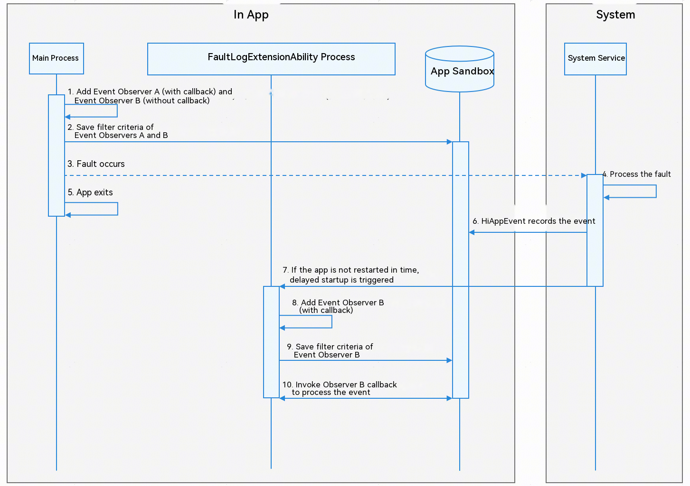

# Using FaultLogExtensionAbility to Subscribe to Events

<!--Kit: Performance Analysis Kit-->
<!--Subsystem: HiviewDFX-->
<!--Owner: @chenshi51-->
<!--Designer: @Maplestory91-->
<!--Tester: @gcw_KuLfPSbe-->
<!--Adviser: @jinqiuheng-->
<!-- md-trans-meta sourceCommit=2f4b89223ea807a0581c60a9a81b8de70ba28fa9 translatedAt=2026-08-18T11:01:57.461Z pushedAt=2026-08-18T11:35:58.242Z -->

Since API version 21, you can use HiAppEvent event subscription APIs in FaultLogExtensionAbility to implement delayed notification of app fault events (only [crash events](./hiappevent-watcher-crash-events.md) and [app freeze events](./hiappevent-watcher-freeze-events.md)). When an app exits due to a crash or freeze and cannot be restarted or remains unstarted for a long time, you can receive subscription callbacks for fault event information without relying on app startup. FaultLogExtensionAbility is only used to supplement fault event processing and cannot replace fault event handling when the main process starts normally.

The system starts the FaultLogExtensionAbility process 30 minutes after an app crash or freeze event occurs. The actual start time may be delayed due to system scheduling. The 30-minute period refers to the cumulative time while the device is not in sleep mode. During testing, keep the test device screen on to prevent the device from entering sleep mode. The device may enter sleep mode when the screen is off, which can extend the actual time before the callback is received.

## Working Principles

The working principles of FaultLogExtensionAbility are illustrated in the following figure:



1. After the main process starts, add Event Observer A and Event Observer B in the main process. Observer A contains a normally implemented callback function and event subscription filter criteria [appEventFilter](../reference/apis-performance-analysis-kit/js-apis-hiviewdfx-hiappevent.md#appeventfilter). When the app restarts normally after a fault, Observer A's callback handles the HiAppEvent events. Observer B has an empty callback implementation and is used only to generate the event subscription filter criteria that need to be saved.

2. The event subscription filter criteria of Event Observer A and Event Observer B are saved to the app sandbox. When the app removes an event observer, the corresponding observer's event subscription filter criteria saved in the app sandbox are also deleted.

3. A crash event or app freeze event occurs during app service execution.

4. After detecting the app fault, the system service collects app fault information.

5. After the system service finishes collecting the app fault site information, the app exits.

6. Based on the HiAppEvent subscription event types subscribed by the app, the system saves the collected app fault information to the app sandbox. If the app restarts in time, HiAppEvent detects the unprocessed fault events in the app sandbox. If these events meet the filter criteria of Event Observer A, Observer A's callback function is triggered to process the events. Since Event Observer B has an empty callback implementation, the same events are not processed again.

7. If the app does not restart in time to process the fault events after a fault occurs, the system service creates a task with a 30-minute delay to start the app's FaultLogExtensionAbility process. If a delayed start task for the current process already exists in the task queue, no new delayed task is created. Regardless of whether the events have been processed, the FaultLogExtensionAbility process exits after 10 seconds.

8. Add Event Observer B in the FaultLogExtensionAbility process. You need to implement a normal callback function for this Event Observer B, and it must have the same name as the Event Observer B previously added in the main process.

9. Since the Event Observer B added in the FaultLogExtensionAbility process has the same name as the Event Observer B added in the main process, the app sandbox overwrites the previously saved event subscription filter criteria of Observer B.

10. HiAppEvent detects unprocessed fault events in the app sandbox. When these fault events meet the filter criteria of Event Observer B in the FaultLogExtensionAbility process, Observer B's callback processing logic is triggered. The unprocessed event information stored in the sandbox is deleted after the fault events are processed by the callback.

## Constraints

- After FaultLogExtensionAbility is started, you have only 10 seconds to complete fault handling. If the handling is not completed within the timeout, you can save the state in [onDisconnect](../reference/apis-performance-analysis-kit/js-apis-hiviewdfx-FaultLogExtensionAbility.md#ondisconnect).

- The timer starts when the application triggers a crash or freeze event for the first time after the device is powered on or FaultLogExtensionAbility is started last time. When a crash or screen freeze event is repeatedly triggered before FaultLogExtensionAbility is started, the timer will not restart. FaultLogExtensionAbility is started after 30 minutes.

- If FaultLogExtensionAbility crashes, it will not be restarted by the system service.

- For details about the API call restrictions of FaultLogExtensionAbility, see [Constraints](../reference/apis-performance-analysis-kit/js-apis-hiviewdfx-FaultLogExtensionAbility.md#constraints) in the API reference.

- Events subscribed to in the FaultLogExtensionAbility process must be subscribed to in the main process using HiAppEvent. Otherwise, [the FaultLogExtensionAbility process may not receive the callback event](#what-should-i-do-if-the-faultlogextensionability-process-does-not-receive-the-callback-event).

- In the FaultLogExtensionAbility process, subscribe only to crash and app freeze events. Do not subscribe to system events other than these two types. Otherwise, [system events may be repeatedly reported](#what-should-i-do-if-system-events-are-repeatedly-reported).

- The names of Event Observer B used for delayed callback processing and Event Observer A used for non-delayed processing in the main process must not be the same. Otherwise, [some events may be lost](#what-should-i-do-if-some-events-are-lost).

- After FaultLogExtensionAbility is accessed, if the device restarts after an application fault occurs, the FaultLogExtensionAbility process will not be started after the restart.

## Available APIs

For details about how to use the APIs (such as parameter usage restrictions and value ranges), see [@ohos.hiviewdfx.FaultLogExtensionAbility (Delayed Fault Notification)](../reference/apis-performance-analysis-kit/js-apis-hiviewdfx-FaultLogExtensionAbility.md).

These APIs apply only to the stage model.

**Subscription APIs**

| API| Description|
| -------- | -------- |
| [onConnect(): void](../reference/apis-performance-analysis-kit/js-apis-hiviewdfx-FaultLogExtensionAbility.md#onconnect) | Called when the system connects to FaultLogExtensionAbility.|
| [onDisconnect(): void](../reference/apis-performance-analysis-kit/js-apis-hiviewdfx-FaultLogExtensionAbility.md#ondisconnect) | Called when the system disconnects from FaultLogExtensionAbility.|
| [onFaultReportReady(): void](../reference/apis-performance-analysis-kit/js-apis-hiviewdfx-FaultLogExtensionAbility.md#onfaultreportready) | Called when the system notifies ability of fault handling. It is recommended that the service logic in the callback does not exceed 10s.|

## How to Develop

The following walks you through on how to subscribe to the appfreeze event.

1. Create an ArkTS application project. In the **entry/src/main/ets/pages/Index.ets** file in the project, construct an appfreeze fault as follows:

   ```ts
   @Entry
   @Component
   struct Index {
     build() {
       Button("AppInput")
       .onClick(() => {
         let t = Date.now();
         while (Date.now() - t <= 15000) {}
       })
     }
   }
   ```

2. Edit the **entry > src > main > ets > entryability > EntryAbility.ets** file in the project. The sample code is as follows:

   ```ts
   // Import the hiAppEvent module.
   import { hiAppEvent } from '@kit.PerformanceAnalysisKit';
       // Code omitted...
       // Add a system event subscription in the onCreate function, Observer A.
       hiAppEvent.addWatcher ({
          // You can customize the observer name. The system uses the name to identify different observers.
          name: "EntryAbilityWatcherNormal",
          // You can subscribe to system events of interest. Here, the app freeze event is subscribed.
          appEventFilters: [
              {
                  domain: hiAppEvent.domain.OS,
                  names: [hiAppEvent.event.APP_FREEZE]
              }
          ],
          // After a fault occurs, the app restarts normally and Observer A processes the event callback.
          onReceive: (domain: string, appEventGroups: Array<hiAppEvent.AppEventGroup>) => {
              // Code omitted...
          }
       });
       // Add a system event subscription in the onCreate function, Observer B.
       hiAppEvent.addWatcher ({
          // You can customize the observer name. The system uses the name to identify different observers.
          name: "EntryAbilityWatcherExtension",
          // You can subscribe to system events of interest. Here, the app freeze event is subscribed.
          appEventFilters: [
              {
                  domain: hiAppEvent.domain.OS,
                  names: [hiAppEvent.event.APP_FREEZE]
              }
          ],
          // Empty implementation, used only to generate a filtering rule so that fault events are retained in the app sandbox before being processed;
          // If the app restarts normally, Observer A has already processed the same event, and Observer B consumes the event obtained from the sandbox through the empty implementation without duplicate processing.
          onReceive: (domain: string, appEventGroups: Array<hiAppEvent.AppEventGroup>) => {

          }
       });
       // Code omitted...
   ```

3. Create the **faultlogextension/MyFaultLogExtensionAbility.ets** file in the **entry/src/main/ets** directory. Create the MyFaultLogExtensionAbility class that inherits from FaultLogExtensionAbility and override the three subscription APIs. The sample code is as follows:

   ```ts
   // Import the FaultLogExtensionAbility class.
   import { FaultLogExtensionAbility, hilog, hiAppEvent } from '@kit.PerformanceAnalysisKit';

   export default class MyFaultLogExtensionAbility extends FaultLogExtensionAbility {
    // Override onConnect().
    onConnect() {
      hilog.info(0x0000, 'testTag', `FaultLogExtensionAbility onConnect`);
    }

    // Override onDisconnect().
    onDisconnect() {
      hilog.info(0x0000, 'testTag', `FaultLogExtensionAbility onDisconnect`);
    }

    // Override onFaultReportReady().
    onFaultReportReady() {
      hilog.info(0x0000, 'testTag', `FaultLogExtensionAbility onFaultReportReady`);
      hiAppEvent.addWatcher({
        // Watcher name, which must be consistent with Event Observer B in the main process.
        name: "EntryAbilityWatcherExtension",
        // You can subscribe to system events that you are interested in. Here, the application freeze event is subscribed to.
        appEventFilters: [
          {
            domain: hiAppEvent.domain.OS,
            names: [hiAppEvent.event.APP_FREEZE]
          }
        ],
        // Implement a callback for the registered system event so that you can apply custom processing to the event data obtained.
        onReceive: (domain: string, appEventGroups: Array<hiAppEvent.AppEventGroup>) => {
          hilog.info(0x0000, 'testTag', `HiAppEvent onReceive: domain=${domain}`);
          for (const eventGroup of appEventGroups) {
            // The event name uniquely identifies a system event.
            hilog.info(0x0000, 'testTag', `HiAppEvent eventName=${eventGroup.name}`);
            for (const eventInfo of eventGroup.appEventInfos) {
              // Apply custom processing to the event data obtained, for example, print the event data in the log.
              hilog.info(0x0000, 'testTag', `HiAppEvent eventInfo.domain=${eventInfo.domain}`);
              hilog.info(0x0000, 'testTag', `HiAppEvent eventInfo.name=${eventInfo.name}`);
              hilog.info(0x0000, 'testTag', `HiAppEvent eventInfo.eventType=${eventInfo.eventType}`);
              // Obtain the timestamp when the application freeze event occurs.
              hilog.info(0x0000, 'testTag', `HiAppEvent eventInfo.params.time=${eventInfo.params['time']}`);
              // Obtain the foreground/background status of the application when the application freeze event occurs.
              hilog.info(0x0000, 'testTag', `HiAppEvent eventInfo.params.foreground=${eventInfo.params['foreground']}`);
              // Obtain the version information of the application when the application freeze event occurs.
              hilog.info(0x0000, 'testTag', `HiAppEvent eventInfo.params.bundle_version=${eventInfo.params['bundle_version']}`);
              // You can obtain the unique correlation ID of the app when the Application Freeze event occurs.
              hilog.info(0x0000, 'testTag', `HiAppEvent eventInfo.params.app_running_unique_id=${eventInfo.params['app_running_unique_id']}`);
              // Obtain the bundle name of the application when the application freeze event occurs.
              hilog.info(0x0000, 'testTag', `HiAppEvent eventInfo.params.bundle_name=${eventInfo.params['bundle_name']}`);
              // Obtain the process name of the application when the application freeze event occurs.
              hilog.info(0x0000, 'testTag', `HiAppEvent eventInfo.params.process_name=${eventInfo.params['process_name']}`);
              // Obtain the process ID of the application when the application freeze event occurs.
              hilog.info(0x0000, 'testTag', `HiAppEvent eventInfo.params.pid=${eventInfo.params['pid']}`);
              hilog.info(0x0000, 'testTag', `HiAppEvent eventInfo.params.uid=${eventInfo.params['uid']}`);
              hilog.info(0x0000, 'testTag', `HiAppEvent eventInfo.params.uuid=${eventInfo.params['uuid']}`);
              // Obtain the exception type and cause of the application freeze event.
              hilog.info(0x0000, 'testTag', `HiAppEvent eventInfo.params.exception=${JSON.stringify(eventInfo.params['exception'])}`);
              // Obtain the log information when the application freeze event occurs.
              hilog.info(0x0000, 'testTag', `HiAppEvent eventInfo.params.hilog.size=${eventInfo.params['hilog'].length}`);
              // Obtain the messages that are not yet processed by the main thread when the application freezes.
              hilog.info(0x0000, 'testTag', `HiAppEvent eventInfo.params.event_handler=${eventInfo.params['event_handler']}`);
              hilog.info(0x0000, 'testTag', `HiAppEvent eventInfo.params.event_handler_size_3s=${eventInfo.params['event_handler_size_3s']}`);
              hilog.info(0x0000, 'testTag', `HiAppEvent eventInfo.params.event_handler_size_6s=${eventInfo.params['event_handler_size_6s']}`);
              // Obtain the synchronous binder call information when the application freezes.
              hilog.info(0x0000, 'testTag', `HiAppEvent eventInfo.params.peer_binder=${eventInfo.params['peer_binder']}`);
              // Obtain the full thread call stack when the application freezes.
              hilog.info(0x0000, 'testTag', `HiAppEvent eventInfo.params.threads.size=${eventInfo.params['threads'].length}`);
              // Obtain the memory information when the application freezes.
              hilog.info(0x0000, 'testTag', `HiAppEvent eventInfo.params.memory=${JSON.stringify(eventInfo.params['memory'])}`);
              // Obtain the fault log file when the application freezes.
              hilog.info(0x0000, 'testTag', `HiAppEvent eventInfo.params.external_log=${JSON.stringify(eventInfo.params['external_log'])}`);
              hilog.info(0x0000, 'testTag', `HiAppEvent eventInfo.params.log_over_limit=${eventInfo.params['log_over_limit']}`);
            }
          }
        }
      });
    }
   }
   ```

4. In the **entry/src/main/module.json5** file in the project, add the extensionAbility information. The sample code is as follows:

   ```json5
   "extensionAbilities": [
     {
       "name" : "MyFaultLogExtensionAbility",
       "srcEntry": "./ets/faultlogextension/MyFaultLogExtensionAbility.ets",
       "type": "faultLog"
     }
   ]
   ```

## Debugging and Verification

Click the run button in the DevEco Studio interface to start the app project. On the app screen, tap the **AppInput** button to trigger a freeze event. After the app exits, do not restart the app or the device, and wait for about 30 minutes.

In the HiLog window, search for the keyword "testTag" to view the result of FaultLogExtensionAbility's callback.

   ```text
   FaultLogExtensionAbility onConnect
   FaultLogExtensionAbility onFaultReportReady
   HiAppEvent onReceive: domain=OS
   HiAppEvent eventName=APP_FREEZE
   HiAppEvent eventInfo.domain=OS
   HiAppEvent eventInfo.name=APP_FREEZE
   HiAppEvent eventInfo.eventType=1
   ......
   FaultLogExtensionAbility onDisconnect
   ```

  The FaultLogExtensionAbility executes connection, processing, and disconnection in sequence.

## FAQs

### What should I do if the FaultLogExtensionAbility process does not receive the callback event

After the FaultLogExtensionAbility process starts, the callback subscribed by HiAppEvent is not received. The possible causes are as follows:

- Before the FaultLogExtensionAbility process starts, the main process has subscribed to and processed the event.

- The subscription in the FaultLogExtensionAbility process is the first subscription after the app is installed. HiAppEvent is not aware of events that occurred before the subscription. You need to subscribe to the relevant events normally in the main process. After a fault occurs, HiAppEvent records the relevant events and triggers the callback after FaultLogExtensionAbility is started.

### What should I do if system events are repeatedly reported

System events are notified via HiAppEvent callbacks to all event observers that have subscribed to the event. When both the FaultLogExtensionAbility process and the main process exist and both have subscribed to the same system event, both processes receive the corresponding event callback after the system event is triggered.

### What should I do if some events are lost

Events that occur after the application starts and before the watcher is registered are lost. Check whether multiple event watchers with the same name are registered.

To prevent event loss, HiAppEvent, after the app starts but before the event observer is registered, first scans the subscription filter criteria of event observers that were not removed before the app last exited, and subscribes to and saves events accordingly. When an event observer with the same name is registered again, the later registration overwrites the previous observer's information, causing the subscription filter criteria to be overwritten and events to be lost.