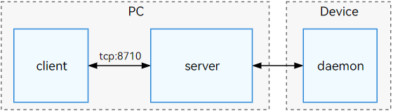

# hdc

OpenHarmony Device Connector (hdc) is a command line tool used for debugging. You can use it on a Windows, Linux, or macOS system to interact with devices.

hdc consists of three processes:

**client**: the process running on the PC. This process is started when you run the hdc command and exits after the command is executed.

**server**: the background server process running on the PC. It is used to manage data interaction between the **client** and **daemon** processes and discover devices.

**daemon**: the daemon process running on the device. It is used to respond to the requests sent by **server**.

The following figure shows the relationship.


> **NOTE**
>
> When **client** is started, it checks whether **server** is running by default. If not, a new hdc program is started as the **server** and runs in the background.
>
> When **server** is running, it listens for port 8710 of the PC by default. You can set the system environment variable **OHOS_HDC_SERVER_PORT** to listen for a port.

## Environment Setup

Download and install [DevEco Studio](https://developer.huawei.com/consumer/cn/deveco-studio/). You can obtain the hdc application in **DevEco Studio/sdk/default/openharmony/toolchains**.

### (Optional) Running the hdc Program on the CLI

You can go to the **toolchains** directory of SDK through the CLI and run the hdc command in the directory for debugging.
To facilitate the execution of the hdc program in the CLI, you can add the file path of the hdc program to the system environment variable that specifies the command search path.
For example, add it to **Path** on Windows.

### (Optional) Configuring the hdc Server

You can set the listening port, log output level, feature switch, and command recording of the hdc server by configuring the corresponding system environment variables. For details, see [Optional Configuration Items](#optional-configuration-items).

> **NOTE**
>
> After the environment variable is configured, close and restart the CLI and other software that uses OpenHarmony SDK.

## hdc commands

### Global Parameters

Global parameters are the parameters that follow **hdc** when some hdc commands are run.
For example, use the **-t** parameter to specify a device for command execution.

   ```shell
   hdc -t connect-key shell echo "Hello world"
   ```

| Parameter| Description|
| -------- | -------- |
| -t | Specifies a target device to connect. When one device is connected, this parameter is optional. When multiple devices are connected, it is mandatory.|
| -l | (Optional) Specifies the log level when the device is running. The value ranges from 0 to 6. The default value is **3** (**LOG_INFO**).|
| -s | (Optional) Specifies the IP and port for listening when the client connects to the server.|
| -p | (Optional) Executes a client command without querying the server process.|
| -m | (Optional) Starts the server process in the foreground.|

### Commands
| Command| Description|
| -------- | -------- |
| list targets | Displays all connected target devices.|
| wait | Waits until the device is properly connected.|
| tmode usb | This command is invalid and cannot be used to enable the USB connection channel. You need to enable it on the device setting page.|
| tmode port | Enables the network connection channel of the device.|
| tmode port close | Disables the network connection channel of the device.|
| tconn | Specifies the device to connect based on the IP address and port number.|
| shell | Executes a single command on the device.|
| install | Installs an application.|
| uninstall | Uninstalls a specified application.|
| file send | Sends a local file to a remote device.|
| file recv | Sends a file from a remote device to the local device.|
| fport ls | Lists all port forwarding tasks.|
| fport | Sets up a local port forwarding, which forwards data from a local port to a remote port.|
| rport | Sets up a remote port forwarding, which forwards data from a remote port to a local port.|
| fport rm | Deletes a port forwarding task.|
| start | Starts the hdc server process.|
| kill | Terminates the hdc server process.|
| hilog | Obtains device log information.|
| jpid | Displays the PIDs of all applications that have enabled JDWP on the device.|
| track-jpid | Displays the PIDs and names of the applications that have enabled JDWP on the device in real time.|
| target boot| Restarts the target device.|
| <!--DelRow--> target mount | Mounts the system partition in read/write mode. (This command is unavailable for non-root devices.)|
| <!--DelRow--> smode | Grants the **root** permission to the background hdc server running on the device. You can use the **-r** option to revoke the granted permission. (This command is unavailable for non-root devices.)|
| keygen | Generates a new key pair.|
| version | Displays the hdc version information. You can also run the **hdc -v** command to display the version information.|
| checkserver | Obtains the version information about the client process and server process.|

> **NOTE**
>
> Global parameters must be placed before commands.

## Basic Commands

Before using hdc, enable the USB debugging function on the device and connect the device to the PC using a USB cable.

### Displaying Connected Devices

   ```shell
   hdc list targets
   ```

### Running the Shell command

   ```shell
   hdc shell echo "Hello world"
   ```

### Obtaining the Help Information

| Command| Description|
| -------- | -------- |
| -h [verbose] | Displays the hdc help information. The optional parameter **verbose** can be used to display detailed help information.|
| help | Displays the hdc help information.|

Display the hdc help information.

   ```shell
   hdc -h [verbose]
   hdc help
   ```

**Return value**
| Return Value| Description|
| -------- | -------- |
| OpenHarmony device connector(HDC) ...<br>---------------------------------global commands:----------------------------------<br>-h/help [verbose]&nbsp;&nbsp;&nbsp;&nbsp;&nbsp;&nbsp;&nbsp;&nbsp;&nbsp;&nbsp;&nbsp;&nbsp;&nbsp;&nbsp;&nbsp;&nbsp;&nbsp;&nbsp;&nbsp;&nbsp;&nbsp;- Print hdc help, 'verbose' for more other cmds<br>..._(Detailed information is omitted here.)_| Help information for hdc commands.|

**Usage**

```shell
hdc -h
hdc help

// Display the detailed help information.
hdc -h verbose
```

### NOTE

- If an exception occurs, run the **hdc kill -r** command to kill the hdc process and restart the hdc server.

- If the **hdc list targets** command cannot obtain the device information, see [Failed to Identify the Target Device](#failed-to-identify-the-target-device).

## Managing Device Connections

### Displaying Devices

Run the **list targets** command to display all connected target devices.
You can add the **-v** parameter to display detailed device information.
Run the following commands:

```shell
hdc list targets [-v]
```

**Return value**
| Return Value| Description|
| -------- | -------- |
| Device ID list| List of connected device IDs. The ID is the value of **connect-key** used in the **-t** parameter.|
| [Empty] | No device is found.|

**Usage**

```shell
hdc list targets
hdc list targets -v
```

### Connecting to the Specified Target Device

When a single device is connected, you do not need to specify the device ID when running the command.
When multiple devices are connected, use the **-t** parameter to specify the target device ID each time you run the command.

   ```shell
   hdc -t [connect-key] [command]
   ```

   **Parameters**
| Name| Description|
| -------- | -------- |
| connect-key| Device ID, which is the return value of the **hdc list targets** command.|
| command | Command to be executed.|

   > **NOTE**
   >
   > The *connect-key* uniquely identifies a device. If the device is connected over the network, the *connect-key* is the IP address and port number. If the device is connected through USB, the *connect-key* is the USB SN.

   **Return value**
| Return Value| Description|
| -------- | -------- |
| Command output| Command execution result, which may vary with the command.|
| [Fail]Not match target founded, check connect-key please | No device matches the *connect-key*.|
| [Fail]Device not founded or connected | The device is not found or connected.|
| [Fail]ExecuteCommand need connect-key? please confirm a device by help info | You must specify one device if there are multiple devices available.|
| Unknown operation command... | The command is not supported.|

   > **NOTE**
   >
   > The error messages will be optimized in the future. Do not use them to determine the result of the automatic script or program.

   **Usage**

   This option must be used with a command. The following uses the **shell** command as an example.

   ```shell
   hdc list targets  // Display connect-key of all connected devices.
   hdc -t [connect-key] shell // Replace connect-key with the specified device ID.
   ```

### Waiting for Device Connection

Run the following commands:

   ```shell
   hdc wait // Wait for the device to connect.
   hdc -t connect-key wait // Wait for the specified device to connect. Replace connect-key with the specified device ID.
   ```

   **Return value**
| Return Value| Description|
| -------- | -------- |
| None| The **hdc wait** command ends when a properly connected device is identified.|

   **Usage**

   ```shell
   hdc wait
   hdc -t connect-key wait
   ```

### Common Connections

#### USB Connection

- Checking the environment

| Item| Normal| Exception Handling|
| -------- | -------- | -------- |
| USB debugging| USB debugging is enabled.| If the USB debugging mode is not automatically enabled, restart the device.|
| USB data cable connection| The PC used for debugging is connected to the device USB port using a USB cable.| If you use a USB cable with low bandwidth and no data communication function, the device may fail to be identified. You are advised to use an officially recommended USB cable.|
| USB port| A USB port on the mainboard (USB port on the rear panel of a desktop computer or USB port on a laptop computer) is used.| If you use a conversion adapter, docking station, or USB port on the front panel of a desktop computer, issues such as low bandwidth and USB sync problems may occur, which results in frequent disconnections. Therefore, direct connection between the PC and the device is recommended.|
| hdc environment variable| The help information is displayed after the **hdc -h** command is executed.| For details, see [Environment Setup](#environment-setup).|
| Driver| After the device is connected via hdc, **HDC Device** or **HDC Interface** is displayed in **Device Manager**.| For details, see [Failed to Identify the Target Device](#failed-to-identify-the-target-device).|

- Procedure

1. Connect the PC to the device through a USB port.

2. Check the connection.

   ```shell
   hdc list targets
   ```

   If the corresponding device ID is returned, the USB connection is successful.

3. When the device is found, run the related commands to interact with the device. If you want to perform USB command operations without the device ID, ensure that the device is not in TCP connection mode (the device information displayed by running the **hdc list targets** command does not contain **IP:port**) and directly connect to the device. For example:

   ```shell
   hdc shell
   ```

#### TCP Connection

   > **NOTE**
   >
   > The TCP debugging function is not stable. Exercise caution when using this function for production.

- Checking the environment

| Item| Normal| Exception Handling|
| -------- | -------- | -------- |
| Network connection| The PC and the device are on the same network.| Connect the PC and device to the same Wi-Fi network or enable the Wi-Fi hotspot on your device.|
| Network Status| Use **telnet IP:port** to check that the network connection between the PC and the device is normal.| Connect the PC and the device over a stable network.|
| hdc environment variable| The help information is displayed after the **hdc -h** command is executed.| For details, see [Environment Setup](#environment-setup).|

- Procedure

1. Enable network debugging on the device setting page.

2. Record the port number displayed on the device as **PORT** for TCP connection.

3. Run the following command to connect to the device through TCP (you need to know the device IP address and enabled port number):

   ```shell
   hdc tconn IP:PORT
   ```
   You can obtain the IP address from the device settings. The port number is displayed in the previous step.

4. Check the connection.

   ```shell
   hdc list targets
   ```

   If the return value is in the *IP:PORT* format, the connection is successful.

5. To disable the TCP connection mode, disable network debugging on the device.

#### Remote Connection

In the remote connection scenario, the client remotely connects to the server through the network. The client and server run on different PCs, and the server connects to the device.
The following figure shows the remote connection.


The hdc client runs on PC1, and the hdc server runs on PC2, which is connected to the device.

- Connection command

   | Command| Description|
   | -------- | -------- |
   | -s | Specifies the IP address and port number of the current server process to listen for.|

   Use the **-s** parameter to specify the IP address and port number of the server. The setting is valid only when the current command is executed.

   ```shell
   hdc -s [ip]:[port] [command]
   ```

   **Parameters**
   | Parameter| Description|
   | -------- | -------- |
   | ip | IP address to listen for. Both IPv4 and IPv6 addresses are supported.|
   | port | Port to listen for. The value ranges from 1 to 65535.|
   | command | Command to be executed.|

   **Return value**
   | Return Value| Description|
   | -------- | -------- |
   | Connect server failed | Fails to connect to the server.|
   | -s content port incorrect. | The port number is out of range (1 to 65535).|

   **Usage**

   ```shell
   # Run the command to obtain the device information in the server process of 127.0.0.1:8710:
   hdc -s 127.0.0.1:8710 list targets
   ```

   > **NOTE**
   >
   > If the **-s** parameter is used to specify a server port, the system ignores the port set in the **OHOS_HDC_SERVER_PORT** environment variable.

- Procedure

   1. Configure the server

   Connect the server to the device using a USB cable and run the following commands:

   ```shell
   hdc kill          // Terminate the local hdc server.
   hdc -s IP:8710 -m // Enable the hdc server for network forwarding.
                     // In the command, IP indicates the IP address of the server. To query the IP address, you can run the **ipconfig** command on Windows and run the **ifconfig** command on Unix.
                     // 8710 is the default port number. You can also set it to another port number, for example, 18710.
                     // After startup, the server prints logs.
   ```

   2. Connect to the client

   Ensure that the client can connect to the server IP address, and then run the following command:

   ```shell
   hdc -s IP:8710 [command] // IP indicates the IP address of the server, and 8710 indicates the port number set when the server is started in step 1.
                           // If the port number changes, change the port number accordingly.
                           // and command can be any available hdc command, for example, list targets.
   ```

### Switching Between USB Debugging and Network Debugging

The following table lists the commands for switching the connection mode.

You are advised to enable or disable the USB debugging and network debugging on the device.

| Command| Description|
| -------- | -------- |
| tmode usb | This command is invalid and cannot be used to enable the USB connection channel. You need to enable it on the device setting page.|
| tmode port [port-number] | Enables the network connection channel of the device. Then the daemon process on the device restarts, and the USB connection is interrupted. You need to reconnect the device.|
| tmode port close | Disables the network connection channel of the device. Then the daemon process on the device restarts, and the USB connection is interrupted. You need to reconnect the device.|
| tconn [IP]:[port] [-remove] | Specifies a connection to a device in *IP address: port number* format. Use the **-remove** option to disconnect from the specified device.|

1. Enable the network connection of the device.

   ```shell
   hdc tmode port [port-number]
   ```

   **Parameters**
   | Parameter| Description|
   | -------- | -------- |
   | port-number | Port number of the connection. The value ranges from 1 to 65535.|

   **Return value**
   | Return Value| Description|
   | -------- | -------- |
   | Set device run mode successful. | The network connection channel is enabled successfully.|
   | [Fail]ExecuteCommand need connect-key | Failed to enable the network connection channel because no device exists in the list. |
   | [Fail]Incorrect port range | The port number is out of range (1 to 65535).|

   **Usage**

   ```shell
   hdc tmode port 1234
   ```

   > **NOTE**
   >
   > Before changing the connection mode, ensure that the remote device and the local PC are on the same network and the PC can ping the IP address of the remote device.
   >
   > Otherwise, do not run this command.

   > **NOTE**
   >
   > After the command is executed, the remote daemon process exits and restarts, and the USB connection is disconnected. You need to reconnect the USB connection.

2. Disable the network connection channel of the device.

   ```shell
   hdc tmode port close
   ```

   **Return value**
   | Return Value| Description|
   | -------- | -------- |
   | [Fail]ExecuteCommand need connect-key | Failed to disable the network connection channel because no device exists in the list.|

   **Usage**

   ```shell
   hdc tmode port close
   ```
   > **NOTE**
   > After the command is executed, the remote daemon process exits and restarts, and the USB connection is disconnected. You need to reconnect the USB connection.

3. Connect to the specified device through TCP.

   ```shell
   hdc tconn [IP]:[port] [-remove]
   ```

   **Parameters**
   | Parameter| Description|
   | -------- | -------- |
   | [IP]:[port]  | IP address and port number of the device.|
   | -remove | An optional parameter used to disconnect a specified device.|

   **Return value**
   | Return Value| Description|
   | -------- | -------- |
   | Connect OK | Device connected.|
   | [Info]Target is connected, repeat operation| The device is already connected.|
   | [Fail]Connect failed | Failed to connect the specified device.|

   **Usage**

   ```shell
   hdc tconn 192.168.0.1:8888
   hdc tconn 192.168.0.1:8888 -remove  // Disconnect from the specified device.
   ```

## Running the Interactive Command

Run the following commands:

   ```shell
   hdc shell [-b bundlename] [command]
   ```

   **Parameters**
| Parameter| Description|
| -------- | -------- |
| [-b _bundlename_] | The bundle name of a debug application. The command is executed in non-interactive mode in the data directory of the debug application.<br>Currently, this parameter can be used only in non-interactive mode, and the **command** parameter must be specified to enter an interactive shell session.<br>Otherwise, commands are executed in the system root directory by default.|
| [command] | A single command to execute on the device. The command varies depending on the system type or version. You can run the **hdc shell ls /system/bin** command to obtain the supported command list. Currently, many commands are provided by [toybox](../tools/toybox.md). You can run the **hdc shell toybox --help** command to obtain the help information.<br>If this parameter is not specified, hdc starts an interactive shell session, in which you can enter commands such as **ls**, **cd**, and **pwd** at the command prompt.|

   **Return value**
| Return Value| Description|
| -------- | -------- |
| Command execution result| Execution result of the command. For details, see the corresponding command output.|
| /bin/sh: XXX : inaccessible or not found | The specified command is not supported.|
| [Fail]Error information| The execution fails. For details, see [hdc Error Codes](#hdc-error-codes).|

   **Usage**

   ```shell
   # Enter the interactive mode to run a command.
   hdc shell

   # Run the command in non-interactive mode.
   hdc shell ps -ef

   # Obtain the help information.
   hdc shell help -a

   # Specify the bundle name of an application to run the command in non-interactive mode in its data directory. The **touch**, **rm**, **ls**, **stat**, **cat** and **mkdir** commands are supported.
   hdc shell -b com.example.myapplication ls data/storage/el2/base/
   ```

   > **NOTE**
   >
   > To use the **[-b _bundlename_]** parameter, ensure that the installed application to be specified is an application signed by a debug certificate. For details about how to request and use the debug certificate, see [Requesting a Debug Certificate](https://developer.huawei.com/consumer/en/doc/app/agc-help-add-debugcert-0000001914263178).

## Managing Applications

| Command| Description|
| -------- | -------- |
| install _src_ | Installs an application.|
| uninstall _packageName_ | Uninstalls an application.|

1. Install an app.

   ```shell
   hdc install [-r|-s] src
   ```

   **Parameters**
   | Name| Description|
   | -------- | -------- |
   | src| Installation package name.|
   | -r | Replaces the existing app (.hap).|
   | -s | Install a shared package (.hsp).|

   **Return value**
   | Return Value| Description|
   | -------- | -------- |
   | AppMod finish | The installation is successful.|
   | Error information| The installation fails.|

   **Usage**

   For example, install **example.hap**.

   ```shell
   hdc install E:\example.hap
   ```

2. Uninstall the app.

   ```shell
   hdc uninstall [-k|-s] packageName
   ```

   **Parameters**
   | Name| Description|
   | -------- | -------- |
   | packageName | Application installation package.|
   | -k | Used to retain **/data** and **/cache**.|
   | -s | Used to uninstall a shared package.|

   **Return value**
   | Return Value| Description|
   | -------- | -------- |
   | AppMod finish | The uninstallation is successful.|
   | Error information| The uninstallation fails.|

   **Usage**

   For example, uninstall **com.example.hello**.

   ```shell
   hdc uninstall com.example.hello
   ```

## Transferring Files

| Command| Description|
| -------- | -------- |
| file send _localpath remotepath_ | Sends a local file to a remote device.|
| file recv _remotepath localpath_ | Sends a file from a remote device to the local device.|

1. Send a local file to a remote device.

   ```shell
   hdc file send [-a|-sync|-z|-m|-b bundlename] localpath remotepath
   ```

   **Parameters**
   | Name| Description|
   | -------- | -------- |
   | _localpath_ | Path of the file to send on the local device.|
   | _remotepath_ | Destination path on the remote device.|
   | -a | Used to retain the file timestamp.|
   | -sync | Used to transfer only the files whose **mtime** is updated.|
   | -z | Used to compress and transmit files in LZ4 format. This parameter is unavailable.|
   | -m | Used to synchronize the DAC permission, UID, GID, and MAC permission during file transfer.|
   | -b | Used to transfer files in the application data directory of the specified debug application process.|
   | _bundlename_ | Bundle name of the debug application process.|

   **Return value**

   A success message is displayed if the file is sent successfully. Error information is displayed if the file fails to be sent.

   **Usage**

   ```shell
   hdc file send E:\example.txt /data/local/tmp/example.txt
   hdc file send -b com.example.myapplication a.txt data/storage/el2/base/b.txt
   ```

   > **NOTE**
   >
   > In the **hdc file send -b com.example.myapplication a.txt data/storage/el2/base/b.txt** command, the **-b** parameter is specified to transfer the **a.txt** file in the current local directory to the relative path **data/storage/el2/base/** of the **com.example.myapplication** application data directory and rename the file to **b.txt**.
   >
   > To use the **[-b _bundlename_]** parameter, ensure that the installed application to be specified is an application signed by a debug certificate. For details about how to request and use the debug certificate, see [Requesting a Debug Certificate](https://developer.huawei.com/consumer/en/doc/app/agc-help-add-debugcert-0000001914263178).

2. Send a file from a remote device to the local device.

   ```shell
   hdc file recv [-a|-sync|-z|-m|-b bundlename] remotepath localpath
   ```

   **Parameters**
   | Name| Description|
   | -------- | -------- |
   | _localpath_ | Destination path on the local device.|
   | _remotepath_ | Path of the file to send on the remote device.|
   | -a | Used to retain the file timestamp.|
   | -sync | Used to transfer only the files whose **mtime** is updated.|
   | -z | Used to compress and transmit files in LZ4 format. This parameter is unavailable.|
   | -m | Used to synchronize the DAC permission, UID, GID, and MAC permission during file transfer.|
   | -b | Used to transfer files in the application data directory of the specified debug application process.|
   | _bundlename_ | Bundle name of the debug application process.|

   **Return value**

   A success message is displayed if the file is received successfully. Error information is displayed if the file fails to be received.

   **Usage**

   ```shell
   hdc file recv  /data/local/tmp/a.txt   ./a.txt
   hdc file recv -b com.example.myapplication data/storage/el2/base/b.txt   a.txt
   ```

   > **NOTE**
   >
   > In the **hdc file recv -b com.example.myapplication data/storage/el2/base/b.txt a.txt** command, the **-b** parameter is specified to transfer the **b.txt** file in the relative path **data/storage/el2/base/** of the **com.example.myapplication** application data directory to the current local directory and rename the file to **a.txt**.
   >
   > To use the **[-b _bundlename_]** parameter, ensure that the installed application to be specified is an application signed by a debug certificate. For details about how to request and use the debug certificate, see [Requesting a Debug Certificate](https://developer.huawei.com/consumer/en/doc/app/agc-help-add-debugcert-0000001914263178).

## Port Forwarding

| Command| Description|
| -------- | -------- |
| fport ls | Lists all port forwarding tasks.|
| fport _localnode remotenode_ | Sets up a local port forwarding, which forwards data from a local port to a remote port.|
| rport _remotenode localnode_ | Sets up a remote port forwarding, which forwards data from a remote port to a local port.|
| fport rm _taskstr_ | Deletes a port forwarding task.|

Port forwarding type supported by the PC: TCP.

Port forwarding type supported by the device: TCP, DEV, localabstract, localfilesystem, JDWP, ark.

1. List all port forwarding tasks.

   ```shell
   hdc fport ls
   ```

   **Return value**
   | Return Value| Description|
   | -------- | -------- |
   | tcp:1234 tcp:1080 [Forward] | Local port forwarding.|
   | tcp:2080 tcp:2345 [Reverse] | Remote port forwarding.|
   | [empty] | No port forwarding.|

   **Usage**

   ```shell
   hdc fport ls
   ```

2. Set up a local port forwarding, which forwards data from a local port to a remote port.

   ```shell
   hdc fport localnode remotenode
   ```

   **Return value**
   | Return Value| Description|
   | -------- | -------- |
   | Forwardport result:OK | The port forwarding is set up properly.|
   | [Fail]Incorrect forward command | Failed to set up the port forwarding due to parameter errors.|
   | [Fail]TCP Port listen failed at XXXX | Failed to set up the port forwarding because the local port is in use.|

   **Usage**

   ```shell
   hdc fport tcp:1234 tcp:1080
   ```

3. Set up a remote port forwarding, which forwards data from a remote port to a local port.

   ```shell
   hdc rport remotenode localnode
   ```

   **Return value**
   | Return Value| Description|
   | -------- | -------- |
   | Forwardport result:OK | The port forwarding is set up properly.|
   | [Fail]Incorrect forward command | Failed to set up the port forwarding due to parameter errors.|
   | [Fail]TCP Port listen failed at XXXX | Failed to set up the port forwarding because the local port is in use.|

   **Usage**

   ```shell
   hdc rport tcp:1234 tcp:1080
   ```
4. Delete a specified port forwarding task.

   ```shell
   hdc fport rm taskstr
   ```

   **Parameters**
   | Parameter| Description|
   | -------- | -------- |
   | _taskstr_ | Port forwarding task, in the format of **tcp:XXXX tcp:XXXX**.|

   **Return value**
   | Return Value| Description|
   | -------- | -------- |
   | Remove forward ruler success, ruler:tcp:XXXX tcp:XXXX | The port forwarding is removed successfully.|
   | [Fail]Remove forward ruler failed, ruler is not exist tcp:XXXX tcp:XXXX | Failed to remove the port forwarding because the specified forwarding does not exist.|

   **Usage**

   ```shell
   hdc fport rm tcp:1234 tcp:1080
   ```

## Managing Server Processes

| Command| Description|
| -------- | -------- |
| start [-r] | Starts the hdc process. You can use the **-r** option to restart the process.|
| kill [-r] | Terminates the hdc process. You can use the **-r** option to restart the process.|
| -p | Executes a client command without querying the server process.|
| -m | Starts a server process in the foreground.|


1. Start the hdc server.

   ```shell
   hdc start [-r]
   ```

   **Return value**
   | Return Value| Description|
   | -------- | -------- |
   | No return value| The server is started successfully.|

   **Usage**

   ```shell
   hdc start
   hdc start -r // Restart the server.
   ```

   > **NOTE**
   >
   > When a hdc server is started and the system does not detect any running server, set the log level in the following sequence: If the **-l** parameter is specified and the **OHOS_HDC_LOG_LEVEL** environment variable is configured, use the log level configured by the environment variable. If only the **-l** parameter is specified, use the log level configured by this parameter. If both of them are not specified, the server starts with the default log level **LOG_INFO**.

2. Terminate the hdc server.

   ```shell
   hdc kill [-r]
   ```

   **Return value**
   | Return Value| Description|
   | -------- | -------- |
   | Kill server finish | The server is terminated successfully.|
   | [Fail]Error information| Failed to terminate the server.|

   **Usage**

   ```shell
   hdc kill
   hdc kill -r // Restart and terminate the server process. 
   ```

3. Execute a client command without querying the server.

   ```shell
   hdc -p [command]
   ```

   **Parameters**
   | Parameter| Description|
   | -------- | -------- |
   | command | Command to be executed.|

   **Return value**
   | Return Value| Description|
   | -------- | -------- |
   | Connect server failed | Fails to connect to the server.|

   **Usage**

   ```shell
   # Start a background server.
   hdc start
   # Execute the command directly without querying the server.
   hdc -p list targets
   ```

   > **NOTE**
   >
   > When a command is executed without the **-p** parameter specified, the client first checks whether a server is running locally. If the system does not detect a running server process, the client automatically starts a server process and sets up a connection to transfer commands. If the system detects a running server process, the client directly connects to the server process and transfers commands.

4. Start the server process in the foreground.

   ```shell
   hdc -m
   ```

   **Return value**
   | Return Value| Description|
   | -------- | -------- |
   | Initial failed | The server process fails to be initialized.|
   | [I][_1970-01-01 00:00:00.000_][_abcd_][_session.cpp:25_] _Program running. Ver: X.X.Xa Pid:12345_ | Logs of the corresponding level are printed to display the activity status of the server.|

   **Usage**

   ```shell
   # Start a server process with the IP address and port number specified.
   hdc -s 127.0.0.1:8710 -m
   ```

   > **NOTE**
   >
   > 1. When using the **-m** parameter, you can add the **-s** parameter to specify the IP address and port number to be listened. If no IP address and port number are specified using the **-s** parameter and the environment variable **OHOS_HDC_SERVER_PORT** is not set, the system uses the default IP address and port number **127.0.0.1:8710**.
   > 2. If the server process is started in the foreground, the default log output level is **LOG_DEBUG**. You can use the **-l** parameter to change the log level.
   > 3. Only one server process instance can run at a time. If a background server process is running, a new server process instance cannot be started on the foreground.

## Operating the Device

| Command| Description|
| -------- | -------- |
| hilog [-h] | Displays the log information of the device. You can run the **hdc hilog -h** command to obtain the supported parameters. |
| jpid | Displays the PIDs of all applications that have enabled JDWP on the device.|
| track-jpid [-a\|-p]  | Displays the PID and name of the application for which JDWP is enabled on the device in real time. If no parameter is specified, only the processes of the **debug** application are displayed. If the **-a** parameter is specified, the processes of the **debug** and **release** applications are displayed. If the **-p** parameter is specified, the **debug** and **release** labels are not displayed.|
| target boot [-bootloader\|-recovery] | Restarts the target device. You can use the **-bootloader** option to enter the fastboot mode and the **-recovery** option to enter the recovery mode.|
| target boot [MODE] | Restart the target device to enter the corresponding mode. **MODE** is an option supported by **reboot** in the **/bin/begetctl** command.|
| <!--DelRow--> target mount | Mounts the system partition in read/write mode. (This command is supported after the device has required the root permission.)|
| <!--DelRow--> smode [-r] | Grants the root permission to the hdc background server process on the device. You can use the **-r** parameter to cancel the permission. (This command is supported after the device has required the root permission.)|

1. Display the log information of the device.

   ```shell
   hdc hilog [-h]
   ```

   **Parameters**
   | Parameter| Description|
   | -------- | -------- |
   | [-h] | Parameters supported by HiLog. You can run the **hdc hilog -h** command to obtain the parameter list.|

   **Return value**
   | Return Value| Description|
   | -------- | -------- |
   | Returned information| Log information obtained.|

   **Usage**

   ```shell
   hdc hilog
   ```

2. Display the PIDs of all processes that enable JDWP.

   ```shell
   hdc jpid
   ```

   **Return value**
   | Return Value| Description|
   | -------- | -------- |
   | PID list| PIDs of the applications that enable JDWP.|
   | [empty] | No process enables JDWP.|

   **Usage**

   ```shell
   hdc jpid
   ```

3. Display the PIDs and application names of the processes that enable JDWP on the device in real time.

   ```shell
   track-jpid [-a|-p]
   ```

   **Parameters**
   | Parameter| Description|
   | -------- | -------- |
   | Not specified| Used to display only the PIDs, bundle names, and process names of **debug** applications.|
   | -a | Used to display the PIDs, bundle names, and process names of the **debug** and **release** applications. |
   | -p | Used to display the PIDs, bundle names, and process names of the **debug** and **release** applications, but does not display the **debug** and **release** labels.|

   **Return value**
   | Return Value| Description|
   | -------- | -------- |
   | PIDs and bundle/process name list| - |
   | [empty] | If no parameter is specified, no process of the debug application enables JDWP. If the **-a** or **-p** parameter is specified, no process enables JDWP.|

   **Usage**

   ```shell
   hdc track-jpid
   ```

4. Restart the target device.

   ```shell
   target boot [-bootloader|-recovery]
   target boot [MODE]
   ```

   **Parameters**
   | Name| Description|
   | -------- | -------- |
   | Not specified| Used to restart a device.|
   | -bootloader| Used to restart a device to enter the **fastboot** mode.|
   | -recovery | Used to restart a device to enter the **recovery** mode.|
   | MODE | Used to restart a device to enter the **MODE** mode. **MODE** is a parameter supported by **reboot** in the **/bin/begetctl** command.<br> For details, run the **hdc shell "/bin/begetctl -h \| grep reboot"** command.|  |

   **Usage**

   ```shell
   hdc target boot -bootloader // Restart the device to enter the fastboot mode.
   hdc target boot -recovery // Restart the device to enter the recovery mode.
   hdc target boot shutdown // Shut down the device.
   ```

<!--Del-->
5. Mount the system partition in read/write mode.

   ```shell
   hdc target mount
   ```

   **Return value**
   | Return Value| Description|
   | -------- | -------- |
   | Mount finish | Mounting succeeded.|
   | [Fail]Mount failed | Mounting failed.|

   **Usage**

   ```shell
   hdc target mount
   ```

   > **NOTE**
   >
   > This command is supported only after the device has required the root permission. Exercise caution when running this command.

6. Grant the **root** permission to the background hdc server running on the device.

   ```shell
   hdc smode [-r]
   ```

   **Return value**
   | Return Value| Description|
   | -------- | -------- |
   | No return value| Permission granted.|
   | [Fail]Error information| Failed to grant the permission.|

   **Usage**

   ```shell
   hdc smode
   hdc smode -r  // Revoke the root permission.
   ```

   > **NOTE**
   >
   > This command is supported only after the device has required the **root** permission.

<!--DelEnd-->

## Security Command

| Command| Description|
| -------- | -------- |
| keygen FILE | Generates a new key pair and save the private key and public key to **FILE** and **FILE.pub** respectively. The file name **FILE** can be customized.|

1. Generate a new key pair.

   ```shell
   hdc keygen FILE
   ```

   **Parameters**
   | Parameter| Description|
   | -------- | -------- |
   | FILE | Custom file name.|

   **Usage**

   ```shell
   hdc keygen key // Generate the key and key.pub files in the current directory.
   ```

## Obtaining the Version Number

| Command| Description|
| -------- | -------- |
| -v/version | Displays hdc version information.|
| checkserver | Obtains the client and server process versions.|

1. Display hdc version information.

   ```shell
   hdc -v/version
   ```

   **Return value**
   | Return Value| Description|
   | -------- | -------- |
   | Ver: X.X.Xa | hdc (SDK) version information.|

   **Usage**

   ```shell
   hdc -v or hdc version
   ```

2. Obtain the client and server process versions.

   ```shell
   hdc checkserver
   ```

   **Return value**
   | Return Value| Description|
   | -------- | -------- |
   | Client version: Ver: X.X.Xa, Server version: Ver: X.X.Xa | The client and server versions.|

   **Usage**

   ```shell
   hdc checkserver
   ```

## hdc Debugging Logs

### Server Logs

#### Specifying the Log Level

Specify the hdc log level. The default value is **LOG_INFO**. 

   ```shell
   hdc -l [level] [command]
   ```

   **Parameters**
| Parameter| Description|
| -------- | -------- |
| [level] | Log Level<br>0: LOG_OFF<br>1: LOG_FATAL<br>2: LOG_WARN<br>3: LOG_INFO<br>4: LOG_DEBUG<br>5: LOG_ALL<br>6: LOG_LIBUSB|
| command | Command to be executed.|

   > **NOTE**
   >
   > 1. When the log level is set to 6 (**LOG_LIBUSB**), incremental logs related to libusb are generated. The incremental logs are detailed and contain a large amount of data, which helps accurately diagnose USB-related exceptions in server processes. USB-related operations are mainly performed by server processes. Therefore, incremental logs are available only for server processes. Accordingly, the client logs almost do not contain incremental log information.
   > 2. You can change only the log levels of the current client and server processes.

   **Return value**
| Return Value| Description|
| -------- | -------- |
| Command output| Command execution result, which may vary with the command.|
| Log information| Logs of the specified level.|

   **Usage**

   Run the **shell ls** command with the log level specified to **LOG_DEBUG**.

   ```shell
   hdc -l 5 shell ls
   ```

   Run the **-m** command with the log level specify to **LOG_LIBUSB**.

   ```shell
   hdc kill && hdc -l 6 -m
   ```

   > **NOTE**
   > The **-m** parameter is used to start the server process in the foreground. You can directly view the foreground log output and press **Ctrl+C** to exit the process.

   Start the server process in the background with the log level set to **LOG_LIBUSB**.

   ```shell
   hdc kill && hdc -l 6 start
   ```

   > **NOTE**
   > When the server process is started in the background, you can view the log output in **hdc.log**. For details about the log path, see **Obtaining Logs**.

#### Obtaining Logs

Obtain server logs.

```shell
hdc kill
hdc -l5 start
```

The collected logs are stored in the following path.

| OS| Path| Remarks|
| -------- | -------- | -------- |
| Windows | %temp% | Example: **C:\Users\Username\AppData\Local\Temp**.<br>Replace *Username* with the actual one.|
| Linux | /tmp | - |
| macOS| $TMPDIR | - |

Log-related environment variables

| Environment Variable            | Default Value| Description                            |
|--------------------|-----|--------------------------------|
| OHOS_HDC_LOG_LEVEL | 5   | The log level of the server process.<br>For details, see [Server Logs](#server-logs). |


### Device Logs

Enable HiLog to obtain the corresponding logs.

```shell
hdc shell hilog -w start                             // Enable the function of storing HiLog logs.
hdc shell ls /data/log/hilog                     // View the stored HiLog logs.
hdc file recv /data/log/hilog                  // Obtain the stored HiLog logs (including kernel logs).
```

## Optional Configuration Items

### OHOS_HDC_SERVER_PORT

 

Sets the port of the hdc server to listen for. This port is used for data communication between the hdc client and hdc server. The default value of this parameter is **8710**.

When the hdc server is started, it listens for port 8710 of the PC by default. The hdc client uses TCP to connect to the server through this port. If port 8710 of the PC has been used or you want to use another port, you can add the environment variable **OHOS_HDC_SERVER_PORT** to the system environment variable to listen for any unoccupied port when the server is started. You can set the port number to a value ranging from 1 to 65535.

For example, set **OHOS_HDC_SERVER_PORT** to **18710**.

### OHOS_HDC_LOG_LEVEL

 

Sets the log level of the service process. The default value of this parameter is **3**. For details about the log level, see "Log Level" in [Server Logs](#server-logs).

### OHOS_HDC_HEARTBEAT

 

Sets whether to enable the heartbeat functionality for the hdc server and hdc daemon. This functionality is enabled by default.

After the hdc server and hdc daemon are started, they send heartbeat packets to each other and record the heartbeat packets in hdc logs for checking the device connection status.

When the environment variable **OHOS_HDC_HEARTBEAT** is set to **1** for the hdc server, its heartbeat functionality is disabled. When the device is connected to the PC, the hdc server notifies the hdc daemon that the heartbeat functionality is disabled and does not send heartbeat packets to each other.

When **OHOS_HDC_HEARTBEAT** is set to other values, the heartbeat function is enabled.

### OHOS_HDC_CMD_RECORD


Sets whether to enable the hdc command recording functionality. This functionality is enabled by default. This functionality records only the executed hdc commands but not the command execution results.

When this parameter is set to **1**, the command recording functionality is enabled. When it is not set or set to any other number, the command recording functionality is disabled.

This parameter is supported since API version 20.

Paths for storing recording logs:

| OS| Path| Remarks|
| -------- | -------- | -------- |
| Windows | %temp%\hdc_cmd\ | Example: **C:\Users\Username\AppData\Local\Temp\hdc_cmd\**.<br>Replace *Username* with the actual one.|
| Linux | /tmp/hdc_cmd/ | - |
| macOS| $TMPDIR/hdc_cmd/ | - |

### Configuring Environment Variables

In the following example, the **OHOS_HDC_CMD_RECORD** environment variable is set to **1**.

| OS| Configuration Method|
|---|---|
| Windows  | Choose **This PC >Properties >Advanced system settings >Advanced >Environment Variables**, add the environment variable **OHOS_HDC_CMD_RECORD**, and set its value to **1**. After the configuration is complete, click **OK**. Restart the CLI or other software that uses OpenHarmony SDK for the new environment variable to take effect. |
| Linux  | Add **export OHOS_HDC_CMD_RECORD=1** to the end of the **~/.bash_profile** file, save the file, and run the **source ~/.bash_profile** command for the current environment variable to take effect.|
| macOS | Add **export OHOS_HDC_CMD_RECORD=1** to the end of the **~/.zshrc** file, save the file, and run the **source ~/.zshrc** command for the current environment variable to take effect. Restart the CLI or other software that uses OpenHarmony SDK for the new environment variable to take effect.|

## FAQs

### Failed to Identify the Target Device

**Symptom**

After the **hdc list targets** command is executed, the command output is **[empty]**.

**Possible Causes and Solution**

Perform the following operations to locate the fault.

- Case 1: Check whether the target device is displayed in **Device Manager**.

   Windows:

   Check whether **HDC Device** (for a single-port device) or **HDC Interface** (for a composite device) exists under **Universal Serial Bus Controllers** in **Device Manager**.

   Linux:

   Run the **lsusb** command. Check whether **HDC Device** or **HDC Interface** is displayed in the command output.

   macOS:

   View USB devices in **System Information** or **System Overview**.

   1. Press and hold the **Option** key, and click **Menu**.

   2. Choose **System Information** or **System Overview**.

   3. Select **USB** on the left.

   4. Check whether **HDC Device** or **HDC Interface** exists in the device tree.

   **Solution**

   If the device is not displayed, it fails to be identified. You can use any of the following methods to resolve the problem:

   - Use another physical USB port.
   - Replace the USB cable.
   - Use another PC for debugging.
   - Enable the USB debugging mode.
   - Click **OK** to allow USB debugging.
   - If a TCP connection can be set up, run the **hdc tmode usb** command to switch to the USB connection.
   - Restore the factory settings of the device.

- Case 2: A USB device exists, but the driver is damaged. **HDC Device** with a warning icon in yellow is displayed.

   This problem usually occurs in Windows. In **Device Manager/Universal Serial Bus Device**, **HDC Device** is displayed with a yellow warning icon, indicating that the device cannot work properly. To resolve the problem, reinstall the driver. If the problem persists, use another USB cable, docking station, or USB port.

   **Reinstalling the Driver**

   1. Open **Device Manager**, and right-click the **HDC Device** with a warning icon.

   2. In the displayed menu, choose **Update driver**.

   3. In the first prompt window, select **Browse my computer for drivers**.

   4. In the second prompt window, select **Let me pick from a list of available drivers on my computer**.

   5. In the third prompt window, deselect **Show compatible hardware**, select **WinUsb Device** for **Manufacture** and **WinUsb Device** for **Model**, and click **Next**.

- Case 3: "[Fail]Failed to communicate with daemon" is displayed when the device is connected. 

   When "[Fail]Failed to communicate with daemon" is displayed after a hdc command is executed.

   Possible causes are as follows:

   - The hdc or SDK does not match the device. If the device is the latest version, update the hdc or SDK tool to the latest version.
   - The port is occupied.

   This problem usually occurs when hdc and hdc_std use the same **OHOS_HDC_SERVER_PORT** or the same default port **8710**. Ensure that either hdc or hdc_std is running. This problem also occurs when other software occupies the default hdc port.

- Case 4: "Connect server failed" is displayed when the device is connected.

   The possible causes are as follows:

   - **Port Preemption**

      Solution:
      1. Check the software processes that come with hdc, including software with built-in hdc, such as DevEco Studio and DevEco Testing.

         Stop these software processes and run hdc commands.

      2. Check hdc port status.

         For example, if **OHOS_HDC_SERVER_PORT** is set to **8710**, run the following command to check the port status.

         Unix:

         ```shell
         netstat -an |grep 8710
         ```

         Windows:

         ```shell
         netstat -an |findstr 8710
         ```

         If the port is used by another software, stop the software process or change the **OHOS_HDC_SERVER_PORT** environment variable to another port number.

      3. Check for and stop the hdc server of another version.

         Windows:

         Choose **Task Manager** > **Details**, right-click the **hdc.exe** process and choose **Open file location**. Check whether the location is the same as that configured in the environment variable. If not, stop the **hdc.exe** process by running the **hdc kill** command or terminating the process in **Task Manager**. Then, run the hdc command again. (The hdc server will be restarted by running the hdc command.)

         Unix:

         Run the **ps -ef |grep hdc** command to query the hdc server process running in the background and check whether the process startup location is the hdc file location set by the environment variable **Path**. If not, stop the hdc process by running the **hdc kill** or **kill -9 hdc** *PID* command, and run the hdc command again. (The hdc server will be restarted by running the hdc command.)

   - **Registry Exception**

      Solution: Clear the registry. The procedure is as follows:

      1. Press **Win+R** to open the **Run** dialog box, and enter **regedit** to open the registry.
      2. Enter the following address in the address bar, and press **Enter** to access the registry of the USB device driver.

         ```shell
         Computer\HKEY_LOCAL_MACHINE\SYSTEM\CurrentControlSet\Control\Class\{88bae032-5a81-49f0-bc3d-a4ff138216d6}
         ```

      3. Right-click **UpperFilters** and choose **Edit**. Back up and clear the value data. The backup data can be used to restore the value data if the problem persists.
      4. Refresh the **Device Manager**, remove and reconnect the USB cable to the USB port, or restart the PC.

<!--Del-->

**The non-root user cannot find the device using hdc in Linux**

In Linux, you can enable the USB device operation permission for non-root users as follows:

- To temporarily grant the full operation permission on a USB device, run the following command:

   ```shell
   sudo chmod -R 777 /dev/bus/usb/
   ```

- To permanently change the operation permission on a USB device, do as follows:

   1. Run the **lsusb** command to obtain the **vendorID** and **productID** of the USB device.

   2. Create an **udev** rule.

      Edit the **udev** loading rule and replace the default **idVendor** and **idProduct** values of the device with the values obtained in the previous step.

      **MODE="0666"** indicates the permissions of **GROUP** (the user group) for the USB device. Ensure that the login user is in the user group.

         ```shell
         sudo vim /etc/udev/rules.d/90-myusb.rules
         SUBSYSTEMS=="usb", ATTRS{idVendor}=="067b", ATTRS{idProduct}=="2303", GROUP="users", MODE="0666"
         ```

   3. Restart the computer or reload the **udev** rule.

         ```shell
         sudo udevadm control --reload
         ```

> **NOTE**
> A non-root user cannot find the device using hdc in Linux. Granting USB operation permission for non-root users can solve this problem. However, granting the full permission may pose potential security risks. You need to determine whether to grant the permission based on actual requirements.

<!--DelEnd-->

### Failed to Run hdc

**Symptom**

The **hdc.exe**/hdc binary file cannot be executed using the CLI.

**Possible Causes and Solution**

- Incorrect runtime environment.

   Linux: Ubuntu 18.04 64-bit or later is recommended. If **libc++.so** reference errors are reported, run the **ldd** or **readelf** command to check library reference.

   macOS: macOS 11 or later is recommended.

   Windows: Windows 10 or Windows 11 64-bit is recommended. If the WinUSB library or driver is missing in an earlier version, use [Zadig](https://github.com/pbatard/libwdi/releases) to update it. For Windows 10 or Windows 11 64-bit, use [Zadig](https://github.com/pbatard/libwdi/releases) to install the libusb-win32 driver. For details, see [Zadig](https://github.com/pbatard/libwdi/releases).

- Improper running mode: Use the correct command to run the hdc tool instead of double-clicking the file.

### Common Procedure for Troubleshooting Other Problems

1. Run the **hdc list targets** command.
2. Check whether **HDC Device** exists in **Device Manager**.
3. Run the **hdc kill** command to terminate the server, and then run the **hdc -l5 start** command to collect logs. (The **hdc.log** file is stored in the **TEMP** directory on the execution end. The directory location varies with the OS. For details, see [Server Logs](#server-logs).)
4. Locate the problem based on the **hdc.log** file.

## hdc Error Codes

### E003001 The Specified Bundle Name Is Invalid

**Error Message**

Invalid bundle name: _bundlename_

**Symptom**

The **_bundlename_** specified in the **hdc shell [-b bundlename] [command]** command is not the bundle name of an installed debug application, or the application directory does not exist.

**Possible Causes**

* Scenario 1: The specified application is not installed on the device.

* Scenario 2: The specified application is not a debug application.

* Scenario 3: The specified application is not started.

**Solution**

* Scenario 1: Ensure that the application specified in the command has been installed on the device.

   a. Run the **hdc shell "bm dump -a | grep bundlename"** command to check whether the application corresponding to the bundle name has been installed on the device. The expected result is **_bundlename_**.
   
   For example, if the bundle name is **com.example.myapplication**, run the following command:

   ```shell
   hdc shell "bm dump -a | grep com.example.myapplication"
   ```

   If the bundle has been installed on the device, the following information is returned:

   ```shell
   com.example.myapplication
   ```

   b. If the application is a debug application but is not installed on the device, run the **hdc install [app_path]** command to install it.

   c. If the application is not a debug application but a release application, the** _bundlename_** cannot be specified.

* Scenario 2: Run the **hdc shell "bm dump -n bundlename | grep appProvisionType"** command to check whether the application specified in the command can be debugged. The expected output is **"appProvisionType": "debug"**.

   For example, run the following command to check the bundle name **com.example.myapplication**:

   ```shell
   hdc shell "bm dump -n com.example.myapplication | grep appProvisionType"
   ```

   If the application is a debug application, the following information is displayed:

   ```shell
   "appProvisionType": "debug",
   ```

   To build a debug application, you need to use a debug certificate for signature. For details about how to request and use the debug certificate, see [Requesting a Debug Certificate](https://developer.huawei.com/consumer/en/doc/app/agc-help-add-debugcert-0000001914263178).

* Scenario 3: Ensure that the bundle specified by the command has been started.

   a. Run the **hdc shell "mount |grep bundlename"** command to check whether the resource directory is mounted after the bundle is started.

   For example, to check the bundle name **com.example.myapplication**, run the following command:

   ```shell
   hdc shell "mount |grep com.example.myapplication"
   ```

   If the corresponding resource directory has been mounted, mounting information is expected to be returned. (The returned information varies according to the actual mounting status and is not displayed here.)

   If the corresponding resource directory is not mounted, no information is returned.

   b. If the corresponding resource directory is not mounted, you can click the application or run the **aa** command to start the application.

   For example, to start the application whose name is **com.example.myapplication** and module name is **EntryAbility**, run the following command:

   ```shell
   hdc shell aa start -b com.example.myapplication -a EntryAbility
   ```

   For details, see [aa Commands](../tools/aa-tool.md).

### E003002 The Parameter Specified in the Command Does Not Support the Interactive Option

**Error Message**

Unsupport interactive shell command option

**Symptom**

The **hdc shell [-b bundlename] [command]** command does not support the interactive option.

**Possible Causes**

The **_command_** parameter specified in **hdc shell [-b bundlename] [command]** is empty.

**Solution**

Ensure that the **_command_** parameter of the command is not empty. For details, see [Running the Interactive Command](#running-the-interactive-command).

### E003003 The Command Option Is Not Supported

**Error Message**

Unsupported shell option: _option_

**Symptom**

The **hdc shell [-b bundlename] [command]** command contains the unsupported parameter **_option_**.

**Possible Causes**

The **hdc shell [-b bundlename] [command]** command specifies the unsupported command parameters, such as **-f** and **-B**. The parameters are case sensitive.

**Solution**

Use the parameter supported by the current version, for example, **-b**.

### E003004 The Command Parameter Is Not Supported by the Device

**Error Message**

Device does not supported this shell command

**Symptom**

An unsupported parameter is specified in the **hdc shell [-b bundlename] [command]** command.

**Possible Causes**

The system version of the device is too early to support the new command parameters.

**Solution**

Upgrade the device system to the latest version.

### E003005 The Parameter Is Missing

**Error Message**

The parameter is missing, correct your input by referring below: _Usage_

**Symptom**

Mandatory parameters are missing in the **hdc shell [-b bundlename] [command]** command.

**Possible Causes**

When the **-b** option is specified in the command, the **_bundlename_** and **_command_** parameters are missing. For details about the parameters, see [Running the Interactive Command](#running-the-interactive-command).

**Solution**

Ensure that the **_bundlename_** and **_command_** parameters of the command are not empty.

### E005101 The Specified Bundle Name Is Invalid During File Transfer

**Error Message**

Invalid bundle name: _bundlename_

**Symptom**

The specified **_bundlename_** in the **hdc file send/recv [-b bundlename] [localpath] [remotepath]** command is not the bundle name of an installed debug application, or the application directory does not exist.

**Possible Causes**

Same as [E003001 The Specified Bundle Name Is Invalid](#e003001-the-specified-bundle-name-is-invalid).

**Solution**

Same as [E003001 The Specified Bundle Name Is Invalid](#e003001-the-specified-bundle-name-is-invalid).

### E005102 The Remote Path Is Invalid

**Error Message**

Remote path: _remotepath_ is invalid, it is out of the application directory.

**Symptom**

The path specified by **_remotepath_** in the **hdc file send [-b bundlename] [localpath] [remotepath]** command does not exist or exceeds the application data directory.

The path specified by **_remotepath_** in the **hdc file recv [-b bundlename] [remotepath] [localpath]** command does not exist or exceeds the application data directory.

**Possible Causes**

* Scenario 1: The path does not exist.

* Scenario 2: The **_remotepath_ parameter** contains the **..** redirection symbol. After the redirection, the directory exceeds the application data root directory.

**Solution**

Check whether the relative path of the application data directory specified by **_remotepath_** exists.

### E005003 The Parameter Is Missing During File Transfer

**Error Message**

The parameter is missing, correct your input by referring below: _Usage_

**Symptom**

Mandatory parameters are missing in the **hdc file send [-b bundlename] [localpath] [remotepath]** command.

Mandatory parameters are missing in the **hdc file recv [-b bundlename] [remotepath] [localpath]** command.

**Possible Causes**

When the **-b** option is specified in the command, the **_bundlename_**, **_localpath_** and **_remotepath_** parameters are missing. For details about the parameters, see [Transferring Files](#transferring-files).

**Solution**

Ensure that the **_bundlename_**, **_localpath_** and **_remotepath_** parameters in the command are not empty.

### E005004 The SDK or Device System Version Does Not Support the -b Option

**Error Message**

SDK/Device ROM doesn't support -b option. 

**Symptom**

The **hdc file send/recv** command contains the **-b** option, but the hdc in SDK or device system version does not support this option.

**Possible Causes**

* Scenario 1: When the **hdc file send [-b bundlename] [localpath] [remotepath]** command is executed, the device system does not support the **-b** option.

* Scenario 2: When the **hdc file recv [-b bundlename] [remotepath] [localpath]** command is executed, the hdc in SDK does not support the **-b** option.

**Solution**

* Scenario 1: Update the system to the latest version.

* Scenario 2: Upgrade the SDK to the latest version.
