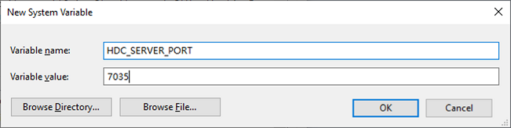
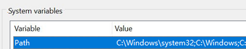
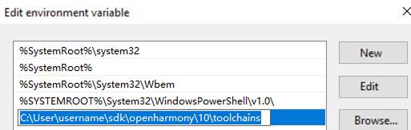

# hdc

OpenHarmony Device Connector (hdc) is a command line tool used for debugging. You can use it on a Windows, Linux, or macOS system to interact with real devices.

## Environment Setup

You can obtain hdc from the **toolchains** folder in the SDK. For first-time use, configure the environment variables as follows.

### Configuring Environment Variable HDC_SERVER_PORT

**On Windows**

Choose **This PC** > **Properties** > **Advanced system settings** > **Advances** > **Environment Variables**, add the variable **HDC_SERVER_PORT**, and set its value to any port number not in use, such as **7035**.



After the environment variable is set, restart DevEco Studio.

**On macOS**

1. Start the terminal tool and run the following command:

   ```shell
   echo $SHELL 
   ```

   - If the command output is **/bin/bash**, run the following command to open the **.bash_profile** file:

      ```shell
      vi ~/.bash_profile
      ```

   - If the command output is **/bin/zsh**, run the following command to open the **.zshrc** file:

      ```shell
      vi ~/.zshrc
      ```

2. Press **i** to enter Insert mode.
3. Enter the following content to add HDC_SERVER_PORT port information to **PATH**:

   ```shell
   HDC_SERVER_PORT=7035
   launchctl setenv HDC_SERVER_PORT $HDC_SERVER_PORT
   export HDC_SERVER_PORT
   ```

4. Press **Esc** to exit Insert mode. Then enter **:wq** and press **Enter** to save the settings.
5. Run the following command for the environment variable to take effect.

   - If Step 1 opens the **.bash_profile** file, run the following command:

      ```shell
      source ~/.bash_profile
      ```

   - If Step 1 opens the **.zshrc** file, run the following command:

      ```shell
      source ~/.zshrc
      ```

6. After the environment variable is set, restart DevEco Studio.

### (Optional) Configuring Global Environment Variables

> **NOTE**
> If global environment variables are not configured, you can still run hdc commands in the CLI under the **toolchains** directory of the SDK.

**On Windows**

Right-click **This PC** and choose **Properties** > **Advanced system settings** > **Advanced** > **Environment Variables**. Add the full **toolchains** path to the value of **Path**.

In this example, the full **toolchains** path is **_/User/username/sdk/openharmony/10/toolchains_**.





**On Linux/macOS**

1. Start the terminal tool and run the following command:

   ```shell
   echo $SHELL 
   ```

   - If the command output is **/bin/bash**, run the following command to open the **.bash_profile** file:

      ```shell
      vi ~/.bash_profile
      ```

   - If the command output is **/bin/zsh**, run the following command to open the **.zshrc** file:

      ```shell
      vi ~/.zshrc
      ```

2. Press **i** to enter Insert mode.

3. Add the **HDC_SDK_PATH** field and set its value to the full **toolchains** path.

   In this example, the full **toolchains** path is **_/User/username/sdk/openharmony/10/toolchains_**.

   ```shell
   HDC_SDK_PATH=/User/username/sdk/openharmony/10/toolchains
   launchctl setenv HDC_SDK_PATH $HDC_SDK_PATH # Only required on macOS.
   export PATH=$PATH:$HDC_SDK_PATH
   ```

4. Press **Esc** to exit Insert mode. Then enter **:wq** and press **Enter** to save the settings.

5. Run the following command for the environment variable to take effect.

   - If Step 1 opens the **.bash_profile** file, run the following command:

      ```shell
      source ~/.bash_profile
      ```

   - If Step 1 opens the **.zshrc** file, run the following command:

      ```shell
      source ~/.zshrc
      ```

**(Optional for Linux) Granting USB Permissions to Non-Root Users**

- (Temporary permissions) Maximize the USB permissions.

   ```shell
   sudo chmod -R 777 /dev/bus/usb/
   ```

- (Permanent permissions) Modify the USB device permission settings.

   1. Run the **lsusb** command to obtain the vendor ID and product ID of the USB device.

   2. Create a udev rule.

      Edit the udev matching rule, replacing the default values with the obtained vendor ID and product ID.

      **MODE="0666"** indicates the permission group of the USB device; **GROUP** indicates the user group to which the logged-in user belongs.

        ```shell
        sudo vim /etc/udev/rules.d/90-myusb.rules
        SUBSYSTEMS=="usb", ATTRS{idVendor}=="067b", ATTRS{idProduct}=="2303", GROUP="users", MODE="0666"
        ```

   3. Restart the computer or reload the udev rule.

        ```shell
        sudo udevadm control --reload
        ```

> **NOTE**
> While granting USB permissions to non-root users can resolve the device recognition issue for non-root users, it may pose potential security risks. Therefore, exercise caution with this operation.

## Important Notes

- If an exception occurs when you are using hdc, run the **hdc kill -r** command to restart the hdc service.

- If no device information is obtained after **hdc list targets** is executed, check whether the hdc process exists in Task Manager. If the process exists, run the **hdc kill -r** command to restart the hdc service.

> **NOTE**
>
> - The parameters enclosed in [] in a command are optional.
> - The parameters in italics are variables. Replace them with actual information when running the command. For example, when running the **file send_***local remote***_** command, replace *local* and *remote* with the path of the local file to be sent and the destination path on the remote device, respectively.

## How to Develop

### Global Option-related Commands

| Option | Description|
| -------- | -------- |
| -t [key] [command] | Specifies the device to connect. You can run the **hdc list targets** command to obtain the list of available devices.|
| help/-h | Displays hdc help information.|
| version/-v | Displays hdc version information.|
| -l [level] | Sets the levels of the logs generated during the running of the tool. The default value is **LOG_INFO**.|
| checkserver | Obtains the client and server version information.|

1. Display hdc help information.

   ```shell
   hdc -h
   ```

   **Return value**
   | Return Value| Description|
   | -------- | -------- |
   | OpenHarmony device connector(HDC) ...<br>---------------------------------global commands:----------------------------------<br>-h/help [verbose]&nbsp;&nbsp;&nbsp;&nbsp;&nbsp;&nbsp;&nbsp;&nbsp;&nbsp;&nbsp;&nbsp;&nbsp;&nbsp;&nbsp;&nbsp;&nbsp;&nbsp;&nbsp;&nbsp;&nbsp;&nbsp;- Print hdc help, 'verbose' for more other cmds<br>..._(Detailed help information is omitted here.)_| Help information about the hdc commands.|

   **Usage**

   ```shell
   hdc -h
   ```

2. Display hdc version information.

   ```shell
   hdc -v
   ```

   **Return value**
   | Return Value| Description|
   | -------- | -------- |
   | Ver: X.X.Xa | hdc (SDK) version information.|

   **Usage**

   ```shell
   hdc -v
   ```

3. Connect to a device. If there is only one device to connect, you do not need to specify **key**. If there are multiple devices, only one can be connected at a time, and you must specify **key** each time.

   ```shell
   hdc-t [key] [command]
   ```

   **Parameters**
   | Name| Description|
   | -------- | -------- |
   | key | ID of the device to connect. It can be an IP address or USB serial number (SN).|
   | command | Command supported by hdc.|

   **Return value**
   | Return Value| Description|
   | -------- | -------- |
   | Command output| For details, see the return value of the corresponding command.|
   | [Fail]Not match target founded, check connect-key please | The device to connect does not exist.|
   | [Fail]ExecuteCommand need connect-key? | The device to connect does not exist.|
   | Unknown operation command... | The command is not supported.|

   **Usage**

   This option must be used with a command. The following uses the **shell** command as an example:

   ```shell
   hdc list targets // Obtain device information.
   hdc -t [key] shell // Replace key with the device ID obtained.
   ```

   > **NOTE**
   > You can connect to multiple devices from the device you use for development. Each device has a unique ID. The ID is the IP address of the device connected over the network or the serial number of the device connected through USB. A specific command must be used with this command.

4. Set the levels of the logs generated during the running of the tool. The default value is **LOG_INFO**.

   ```shell
   hdc -l [level] [command]
   ```

   **Parameters**
   | Name| Description|
   | -------- | -------- |
   | [level] | Log level.<br>**0**: LOG_OFF<br>**1**: LOG_FATAL<br>**2**: LOG_WARN<br>**3**: LOG_INFO<br>**4**: LOG_DEBUG<br>**5**: LOG_ALL|
   | command | Command supported by hdc.|

   **Return value**
   | Return Value| Description|
   | -------- | -------- |
   | Command output| For details, see the return value of the corresponding command.|
   | Log information| Logs of the specified levels.|

   **Usage**

   ```shell
   hdc -l 5 shell ls
   ```

5. Obtain the client and server version information.

   ```shell
   hdc checkserver
   ```

   **Return value**
   | Return Value| Description|
   | -------- | -------- |
   | Client version: Ver: X.X.Xa, server version: Ver: X.X.Xa | Client and server version information.|

   **Usage**

   ```shell
   hdc checkserver
   ```

### Displaying Device Information

| Command| Description|
| -------- | -------- |
| list targets [-v] | Displays all connected devices. Use **-v** to display detailed device information.|

Display all connected devices.

```shell
hdc list targets[-v]
```

**Return value**
| Return Value| Description|
| -------- | -------- |
| Device information| A list of connected devices.|
| [Empty] | No device information is found.|

**Usage**

```shell
hdc list targets
hdc list targets -v
```

### Service Process Commands

| Command| Description|
| -------- | -------- |
| target mount | Mounts the system partition in read/write mode. (Not available in user mode.)|
| target boot | Restarts a device. You can run the **list targets** command to display all connected devices.|
| smode [-r] | Grants the **root** permission to the background hdc service running on the device. You can use the **-r** option to revoke the granted permission. (Not available in user mode.)|
| kill [-r] | Terminates the hdc process. You can use the **-r** option to restart the process.|
| start [-r] | Stars the hdc process. You can use the **-r** option to restart the process.|

1. Mount the system partition in read/write mode.

   ```shell
   hdc target mount
   ```

   **Return value**
   | Return Value| Description|
   | -------- | -------- |
   | Mount finish | Mounting succeeded.|
   | [Fail] Error information| Mounting failed.|

   **Usage**

   ```shell
   hdc target mount
   ```

2. Grant the **root** permission to the background hdc service on the device.

   ```shell
   hdc smode [-r]
   ```

   **Return value**
   | Return Value| Description|
   | -------- | -------- |
   | None| The permission is granted successfully.|
   | [Fail] Error information| Failed to grant the permission.|

   **Usage**

   ```shell
   hdc smode  
   hdc smode -r  // Revoke the root permission.
   ```

3. Terminate the hdc service.

   ```shell
   hdc kill [-r]
   ```

   **Return value**
   | Return Value| Description|
   | -------- | -------- |
   | Kill server finish | The service is terminated successfully.|
   | [Fail] Error information| Failed to terminate the service.|

   **Usage**

   ```shell
   hdc kill
   hdc kill -r // Restart the service.
   ```

4. Start the hdc service.

   ```shell
   hdc start [-r]
   ```

   **Return value**
   | Return Value| Description|
   | -------- | -------- |
   | None| The service is started successfully.|
   | [Fail] Error information| Failed to start the service.|

   **Usage**

   ```shell
   hdc start
   hdc start -r // Restart the service.
   ```

### Network Commands

| Command| Description|
| -------- | -------- |
| fport ls | Lists all port forwarding tasks.|
| fport _local remote_ | Sets a forward port forwarding task, which forwards data from a host port to a device port.|
| fport rm _local__remote_ | Removes a forward port forwarding task.|
| rport _remote local_ | Sets a reverse port forwarding task, which forwards data from a device port to a host port.|
| rport rm _remote local_ | Removes a reverse port forwarding task.|
| tmode usb | Restarts the daemon process and connects to the device using USB preferentially.|
| tmode port [port-number] | Restarts the daemon process and connects to the device over the network preferentially. If the network connection fails, a USB connection will be initiated.|
| tconn_ host_[:port] [-remove] | Connects to a device with the specified IP address and port number. Use the**-remove** option to disconnect from the specified device.|

1. List all port forwarding tasks.

   ```shell
   hdc fport ls
   ```

   **Return value**
   | Return Value| Description|
   | -------- | -------- |
   | 'tcp:1234 tcp:1080' [Forward] | Forward port forwarding task.|
   | 'tcp:2080 tcp:2345' [Reverse] | Reverse port forwarding task.|
   | [empty] | No port forwarding task available.|

   **Usage**

   ```shell
   hdc fport ls
   ```

2. Set a forward port forwarding task, which forwards data from a host port to a device port.

   ```shell
   hdc fport local remote
   ```

   **Return value**
   | Return Value| Description|
   | -------- | -------- |
   | Forwardport result:OK | The port forwarding task is set properly.|
   | [Fail]Incorrect forward command | Failed to set the port forwarding task due to parameter errors.|
   | [Fail]TCP Port listen failed at XXXX | Failed to set the port forwarding task because the local port is in use.|

   **Usage**

   ```shell
   hdc fport tcp:1234 tcp:1080
   ```

3. Remove a forward port forwarding task, which forwards data from a host port to a device port.

   ```shell
   hdc fport rm localremote
   ```

   **Return value**
   | Return Value| Description|
   | -------- | -------- |
   | Remove forward ruler success, ruler:tcp:XXXX tcp:XXXX | The port forwarding task is removed successfully.|
   | [Fail]Remove forward ruler failed, ruler is not exist tcp:XXXX tcp:XXXX | Failed to delete the port forwarding task because the specified forwarding task does not exist.|

   **Usage**

   ```shell
   hdc fport rm tcp:1234 tcp:1080
   ```

4. Set a reverse port forwarding task, which forwards data from a device port to a host port.

   ```shell
   hdc rport remote local
   ```

   **Return value**
   | Return Value| Description|
   | -------- | -------- |
   | Forwardport result:OK | The port forwarding task is set properly.|
   | [Fail]Incorrect forward command | Failed to set the port forwarding task due to parameter errors.|
   | [Fail]TCP Port listen failed at XXXX | Failed to set the port forwarding task because the local port is in use.|

   **Usage**

   ```shell
   hdc rport tcp:1234 tcp:1080
   ```

5. Remove a reverse port forwarding task, which forwards data from a device port to a host port.

   ```shell
   hdc rport rm remote local
   ```

   **Return value**
   | Return Value| Description|
   | -------- | -------- |
   | Remove forward ruler success, ruler:tcp:XXXX tcp:XXXX | The port forwarding task is removed successfully.|
   | [Fail]Remove forward ruler failed, ruler is not exist tcp:XXXX tcp:XXXX | Failed to delete the port forwarding task because the specified forwarding task does not exist.|

   **Usage**

   ```shell
   hdc rport rm tcp:1234 tcp:1080
   ```

6. Restart the daemon process and connect to the device using USB preferentially.

   ```shell
   hdc tmode usb
   ```

   **Return value**
   | Return Value| Description|
   | -------- | -------- |
   | None| The operation is successful.|
   | [Fail]ExecuteCommand need connect-key | The operation fails due to no devices connected over the network.|

   **Usage**

   ```shell
   hdc tmode usb
   ```

7. Restart the daemon process and connect to the device over the network preferentially.

   ```shell
   hdc tmode port [port-number]
   ```

   **Parameters**
   | Name| Description|
   | -------- | -------- |
   | port-number | Port used to connect to the device. The value ranges from 1 to 65536.|

   **Return value**
   | Return Value| Description|
   | -------- | -------- |
   | None| The operation is successful.|
   | [Fail]ExecuteCommand need connect-key | The operation fails due to no devices available.|
   | [Fail]Incorrect port range | The port number is out of range (1 to 65536).|

   **Usage**

   ```shell
   hdc tmode port 1234
   ```

   > **NOTICE**
   > Before running the preceding command, make sure the local and remote devices are on the same network, and the remote device is reachable
   >
   > (which you can find out by pinging the device's IP address).

   > **NOTE**
   > After the command is executed, the remote daemon process can be connected only over TCP by default. To connect to the process using USB, use either of the following methods:
   >
   > (1) Run the **hdc tconn [ip]:[port]** command to set up a TCP connection, and then run the **hdc tmode usb** command to restore the connection.
   >
   > (2) Restore the device to its factory settings.

8. Connect to a device with the specified IP address and port number.

   ```shell
   hdc tconn host[:port] [-remove]
   ```

   **Parameters**
   | Name| Description|
   | -------- | -------- |
   | host[:port] | IP address and port number for the device to connect.|
   | -remove | (Optional) Disconnects from the specified device.|

   **Return value**
   | Return Value| Description|
   | -------- | -------- |
   | Connect OK | The connection is successful.|
   | [Info]Target is connected, repeat opration | The device is already connected.|
   | [Fail]Connect failed | The connection fails.|

   **Usage**

   ```shell
   hdc tconn 192.168.0.1:8888
   hdc tconn 192.168.0.1:8888 -remove  // Disconnect from the device.
   ```

### File Commands

| Command| Description|
| -------- | -------- |
| file send _local remote_ | Sends a local file to a remote device.|
| file recv _remote local_ | Sends a file from a remote device to the local device.|

1. Send a local file to a remote device.

   ```shell
   hdc file send local remote
   ```

   **Parameters**
   | Name| Description|
   | -------- | -------- |
   | local | Path of the file to send on the local device.|
   | remote | Destination path on the remote device.|

   **Return value**

   A success message is displayed if the file is sent successfully. Error information is displayed if the file fails to be sent.

   **Usage**

   ```shell
   hdc file send E:\example.txt /data/local/tmp/example.txt
   ```

2. Send a file from a remote device to the local device.

   ```shell
   hdc file recv remote local
   ```

   **Parameters**
   | Name| Description|
   | -------- | -------- |
   | local | Destination path on the local device.|
   | remote | Path of the file to send on the remote device.|

   **Return value**

   A success message is displayed if the file is received successfully. Error information is displayed if the file fails to be receied.

   **Usage**

   ```shell
   hdc file recv  /data/local/tmp/a.txt   ./a.txt
   ```

### Application Commands

| Command| Description|
| -------- | -------- |
| install [-r/-d/-g] _packageFile_ | Installs the specified application.|
| uninstall_ packageName_ | Uninstalls the specified application.|

1. Install an application.

   ```shell
   hdc install [-r/-d/-g] packageFile
   ```

   **Parameters**
   | Name| Description|
   | -------- | -------- |
   | packageFile | Application installation package.|
   | -r | Replaces the existing application.|
   | -d | Allows downgrade installation.|
   | -g | Grants permissions dynamically.|

   **Return value**
   | Return Value| Description|
   | -------- | -------- |
   | None| The operation is successful.|
   | Error| Error information|

   **Usage**

   The following example installs the **com.example.hello** package.

   ```shell
   hdc install E:\com.example.hello.hap
   ```

2. Uninstall the specified application.

   ```shell
   hdc uninstall [-k] packageName
   ```

   **Parameters**
   | Name| Description|
   | -------- | -------- |
   | packageName | Application installation package.|
   | -k | Retains **/data/cache**.|

   **Return value**
   | Return Value| Description|
   | -------- | -------- |
   | None| The operation is successful.|
   | Error| Error information|

   **Usage**

   The following example uninstalls the **com.example.hello** package.

   ```shell
   hdc uninstall com.example.hello
   ```

### Debugging Commands

| Command| Description|
| -------- | -------- |
| jpid | Displays the applications that can be debugged.|
| hilog [options] | Obtains the log information of the device. **[options]** indicates the parameters supported by HiLog. You can run the **hdc hilog -h** command to obtain the parameter information.|
| shell [COMMAND] | Enters the interactive command environment. **[COMMAND]** indicates a single command to execute. The supported commands vary by system type and version. To view the supported command list, run the** hdc shell ls /system/bin** command.|

1. Obtain log information about the device.

   ```shell
   hdc hilog[options]
   ```

   **Parameters**
   | Name| Description|
   | -------- | -------- |
   | [options] | Parameters supported by HiLog. You can run the **hdc hilog -h** command to obtain the parameter information.|

   **Return value**
   | Return Value| Description|
   | -------- | -------- |
   | Returned information| Log information obtained.|

   **Usage**

   ```shell
   hdc hilog 
   hdc shell "hilog -r" // Clear the cached logs.
   ```

2. Obtain the list of applications that can be debugged.

   ```shell
   hdc jpid
   ```

   **Return value**
   | Return Value| Description|
   | -------- | -------- |
   | Application list| List of applications that can be debugged.|
   | [empty] | No applications that can be debugged.|

   **Usage**

   ```shell
   hdc jpid
   ```

3. Enter the interactive command environment.

   ```shell
   hdc shell [COMMAND]
   ```

   **Parameters**
   | Name| Description|
   | -------- | -------- |
   | [COMMAND] | Command to execute. To view help information about the commands, run **help**.|

   **Return value**
   | Return Value| Description|
   | -------- | -------- |
   | Returned information| For details about the returned information, see the return value of other interactive commands.|
   | /bin/sh: XXX : inaccessible or not found | The command is not supported.|

   **Usage**

   ```shell
   hdc shell ps -ef  
   hdc shell help -a // List all available commands.
   ```

## Scenarios

### Setting Up a USB Connection

**Environment Setup**
| Item| Description| Exception Handling|
| -------- | -------- | -------- |
| USB debugging| Enable USB debugging.| If USB debugging cannot be automatically enabled, restart the device.|
| USB data cable| Use a USB data cable to connect the target device to the PC.| If the device is not recognized correctly, the USB data cable may not support high bandwidths or data communication. In this case, replace it with an official USB data cable.|
| USB port| Use the USB port on the rear panel of the PC (or the USB port on the laptop).| Using a conversion adapter, docking station, or USB port on the front panel of the PC may result in low speeds, USB synchronization issues, and even frequent disconnections. Therefore, you are advised to connect the device directly to the USB port on the rear panel of the PC.|
| hdc environment variable| Run the **hdc -h** command on the CLI. If the help information is displayed, the environment variable is configured correctly.| For details, see [Environment Setup](#environment-setup).|
| Driver| Make sure the **HDC Device** or **HDC Interface** entry is displayed under **Universal Serial Bus controllers** in Device Manager.| Install the driver.|

**Procedure**

```shell
hdc shell // Make sure the device is not using TCP for connections.
```

### Setting Up a TCP Connection

**Environment Setup**
| Item| Description| Exception Handling|
| -------- | -------- | -------- |
| Network connection| Make sure the PC and target device are on the same network.| Connect the PC and target device to the same Wi-Fi network; alternatively, enable the Wi-Fi hotspot on the target device, and connect the PC to the device.|
| Network status| Run **telnet *ip*:*port***. The result shown should indicate that the network speed is stable.| Select a stable network connection mode.|
| hdc environment variable| Run the **hdc -h** command on the CLI. If the help information is displayed, the environment variable is configured correctly.| For details, see [Environment Setup](#environment-setup).|

**Procedure**

1. Connect the target device to the PC through the USB port.

2. Turn on the device screen.

   ```shell
   hdc shell "power-shell setmode 602"
   ```

   Keep the screen always on to avoid Wi-Fi disconnection. If the device is disconnected, run the **tconn** command immediately for reconnection.

3. Switch the device from the USB mode to the TCP mode:

   ```shell
   hdc tmode port 8710// Replace 8710 with the actual port used.
   ```

4. Connect to the device through TCP (the device IP address must be obtained in advance):

   ```shell
   hdc tconn ip:8710
   ```

   Replace **ip** with the device IP address (displayed in the device system settings) and **8710** (default value) with the port number you specify in the previous step.

5. View the connected devices.

   ```shell
   hdc list targets
   ```

   If the return value is in the ip:port format, the connection is successful. You can then run **hdc** commands with the **-t** option to perform operations on one or more devices.

6. (Optional) Switch the device from the TCP mode back to the USB mode.

   ```shell
   hdc tmode usb
   ```

   The device can then be connected using USB.

### Connecting to a Remote Server

The following figure shows a remote connection.


**Operations on the Server**

Connect the server to the hdc device using a USB data cable and run the following commands:

```shell
hdc kill          // Disable the local hdc service.
hdc -s ip:8710 -m // Enable the hdc service on the server.
                  // ip indicates the server IP address. To check the IP address, run ipconfig in Windows and ifconfig in Unix.
                  // 8710 is the default port number. You can change it to any usable port number, for example, 18710.
                  // After startup, the server prints logs.
```

**Operations on the Client**

Ensure that the client can connect to the server IP address. Then run the following commands:
```shell
hdc -s ip:8710 [command] // ip indicates the server IP address.
                         // command can be any available hdc command, for example, list targets.
```

### Obtaining Logs

**Server Logs**

Enable logging.

```shell
hdc kill ​
hdc -l5 start
```

The log save path varies by platform.

| Platform| Path| Remarks|
| -------- | -------- | -------- |
| Windows | %temp%\hdc.log | Example of a full path:<br>C:\Users\*Username*\AppData\Local\Temp\hdc.log<br>**NOTE**<br>In a Windows path, backslashes (\) are used.|
| Linux | /tmp/hdc.log | - |
| MacOS | $TMPDIR/hdc.log | - |

**Device Logs**

Start HiLog for logging.

```shell
hdc shell hilog -w start                              // Start HiLog.
hdc shell ls /data/log/hilog                          // View the saved logs.
hdc file recv /data/log/hilog                         // Obtain the saved logs (including kernel logs).
```

## FAQs

### Device cannot be identified

**Symptom**

After the **hdc list targets** command is executed, **[empty]** is displayed.

Perform the following operations to locate the fault:

- Case 1: Check whether the hdc device is displayed in Device Manager.

  Windows:

  Check whether **HDC Device** or **HDC Interface** exists under **Universal Serial Bus controllers** in Device Manager.

  Linux:

  Run the **lsusb** command. Check whether **HDC Device** or **HDC Interface** is displayed in the command output.

  macOS:

  Check for USB devices in **System Information** or **System Profiler**.

  1. Press and hold the **Option** key, and then click the menu.

  2. Select **System Information** or **System Profiler**.

  3. In the displayed window, select **USB** on the left.

  4. Check for **HDC Device** or **HDC Interface** in the displayed device tree.

  **Solution**

  If neither **HDC Device** or **HDC Interface** is displayed, the device cannot be identified. In this case, perform the following operations:

  - Use another physical USB port.
  - Replace the USB data cable.
  - Use another computer for debugging.
  - Enable USB debugging mode on the device.
  - When prompted, allow debugging on the device.
  - If the connection can be set up over TCP, run the **hdc tmode usb** command to switch the device to USB mode.
  - Restore the device to factory settings.

- Case 2: There is an exclamation mark on the USB device entry in Device Manager.

  This issue usually occurs in Windows. The exclamation mark indicates that the device is not working properly. To resolve the issue, reinstall the driver. If the issue persists, use another USB cable, docking station, or USB port.

  To reinstall the driver:

  1. Open Device Manager and right-click **HDC Device** with an exclamation mark.

  2. Select **Update driver** from the shortcut menu.

  3. In the displayed dialog box, select **Browse my computer for driver software**.

  4. Select **Let me pick from a list of device drivers on my computer**.

  5. Deselect **Show compatible hardware**. Select WinUSB device for both the manufacturer and model, and then click **Next**.

- Case 3: Running an hdc command returns the "[Fail]Failed to communicate with daemon" message.

   Perform the following steps:

  - The hdc SDK does not match the device: Make sure the device's system version is update to date, and then update hdc.
- The port is in use.
  
    This issue usually occurs when hdc and hdc_std use the same port. By default, they use the same port (port 8710, as specified by **HDC_SERVER_PORT**), and running them at the same time will result in port conflicts. As such, do not run them at the same time. This issue also occurs when other software is using the default hdc port.

- Case 4: The message "Connect server failed" is displayed when the device is connected.

  Perform the following steps:

  - Port preemption

    The solution is as follows:
    1. Check for software that comes with hdc.

       Such software includes DevEco Studio and DevEco Testing. Close any such software before running hdc commands.

    2. Check hdc port usage.

       For example, if **HDC_SERVER_PORT** is set to **8710**, run the following command depending on the platform:

       Unix:

       ```shell
       netstat -an |grep 8710
       ```

       Windows:

       ```shell
       netstat -an |findstr 8710
       ```

       If any other software is using the port, stop the software process or change the **HDC_SERVER_PORT** environment variable to another port number.

    3. Check for hdc servers of other versions.

       Windows:

       Choose **Task Manager** > **Details**. Locate the **hdc.exe** process, right-click it, and open its file location. Check whether the location is the same as the hdc file location specified in the environment variables. If they are different, stop the **hdc.exe** process (by running the **hdc kill** command or by closing the process in Task Manager). Run the hdc command again. (After the hdc server is shut down, running the hdc command will start the hdc server.)

       Unix:

       Run the **ps -ef |grep hdc** command to check the hdc server process. Check whether the process startup location is the same as the hdc file location specified in the environment variables. If they are different, stop the process (by running the **hdc kill** command or the **kill -9 hdc** command followed by the PID). Run the hdc command again. (After the hdc server is shut down, running the hdc command will start the hdc server.)

  - Registry exception

    Clear the registry as follows:

    1. Press **Win+R** to open the **Run** dialog box, enter **regedit** in the text box, and then press **Enter**.
    2. Enter the following in the registry address bar and press **Enter** to access the registry of the USB device driver.

       ```shell
       Computer\HKEY_LOCAL_MACHINE\SYSTEM\CurrentControlSet\Control\Class\{88bae032-5a81-49f0-bc3d-a4ff138216d6}
       ```

    3. Right-click **UpperFilters** and choose **Modify** from the shortcut menu. Back up and clear the value data. If the issue persists, restore the value data based on the backup data.
    4. Refresh Device Manager, remove and insert the USB data cable, or restart the computer.

### Failed to run hdc

**Symptom**

The **hdc.exe** or the hdc binary file cannot be executed.

**Solution**

- Check the running environment.

  Linux: Ubuntu 18.04 64-bit or later is recommended. If **libc++.so** is incorrectly referenced, run the **ldd** or **readelf** command to check the referenced library.

  macOS: macOS 11 or later is recommended.

  Windows: Windows 10 or Windows 11 64-bit is recommended. If the Windows winusb library of an earlier version is missing, use [Zadig](https://github.com/pbatard/libwdi/releases) to update the library. For composite devices, use Zadig tool to install the libusb-win32 driver.

- Run commands to start hdc, instead of double-clicking the **hdc.exe** or the hdc binary file.

### Common Procedure for Troubleshooting

1. Run the **hdc list targets** command and check the return value.
2. Check whether **HDC Device** exists in Device Manager.
3. Run the **hdc kill** command to stop the server, and then run the **hdc -l5 start** command to collect logs. (The **hdc.log** file is stored in the **TEMP** path, with the full path varying by platform. For details, see [Obtaining Logs](#obtaining-logs).)
4. Examine the **hdc.log** file.
