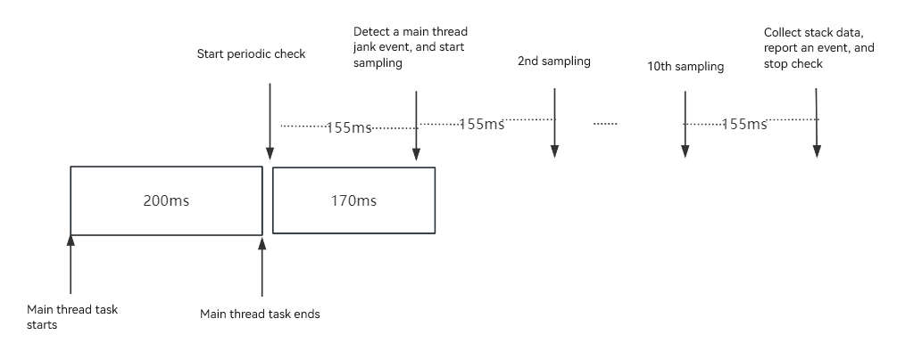
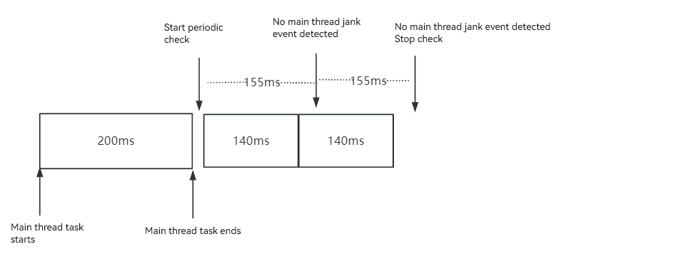
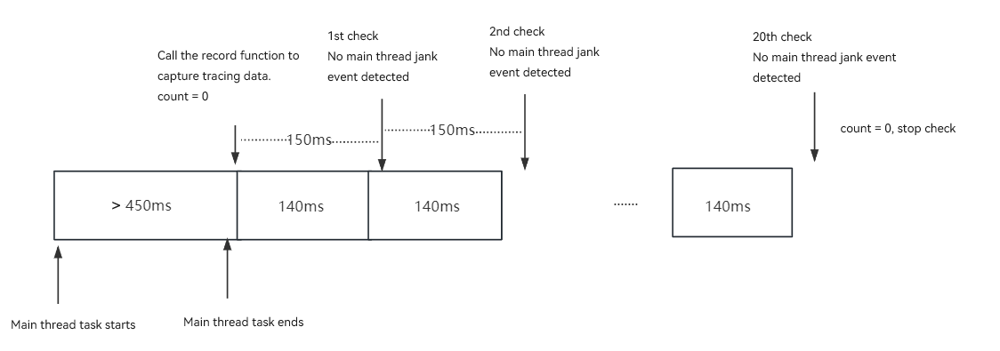
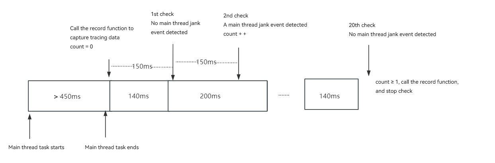

# Subscribing to Main Thread Jank Events (ArkTS)

## Available APIs

For details about how to use the APIs, see [Application Event Logging](../reference/apis-performance-analysis-kit/js-apis-hiviewdfx-hiappevent.md).

| API                                             | Description                                        |
| --------------------------------------------------- | -------------------------------------------- |
| addWatcher(watcher: Watcher): AppEventPackageHolder | Adds a watcher to listen for application events.|
| removeWatcher(watcher: Watcher): void               | Removes a watcher to unsubscribe from application events.|

## How to Develop

The following describes how to subscribe to the main thread jank event, which is reported when a task running in the main thread times out.

1. Create an ArkTS application project. In the **entry/src/main/ets/entryability/EntryAbility.ets** file, import the dependent modules.

   ```ts
   import { hiAppEvent, hilog } from '@kit.PerformanceAnalysisKit';
   ```

2. In the **entry/src/main/ets/entryability/EntryAbility.ets** file, add a watcher in **onCreate()** to subscribe to system events. The sample code is as follows:

   ```ts
    hiAppEvent.addWatcher({
      // Set the watcher name. The system identifies different watchers based on their names.
      name: "watcher",
      // Add the system events to watch, for example, the main thread jank event.
      appEventFilters: [
        {
          domain: hiAppEvent.domain.OS,
          names: [hiAppEvent.event.MAIN_THREAD_JANK]
        }
      ],
      // Implement a callback for the registered system event so that you can apply custom processing to the event data obtained.
      onReceive: (domain: string, appEventGroups: Array<hiAppEvent.AppEventGroup>) => {
        hilog.info(0x0000, 'testTag', `HiAppEvent onReceive: domain=${domain}`);
        for (const eventGroup of appEventGroups) {
          // The event name uniquely identifies a system event.
          hilog.info(0x0000, 'testTag', `HiAppEvent eventName=${eventGroup.name}`);
          for (const eventInfo of eventGroup.appEventInfos) {
            // Apply custom processing to the event data obtained, for example, print the event data in the log.
            hilog.info(0x0000, 'testTag', `HiAppEvent eventInfo.domain=${eventInfo.domain}`);
            hilog.info(0x0000, 'testTag', `HiAppEvent eventInfo.name=${eventInfo.name}`);
            hilog.info(0x0000, 'testTag', `HiAppEvent eventInfo.eventType=${eventInfo.eventType}`);
            // Obtain the timestamp when the main thread jank event occurs.
            hilog.info(0x0000, 'testTag', `HiAppEvent eventInfo.params.time=${eventInfo.params['time']}`);
            // Obtain the version information of the app.
            hilog.info(0x0000, 'testTag', `HiAppEvent eventInfo.params.bundle_version=${eventInfo.params['bundle_version']}`);
            // Obtain the bundle name of the app.
            hilog.info(0x0000, 'testTag', `HiAppEvent eventInfo.params.bundle_name=${eventInfo.params['bundle_name']}`);
            // Obtain the PID and UID of the app.
            hilog.info(0x0000, 'testTag', `HiAppEvent eventInfo.params.pid=${eventInfo.params['pid']}`);
            hilog.info(0x0000, 'testTag', `HiAppEvent eventInfo.params.uid=${eventInfo.params['uid']}`);
            // Obtain the begin time and end time on the main thread.
            hilog.info(0x0000, 'testTag', `HiAppEvent eventInfo.params.begin_time=${eventInfo.params['begin_time']}`);
            hilog.info(0x0000, 'testTag', `HiAppEvent eventInfo.params.end_time=${eventInfo.params['end_time']}`);
            // Obtain the error log file generated when the main thread jank event occurs.
            hilog.info(0x0000, 'testTag', `HiAppEvent eventInfo.params.external_log=${JSON.stringify(eventInfo.params['external_log'])}`);
            hilog.info(0x0000, 'testTag', `HiAppEvent eventInfo.params.log_over_limit=${eventInfo.params['log_over_limit']}`);
          }
        }
      }
    });
   ```


3. In the **entry/src/main/ets/pages/Index.ets** file, add the **timeOut500** button with **onClick()** to trigger a main thread jank event when the button is clicked. The sample code is as follows:
   ```ts
     Button("timeOut350")
     .fontSize(50)
     .fontWeight(FontWeight.Bold)
     .onClick(() => {
         let t = Date.now();
         while (Date.now() - t <= 350){
         
         }
     })
   ```

4. **If the nolog version is used and the developer mode is disabled**, the main thread checker will collect tracing data when a task times out. 

5. In DevEco Studio, click the **Run** button to run the application project. Click the **timeOut350** button twice consecutively to trigger a main thread jank event.

6. After the main thread jank event is reported, the system calls **onReceive()**. You can view the following event information in the **Log** window.

   Tracing data of the main thread jank event is as follows:

    ```text
     HiAppEvent eventInfo.domain=OS
     HiAppEvent eventInfo.name=MAIN_THREAD_JANK
     HiAppEvent eventInfo.eventType=1
     HiAppEvent eventInfo.params.time=1717593620518
     HiAppEvent eventInfo.params.bundle_version=1.0.0
     HiAppEvent eventInfo.params.bundle_name=com.example.main_thread_jank
     HiAppEvent eventInfo.params.pid=40986
     HiAppEvent eventInfo.params.uid=20020150
     HiAppEvent eventInfo.params.begin_time=1717593620016
     HiAppEvent eventInfo.params.end_time=1717593620518
     HiAppEvent eventInfo.params.external_log=["/data/storage/el2/log/watchdog/MAIN_THREAD_JANK_20240613211739_40986.txt"]
     HiAppEvent eventInfo.params.log_over_limit=false
    ```

   The sampling stack of the main thread jank event is similar to the trace result. The differences are as follows:
   
   Stack:
   external_log=["/data/storage/el2/log/watchdog/MAIN_THREAD_JANK_yyyyMMDDHHmmss_xxxx.txt"]. *xxxx* indicates the process ID.
   
   Trace:
   external_log=[""/data/storage/el2/log/watchdog/MAIN_THREAD_JANK_unix timestamp_xxxx.trace"]. *xxxx* indicates the process ID.

## Main Thread Jank Event Time Specifications
1. Begin time

    If the main thread processing time is greater than 150 ms but less than 450 ms, trigger a stack sampling. **Only one sampling stack can be triggered based on the PID of an app in its lifecycle.**
  
    If the main thread processing time exceeds 450 ms, trigger a trace sampling. **Only one sampling trace can be triggered based on the UID of an app in a day.**

2. Stack capture time

    When the main thread jank event occurs, the main thread checker starts to check whether the jank event occurs again every 155 ms (1 ≤ number of check times ≤ 2). There are three cases:

    (1) If a jank event is detected during the first check, the main thread checker starts stack sampling every 155 ms for 10 times. The stack sampling data is collected and an event is reported at the next interval. Then the check ends. 
    
      

    (2) If a jank event is detected during the second check, the main thread checker starts stack sampling every 155 ms for 10 times. The stack sampling data is collected and an event is reported at the next interval. Then the check ends. 
    
      

    (3) If no jank event is detected in the two checks, the check ends.

      

3. Trace capture time 

   After the function is called to capture tracing data, the main thread checker checks for a main thread jank event every 150 ms for 20 times. If a main thread jank event occurs in any of the 20 checks, the check ends in 3s and the tracing data is stored.

   (1) No main thread jank event is detected. 

   

   (2) At least one main thread jank event is detected.

   

## Main Thread Jank Event Specifications

1. Log aging

    Generally, the size of a stack file is 7 KB to 10 KB, and the size of a trace file is 3 MB to 6 MB. The **watchdog** directory in the app sandbox can store a maximum of 10 MB files. If the total file size exceeds 10 MB, the user needs to manually delete files. The path to **watchdog** is **/data/app/el2/100/log/*app_bundle_name*/watchdog**.

2. You can obtain the log path from **EXTERNAL_LOG**.

3. Currently, stack capturing supports only the ARM64 architecture. The stack capture result contains both native frames and JS frames parsed.

   An example of the stack capture result is as follows:
   ```text
    9 #00 pc 0000757c /system/bin/appspawn(55679d09bcdea35bb1e0d4e1d9a3e58f)
        9 #01 pc 000731c0 /system/lib/ld-musl-aarch64.so.1(add9e521e4eaf5cb009d4260f3b69ccd)
            9 #02 pc 000090a9 /system/bin/appspawn(main+396)(55679d09bcdea35bb1e0d4e1d9a3e58f)
                9 #03 pc 0000ab5d /system/bin/appspawn(AppSpawnRun+100)(55679d09bcdea35bb1e0d4e1d9a3e58f)
                    9 #04 pc 0000e7f1 /system/lib/chipset-pub-sdk/libbegetutil.z.so(RunLoop_+200)(52ace27d827ad482439bf32cc75bb17b)
                    ......
                                            9 #21 pc 00107aec /system/lib/ld-musl-aarch64.so.1(__pthread_cond_timedwait+628)(add9e521e4eaf5cb009d4260f3b69ccd)
    1 #00 pc 00032e67 /system/lib/platformsdk/libmmi-util.z.so(OHOS::MMI::UDSSocket::OnReadPackets(OHOS::MMI::CircleStreamBuffer&, std::__h::function<void (OHOS::MMI::NetPacket&)>)+158)(99e56bc765f9208f7b7ba8b268886a59)
        1 #01 pc 0000312e5 /system/lib/platformsdk/libmmi-client.z.so(OHOS::MMI::ClientMsgHandler::OnMsgHandler(OHOS::MMI::UDSClient const&, OHOS::MMI::NetPacket&)+340)(66ac85e964777ae89f0c26c339093cd1)
            1 #02 pc 0003016b /system/lib/platformsdk/libmmi-client.z.so(OHOS::MMI::ClientMsgHandler::OnPointerEvent(OHOS::MMI::UDSClient const&, OHOS::MMI::NetPacket&)+1222)(66ac85e964777ae89f0c26c339093cd1)
                1 #03 pc 0003b96b /system/lib/platformsdk/libmmi-client.z.so(OHOS::MMI::InputManagerImpl::OnPointerEvent(std::__h::shared_ptr<OHOS::MMI::PointerEvent>)+1370)(66ac85e964777ae89f0c26c339093cd1)
                    1 #04 pc 00095903 /system/lib/platformsdk/libwm.z.so(OHOS::Rosen::InputEventListener::OnInputEvent(std::__h::shared_ptr<OHOS::MMI::PointerEvent>) const+478)(9c40c5f416d6f830435126998fbcad42)
                    ......
                                            1 #21 pc 003f5c55 /system/lib/platformsdk/libark_jsruntime.so(4e6a2651ec80a7f639233f414d6486fe)
                                                1 #22 at anonymous (/entry/build/default/cache/default/default@CompileArkTS/esmodule/debug/entry/src/main/ets/pages/Index.js:67:17)
                                                    1 #23 at wait2 (/entry/build/default/cache/default/default@CompileArkTS/esmodule/debug/entry/src/main/ets/pages/Index.js:16:12)
                                                    ......
   ```

   Each stack capture records 16 KB call stack information of the main thread for stack unwinding. Therefore, each stack capture result contains a maximum of 16 KB invocation information of the process for 10 times. The captured data is displayed in a tree view, with repeated stack frames aggregated and different call layers distinguished by line indentation.  If the stack fails to be captured (for example, the main thread is blocked in the kernel or signals are masked), the content of the **/proc/self/wchan** file is output.
   
   In the result, each row indicates a piece of stack information. The meaning of a row of stack frame information can be interpreted as follows:

   Native frame:

   ```text
    9 #02 pc 000090a9 /system/bin/appspawn(main+396)(55679d09bcdea35bb1e0d4e1d9a3e58f)
    ^  ^       ^               ^              ^                   ^ 
    1  2       3               4              5                   6

    1 indicates the number of times that the frame is sampled.
    2 indicates the invoking level of the frame. The line indentation size corresponds to this level. The number of sampling times of all frames at the same level cannot be greater than 10. The number of sampling times of #00 is 10 (set the sampling times).
    3 indicates the PC value of the native frame.
    4 indicates the path of the called file.
    5 indicates the name of the called function and code line offset (available in unstripped version, and may not available in stripped version).
    6 indicates the MD5 value of the .so file.
   ```

   JS frame:

   ```text
    1 #23 at wait2 (/entry/build/default/cache/default/XXX/entry/src/main/ets/pages/Index.js:16:12)
    ^  ^    ^               ^
    1  2    3               4

    1 indicates the number of times that the frame is sampled. The maximum value is the sampling times.
    2 indicates the invoking level of the frame, which is the same as that of the native frame.
    3 indicates the name of the called function, which is **wait2**.
    4 indicates the path, file, row number, and column number of the called function.
   ```

4. Trace specifications

    The size of a trace file is 1 MB to 5 MB. You can parse the trace file using [SmartPerf](https://www.smartperf.host).

    After the trace file is imported, the page displays the time axis, CPU usage, CPU load, IPC method calling, and process, thread, and method calling information from the top down. In this way, the data is displayed from the event dimension.

    For details about how to use trace files, see [How to Load Trace Files on the Web Client](https://gitee.com/openharmony/developtools_smartperf_host/blob/master/ide/src/doc/md/quickstart_systemtrace.md).
