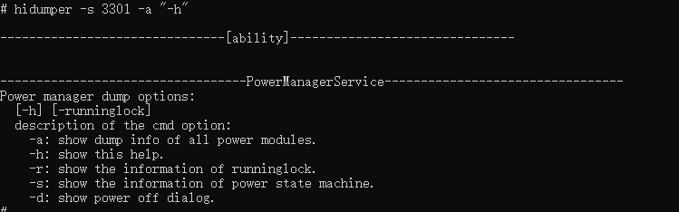

# hidumper

HiDumper is a unified system information collection tool provided for development and test personnel to analyze and locate faults.

## Prerequisites

- The [environment setup](hdc.md#environment-setup) is complete.

- The devices are properly connected.

## Command Description

| Option| Description|
| -------- | -------- |
| -h  | Shows help information.|
| -lc | Shows the system information cluster list.|
| -ls | Shows the system ability list.|
| -c | Exports system cluster information.|
| -s | Exports all system ability information.|
| -e | Exports crash logs.|
| --net | Exports network information.|
| --storage | Exports storage information.|
| -p | Exports the process list and all process information.|
| --cpuusage [pid] | Exports the CPU usage information. If **pid** is specified, the CPU usage of the corresponding process is exported.|
| --cpufreq | Exports the actual CPU frequency.|
| --mem [pid] | Exports the total memory usage. If **pid** is specified, the memory usage of the corresponding process is exported.|
| --mem-smaps pid [-v] | Exports the total memory usage to **/proc/pid/smaps**. Use **-v** to specify more details.|
| --zip | Compresses the exported information to **/data/log/hidumper**.|

## Common Commands

1. View help information.

   ```
   hidumper -h
   ```

   **Example**

   

2. View memory usage of the process specified by **pid**.

   ```
   hidumper --mem pid
   ```

   **Example**

   

   The **Graph** field represents the memory size used by the process under the **/proc/process_dmabuf_info** node.
   
3. View memory usage of all processes on the device.

   ```
   hidumper --mem
   ```

   **Example**

   

4. View CPU usage.

   ```
   hidumper --cpuusage
   ```

   **Example**

   

5. View CPU usage of the process specified by **pid**.

   ```
   hidumper --cpuusage pid
   ```

   **Example**

   

6. View the help information about the ability whose ID is 3301.

   ```
   hidumper -s 3301 -a "-h" 
   ```

   **Example**

   

7. View the help information about RenderService.

   ```
   hidumper -s RenderService -a "h" 
   ```

   **Example**

   

8. View the refresh frame rate of a surface.

   ```
   hidumper -s RenderService -a "surface_name fps" 
   ```

   **Example**

   
