# HiDumper

HiDumper is a command-line tool used to export essential system information for analyzing and locating issues.

## Prerequisites

- The [environment setup](hdc.md#environment-setup) is complete.

- The devices are properly connected.

## Command Description

| Commands| Description|
| -------- | -------- |
| -h  | Displays help information.|
| -lc | Lists system information clusters.|
| -ls | Lists system capabilities.|
| -c | Obtains detailed information about the system information cluster.|
| -s | Obtains detailed information about all system capabilities.|
| -s [SA] -a ["option"] | Executes a specific option of a system capability. **SA** indicates a system capability, and **option** indicates an option supported by the system capability. You can run **-s [SA] -a ["-h"]** to obtain all options supported by a system capability.|
| -e | Obtains crash logs.|
| --net [pid] | Obtains network information. If **pid** is specified, obtains only the network traffic usage of the specified process.|
| --storage [pid] | Obtains storage information. If **pid** is specified, obtains the I/O information of the specified process.|
| -p [pid] | Obtains all process and thread information.|
| --cpuusage [pid] | Obtains the CPU usage by process and category. If **pid** is specified, obtains the CPU usage of the specified process.|
| --cpufreq | Obtains the actual CPU frequency.|
| --mem [pid] | Obtains the total memory usage. If **pid** is specified, obtains the memory usage of the specified process.|
| --zip | Saves the exported compressed file to **/data/log/hidumper**.|
| --ipc pid/-a --start-stat/stop-stat/stat | Collects the IPC statistics of a process in a period of time. **-a** is used to collect the IPC statistics of all processes, **--start-stat** is used to start collecting statistics, **--stat** is used to obtain statistics, and **--stop-stat** is used to stop collecting statistics.|
| --mem-smaps pid [-v] | Obtains the memory usage of a specified process from **/proc/pid/smaps**. **-v** is used to specify more details about the process. This command is only available in the Debug version.|
| --mem-jsheap pid [-T tid] [--gc] [--leakobj] |  Triggers the Garbage Collection (GC) and exports the snapshot of all threads. **pid** is mandatory. If **tid** is specified, triggers the GC and exports the snapshot of the specified thread. If **--gc** is specified, triggers the GC but not exports the snapshot. If **--leakobj** is specified, obtains the list of leaked objects.|

## Examples

1. Display help information.

   ```
   hidumper -h
   ```

   **Example**

   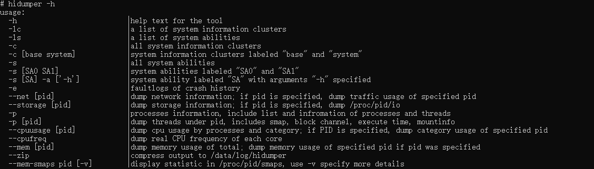

2. Obtain memory usage of the specified process on the device.

   ```
   hidumper --mem pid
   ```

   **Example**

   

   The **Graph** field represents the memory size used by the process in the **/proc/process_dmabuf_info** node.
   
3. Obtain memory usage of all processes.

   ```
   hidumper --mem
   ```

   **Example**

   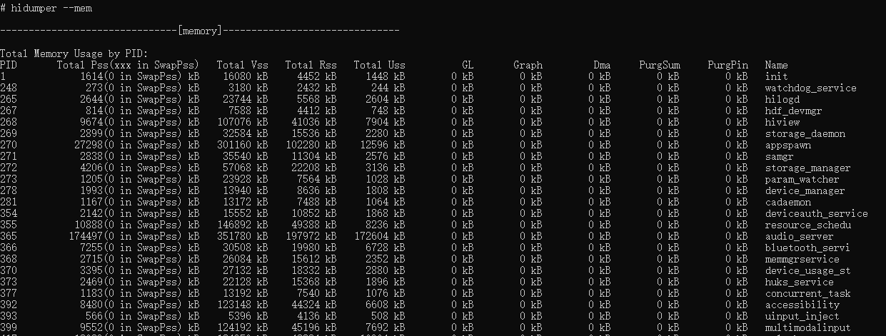

4. Obtain CPU usage, which is displayed by process and category.

   ```
   hidumper --cpuusage
   ```

   **Example**

   

5. Obtain CPU usage of the specified process.

   ```
   hidumper --cpuusage pid
   ```

   **Example**

   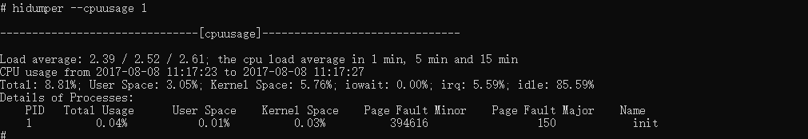

6. List system capabilities.
   ```
   hidumper -ls
   ```

   **Example**

   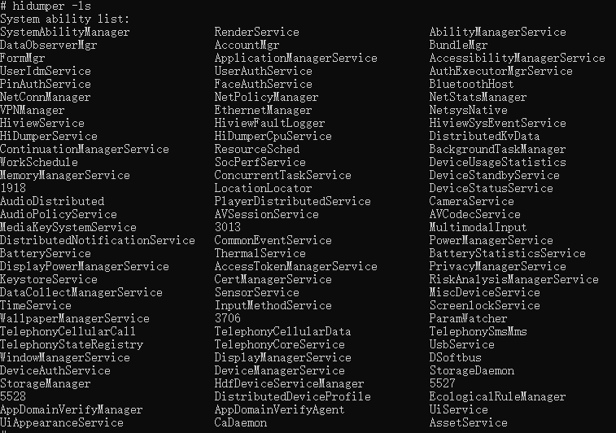

7. Obtain detailed information about all system capabilities.

   ```
   hidumper -s
   ```

   **Example**

   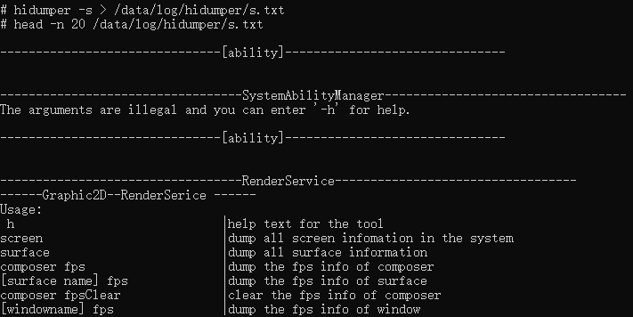


   Obtain the help information about **RenderService**.

   ```
   hidumper -s RenderService -a "h" 
   ```

   **Example**

   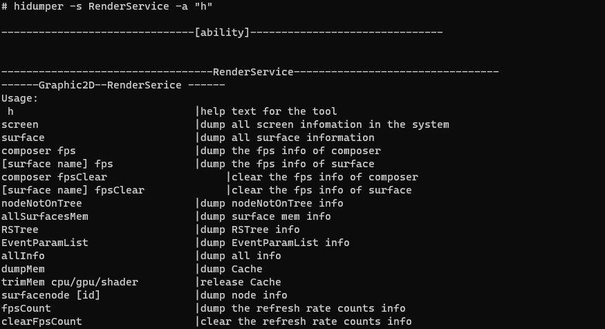

8. Obtain the refresh frame rate of a surface.

   ```
   hidumper -s RenderService -a "surface_name fps" 
   ```

   **Example**

   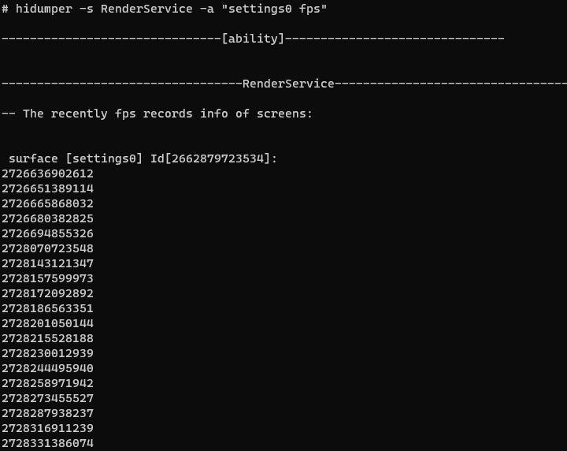

9. Obtain the crash information generated by the Faultlog module.

   ```
   hidumper -e 
   ```

   **Example**

    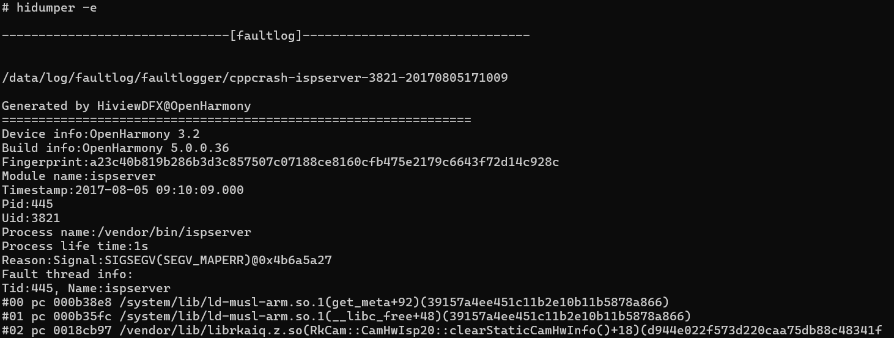

10. Obtain network information. Specify **pid** to obtain the network traffic usage of the specified process.

    ```
    hidumper --net
    ```

    **Example**

    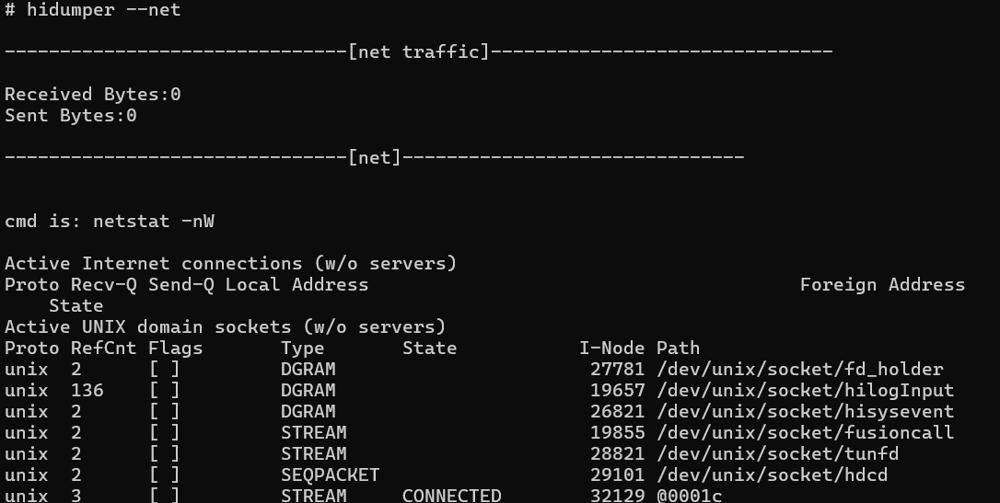

11. Obtain all process and thread information.

    ```
    hidumper -p
    ```

    **Example**

    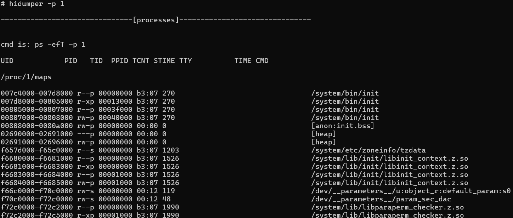

12. Collect IPC statistics of the process in a period. Use **-a** to collect the IPC statistics of all processes. Specify **pid** to collect the IPC statistics of the specified process. Use **--start-stat** to start collecting statistics, use **--stat:** to obtain statistics, and use **--stop-stat** to stop collecting statistics.

    ```
    hidumper --ipc pid --start-stat
    hidumper --ipc pid --stat
    hidumper --ipc pid --stop-stat
    ```

    **Example**

    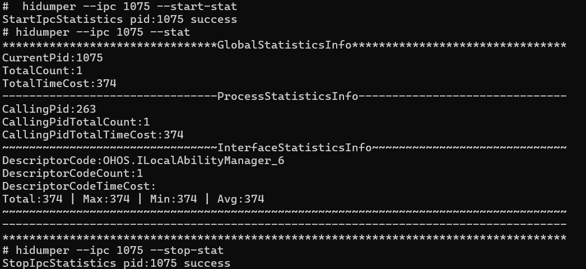

13. Export the detailed memory usage of the specified process.

    ```
    hidumper --mem-smaps pid [-v]
    ```

    > **Note**
    >
    > This command is available only in the Debug version and is unavailable in the Release version.
    >
    > How to distinguish the Debug and Release versions:
    >
    > 1. Run the **hdc shell "param get|grep const.debuggable"** command to check whether the output is **0** or **1**.
    >
    > 2. Run the **hdc shell "param get|grep const.product.software.version"** command to check whether the current version contains the **log** string.
    >
    > The Release version outputs **0** and does not contain the **log** string.
    >
    > The Debug version outputs **1** and contain the **log** string.

    **Example**

    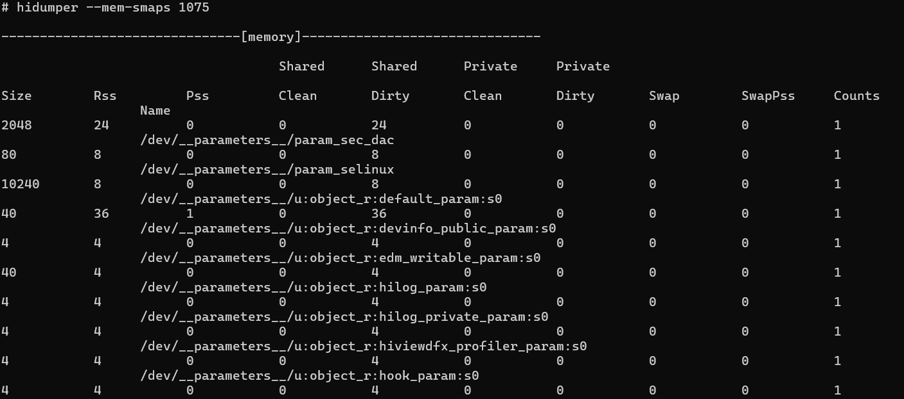

14. Run the **hidumper --mem-jsheap pid [-T tid] [--gc] [--leakobj]** command to trigger GC and export snapshot of all threads. **pid** is mandatory. Specify **tid** to trigger GC and export snapshot of the specified thread. Specify **--gc** to trigger GC but not to export snapshot. Specify **--leakobj** to obtain the list of leaked objects. This command is only available in the Debug version.

    ```
    hidumper --mem-jsheap pid [-T tid] [--gc] [--leakobj]
    ```

    > **Note**
    >
    > In the Release version, this command can be used to export the snapshot information of the debugging applications.
    >
    > For details about how to distinguish the Debug and Release versions, see the last example.
    >
    > The path of the jsheap file: **/data/log/faultlog/temp or /data/log/reliability/resource_leak/memory_leak**.

    **Example**

    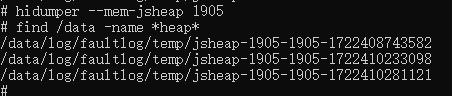
