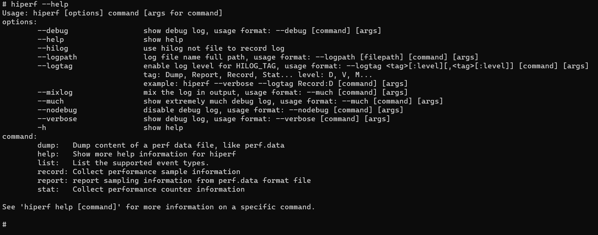
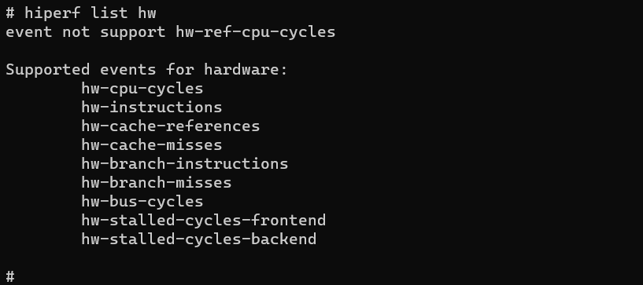
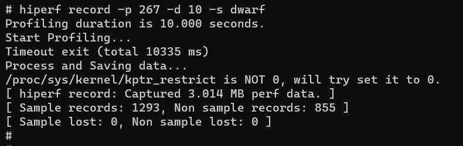
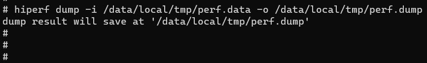

# hiperf

hiperf is a command-line tool provided to capture performance data of a specific program or the entire system, like the kernel's perf tool. It can run on Windows, Linux, and macOS.

## Environment Setup

- The environment for OpenHarmony Device Connector (hdc) has been set up. For details, see [Environment Setup](hdc.md#environment-setup).

- The devices are properly connected.

## hiperf

| Parameter| Description|
| -------- | -------- |
| -h/--help  | Displays the help information.|
| --debug | Outputs debug logs.|
| --hilog | Writes logs to the hilog.|
| --logpath | Specifies the log path.|
| --logtag | Specifies the log level.|
| --mixlog | Outputs mixed logs.|
| --much | Output as many logs as possible.|
| --nodebug | Outputs no log.|
| --verbose | Outputs verbose logs.|

## help

Run the **--help** command to view help information.

```
hiperf --help
```



Run the following command to view the help information about a command:

```
hiperf [command] --help
```

## list

Lists all the supported events on the device. The event names are used for the **-e** and **-g** parameters of the **stat** and **record** commands.

**Parameters of the list command**

| Parameter| Description|
| -------- | -------- |
| -h/--help  | Displays the help information.|
| hw | Lists the hardware events.|
| sw | Lists the software events.|
| tp | Tracepoint event.|
| cache | Lists the hardware cache events.|
| raw | Lists the original PMU events.|

```
Usage: hiperf list [event type name]
```

Run the **help** command to query the supported event types.

```
hiperf list --help
```


Run the following command to list the hardware events supported and not supported by the device. 

```
hiperf list hw
```



## record

Specifies the target program for sampling and saves the sampled data to a file (**/data/local/tmp/perf.data** by default).

**Parameters of the record command**

| Parameter| Description|
| -------- | -------- |
| -h/--help  | Displays the help information.|
| -a  | Collects the full information of the system for evaluating all processes and threads.|
| --exclude-hiperf | Collects no hiperf data.|
| -c | Specifies the ID of the CPU to collect its data.|
| --cpu-limit | Sets the maximum CPU usage during collection. Value range: 1 to 100. The default value is 25.|
| -d | Sets the collection duration.|
| -f | Sets the collection frequency. The default value is 4000 times per second. This parameter cannot be used together with **--period**.|
| --period | Sets the event collection period, that is, the number of events to be collected each time. This parameter cannot be used together with **-f**.|
| -e | Specifies the events to collect, which are separated by commas (,).|
| -g | Specifies the event groups to collect, which are separated by commas (,).|
| --no-inherit | Collects no subprocess data.|
| -p | Specifies the IDs of the processes to collect, which are separated by commas (,). This parameter cannot be used together with **-a**.|
| -t | Specifies the IDs of the threads to collect, which are separated by commas (,). This parameter cannot be used together with **-a**.|
| --exclude-tid | Specifies the IDs of the threads not to collect, which are separated by commas (,). This parameter cannot be used together with **-a**.|
| --exclude-thread | Specifies the names of the threads not to collect, which are separated by commas (,). This parameter cannot be used together with **-a**.|
| --exclude-process | Specifies the names of the processes not to collect, which are separated by commas (,). This parameter must be used together with **-a**.|
| --offcpu | Traces the time when a thread is out of CPU scheduling.|
| -j | Samples branch stacks. The following filters are supported: **any**, **any_call**, **any_ret**, **ind_call**, **ind_jmp**, **cond** and **call**.|
| -s/--callstack | Sets the stack mode.|
| --kernel-callchain | Collects kernel stack information. This parameter must be used together with **-s fp/dwarf**.|
| --callchain-useronly | Collects only user stacks.|
| --delay-unwind | Unwinds the stack after recording. If **-s dwarf** is set, the stack is unwound during recording.|
| --disable-unwind | Disables the unwinding of the stack during recording by default when **-s dwarf** is set.|
| --disable-callstack-expand | Disables the 64 KB stack limit when **-s dwarf** is set. By default, call stacks are combined to a more complete call stack, which may be inaccurate.|
| --enable-debuginfo-symbolic | Parses the symbols in the **.gnu_debugdata** section of elf when **-s fp/dwarf** is set. By default, the symbols are not parsed.|
| --clockid | Sets the type of the clock to collect, which can be **monotonic** or **monotonic_raw**.|
| --symbol-dir | Specifies the directory of the online symbol table file.|
| -m | Sets the number of mmap pages. Value range: 2 to 1024. The default value is **1024**.|
| --app | Specifies the names of the applications to collect, which are separated by commas (,). The applications must be in debuggable mode. If an application is not started, the system waits for 20s.|
| --chkms | Sets the check interval. Value range: 1 to 200. The default value is **10**.|
| --data-limit | Sets the limit of the output data size. When this limit is reached, the collection stops. By default, there is no limit.|
| -o | Specifies the output file path.|
| -z | Outputs the data in a compressed file.|
| --restart | Collects performance indicator information about application startup. If a process is not started within 30 seconds, the record exits.|
| --verbose | Outputs a more detailed report.|
| --control [command]| Controls the collection command. The following commands are supported: **prepare**/**start**/**pause**/**resume**/**output**/**stop**.|
| --dedup_stack | Deletes duplicate stacks from a record. This parameter cannot be used together with **-a**.|
| --cmdline-size | Sets the value of the **/sys/kernel/tracing/saved_cmdlines_size** node. Value range: 512 to 4096.|
| --report | Obtains the stack report after collection. This parameter cannot be used together with **-a**.|
| --backtrack | Collects data in a previous period. This parameter must be used together with **--control prepare**.|
| --backtrack-sec | Collects the duration of previous data. The value ranges from 5 to 30. The default value is 10s. This parameter must be used together with **--backtrack**.|
| --dumpoptions | Dumps the command options.|

```
Usage: hiperf record [options] [command [command-args]] 
```

Sample the process 267 for 10 seconds and use **dwarf** to collect and unwind stack memory of the process.

```
hiperf record -p 267 -d 10 -s dwarf
```




## stat

Monitors the specified application and periodically prints the values of performance counters.

**Parameters of the stat command**

| Parameter| Description|
| -------- | -------- |
| -h/--help  | Displays the help information.|
| -a  | Collects the full information of the system for evaluating all processes and threads.|
| -c | Specifies the ID of the CPU to collect its data.|
| -d | Sets the collection duration.|
| -i | Sets the interval for printing stat information. Unit: ms.|
| -e | Specifies the events to collect, which are separated by commas (,).|
| -g | Specifies the event groups to collect, which are separated by commas (,).|
| --no-inherit | Collects no subprocess data.|
| -p | Specifies the IDs of the processes to collect, which are separated by commas (,). This parameter cannot be used together with **-a**.|
| -t | Specifies the IDs of the threads to collect, which are separated by commas (,). This parameter cannot be used together with **-a**.|
| --app | Specifies the names of the applications to collect, which are separated by commas (,). The applications must be in debuggable mode. If an application is not started, the system waits for 10s.|
| --chkms | Sets the check interval. Value range: 1 to 200. The default value is **10**.|
| --per-core | Obtains the print count of each CPU core.|
| --pre-thread | Obtains the print count of each thread.|
| --restart | Collects performance indicator information about application startup. If a process is not started within 30 seconds, the record exits.|
| --verbose | Outputs a more detailed report.|
| --dumpoptions | Dumps the command options.|

```
Usage: hiperf stat [options] [command [command-args]]
```

Monitor the performance counter of process 2349 on CPU0 for 3 seconds.

```
hiperf stat -p 2349 -d 3 -c 0
```

## dump

Reads the data in **perf.data** without processing the file. You can check whether the original sampling data is correct.

**Parameters of the dump command**

| Parameter| Description|
| -------- | -------- |
| -h/--help  | Displays the help information.|
| --head | Outputs only the data header and attributes.|
| -d | Outputs only data segments.|
| -f | Outputs only additional functions.|
| --syspath | Specifies the path of the symbol table file.|
| -i | Specifies the resource file path.|
| -o | Specifies the output file path. If this parameter is not set, the file is displayed on the screen.|
| --elf | Outputs the ELF file.|
| --proto | Outputs data in ProtoBuf format.|
| --export | Exports user stack data to a split file and generates ut data.|

```
Usage: hiperf dump [option] \<filename\>
```

Run the **dump** command to read the **/data/local/tmp/perf.data** file and export it to the **/data/local/tmp/perf.dump** file.

```
hiperf dump -i /data/local/tmp/perf.data -o /data/local/tmp/perf.dump
```




## report

Displays the sampled data (read from perf.data) in required format (such as JSON or ProtoBuf).

**Parameters of the report command**

| Parameter| Description|
| -------- | -------- |
| -h/--help  | Displays the help information.|
| --symbol-dir | Specifies the path of the symbol table file.|
| --limit-percent | Sets the percentage of the content to display.|
| -s | Displays the stack mode.|
| --call-stack-limit-percent | Sets the percentage of the stack to display.|
| -i | Specifies the resource file path. The default value is **perf.data**.|
| -o | Specifies the output file path. If this parameter is not set, the file is displayed on the screen.|
| --proto | Outputs data in ProtoBuf format.|
| --json | Outputs data in JSON format.|
| --diff | Displays the differences between the **-i** and **--diff **files.|
| --branch | Displays the branch in the address instead of the IP address.|
| --\<keys\> \<keyname1\>[,keyname2][,...] | Specifies the keywords, which can be **comms**, **pids**, **tids**, **dsos**, **funcs**, **from_dsos** or **from_funcs**, for example, **--comms hiperf**.|
| --sort [key1],[key2],[...] | Sorts the data by keyword.|
| --hide_count | Hides values in the report.|
| --dumpoptions | Dumps the command options.|

```
Usage: hiperf report [option] \<filename\>
```

Display a common report, with the sampling limit of 1%.

```
hiperf report --limit-percent 1
```


## script

You can use a script to sample data and generate flame graphs. You can obtain the script from [developtools_hiperf](https://gitee.com/openharmony/developtools_hiperf/tree/master/script).

1. Sample data.

   Run **command_script.py** to sample data. This script packages the **report** command.

   ```
   usage: command_script.py [-h]                         
                            (-app PACKAGE_NAME | -lp LOCAL_PROGRAM | -cmd CMD | -p [PID [PID ...]] | -t [TID [TID ...]] | -sw)
                            [-a ABILITY] [-r RECORD_OPTIONS] [-lib LOCAL_LIB_DIR]
                            [-o OUTPUT_PERF_DATA] [--not_hdc_root]
   ```

   Sample the **com.ohos.launch** package.

   ```
   python command_script.py -app com.ohos.launch
   ```

   Sample the **hdcd** process.

   ```
   python command_script.py -lp hdcd
   ```

2. Collect symbol tables.

   Run **recv_binary_cache.py** to collect symbol tables. This script searches for the ELF in the specified paths based on the files and libraries recorded in **perf.data** and their **buildids**.

   ```
   usage: recv_binary_cache.py [-h] [-i PERF_DATA] [-l LOCAL_LIB_DIR [LOCAL_LIB_DIR ...]]
   ```

   The following example specifies two symbol table paths.

   ```
   python recv_binary_cache.py -l Z:\OHOS_MASTER\out\ohos-arm-release\lib.unstripped  Z:\OHOS_MASTER\out\ohos-arm-release\exe.unstripped
   ```

   The ELF files of the specified symbol table paths are copied to the **binary_cache** folder. If the paths do not exist, the file in the device will be copied.

3. Generate a flame graph.

   Run **make_report.py** to display the sampled data in an HTML page.

   ```
   usage: make_report.py [-h] [-i PERF_DATA] [-r REPORT_HTML]
   ```

   Generate an HTML file. The default file name is **hiperf_report.html**.

   ```
   python make_report.py -i perf.data
   ```
