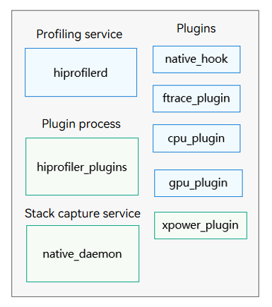
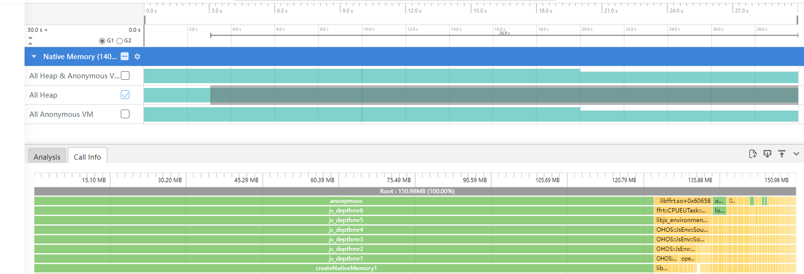

# hiprofiler

<!--Kit: Performance Analysis Kit-->
<!--Subsystem: HiviewDFX-->
<!--Owner: @zyxzyx-->
<!--Designer: @Maplestroy-->
<!--Tester: @gcw_KuLfPSbe-->
<!--Adviser: @foryourself-->


## Overview


hiprofiler consists of the system and application profiler frameworks. It provides a performance profiler platform for you to analyze memory and performance issues.


Its overall architecture comprises the profiling data display page on the PC and performance profiling service on the device. The services on the PC and device use the C/S model, and the profiling data on the PC is displayed on the [DevEco Studio](https://cbg.huawei.com/#/group/ipd/DevEcoToolsList)/[SmartPerf](https://gitee.com/openharmony/developtools_smartperf_host) web page. The device program consists of multiple parts that run in the system environment. The **hiprofilerd** process that communicates with DevEco Studio is the profiling service. The device also contains the CLI tool (**hiprofiler_cmd**) and data collection process (**hiprofiler_plugins**). Based on the Producer-Consumer model, the profiling service controls the data collection process to obtain profiling data and sends the data to DevEco Studio. Currently, plugins such as nativehook, CPU, ftrace, GPU, hiperf, xpower, and memory have been implemented, providing comprehensive profiling capabilities for CPU, GPU, memory, and energy consumption.


Benchmarking with profilers in the industry, hiprofiler provides more capabilities, such as [cross-language stack unwinding, power consumption data obtaining, and long-time heap memory stack capturing](#plugin-parameters).


## Environment Requirements

- The environment for OpenHarmony Device Connector (hdc) has been set up. For details, see [Environment Setup](hdc.md#environment-setup).

- The devices are properly connected and **hdc shell** is executed.


## Architecture

1. The PC calls **hiprofiler_cmd** on DevEco Studio/SmartPerf.

2. The **hiprofiler_cmd** process starts the **hiprofilerd** service and the **hiprofiler_plugins** process.

3. **hiprofiler_plugins** enables the corresponding plugin and summarizes the obtained profiling data to the hiprofilerd process.

4. The **hiprofilerd** process stores the profiling data in proto format to a file, or returns it to the PC in real time.

5. The PC parses the data, generates lanes, and displays the obtained profiling data.




## Command Syntax

You can use hiprofiler_cmd to call different profiler plugins and input different parameters for different profiling requirements. The following is an example command:

```shell
$ hiprofiler_cmd \
  -c - \
  -o /data/local/tmp/hiprofiler_data.htrace \
  -t 30 \
  -s \
  -k \
<<CONFIG
 request_id: 1
 session_config {
  buffers {
   pages: 16384
  }
 }
 plugin_configs {
  plugin_name: "ftrace-plugin"
  sample_interval: 1000
  config_data {
   hitrace_categories: "binder"
   buffer_size_kb: 204800
   flush_interval_ms: 1000
   flush_threshold_kb: 4096
   trace_period_ms: 200
  }
 }
CONFIG
```


| Command| Description| 
| -------- | -------- |
| -c | After setting this option, you need to place the configuration file in the **/data/local/tmp** directory and input the path.| 
| -o | Sets the custom file save path, which must start with **/data/local/tmp**. If no path is set, the profiling data is saved to **/data/local/tmp/hiprofiler_data.htrace** by default. If the profiling is performed repeatedly, the file in the original path will be overwritten.| 
| -k | Kills the existing profiling service process.| 
| -s | Starts the profiling service process.| 
| -t | Sets the profiling duration, in seconds.| 


After inputting the hiprofiler_cmd parameter, input the plugin configuration information. The configuration information starts with **<<CONFIG** and ends with **CONFIG**. The content in the middle is in JSON format.


The following table describes the **session config** fields.


| Field| Description| 
| -------- | -------- |
| buffers | Number of shared memory pages.| 
| split_file | Whether to split a file. The value **true** means to split the file, and **false** means the opposite.| 
| split_file_max_size_mb | Maximum size of each split file when **split_file** is set to **true**.| 


The following table describes the **plugin_configs** fields.


| Field| Description| 
| -------- | -------- |
| plugin_name | Name of the plugin to enable.| 
| sample_interval | Interval for the plugin to obtain profiling data, in milliseconds.| 
| config_data | Parameters of the plugin. The parameters required by each plugin are different. For details, see the **proto** definition of the plugins.<br>(The code path is **developtools/profiler/protos**.)| 


Download the generated trace file to the local PC by running the **hdc file recv** command, and then upload the file to SmartPerf or DevEco Studio for parsing.


## Plugins Supported

<!--RP1-->
| Name| Description| Specifications|
| -------- | -------- | -------- |
| native_hook | Obtains the call stack information about heap memory allocation.|  |
| ftrace-plugin | Obtains the trace events of kernel logging and the HiTrace logging data.|  |
| cpu-plugin | Obtains the CPU usage information of a process, including the process-level and thread-level usage.|  |
| gpu-plugin | Obtains the GPU usage information of a process.|  |
| xpower-plugin | Obtains the power consumption data of a process.|  |
| memory-plugin | Obtains the memory usage of a process, primarily the data from its **smaps** node.| In user mode, the file paths in **smaps** are not displayed.|
| diskio plugin | Obtains the disk space usage of a process.|  |
| network profiler | Obtains the HTTP request information of a process through process logging.|  |
| network plugin | Obtains the network traffic information of a process.|  |
| hisysevent plugin | Obtains the HiSysEvent logging data by running the HiSysEvent commands.|  |
| hiperf plugin | Obtains the number of instructions and the corresponding stack of a process by running the HiPerf commands.|  |
| hidump plugin | Obtains the HiDump data by running the SP_daemon commands.|  |
<!--RP1End-->


## Applications Signed by the Debug Certificate


> **NOTE**
>
> Run the **hdc shell "bm dump -n bundlename | grep appProvisionType"** command to check whether the application specified in the command can be debugged. The expected output is **"appProvisionType": "debug"**.

For example, run the following command to check the bundle name **com.example.myapplication**:

```shell
hdc shell "bm dump -n com.example.myapplication | grep appProvisionType"
```

If the application is a debug application, the following information is displayed:

```shell
"appProvisionType": "debug",
```

To build a debug application, you need to use a debug certificate for signature. For details about how to request and use the debug certificate, see [Requesting a Debug Certificate](https://developer.huawei.com/consumer/en/doc/app/agc-help-add-debugcert-0000001914263178).


## Plugin Parameters

**native_hook**

Obtains the call stacks for heap memory allocations, including cross-language allocations (for example, using Node-API in ArkTS to allocate native heap memory), covering the **malloc**, **mmap**, **calloc**, and **realloc** functions. It can also display the call stacks of unreleased heap memory due to memory leak.

Parameters

| Name| Type| Description| Details| 
| -------- | -------- | -------- | -------- |
| fp_unwind | bool | Whether to enable stack unwinding in fp mode. The value **true** means to enable stack unwinding in fp mode.<br>The value **false** means to enable stack unwinding in dwarf mode.| The stack unwinding in fp mode is implemented by using the x29 register, in which the function fp always points to the parent function (caller) fp. After stack unwinding, the profiling service calculates the relative PC based on the instruction pointer (IP) and searches for the corresponding mapping in maps for symbolization.<br>Due to increasingly aggressive compiler optimizations, register reuse and disabled fp can cause stack unwinding in fp mode to fail. In mixed stacks, the fp alone cannot capture all frames, so dwarf is required for more accurate stack rewinding.<br>The stack unwinding in dwarf mode is to search for the corresponding mapping information in the map table based on the PC register. The performance of dwarf is worse than that of fp because the call stack is parsed level by level in dwarf mode.<br>Note: fp stack unwinding does not support profiling for non-AArch64 devices.| 
| statistics_interval | int | Statistics interval, in seconds. Stacks in a statistics interval are summarized.| The statistics stack capture mode is provided to implement long-term lightweight collection. If profiling performance is a priority and you only need call counts and total stack size, use statistics mode.| 
| startup_mode | bool | Whether to capture the memory during process startup. By default, the memory during process startup is not captured.| This parameter records the heap memory allocation information during the period from when the process is started by AppSpawn to when the profiling ends. If a system-ability (SA) service is captured, locate the name (for example, **sa_main**) of the process that launches it in the corresponding .cfg file and add that name to this parameter.| 
| js_stack_report | int | Whether to enable cross-language stack unwinding.<br>The value **0** means not to capture the JS stack.<br>The value **1** means to capture the JS stack.| This parameter provides the cross-language stack unwinding feature for the Ark environment.| 
| malloc_free_matching_interval | int | Matching interval, in seconds. **malloc** and **free** are matched within the interval. If matched, the stack is not flushed to the disk.| Within the matching interval, the allocated and released call stacks are not recorded, reducing the overhead of the stack capture service process. If this parameter is set to a value greater than 0, **statistics_interval** cannot be set to **true**.| 
| offline_symbolization | bool | Whether to enable offline symbolization.<br>The value **true** means to enable offline symbolization;<br>the value **false** means the opposite.| When offline symbolization is used, the operation of matching symbols based on IP is transferred to SmartPerf, optimizing the performance of the native daemon and reducing process freezes. However, since the offline symbol table must be written into the trace file, the trace file generated under offline symbolization is larger in size than that under online symbolization.| 
| sample_interval | int | Sampling size.| When this parameter is set, the sampling mode is enabled. In sampling mode, malloc allocations smaller than the sampling size are accounted for probabilistically. The larger the call-stack allocation size, the more frequently it occurs and the greater its chance of being sampled.| 

Result examples:

The fp stack unwinding and cross-language stack unwinding are enabled (green frames denote JavaScript).


The dwarf stack unwinding and cross-language stack unwinding are enabled (native ->JS -> native stack frames are displayed).


Statistics mode is enabled (the stack data is displayed periodically).



Non-statistics mode is enabled.


**ftrace_plugin**:

1. Parameters

| Name| Type| Description| Details| 
| -------- | -------- | -------- | -------- |
| ftrace_events | string | Captured trace events.| Trace events that record kernel logging.| 
| hitrace_categories | string | Captured HiTrace logging information.| The HiTrace capability is called to obtain data and write the data to a file in proto format.| 
| buffer_size_kb | int | Buffer size, in KB.| Cache size required for the **hiprofiler_plugins** process to read kernel events. The default value **204800** is recommended.| 
| flush_interval_ms | int | Data collection interval, in ms.| The default value **1000** is recommended.| 
| flush_threshold_kb | int | Size of the data to refresh.| Data is refreshed to the file once when the threshold is exceeded. It is recommended that you use the default value of SmartPerf.| 
| parse_ksyms | bool | Whether to obtain kernel data.| The value **true** means to obtain kernel data, and **false** means the opposite.| 
| trace_period_ms | int | Period for reading kernel data.| It is recommended that you use the default value of SmartPerf.| 

2. Result analysis

Example command:

```shell
$ hiprofiler_cmd \
  -c - \
  -o /data/local/tmp/hiprofiler_data.htrace \
  -t 10 \
  -s \
  -k \
<<CONFIG
 request_id: 1
 session_config {
  buffers {
   pages: 16384
  }
 }
 plugin_configs {
  plugin_name: "ftrace-plugin"
  sample_interval: 1000
  config_data {
   ftrace_events: "binder/binder_transaction"
   ftrace_events: "binder/binder_transaction_received"
   buffer_size_kb: 204800
   flush_interval_ms: 1000
   flush_threshold_kb: 4096
   parse_ksyms: true
   clock: "boot"
   trace_period_ms: 200
   debug_on: false
  }
 }
CONFIG
```

This command reads the kernel **binder_transaction** and **binder_transaction_received** data. The two fields must be used together to completely display the data at both ends of the binder. After the command is executed, run the **hdc file recv** command to export the file and drag the file to SmartPerf for parsing. The following figure shows an example result.

You can click the arrow on the right of **binder transaction** to go to the process/thread on the other end of the binder.


**memory_plugin**:

1. Parameters

| Name| Type| Description| Details| 
| -------- | -------- | -------- | -------- |
| report_sysmem_vmem_info | bool | Whether to read virtual memory data.| Data is read from the **/proc/vmstat** node.| 
| report_process_mem_info | bool | Whether to obtain the detailed memory data of a process, such as **rss_shmem**, **rss_file**, and **vm_swap**.| Data is read from the **/proc/${pid}/stat** node.| 
| report_smaps_mem_info | bool | Whether to obtain the smaps memory information of a process.| Data is read from the **/proc/${pid}/smaps** node.| 
| report_gpu_mem_info | bool | Whether to obtain the GPU usage of a process.| Data is read from the **/proc/gpu_memory** node.| 
| parse_smaps_rollup | bool | Whether to refresh the data size.| Data is read from the **/proc/{pid}/smaps_rollup** node. The profiling effect (such as CPU and memory) is better than that of using the **report_smaps_mem_info** parameter.| 

2. Result analysis


You can go to **DevEco Studio** -> **Profiler** -> **Allocation** and select **Memory** to use the **memory plug-in** feature of the profiler. The preceding figure shows the process smaps memory information in the selected time range.

**xpower_plugin**:

1. Parameters

| Name| Type| Description| Details| 
| -------- | -------- | -------- | -------- |
| bundle_name | string | Name of the process for which power consumption profiling is required.| The value must be the same as the process name in the **/proc/ directory**.| 
| message_type | XpowerMessageType | Type of the power consumption data to be obtained.| The data types include **REAL_BATTERY**, **APP_STATISTIC**, **APP_DETAIL**, **COMPONENT_TOP**, **ABNORMAL_EVENTS**, and **THERMAL_REPORT**.| 

2. Result analysis


You can go to **DevEco Studio** -> **Profiler** -> **Realtime Monitor** to obtain the power consumption data of related processes.

**gpu_plugin**:

Obtaining GPU usage information

1. Parameters

| Name| Type| Description| Details| 
| -------- | -------- | -------- | -------- |
| pid | int | Name of the process to profile.| The value must be the same as the process name in the **/proc/ directory**.| 
| report_gpu_info | bool | Whether to display the GPU usage of a specified process.| The value **true** means to display the GPU data of a specified process. In this case, you need to set **pid**.  <br>Data is read from the **/sys/class/devfreq/gpufreq/gpu_scene_aware/utilisation** node.<br>The value **false** means not to display the GPU data of a specified process.| 

**cpu_plugin**:

Obtaining CPU usage information

1. Parameters

| Name| Type| Description| Details| 
| -------- | -------- | -------- | -------- |
| pid | int | Name of the process to profile.| The value must be the same as the process name in the **/proc/ directory**.| 
| report_process_info | bool | Whether to display the CPU usage of a specified process.| The value **true** means to display the data of a specified process and you need to set the **pid** parameter.<br>The value false means to display the system CPU usage data.| 
| skip_thread_cpu_info | bool | Whether to skip the thread CPU usage data.| The value **true** means to not display the CPU usage of each thread. When this parameter is set to **true**, the profiling service overhead is reduced.<br>The value false means to display the CPU usage of each thread.| 


## Common Commands


### Sampling Records of Heap Memory Allocation Call Stack Data


Capture the stack for heap memory allocation of the **com.example.insight_test_stage** process. Enable fp stack unwinding, offline symbolization, and statistics mode.


```shell
$ hiprofiler_cmd \
  -c - \
  -t 30 \
  -s \
  -k \
<<CONFIG
 request_id: 1
 session_config {
  buffers {
   pages: 16384
  }
 }
 plugin_configs {
  plugin_name: "nativehook"
  sample_interval: 5000
  config_data {
   save_file: false
   smb_pages: 16384
   max_stack_depth: 20
   process_name: "com.example.insight_test_stage"
   string_compressed: true
   fp_unwind: true
   blocked: true
   callframe_compress: true
   record_accurately: true
   offline_symbolization: true
   startup_mode: false
   statistics_interval: 10
   sample_interval: 256
   js_stack_report: 1
   max_js_stack_depth: 10
  }
 }
CONFIG
```


The collected data is saved to the **/data/local/tmp/hiprofiler_data.htrace** file, which contains the function call information, thread and dynamic library memory allocation information, call stack count and allocation size required for memory leak analysis. Enabling offline symbolization, fp stack unwinding, and statistics mode can improve the data processing efficiency of the profiling service.


Capturing the CPU usage of a specified process


Collect CPU data of the process whose process ID is **1234**. The collection duration is 30s, the sampling period is 1000 ms, the size of the shared memory for transmitting profiling data is 16384 memory pages, and the collected data is saved to the **/data/local/tmp/hiprofiler_data.htrace** file.


```shell
$ hiprofiler_cmd \
  -c - \
  -o /data/local/tmp/hiprofiler_data.htrace \
  -t 30 \
  -s \
  -k \
<<CONFIG
 request_id: 1
 session_config {
  buffers {
   pages: 16384
  }
 }
 plugin_configs {
  plugin_name: "cpu-plugin"
  sample_interval: 1000
  config_data {
   pid: 1234
   report_process_info: true
  }
 }
CONFIG
```


## FAQs

What should I do if an exception occurs during profiling?

**Symptom**

"Service not started" is displayed when the **hiprofiler_cmd** command is executed.


**Possible Causes and Solution**

If the profiling service is not started, DevEco Studio is being used for profiling or the previous profiling exits frequently. In this case, run the **hiprofiler_cmd -k** command and then run the profiling command again.

What should I do if the captured trace file is empty?

**Symptom**

The captured trace file is empty.

**Possible Causes and Solution**

Check whether the generated file is in the **/data/local/tmp/** directory. If the target path is a folder in **/data/local/tmp**, run the **chmod 777** command on the folder. If the user version uses **nativehook** or **network profiler** to capture a no-debug application, no data can be captured. (For details, see changelog https://gitcode.com/openharmony/docs/pulls/57419.)

What should I do if I suspect that the profiling data is inaccurate?

**Symptom**

The native heap captured by hiprofiler is different from that viewed by hidumper.

**Possible Causes and Solution**

hidumper captures the process-level memory usage, while hiprofiler captures the heap memory data allocated by the user-mode process using basic library functions such as **malloc**, **mmap**, and **realloc**. The **operator new** function also calls **malloc**. Therefore, the native heap information capture by them differs in the thread memory cache, heap memory release delay, and memory used by the loader.
