# HiSysEvent

HiSysEvent is a built-in tool that helps you subscribe to real-time system events and query historical system events.

## Environment requirements

- The environment for OpenHarmony Device Connector (hdc) has been set up. For details, see [Environment Setup](hdc.md#environment-setup).

- The devices are properly connected and **hdc shell** is executed.

- The **hisysevent** command is executed on the device to call related capabilities.

## Subscribing to Real-Time System Events

- Run the **hisysevent -r** command to subscribe to system events.

   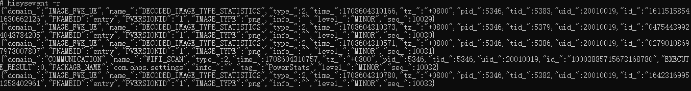

- To specify the type of system event to subscribe to, use the **-g** option.

  > **NOTE** 
  > With the **-g** option, four event types are available: **FAULT**, **STATISTIC**, **SECURITY**, and **BEHAVIOR**.
  >
  > If no event type is specified, HiSysEvent subscribes to all types of system events.

  Example: Subscribe to system events of the **FAULT** type.

  

- To subscribe to system events by event domain and event name, use the **-o**, **-n**, and **-c** options. **-o** specifies the event domain, **-n** specifies the event name, and **-c** specifies the rule for matching the specified event domain and name.

  > **NOTE** 
  > With the **-c** option, the following matching rules are available: **WHOLE_WORD**, **PREFIX**, and **REGULAR**.
  >
  > If no matching rule is specified, the **WHOLE_WORD** matching rule is used by default.

  Example 1: Subscribe to the system event that matches the domain of **AAFWK** and event name of **CONNECT_SERVICE**.

  
  
  Example 2: Subscribe to system events that match the domain prefix of **AAF** and event name prefix of **CONNECT**.

  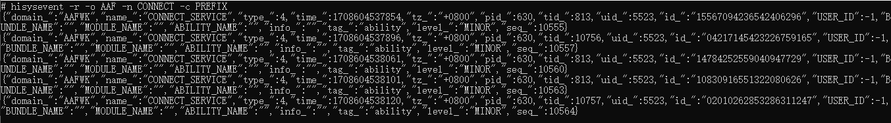
  
  Example 3: Subscribe to system events whose domain matches the **AA\*** regular expression and whose event name matches the **CONNE\*** regular expression.
  
  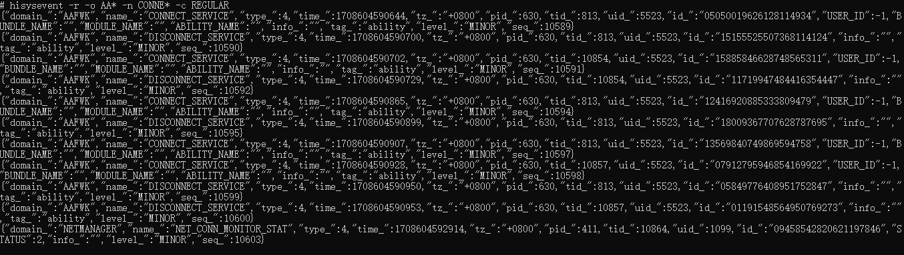

- To subscribe to system events by event tag, use the **-t** and **-c** options. **-t** specifies the event tag, and **-c** specifies the rule for matching the event tag.

  Example 1: Subscribe to system events whose tag is **ability**.

  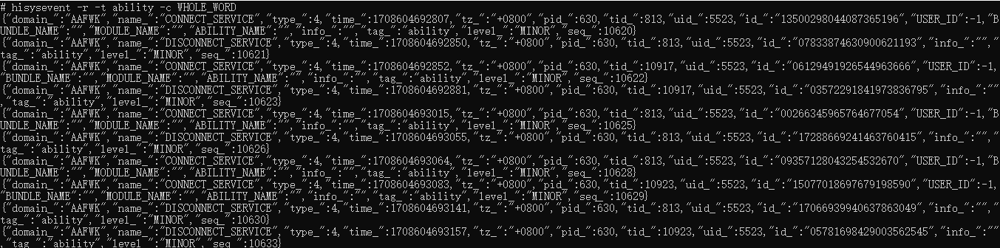

  Example 2: Subscribe to system events whose tag prefix is **abili**.

  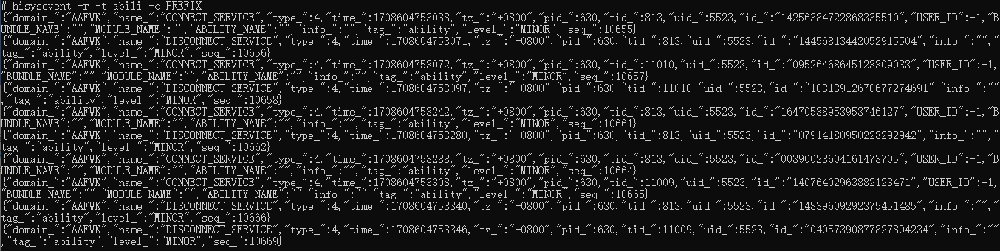

  Example 3: Subscribe to system events whose tag matches the **abi\*** regular expression.

  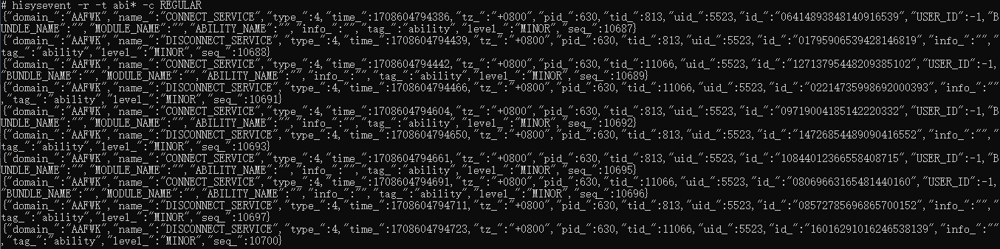

## Querying Historical System Events

- Run the **hisysevent -l** command to query system events that are stored.

  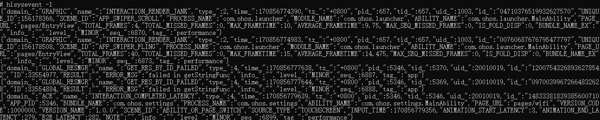

- To specify the type of system event to query, use the **-g** option.

  > **NOTE** 
  > With the **-g** option, four event types are available: **FAULT**, **STATISTIC**, **SECURITY**, and **BEHAVIOR**.
  >
  > If no event type is specified, HiSysEvent queries all types of system events.

  Example: Query system events of the **SECURITY** type.

  

- To query historical system events within the specified period of time, use the **-s** and **-e** options to specify raw timestamps. **-s** specifies the start timestamp, and **-e** the end timestamp.

  > **NOTE** 
  > The raw timestamps are of millisecond precision. 

  Example: Query all system events reported between 1708604541551 and 1708604558551.

  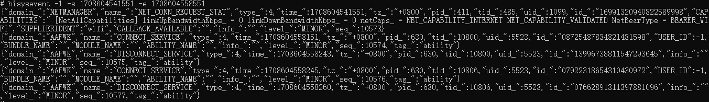

- You can use the **-S** and **-E** options to specify formatted start and end timestamps, respectively. 

  > **NOTE** 
  > The timestamp format is YYYY-MM-DD hh:mm:ss.

  Example: Query all system events reported between 2024-02-22 20:22:21 and 2024-02-22 20:22:38.

  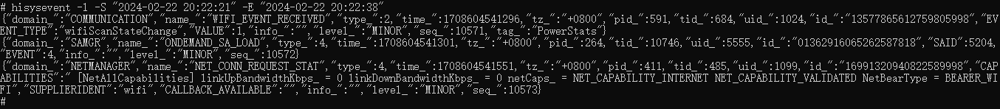

- To query system events by event domain and event name, use the **-o**, **-n**, and **-c** options. **-o** specifies the event domain, **-n** specifies the event name, and **-c** specifies the rule for matching the specified event domain and name.

  > **NOTE** 
  > The **-c** option for querying historical system events must be **WHOLE_WORD**.
  >
  > If no matching rule is specified, the **WHOLE_WORD** matching rule is used by default.

  Example: Query the system event that matches the domain of **AAFWK** and event name of **CONNECT_SERVICE**.

  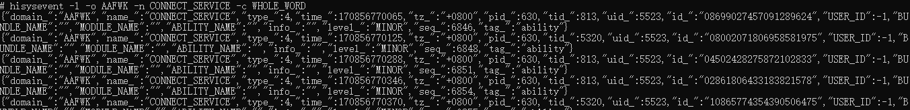

- You can use the **-m** option to set the maximum number of historical events that can be queried.

  > **NOTE** 
  > If **-m** is not specified, a maximum of 10,000 system events are queried by default.

  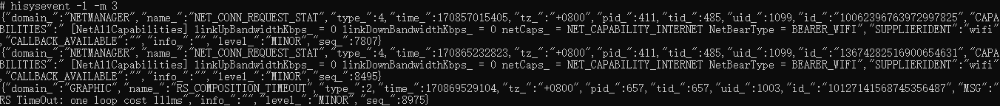

  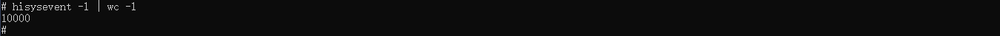

## Checking System Event Validity

To enable system event validity check, use the **-v** option.

If system event validity check is enabled, invalid content contained in system events will be highlighted in red.

> **NOTE** 
>
> Invalid content is defined as follows:
>
> 1. Custom parameter key that is not configured.
> 2. Type mismatch.

Example: For the system event named **INTERACTION_APP_JANK** of the **ACE** domain, the <!--RP1-->[system event configuration](../../device-dev/subsystems/subsys-dfx-hisysevent-logging-config.md)<!--RP1End--> does not contain the custom parameters **DURITION** and **DISPLAY_ANIMATOR**. If these parameters are contained in the event saved, they will be highlighted in red when system event validity check is enabled.

