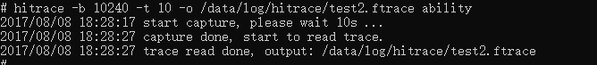
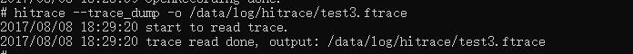
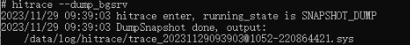
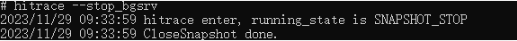

# hitrace

**HiTrace** provides APIs to implement call chain tracing throughout a service process. With this module, you can quickly obtain the run log specific to the call chain of a service process and locate faults across threads, processes, and devices.

## Prerequisites

- The [environment setup](hdc.md#environment-setup) is complete.

- The devices are properly connected.

## Command Description

| Command| Description|
| -------- | -------- |
| -h  | Displays help information.|
| -l | Displays the tag list.|
| --trace_begin | Starts capturing trace data.|
| --trace_finish | Stops capturing trace data.|
| --trace_dump | Dumps trace information.|
| -b N | Sets the buffer size (in KB) for trace data. The default buffer size is 2048 KB.|
| -t N | Sets the trace uptime in seconds, which depends on the time required for analysis. The default value is 5 seconds.|
| -o | Specifies the target file name (**stdout** by default).|
| -z | Compresses the trace data.|
| --trace_clock | Sets the type of the clock for adding a timestamp to a trace. The value can be **boot** (default), **global**, **mono**, **uptime**, or **perf**.|
| --trace_finish_nodump | Stops printing when trace capturing is stopped.|
| --start_bgsrv | Enables trace collection in snapshot mode.|
| --dump_bgsrv | Triggers trace output to a file in snapshot mode.|
| --stop_bgsrv | Disables trace collection in snapshot mode.|

> **Description**
>
> The snapshot mode is a trace collection service with a fixed trace tag. By default, the trace data is not stored. You can run the **--dump_bgsrv** command to trigger trace dump at the current time. The trace file is in binary format and is generated in **/data/log/hitrace** by default. The file name format is **trace-YYMMDDHHmmSS@[BOOT_TIME].sys**. You can view the file using [SmartPerf](https://www.smartperf.host).

## Examples

Run the following commands in the hdc shell:

1. Run the **hitrace -l** command to display the tag list.

   

2. Run the **hitrace --trace_begin app** command to start capturing trace data of the application. 

   

3. Run the **hitrace --trace_finish** or **hitrace --trace_finish -o /data/local/tmp/test.ftrace** command to stop capturing trace data. The former prints the captured trace data in the command-line window, and the latter outputs the data to the specified file.

   

4. Run the **hitrace -b 10240 -t 10 -o /data/local/tmp/test2.ftrace app ability** command to capture trace data with the following settings:

   

   - Buffer size: 10240 KB
   - Trace uptime: 10s
   - Output path: **/data/local/tmp/test1.htrace**
   - Tags: app and ability

5. Run the **hitrace --trace_dump** or **hitrace --trace_dump -o /data/local/tmp/test3.ftrace** command to dump trace data. The former dumps trace data to the command-line window, and the latter dumps trace data to the specified file.

   

   You can also run the **hitrace --trace_dump |grep \*\*\*** command to dump trace data based on keywords.

6. Run the **hitrace --start_bgsrv** command to enable trace collection in snapshot mode.

   

7. Run the **hitrace --dump_bgsrv** command to enable trace collection in snapshot mode.

   By default, the trace information is stored in **/data/log/hitrace/**, which is in binary format. The file is named in the format of **trace-YYMMDDHHmmSS@[BOOT_TIME].sys**. You can view the file using [SmartPerf](https://www.smartperf.host).

   

8. Run the **hitrace --stop_bgsrv** command to disable trace collection in snapshot mode.

   
