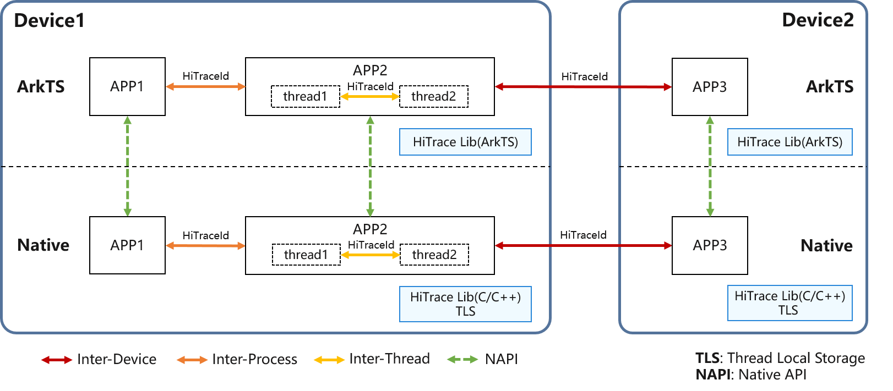

# Introduction to HiTraceChain

<!--Kit: Performance Analysis Kit-->
<!--Subsystem: HiviewDFX-->
<!--Owner: @yu_haoqiaida-->
<!--Designer: @MontSaintMichel-->
<!--Tester: @gcw_KuLfPSbe-->
<!--Adviser: @jinqiuheng-->
<!-- md-trans-meta sourceCommit=9e7305fd2d0bf3a25be65abfadf2e97b359f1ac7 translatedAt=2026-07-31T01:33:43.527Z pushedAt=2026-07-31T07:57:09.754Z -->

## Overview

HiTraceChain is a lightweight implementation of the distributed call chain tracing. It allows applications to trace cross-thread, cross-process, and cross-device service calls. With HiTraceChain, a unique ID is generated for a service process, passed throughout the service process, and associated with various output information (including HiTraceMeter logging, application events, and HiLog logs). During debugging and fault locating, you can use the unique **chainId** to quickly correlate various information related to the service process. HiTraceChain provides APIs to implement call chain tracing throughout a service process. This can help you quickly obtain the run log for the call chain of a service process and locate faults across devices, processes, and threads.

## Basic Concepts

**HiTraceId**: tracing ID provided by HiTraceChain, which uniquely identifies the call chain of a service process.

**chainId**: tracing chain ID, which is a part of **HiTraceId** and uniquely identifies the service process that is being traced.

**spanId**: span ID, which is a part of **HiTraceId** and uniquely identifies a specific task of the service process in a service. Different span IDs can be created for distinguishing tasks. The default value is **0**. When an API is called to create a **spanId**, or **HiTraceId** is automatically passed, a new **spanId** is generated.

**parentSpanId**: parent span ID, which is a part of **HiTraceId** and identifies the parent task of the current task. Different parent span IDs can be used to display the hierarchical relationship between tasks. The default value is **0**. A new **spanId** is created by assigning the current **spanId** to **parentSpanId**.

## Implementation Principles

1. **Generate a HiTraceId**: After HiTraceChain tracing is enabled, a globally unique trace ID **HiTraceId** is generated in the Thread Local Storage (TLS) of the calling thread.

2. **Obtain the HiTraceId**: The native layer directly obtains **HiTraceId** from the TLS, and the ArkTS layer obtains **HiTraceId** from the TLS of the native layer through the Node-API.

3. **Pass the HiTraceId**: During the service process, you can obtain the **HiTraceId** from the TLS of the current thread, pass it between different threads (such as **thread1** and **thread2**), processes (such as **APP1** and **APP2**), and devices (such as **Device1** and **Device2**), and set the **HiTraceId** in the TLS of other threads to ensure that all related threads can access the unique **HiTraceId** in the same service process.

4. **Record information**: For service processes that enable HiTraceChain, the **HiTraceId** is included in the output information (such as HiTraceMeter logs, application events, and HiLog logs). You can correlate the information with **HiTraceId** to enable cross-device call-chain tracing.

   

## Constraints

You can set [HiTraceFlag](../reference/apis-performance-analysis-kit/js-apis-hitracechain.md#hitraceflag) to enable asynchronous call tracing. **HiTraceId** can be automatically transferred in the automatic transfer mechanism of **HiTraceChain**.

The following table lists some common mechanisms that support and do not support HiTraceChain automatic transfer. If it is not supported, **HiTraceId** cannot be passed to the created asynchronous tasks, threads, or processes. As a result, the HiTraceChain tracing is interrupted. In this case, you need to manually pass and set **HiTraceId** to implement complete tracing.

| Scenario| Asynchronous Task| Cross-thread| Cross-process| Cross-device|
| -------- | -------- | -------- | -------- | -------- |
| Mechanisms that support HiTraceChain automatic propagation | [async/await](../arkts-utils/async-concurrency-overview.md#asyncawait) [Promise](../arkts-utils/async-concurrency-overview.md#promise) | [HiAppEvent](hiappevent-intro.md) [napi_async_work](../napi/use-napi-asynchronous-task.md) [FFRT](../ffrt/ffrt-overview.md) | [IPC](../ipc/ipc-rpc-overview.md) | [RPC](../ipc/ipc-rpc-overview.md) |
| Mechanisms that do not support HiTraceChain automatic propagation | Macro tasks and their asynchronous tasks (for example, [setTimeout](../reference/common/js-apis-timer.md#settimeout), [setInterval](../reference/common/js-apis-timer.md#setinterval), etc.) | [TaskPool](../arkts-utils/taskpool-introduction.md) [Worker](../arkts-utils/worker-introduction.md) Threads created by the C++ standard library std::thread, pthread_create, std::async, etc. | [Socket](../network/socket-connection.md) [Ashmem](../reference/apis-ipc-kit/js-apis-rpc.md#ashmem8) | - |