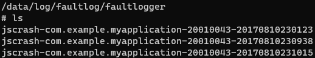
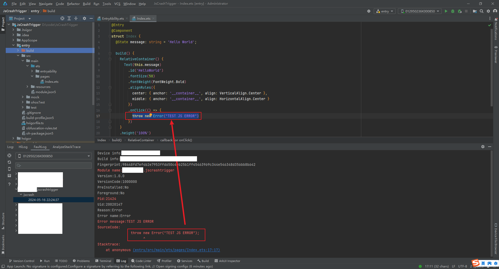

# Analyzing JS Crash

When an application crashes dues to a JS exception, it generates a JS crash log file. You can view the log to locate the error code and analyze the cause of the crash.

This topic describes the JS Crash exception capture scenario, JS Crash fault analysis, and typical cases.

## JS Crash Detection

### JS Crash Log Specifications

The following describes the fields in a process crash log.

```
Build info:XXX-XXXX X.X.X.XX(XXXXXXXX) <- Build information
Module name:com.example.myapplication <- Module name
Version:1.0.0 <- Version number
Pid:579 <- Process ID
Uid:0 <- User ID
Reason:TypeError <- Cause
Error message:Cannot read property c of undefined <- Error message
Cannot get SourceMap info, dump raw stack: <- The release package does not contain the **SourceMap** file, and the JavaScript stack fails to parse it.
SourceCode:
        var a = b.c;   <- Location of the problematic code
                ^
Stacktrace:
    at onPageShow (entry/src/main/ets/pages/Index.ets:7:13)  <- Call stack of the error code
           ^                                      ^
         The error occurs at line 7, column 13 in the entry/src/main/ets/pages/Index.ets file.
```

You can identify the cause of the crash, mostly application issues, based on Error message and Stacktrace in the logs.

### JS Crash Exception Types

JS crash exceptions are classified into the following types in the **Reason** field based on exception scenarios:

 - **Error**: **Error** is the most basic type. Other error types are inherited from this type. The **Error** object consists of  **message** and **name**, which indicate the error message and error name, respectively. Generally, exceptions of the **Error** type are thrown by developers.

 - **TypeError**: As the most common error type at run-time, **TypeError** indicates a variable or parameter that is not of the expected type.

 - **SyntaxError**: **SyntaxError** is also called parsing error. As the most common error type in all programming languages, **SyntaxError** indicates that the syntax does not comply with the syntax specifications of the programming language.

 - **RangeError**: **RangeError** is thrown when a value exceeds the valid range. Common range errors include the following:
    - The array length is negative or too long.
    - The numeric parameter exceeds the predefined range.
    - The number of function stack calls exceeds the maximum.

 - **ReferenceError**: **ReferenceError** is thrown when a variable that does not exist is referenced. Each time a variable is created, the variable name and its value are stored in the key-value format. When a variable is referenced, the value will be located based on the key and returned. If the variable referenced cannot be to be found, **ReferenceError** is thrown.

 - **URI Error**: **URI Error** is thrown when an invalid URI is found in **encodeURI()**, **decodeURI()**, **encodeURIComponent()**, **decodeURIComponent()**, **escape()**, or **unescape()**.

## JS Crash Fault Analysis

### Obtaining the Log

The process crash log is a type of fault log managed together with the app freeze and JS application crash logs by the FaultLogger module. You can obtain process crash logs using any of the following methods:

- Method 1: DevEco Studio

    DevEco Studio collects process crash logs in **/data/log/faultlog/faultlogger/** and archives the logs in FaultLog. For details, see <!--RP1-->[DevEco Studio User Guide-FaultLog](https://developer.huawei.com/consumer/cn/doc/harmonyos-guides-V5/ide-fault-log-0000001659706366-V5)<!--RP1End-->. 

- Method 2: hiAppEvent APIs

    hiAppEvent provides APIs to subscribe to various fault logs. For details, see [Introduction to HiAppEvent](hiappevent-intro.md).

<!--Del-->
- Method 3: Shell

    When a process crashes, you can find fault logs in **/data/log/faultlog/faultlogger/** on the device. The log files are named in the format of **jscrash-process name-process UID-time (seconds)**. They contain information such as the device name, system version, and process crash call stack.

    
<!--DelEnd-->

### Analyzing Faults

Generally, the cause of the fault can be found by locating the problematic code based on the exception scenario, error message, and call stack. The call stack is analyzed in the following cases:

#### 1. StackTrace Scenarios

In JS Crash fault logs, the **StackTrace** field provides the call stack information about the JS Crash exception. Common  **StackTrace** information includes the following:

1. The stack top indicates the problematic code, as shown in the following example. You can click the link to locate the problematic code.
    ```
    Device info:xxx
    Build info:xxx-xxx x.x.x.xxx(xxxx)
    Fingerprint:ed1811f3f5ae13c7262b51aab73ddd01df95b2c64466a204e0d70e6461cf1697
    Module name:com.xxx.xxx
    Version:1.0.0
    VersionCode:1000000
    PreInstalled:No
    Foreground:Yes
    Pid:31255
    Uid:20020145
    Reason:Error
    Error name:Error
    Error message:JSERROR
    Sourcecode:
                    throw new ErrOr("JSERROR");
                          ^
    Stacktrace:
        at anonymous (entry/src/main/ets/pages/Index.ets:13:19)
    ```

2. If "Stack Cannot get SourceMap info, dump raw stack" is displayed in the call stack, as shown in the following example, the system fails to retrieve information from SourceMap and only displays the row number of the problematic code in the compiled code in an eTS stack. You can click the link to identify where the error occurred in the compiled code.
    ```
    Device info:xxx
    Build info:xxx-xxx x.x.x.xxx(xxxx)
    Fingerprint:a370fceb59011d96e41e97bda139b1851c911012ab8c386d1a2d63986d6d226d
    Module name:com.xxx.xxx
    Version:1.0.0
    Versioncode:1000000
    PreInstalled:No
    Foreground:Yes
    Pid:39185
    Uid:20020145
    Reason:Error
    Error name:Error
    Error message:JSERROR
    Stacktrace:
    Cannot get SourceMap info, dump raw stack:
        at anonymous (entry/src/main/ets/paqes/Index.ts:49:49)
    ```

3. If "SourceMap is not initialized yet" is displayed in the call stack, as shown in the following example, SourceMap has not been initialized and the row number of the problematic code in the compiled code in an eTS stack is displayed. In this case, this log is added to notify developers. You can click the link to identify where the error occurred in the compiled code.
    ```
    Device info:xxx
    Build info:xxx-xxx x.x.x.xxx(xxxx)
    Fingerprint:377ef8529301363f373ce837d0bf83aacfc46112502143237e2f4026e86a0510
    Module name:com.xxx.xxx
    Version:1.0.0
    Versioncode:1000000
    PreInstalled:No
    Foreground:Yes
    Pid:6042
    Uid:20020145
    Reason:Error
    Error name:Error
    Error message:JSERROR
    Sourcecode:
                throw new Error("JSERROR");
                      ^
    Stacktrace:
    SourceMap is not initialized yet
    at anonymous (entry/src/main/ets/pages/Index.ts:49:49)
    ```

4. The native stack is printed in the call stack, as shown in the following example. Generally, the **libark_jsruntime.so** dynamic library is at the top of the stack. This is because JS exceptions are thrown by the VM. Search for the error from the top down. Generally, the next frame of **libace_napi.z.so** is the location where an exception is thrown.
    ```
    Device info:xxx
    Build info:xxx-xxx x.x.x.xxx(xxxx)
    Fingerprint:89f2b64b24d642b0fc64e3a7cf68ca39fecaa580ff5736bb9d6706ea4cdf2c93
    Module name:com.xxx.xxx
    Version:1.0.0
    VersionCode:1000000
    PreInstalled:No
    Foreground:No
    Pid:14325
    Uid:20020145
    Reason:ReferenceError
    Error name:ReferenceError
    Error message:Cannot find module 'com.xxx.xxx/entry/EntryAbility' , which is application Entry Point
    Stacktrace:
    SourceMap is not initialized yet
    #01 pc 000000000028ba3b /system/libó4/platformsdk/libark_jsruntime.so(bf6ea8e474ac3e417991f101e062fa90)
    #02 pc 00000000001452ff /system/libó4/platformsdk/libark_jsruntime.so(bf6ea8e474ac3e417991f101e062fa90)
    #03 pC 0000000000144c9f /system/libó4/platformsdk/libark_jsruntime.so(bf6ea8e474ac3e417991f101e062fa90)
    #04 pc 00000000001c617b /system/libó4/platformsdk/libark_jsruntime.so(bf6ea8e474ac3e417991f101e062fa90)
    #05 pc 00000000004c3cb7 /system/libó4/platformsdk/libark_jsruntime.so(bf6ea8e474ac3e417991f101e062fa90)
    #06 pc 00000000004c045f /system/libó4/platformsdk/libark_jsruntime.so(bf6ea8e474ac3e417991f101e062fa90)
    #07 pc 000000000038034f /system/libó4/platformsdk/libark_jsruntime.so(bf6ea8e474ac3e417991f101e062fa90)
    #08 pc 00000000004b2d9b /system/libó4/platformsdk/libark_jsruntime.so(bf6ea8e474ac3e417991f101e062fa90)
    #09 pc 0000000000037e7f /system/libó4/platformsdk/libace_napi.z.so(10ceafd39b5354314d2fe3059b8f9e4f)
    #10 pc 00000000000484cf /system/lib64/platformsdk/libruntime.z.so(3f6305a3843fae1de148a06eec4bd014) <- Location where an exception is thrown
    #11 pc 000000000004fce7 /system/libó4/platformsdk/libruntime.z.so(3f6305a3843fae1de148a06eec4bd014)
    #12 pc 000000000004e9fb /system/libó4/platformsdk/libruntime.z.so(3f6305a3843fae1de148a06eec4bd014)
    #13 pc 000000000004eb7b /system/libó4/platformsdk/libruntime.z.so(3f6305a3843fae1de148a06eec4bd014)
    #14 pc 000000000004f5c7 /system/libó4/platformsdk/libruntime.z.so(3f6305a3843fae1de148a06eec4bd014)
    #15 pc 00000000000303cf /system/lib64/platformsdk/libuiabilitykit_native.z.so(3203F4CCe84a43b519d0a731dfOdb1a3)
    ```

#### 2. Call Stack Analysis

Perform call stack analysis as follows:

- Case 1: A hyperlink is provided to go to the problematic code.

  If the path or offset address in the stack trace information in the FaultLog points to a line of code of the current project, a hyperlink is provided. You can click the link in DevEco Studio to locate the code line.

- Case 2: The hyperlink provided to go to the problematic code does not work.

  If "Cannot get Source Map info, dump raw stack" is displayed, the JS stack fails to obtain the row and column numbers for the problematic code. In this case, clicking the provided hyperlink in DevEco Studio navigates you to an incorrect position or displays an error that indicates the position does not exist.

  When an error occurs during the running of application code, the error stack information is printed. If the TS stack fails to obtain the row and column numbers for ArkTS code, the filename extension of the error stack is still "ets". You need to compile the intermediate product in the **build** directory to generate TS code and locate the problematic code in JS. For details, see [Application Stack Parsing](https://developer.huawei.com/consumer/cn/doc/harmonyos-guides-V5/ide-release-app-stack-analysis-0000001814726289-V5).


## Case Study

The following describes the most common error types, namely, **TypeError** and **Error**, that cause JS crashes. 

### TypeError Analysis

As one of the most common errors that cause JS crashes, TypeError is thrown when the variable type is not the expected one. In other words, the variable is not verified before use. The error message is as follows:

```
Error name:TypeError
Error message:Cannot read property xxx of undefined
```

#### Case 1: JS crash occasionally occurs when a gesture value is updated. 

1. Obtain the JS crash log:

    ```
    Generated by HiviewDFX@OpenHarmony
    ================================================================
    Device info:xxxx
    Build info:xxxx
    Fingerprint:9851196f9fed7fd818170303296ae7a5767c9ab11f38fd8b0072f0e32c42ea39
    Module name:com.xxx.xxx
    Version:1.0.0.29
    VersionCode:10000029
    PreInstalled:Yes
    Foreground:No
    Pid:2780
    Uid:20020018
    Reason:TypeError
    Error name:TypeError
    Error message:Cannot read property needRenderTranslate of undefined
    Stacktrace:
    Cannot get SourceMap info, dump raw stack:
        at updateGestureValue (phone/src/main/ets/SceneBoard/recent/scenepanel/recentpanel/RecentGesture.ts:51:51)
        at onRecentGestureActionBegin (phone/src/main/ets/SceneBoard/scenemanager/SCBScenePanel.ts:5609:5609)
        at anonymous (phone/src/main/ets/SceneBoard/scenemanager/SCBScenePanel.ts:555:555)
        at anonymous (phone/src/main/ets/SceneBoard/recent/RecentEventView.ts:183:183)
    ```

2. Analyze log information.

    According to the log information, **TypeError** is reported because the **needRenderTranslate** object read is **undefined**. Then, obtain the error location based on the call stack.
If "Cannot get SourceMap info, dump raw stack" is displayed, the application is installed using a release package and the eTS row and column numbers cannot be covnerted from the JS stack. You can refer to [Application Stack Parsing](https://developer.huawei.com/consumer/cn/doc/harmonyos-guides-V5/ide-release-app-stack-analysis-0000001814726289-V5) to parse the row number.

3. Locate the error code.

    Based on the preceding JS stack and error variable analysis, the error code can be located as follows:

    ```
      // Update the gesture value.
      public updateGestureValue(screenWidth: number, recentScale: number, sceneContainerSessionList: SCBSceneContainerSession[]) {
        // Calculate the moving distance of the hand.
        this.translationUpY = (this.multiCardsNum >= 1)? sceneContainerSessionList[this.multiCardsNum - 1].needRenderTranslate.translateY: 0; ---> Number of the error line
        this.translationDownY = (this.multiCardsNum >= 2) ? sceneContainerSessionList[this.multiCardsNum - 2].needRenderTranslate.translateY : 0;
        this.screenWidth = px2vp(screenWidth);
        this.recentScale = recentScale;
      }
    ```

4. Solution

    According to the preceding analysis, the member variable **needRenderTranslate** of **sceneContainerSessionList** may be undefined. A protection needs to be added to avoid this type of problem. For example, you can add a '?' operator before the access object for protection.

    ```
    // Update the gesture value.
    public updateGestureValue(screenWidth: number, recentScale: number, sceneContainerSessionList: SCBSceneContainerSession[]) {
      // Calculate the moving distance of the hand.
      this.translationUpY = (this.multiCardsNum >= 1) ?
        sceneContainerSessionList[this.multiCardsNum - 1]?.needRenderTranslate.translateY : 0;
      this.translationDownY = (this.multiCardsNum >= 2) ?
        sceneContainerSessionList[this.multiCardsNum - 2]?.needRenderTranslate.translateY : 0;
      this.screenWidth = px2vp(screenWidth);
      this.recentScale = recentScale;
    }
    ```

5. Suggestions

    To solve this problem, we need to add necessary null checks in the coding phase to ensure security of object access. In many scenarios, the null check may only be a workaround. You need to check the object construction or value assignment logic based on service requirements.

### Error Analysis

Error problems are JS exceptions thrown by developers or JS libraries.

There are two scenarios for this type of problem:
1.	If the application encounters a fault that cannot be rectified, a JS exception is thrown to terminate the service and generate a fault log.
2.	The service is terminated by an exception thrown by an API of the dependent JS library or module. In this case, you need to consider using try-catch to capture such exceptions.


#### Case 1: Throw a custom JS exception to terminate an application.

You can use the following code to throw a JS exception:

```
throw new Error("TEST JS ERROR")
```

Based on the fault logs collected by DevEco Studio FaultLog, you can locate the exception based on the JS exception stack.



To solve this problem, locate the problematic code line based on the fault log and review the context.

#### Case 2: Handle the JS crash caused by a JS exception thrown by a third-party API.

1. Obtain the JS crash log. The key log information is as follows:
    ```
    Error name:Error
    Error message:BussinessError 2501000: Operation failed.
    Error code:2501000
    Stacktrace:
    Cannot get SourceMap info, dump raw stack:
      at onStart (product/phone/build/default/cache/default/default@CompileArkTS/esmodule/release/feature/systemstatus/linkspeedcomponent/src/main/ets/default/controller/NetSpeedController.ts:50:1)
      at NetSpeedController (product/phone/build/default/cache/default/default@CompileArkTS/esmodule/release/feature/systemstatus/linkspeedcomponent/src/main/ets/default/controller/NetSpeedController.ts:43:43)
      at getInstance (product/phone/build/default/cache/default/default@CompileArkTS/esmodule/release/staticcommon/basiccommon/src/main/ets/component/utils/SingletonHelper.ts:17:17)
      at func_main_0 (product/phone/build/default/cache/default/default@CompileArkTS/esmodule/release/feature/systemstatus/linkspeedcomponent/src/main/ets/default/controller/NetSpeedController.ts:325:325)
    ```

2. Analyze log information.

    According to the log information, an **Error** exception is thrown by the code. Then, obtain the error location based on the stack trace.
If "Cannot get SourceMap info, dump raw stack" is displayed, the application is installed using a release package and the eTS row and column numbers cannot be covnerted from the JS stack. You can refer to [Application Stack Parsing](https://developer.huawei.com/consumer/cn/doc/harmonyos-guides-V5/ide-release-app-stack-analysis-0000001814726289-V5) to parse the row number.

3. Locate the error code.

    Based on the preceding JS stack, you can locate the code in the **NetSpeedController.ts** file. The exception is thrown when **wifiManager.on()** is called.

    ```
    onStart(): void {
      super.onStart();
      log.showInfo('onStart');
      ...
      wifiManager.on('wifiConnectionChange', (data) => {
        this.isConnected = data === 1 ? true : false;
        this.handleUpdateState();
      });
      wifiManager.on('wifiStateChange', (data) => {
        this.isWifiActive = data === 1 ? true : false;
        this.handleUpdateState();
      });
      ...
    }
    ```

4. Solution

    According to the analysis of the source code, **wifiManager.on()** throws "BussinessError 2501000: Operation failed" occasionally. If this exception does not cause the application to crash, use try-catch to capture and process the exception. Modify the code as follows:

    ```
    onStart(): void {
      super.onStart();
      log.showInfo('onStart');
      ...
      try {
        wifiManager.on('wifiConnectionChange', (data) => {
          this.isConnected = data === 1 ? true : false;
          this.handleUpdateState();
        });
      } catch (error) {
        log.showError('wifiConnectionChange error');
      }
      try {
        wifiManager.on('wifiStateChange', (data) => {
          this.isWifiActive = data === 1 ? true : false;
          this.handleUpdateState();
        });
      } catch (error) {
        log.showError('wifiStateChange error');
      }
      ...
    }
    ```

5. Suggestions

    For such problems, we can use the JS exception mechanism in the coding phase to identify various exception scenarios. In addition, consider capturing the exceptions thrown by APIs to prevent unnecessary interrupts of the main services of the application.
