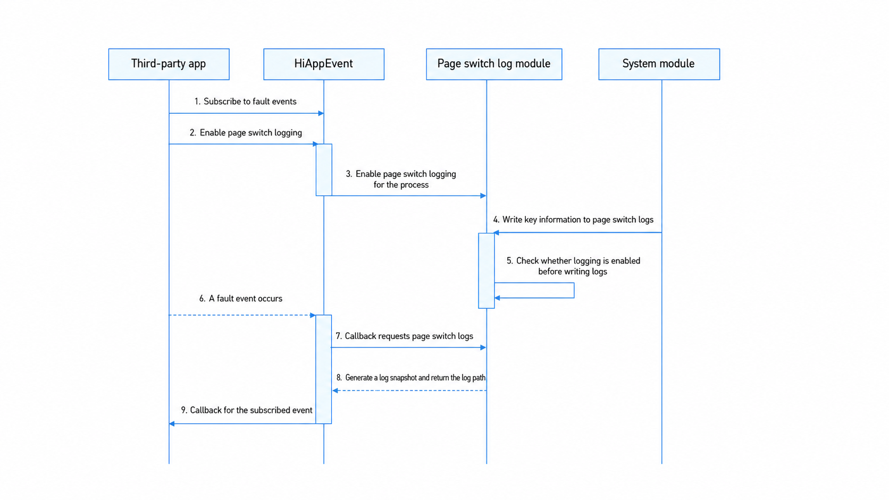

# Page Switch Logs

<!--Kit: Performance Analysis Kit-->
<!--Subsystem: HiviewDFX-->
<!--Owner: @buzhenwang-->
<!--Designer: @shenchenkai-->
<!--Tester: @liyang2235-->
<!--Adviser: @jinqiuheng-->
<!-- md-trans-meta sourceCommit=0fe0b664183e64cf7673a58f285d7af271a109c9 translatedAt=2026-08-15T01:49:09.259Z pushedAt=2026-08-15T07:30:24.528Z -->

## Overview

Page switch logs are supported since API version 24. Page switch logs record app page switch information, such as window creation and destruction and page navigation, helping you analyze user operations before a fault occurs and improve fault locating efficiency.

## Implementation Principle

A third-party app obtains page switch log information when a fault occurs by subscribing to fault events and enabling page switch log recording. The implementation principle is shown in the following figure:



The detailed steps are as follows:

1. The app calls the HiAppEvent API to add a subscription to fault events.

2. The app calls the HiAppEvent API to enable the page switch log for fault events.

3. HiAppEvent sets the enable state of the page switch log module.

4. Writes the page switch log to record key information.

5. Decides whether to write the log information that records the app's page switch trace based on the enable state.

6. A fault event occurs while the app is running.

   After a fault occurs, the process that subscribes to the fault event receives the event callback. In a multi-instance scenario, after a fault occurs, every active instance process receives the event callback, while the instance process that exits due to the crash does not receive the callback after it restarts.

   For example, in the following table, on the premise that all four instance processes listen for and register the crash event, process 622 crashes due to a fault and therefore cannot receive the crash event callback, while the still-active processes 623 to 625 receive the crash event callback. Similarly, if process 625 crashes due to a fault, process 625 cannot receive the crash event callback, while processes 622 to 624 receive the crash event callback.

   | Process ID | Process Name |
   | ------ | ------ |
   | 622 | com.example.myapplication |
   | 623 | com.example.myapplication:EngineServiceAbility:1 |
   | 624 | com.example.myapplication:EngineServiceAbility:5 |
   | 625 | com.example.myapplication:EngineServiceAbility:6 |

7. HiAppEvent requests the page switch log information from the page switch log module based on whether it is enabled.

8. After receiving the request from HiAppEvent, the page switch log module returns the file path of the generated page switch log snapshot to HiAppEvent.

   Generation rule: Find the page switch log files of this instance that are not held by other processes, and copy them to generate snapshot files. A snapshot file is named as follows: page_switch-process name-instance index-file index-millisecond event trigger time.log. If the snapshot file already exists, it is not generated again.

   For example, when process 625 in the preceding table crashes, the generated snapshot files are as follows:

   ```text
   page_switch-com.example.myapplication_EngineServiceAbility-3-1-20260509142812417.log
   page_switch-com.example.myapplication_EngineServiceAbility-3-2-20260509142812417.log
   ```

   To avoid creating snapshots for the page switch logs of historical instances, the event occurrence time is also compared with the modification time of the page switch log. It is agreed that no snapshot is created when the difference between the event occurrence time and the modification time of the page switch log exceeds 24 hours.

9. HiAppEvent adds the path of the page switch log snapshot file to the fault event information and returns it to the app together with the callback.

## Log Specifications

### File Naming Specification

Page switch log files include log files and snapshot files. A log file records the log information of page switching. When a fault occurs, the system packages the log file into a snapshot file, and the event callback returns the snapshot file path to you for analysis.

1. Naming specification of page switch log files.

   A page switch log file name consists of five columns of attributes. Except for the log type suffix, the log name part is separated by `-`. The following is a naming example:

   ```text
   page_switch-com.example.myapplication-1-1.log
   ```

   | First column (log prefix) | Second column (process name) | Third column (instance index) | Fourth column (file index) | Fifth column (log suffix) |
   | :--------: | :--------: | :--------: | :--------: | :--------: |
   | page_switch | com.example.myapplication | 1 | 1 | log |

   > **NOTE**
   >
   > Process name: The process name must have the trailing `:N` suffix removed. When the process name contains `:`, `/`, or `-`, these characters are uniformly replaced with `_`.
   >
   > Instance index: In scenarios where multiple processes share a sandbox (for example, [multi-instance](../quick-start/multiInstance.md) or [ExtensionAbility components](../application-models/extensionability-overview.md)), log write conflicts may occur. Therefore, the page switch log creates a group of log files for each process, and the instance index is used to identify different processes. Value range: [1, 10].
   >
   > File index: A maximum of 2 files are retained under the same process name and instance index. Value range: [1, 2].

2. Naming specification for page switch log snapshot files.

   Example:

   ```text
   page_switch-com.example.myapplication-1-1-20260509142812417.log
   ```

   | First column (log prefix) | Second column (process name) | Third column (instance index) | Fourth column (file index) | Fifth column (timestamp) | Sixth column (log suffix) |
   | :--------: | :--------: | :--------: | :--------: | :--------: | :--------: |
   | page_switch | com.example.myapplication | 1 | 1 | 20260509142812417 | log |

   > **NOTE**
   >
   > The process name, instance index, and file index are the same as those described in the page switch log file name.
   >
   > Timestamp: The format is YYYYMMDDhhmmssSSS, where year (YYYY) occupies 4 digits, month (MM), day (DD), hour (hh), minute (mm), and second (ss) each occupy 2 digits, and millisecond (SSS) occupies 3 digits.

### File Content Specification

The page switch log content supports recording window switch logs, ArkUI route switch logs, UIAbility lifecycle switch logs, and more.

1. Window switch log specification.

The window switch log is used to record the lifecycle of app windows and window state changes, including key information such as window creation, display, hiding, and destruction. The following is an example of a window switch log:

   ```text
   window {Event description}, name: {Window name}, id: {Window ID}, displayId: {Display ID}
   ```

The "event description" includes window lifecycle events and window state change events.

   (1) Window lifecycle events.

   Records the lifecycle changes of a window from creation to destruction, including window creation, display, hiding, and destruction. The specific descriptions and their meanings are as follows:

   | Event Description | Meaning |
   |--------|------|
   | create | The window is created. |
   | show | The window is displayed. |
   | already show | The window is displayed, and it was already in the displayed state. |
   | hide | The window is hidden. |
   | already hide | The window is hidden, and it was already in the hidden state. |
   | destroy | The window is destroyed. |

   (2) Window state change events.

   Records the switching behavior of a window among states such as FULLSCREEN, MAXIMIZE, MINIMIZE, FLOATING, and SPLITSCREEN. The specific descriptions and their meanings are as follows:

   | Event | Description |
   |--------|------|
   | status: FULLSCREEN | The window switches to the full-screen state. |
   | status: MAXIMIZE | The window switches to the maximized state. |
   | status: MINIMIZE | The window switches to the minimized state. |
   | status: FLOATING | The window switches to the floating window state. |
   | status: SPLITSCREEN | The window switches to the split-screen state. |
   | status: UNDEFINED | The window state is undefined. The state is undefined when the switched state is not one of the states above, which generally does not occur. |

   The following is an example of a window switch log in actual app usage:

   ```text
   2026-07-27 14:34:46.513  56594  56594 window create, name: mySubWindow, id: 56, displayId: 0    <- Create the window mySubWindow.
   2026-07-27 14:34:46.540  56594  56594 window show, name: mySubWindow, id: 56, displayId: 0    <- Show the window mySubWindow.
   2026-07-27 14:34:46.559  56594  56680 window status: FLOATING, name: mySubWindow, id: 56, displayId: 0    <- The window mySubWindow is displayed as a floating window.
   2026-07-27 14:34:58.222  56594  56594 window destroy, name: mySubWindow, id: 56, displayId: 0   <- Destroy the window mySubWindow.
   ```

2. ArkUI route switch log specification.

   The ArkUI route switch log includes the switch logs of the Router and Navigation route components.

   Format:

   ```text
   Navigate change at {switch timestamp}: from page '{page name}' (split: {whether in Navigation split mode}) to page '{page name}' (split: {whether in Navigation split mode})
   ```

   Example:

   ```text
   2026-07-27 14:41:49.609 14043 14043 Navigate change at 1785134509304: from page 'navBar' (split: false) to page 'pageOne' (split: false). <- The page navigates from navBar to pageOne at timestamp 1785134509304, and both pages are in non-split mode before and after the navigation.
   ```

3. UIAbility lifecycle switch log specification.

   The UIAbility lifecycle switch log records the lifecycle changes of a UIAbility, including key events such as creation, destruction, foreground/background switching, WindowStage creation and destruction, and receiving a new Want. The format of the UIAbility lifecycle switch log is as follows:

   ```text
   {lifecycle name}, ModuleName: {module name}, AbilityName: {Ability name}
   ```

   The "lifecycle name" contains the UIAbility lifecycle callback events. The specific descriptions and meanings are as follows:

   | Lifecycle Name | Meaning |
   |--------|------|
   | onCreate | The UIAbility is created. |
   | onDestroy | The UIAbility is destroyed. |
   | onWindowStageCreate | The WindowStage of the UIAbility is created. |
   | onWindowStageDestroy | The WindowStage of the UIAbility is destroyed. |
   | onForeground | The UIAbility switches to the foreground. |
   | onBackground | The UIAbility switches to the background. |
   | onNewWant | The UIAbility instance is started again when it already exists. |

The following is an example of the UIAbility lifecycle switch log of an app in actual use:

   ```text
   2026-07-27 14:34:46.513  56594  56594 onCreate, ModuleName: entry, AbilityName: EntryAbility    <- EntryAbility is created.
   2026-07-27 14:34:46.540  56594  56594 onWindowStageCreate, ModuleName: entry, AbilityName: EntryAbility    <- The WindowStage of EntryAbility is created.
   2026-07-27 14:34:46.559  56594  56594 onForeground, ModuleName: entry, AbilityName: EntryAbility    <- EntryAbility switches to the foreground.
   2026-07-27 14:34:58.222  56594  56594 onBackground, ModuleName: entry, AbilityName: EntryAbility    <- EntryAbility switches to the background.
   2026-07-27 14:34:58.240  56594  56594 onWindowStageDestroy, ModuleName: entry, AbilityName: EntryAbility    <- The WindowStage of EntryAbility is destroyed.
   2026-07-27 14:34:58.259  56594  56594 onDestroy, ModuleName: entry, AbilityName: EntryAbility    <- EntryAbility is destroyed.
   ```

## Constraints

The page switch log feature is supported since API version 24. It is not available in earlier versions.

### Page Switch Logs

1. The page switch log supports at most 5 different processes, each process supports at most 10 instances, and each instance creates at most 1 group of 2 files.

   Example: The following shows 5 types of processes, A to E. Each type has 10 instances, numbered 1 to 10, and each instance has 1 group of 2 page switch logs.

   > page_switch-A-1-1.log, page_switch-A-1-2.log
   > page_switch-A-2-1.log, page_switch-A-2-2.log
   > ...
   > page_switch-A-10-1.log, page_switch-A-10-2.log
   >
   > page_switch-B-1-1.log, page_switch-B-1-2.log
   > page_switch-B-2-1.log, page_switch-B-2-2.log
   > ...
   > page_switch-B-10-1.log, page_switch-B-10-2.log
   >
   > ...
   >
   > page_switch-E-1-1.log, page_switch-E-1-2.log
   > page_switch-E-2-1.log, page_switch-E-2-2.log
   > ...
   > page_switch-E-10-1.log, page_switch-E-10-2.log

2. The maximum number of page switch log files is 100. When the limit is reached, the oldest files are deleted in chronological order of their modification time.

### Page Switch Log Snapshot

At most 40 page switch log snapshots are retained. When the number exceeds 40, the oldest snapshots are aged out based on the timestamp in the log file name.

### Event Types

Currently, obtaining page switch logs supports only [crash events](./hiappevent-watcher-crash-events.md), [app freeze events](./hiappevent-watcher-freeze-events.md), [resource leak events](./hiappevent-watcher-resourceleak-events.md), and [address sanitizer events](./hiappevent-watcher-address-sanitizer-events.md).

## Log Retrieval

To obtain fault page switch logs, you need to subscribe to fault events and enable page switch logs for the fault events. Log obtaining depends on the event subscription and system event policy configuration capabilities of HiAppEvent. For details about how to use the APIs (parameter restrictions, value ranges, and so on), see [@ohos.hiviewdfx.hiAppEvent](../reference/apis-performance-analysis-kit/js-apis-hiviewdfx-hiappevent.md).

### Available APIs

| interface name | Description |
| -------- | -------- |
| addWatcher(watcher: Watcher): AppEventPackageHolder | Adds an app event watcher to subscribe to app events. |
| removeWatcher(watcher: Watcher): void | Removes an app event watcher to unsubscribe from app events. |
| configEventPolicy(policy: EventPolicy): Promise&lt;void&gt; | System policy configuration API, used to enable page switch logs for system events. |

### How to Develop

Currently, the HiAppEvent API for enabling page switch logs for system events supports only ArkTS. The following uses obtaining page switch logs for crash events as an example to describe the development procedure.

1. Add an event watcher.

   (1) Create an ArkTS app project, edit the **entry > src > main > ets > entryability > EntryAbility.ets** file in the project, and import the dependent modules. The sample code is as follows:

   ```ts
   import { BusinessError, deviceInfo } from '@kit.BasicServicesKit';
   import { hiAppEvent, hilog } from '@kit.PerformanceAnalysisKit';
   ```

   (2) In the **entry > src > main > ets > entryability > EntryAbility.ets** file, set the custom parameters in **onCreate()**. The sample code is as follows:

   ```ts
   if (deviceInfo.sdkApiVersion >= 24) {  // API version 24 and later supports setting the page switch log.
       // Configure the page switch log.
       let policy : hiAppEvent.EventPolicy = {
           appCrashPolicy: {
               pageSwitchLogEnable: true
           }
       };
       // You can set the crash event policy configuration parameters.
       hiAppEvent.configEventPolicy(policy).then(() => {
           hilog.info(0x0000, 'testTag', `HiAppEvent success to config event policy.`);
       }).catch((err: BusinessError) => {
           hilog.error(0x0000, 'testTag', `HiAppEvent code: ${err.code}, message: ${err.message}`);
       });
   }
   ```

   (3) In the **entry > src > main > ets > entryability > EntryAbility.ets** file, add a watcher in **onCreate()** to subscribe to system events. The sample code is as follows:

   ```ts
   hiAppEvent.addWatcher({
       // You can customize the watcher name, which the system uses to identify different watchers.
       name: "watcher",
       // You can subscribe to the system events of interest. Here, the app crash event is subscribed.
       appEventFilters: [
           {
               domain: hiAppEvent.domain.OS,
               names: [hiAppEvent.event.APP_CRASH]
           }
       ],
       // You can implement the subscription real-time callback to process the subscribed event data as needed.
       onReceive: (domain: string, appEventGroups: Array<hiAppEvent.AppEventGroup>) => {
           hilog.info(0x0000, 'testTag', `HiAppEvent onReceive: domain=${domain}`);
           for (const eventGroup of appEventGroups) {
               // You can distinguish different system events by the event name in the event group.
               hilog.info(0x0000, 'testTag', `HiAppEvent eventName=${eventGroup.name}`);
               for (const eventInfo of eventGroup.appEventInfos) {
                   // You can process the event data in the event group as needed. Here, the event data is printed in the log.
                   hilog.info(0x0000, 'testTag', `HiAppEvent eventInfo.domain=${eventInfo.domain}`);
                   hilog.info(0x0000, 'testTag', `HiAppEvent eventInfo.name=${eventInfo.name}`);
                   hilog.info(0x0000, 'testTag', `HiAppEvent eventInfo.eventType=${eventInfo.eventType}`);
                   // You can obtain the fault log file generated when the app crash event occurs.
                   hilog.info(0x0000, 'testTag', `HiAppEvent eventInfo.params.external_log=${JSON.stringify(eventInfo.params['external_log'])}`);
                   hilog.info(0x0000, 'testTag', `HiAppEvent eventInfo.params.log_over_limit=${eventInfo.params['log_over_limit']}`);
                   // You can obtain the page switch log of the app crash.
                   hilog.info(0x0000, 'testTag', `HiAppEvent eventInfo.params.page_switch_log=${JSON.stringify(eventInfo.params['page_switch_log'])}`);
               }
           }
       }
   });
   ```

   (4) In the **entry > src > main > ets > pages > Index.ets** file, add a button and construct an App crash scenario in its **onClick()** function to trigger an App crash event. The sample code is as follows:

   ```ts
   Button("appCrash").onClick(()=>{
       // Construct a crash scenario in the button click function to trigger the app crash event.
       JSON.parse('');
   })
   ```

   (5) In DevEco Studio, click the **Run** button to run the project. Then, click the **appCrash** button to trigger an App crash event.

2. Verify the App crash event information subscribed by the observer.

   After the app exits due to the crash, restart the app to view the processing log of the system event data in the **Log** window:

   ```text
   HiAppEvent onReceive: domain=OS
   HiAppEvent eventName=APP_CRASH
   HiAppEvent eventInfo.domain=OS
   HiAppEvent eventInfo.name=APP_CRASH
   HiAppEvent eventInfo.eventType=1
   HiAppEvent eventInfo.params.external_log=["/data/storage/el2/log/hiappevent/APP_CRASH_1784946783228_8531.log"]
   HiAppEvent eventInfo.params.log_over_limit=false
   HiAppEvent eventInfo.params.page_switch_log="[\"/data/storage/el2/log/page_switch/snapshot/page_switch-com.example.testpageswitchrel-1-1-20260725103301547.log\",\"/data/storage/el2/log/page_switch/snapshot/page_switch-com.example.testpageswitchrel-1-2-20260725103301547.log\"]"
   ```