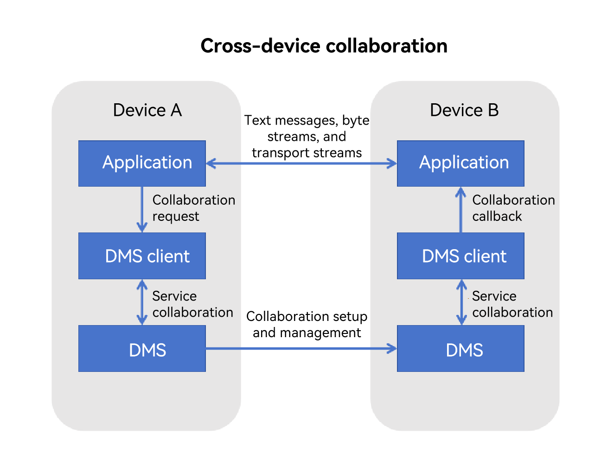

# Cross-Device UIAbility Connection Development (for System Applications Only)

<!--Kit: Distributed Service Kit-->
<!--Subsystem: DistributedSched-->
<!--Owner: @hobbycao-->
<!--Designer: @gsxiaowen-->
<!--Tester: @hanjiawei-->
<!--Adviser: @hu-zhiqiong-->
<!-- md-trans-meta sourceCommit=40fd7e4f4fdebce242bd9157200afe89faee2f0c translatedAt=2026-08-01T02:51:17.722Z pushedAt=2026-08-01T07:05:48.945Z -->

## Introduction

Cross-device connection and communication (including data transmission) is supported since API version 18. This feature utilizes the distributed component management framework to enable multi-device collaboration (that is, applications on different devices working together to fulfill the same service scenario), which has become one of the core functionalities of the distributed system. A typical use case is that the photo control application on the smart watch can remotely invoke the camera function on the mobile phone and implement real-time bidirectional data interaction across devices.

### Available Capabilities

- Cross-device application launch: Supports launching associated applications in a distributed networking environment to implement multi-device service collaboration (application adaptation required).

- Cross-device data interaction: Supports cross-device data transmission. The cross-device data interaction capability varies depending on the application type. Specifically, system applications can transmit text, byte streams, images, and transport streams, while third-party applications can only transmit text.

### Fundamental Concepts

Before you get started, familiarize yourself with the following concepts:

- **DMS**

  A framework that provides distributed component management capabilities.

- **UIAbility**

  [UIAbility](https://developer.huawei.com/consumer/en/doc/harmonyos-guides/uiability-overview) is a component that implements tasks specific to application UIs, such as lifecycle management, user interaction, and UI rendering.

- **Byte stream**

  Data of the [ArrayBuffer](../arkts-utils/arraybuffer-object.md) type, which can be used to store binary data, for example, image or audio data.

- **Transport stream**

  Media streams that can be used to transmit images and video streams.

### How to Implement

Cross-device connection management is built on a distributed component management framework. It implements JS object encapsulation on the distributed component management framework and establishes sessions between applications through this framework to perform cross-device collaboration. The data-based interaction capabilities are provided by the system.

**Figure 1** Cross-device connection mechanism



### Constraints

- This feature is supported only on devices whose API version is 18 or later, and you need to log in with the same HUAWEI ID on related devices.

- Cross-device collaboration is supported only for UIAbility applications with the same bundle name on different devices.

- The byte stream, image, and transport stream capabilities are supported only for system applications.

- After the service collaboration is complete, the collaboration status must be ended in a timely manner. To ensure system security and proper resource utilization, if an application has not requested a continuous task, the collaboration lifecycle will be ended when the screen is locked or the application is switched to the background for more than 5 seconds.

- The distributed component management framework does not censor the transmitted content during the collaboration process. If data privacy is involved, it is recommended that the application employs measures such as pop-up notification to notify users.

<!--RP1-->
<!--RP1End-->

## Environment setup

### Environment requirement

You have logged in to devices A and B with the same HUAWEI ID and the two devices are successfully networked via [Device Manager](https://developer.huawei.com/consumer/en/doc/harmonyos-guides/devicemanager-guidelines) APIs.

### Setting Up the Environment

1. Install [DevEco Studio](https://developer.huawei.com/consumer/en/download/deveco-studio) 4.1 or later on the PC.

2. Update the public-SDK to API 18 or later. For details about how to update the SDK, see [OpenHarmony SDK Upgrade Assistant]( ../tools/openharmony_sdk_upgrade_assistant.md).

3. Connect device A and device B to the PC using USB cables.

4. Enable Wi-Fi and Bluetooth on devices A and B. If they are logged in with the same HUAWEI ID, they will automatically form a trusted network. If they use different HUAWEI IDs, establish a trusted relationship through [device discovery](devicemanager-guidelines.md#discovering-devices) and [device binding](devicemanager-guidelines.md#binding a device) to complete networking.

### Verifying the Environment

Run the following shell command on the PC:

```shell
hdc shell
hidumper -s 4700 -a "buscenter -l remote_device_info"
```

If the networking is successful, the number of networking devices is displayed, for example, **remote device num = 1**.

## How to Develop

Cross-device connection management enables applications to start the peer device through the distributed component management framework and exchange messages. The following describes the available APIs and the development procedure.

### Description

The following table describes the APIs for cross-device connection management. For details, see [abilityConnectionManager](../reference/apis-distributedservice-kit/js-apis-distributed-abilityConnectionManager.md).

**Table 1** Available APIs

| API| Description|
| -------- | -------- |
| createAbilityConnectionSession(serviceName:&nbsp;string,&nbsp;context:&nbsp;Context,&nbsp;peerInfo:&nbsp;PeerInfo,&nbsp;connectOptions:&nbsp;ConnectOptions):&nbsp;number; | Creates a session between applications.|
| destroyAbilityConnectionSession(sessionId:&nbsp;number):&nbsp;void; | Destroys a session between applications.|
| connect(sessionId:&nbsp;number):&nbsp;Promise&lt;ConnectResult&gt;; | Connects to the ability on the source side.|
| acceptConnect(sessionId:&nbsp;number,&nbsp;token:&nbsp;string):&nbsp;Promise&lt;void&gt;; | Connects to the ability on the sink side.|
| disconnect(sessionId:&nbsp;number):&nbsp;void; | Disconnects the ability connection.|
| on(type:&nbsp;'connect'&nbsp;\| &nbsp;'disconnect'&nbsp;\| &nbsp;'receiveMessage'&nbsp;\| &nbsp;'receiveData',&nbsp;sessionId:&nbsp;number,&nbsp;callback:&nbsp;Callback&lt;EventCallbackInfo&gt;):&nbsp;void | Enables listening for the **connect**, **disconnect**, **receiveMessage** and **receiveData** events.|
| off(type:&nbsp;'connect'&nbsp;\| &nbsp;'disconnect'&nbsp;\| &nbsp;'receiveMessage'&nbsp;\| &nbsp;'receiveData',&nbsp;sessionId:&nbsp;number,&nbsp;callback?:&nbsp;Callback&lt;EventCallbackInfo&gt;):&nbsp;void | Disables listening for the **connect**, **disconnect**, **receiveMessage** and **receiveData** events.|
| sendMessage(sessionId:&nbsp;number,&nbsp;msg:&nbsp;string):&nbsp;Promise&lt;void&gt;; | Sends a text message.|
|<!--DelRow--> sendData(sessionId:&nbsp;number,&nbsp;data:&nbsp;ArrayBuffer):&nbsp;Promise&lt;void&gt;; | Sends byte streams (supported only for system applications).|
|<!--DelRow--> sendImage(sessionId:&nbsp;number,&nbsp;image:&nbsp;image.PixelMap):&nbsp;Promise&lt;void&gt;; | Sends an image (supported only for system applications).|
|<!--DelRow--> createStream(sessionId:&nbsp;number,&nbsp;param:&nbsp;StreamParam):&nbsp;Promise&lt;number&gt;; | Creates transport streams (supported only for system applications).|
|<!--DelRow--> destroyStream(sessionId:&nbsp;number):&nbsp;void; | Destroys transport streams (supported only for system applications).|

### How to Develop

The application on device A starts and connects to the application on device B through the cross-device application management module. After the connection is successful, the applications on device A and device B register a callback listener for corresponding events through the **on** interface. The application on device A or device B calls **sendMessage**, **sendData**, **sendImage**, or **createStream** to send text messages, byte streams, or transport streams. The peer end performs subsequent service coordination based on the received callback.

**Importing the AbilityConnectionManager Module File**

<!-- @[import_abilityConnectionManager](https://gitcode.com/openharmony/applications_app_samples/blob/master/code/DocsSample/DistributedCollab/entry/src/main/ets/pages/Index.ets) -->

``` TypeScript
import {abilityConnectionManager, distributedDeviceManager } from '@kit.DistributedServiceKit';
```

**Discovering Devices**

The application on device A needs to discover device B and use its [networkId](../reference/apis-distributedservice-kit/js-apis-distributedDeviceManager.md#devicebasicinfo) as the input parameter of the collaboration API. You can call APIs of the distributed device management module to discover and select the peer device. For details, see [Distributed Device Management Development](devicemanager-guidelines.md).

**Initiating a Session Between Applications**

During session establishment, the applications on device A and device B perform different operations. In the subsequent development procedure, the application on device A serves as the connection initiator, while the application on device B serves as the connection receiver.

**1. Device A**

The application calls **createAbilityConnectionSession()** to create a session and obtain the session ID. Then, it calls **connect()** to start the ability session connection. Now, the application on device B is started.

<!-- @[source_1](https://gitcode.com/openharmony/applications_app_samples/blob/master/code/DocsSample/DistributedCollab/entry/src/main/ets/pages/Index.ets) -->

``` TypeScript
let dmClass: distributedDeviceManager.DeviceManager;

function initDmClass(): void {
  // createDeviceManager is a system API.
  try {
    dmClass = distributedDeviceManager.createDeviceManager('com.example.remotephotodemo');
  } catch (err) {
    hilog.info(0x0000, 'testTag', 'createDeviceManager err');
  }
}

// Obtain the ID of device B.
function getRemoteDeviceId(): string | undefined {
  initDmClass();
  if (typeof dmClass === 'object' && dmClass !== null) {
    hilog.info(0x0000, 'testTag', 'getRemoteDeviceId begin');
    let list = dmClass.getAvailableDeviceListSync();
    if (typeof (list) === 'undefined' || typeof (list.length) === 'undefined') {
      hilog.info(0x0000, 'testTag', 'getRemoteDeviceId err: list is null');
      return;
    }
    if (list.length === 0) {
      hilog.info(0x0000, 'testTag', 'getRemoteDeviceId err: list is empty');
      return;
    }
    // Select the target device in the dialog box.
    return list[0].networkId;
  } else {
    hilog.info(0x0000, 'testTag', 'getRemoteDeviceId err: dmClass is null');
    return;
  }
}
```

<!-- @[source_2](https://gitcode.com/openharmony/applications_app_samples/blob/master/code/DocsSample/DistributedCollab/entry/src/main/ets/pages/Index.ets) -->

``` TypeScript
  createSession(): void {
    // Define peer device information.
    const peerInfo: abilityConnectionManager.PeerInfo = {
      deviceId: getRemoteDeviceId()!,
      bundleName: 'com.example.myapplication',
      moduleName: 'entry',
      abilityName: 'EntryAbility',
    };
    const myRecord: Record<string, string> = {
      'newKey1': 'value1',
    };

    // Define connection options.
    const connectOption: abilityConnectionManager.ConnectOptions = {
      needSendData: true,
      startOptions: abilityConnectionManager.StartOptionParams.START_IN_FOREGROUND,
      parameters: myRecord
    };
    console.info(TAG + JSON.stringify(peerInfo))
    console.info(TAG + JSON.stringify(connectOption))
    let context = this.getUIContext().getHostContext();
    try {
      this.sessionId = abilityConnectionManager.createAbilityConnectionSession('collabTest', context, peerInfo, connectOption);
      hilog.info(0x0000, 'testTag', 'createSession sessionId is', this.sessionId);
      abilityConnectionManager.connect(this.sessionId).then((connectResult) => {
        if (!connectResult.isConnected) {
          hilog.info(0x0000, 'testTag', 'connect failed');
          return;
        }
      }).catch(() => {
        hilog.error(0x0000, 'testTag', 'connect failed');
      })
    } catch (error) {
      hilog.error(0x0000, 'testTag', error);
    }
  }
```

**2. Device B**

After the application on device A calls **connect()**, the application on device B is started in collaboration mode, and the collaboration lifecycle function **onCollaborate()** is triggered. You can configure the **createAbilityConnectionSession()** and **acceptConnect()** calls in this API.

<!-- @[collab](https://gitcode.com/openharmony/applications_app_samples/blob/master/code/DocsSample/DistributedCollab/entry/src/main/ets/entryability/EntryAbility.ets) -->

``` TypeScript
onCollaborate(wantParam: Record<string, Object>): AbilityConstant.CollaborateResult {
  hilog.info(0x0000, 'testTag', '%{public}s', 'on collaborate');
  let param = wantParam['ohos.extra.param.key.supportCollaborateIndex'] as Record<string, Object>
  this.onCollab(param);
  return 0;
}

onCollab(collabParam: Record<string, Object>) {
  const sessionId = this.createSessionFromWant(collabParam);
  if (sessionId == -1) {
    return;
  }
  this.registerSessionEvent(sessionId);
  const collabToken = collabParam['ohos.dms.collabToken'] as string;
  abilityConnectionManager.acceptConnect(sessionId, collabToken).then(() => {
    AppStorage.setOrCreate<number>('sessionId', sessionId);
  }).catch(() => {
    console.error(TAG + `acceptConnect failed` );
  })
}

createSessionFromWant(collabParam: Record<string, Object>): number {
  let sessionId = -1;
  const peerInfo = collabParam['PeerInfo'] as abilityConnectionManager.PeerInfo;
  if (peerInfo == undefined) {
    return sessionId;
  }
  // Define connection options.
  const options = collabParam['ConnectOption'] as abilityConnectionManager.ConnectOptions;
  try {
    sessionId = abilityConnectionManager.createAbilityConnectionSession('collabTest', this.context, peerInfo, options);
  } catch (error) {
    console.error(error);
  }
  return sessionId;
}
```

**Enabling Event Listening**

After the application creates a session and obtains the session ID, you can call **on()** to listen for the corresponding events and notify the listener through a callback.

<!-- @[abilityconnectionmanager_on](https://gitcode.com/openharmony/applications_app_samples/blob/master/code/DocsSample/DistributedCollab/entry/src/main/ets/entryability/EntryAbility.ets) -->

``` TypeScript
registerSessionEvent(sessionId: number) {
  abilityConnectionManager.on('connect',sessionId,(callbackInfo) => {
    AppStorage.setOrCreate<boolean>('isConnected', true);
    AppStorage.setOrCreate<string>('receiveMessage', 'connect success');
  });
  abilityConnectionManager.on('disconnect',sessionId,(callbackInfo) => {
    abilityConnectionManager.destroyAbilityConnectionSession(sessionId)
    AppStorage.setOrCreate<boolean>('isConnected', false);
    AppStorage.setOrCreate<string>('receiveMessage', 'session disconnect');
  })
  abilityConnectionManager.on('receiveMessage',sessionId,(callbackInfo) => {
    AppStorage.setOrCreate<string>('receiveMessage', callbackInfo.msg);
    if (callbackInfo.msg == 'startStream') {
      hilog.info(0x0000, 'testTag', 'startStream');
    }
  })
  abilityConnectionManager.on('receiveData',sessionId,(callbackInfo) => {
    let decoder = util.TextDecoder.create('utf-8');
    let str = decoder.decodeToString(new Uint8Array(callbackInfo.data));
    AppStorage.setOrCreate<string>('receiveMessage', str);
  })
}
```

**Sending Data**
**1. Send messages.**

After the applications are successfully connected, you can call **sendMessage()** on device A or device B to send text messages to the peer application.

  ```ts
  import { abilityConnectionManager } from '@kit.DistributedServiceKit';
  import { hilog } from '@kit.PerformanceAnalysisKit';

  abilityConnectionManager.sendMessage(this.sessionId, "message send success").then(() => {
    hilog.info(0x0000, 'testTag', "sendMessage success");
  }).catch(() => {
    hilog.error(0x0000, 'testTag', "connect failed");
  })
  ```

**2. Send byte streams.**

After the applications are successfully connected, you can call **sendData()** on device A or device B to send byte streams to the peer application. (This function is supported only for system applications.)

  ```ts
  import { abilityConnectionManager } from '@kit.DistributedServiceKit';
  import { hilog } from '@kit.PerformanceAnalysisKit';
  import { util } from '@kit.ArkTS';
  
  let textEncoder = util.TextEncoder.create("utf-8");
  const arrayBuffer  = textEncoder.encodeInto("data send success");

  abilityConnectionManager.sendData(this.sessionId, arrayBuffer.buffer).then(() => {
    hilog.info(0x0000, 'testTag', "sendMessage success");
  }).catch(() => {
    hilog.info(0x0000, 'testTag', "sendMessage failed");
  })
  ```

**3. Send images.**

After the applications are successfully connected, you can call **sendImage()** on device A or device B to send images to the peer application. (This function is supported only for system applications.)

  ```ts
  import { abilityConnectionManager } from '@kit.DistributedServiceKit';
  import { hilog } from '@kit.PerformanceAnalysisKit';
  import { photoAccessHelper } from '@kit.MediaLibraryKit';
  import { image } from '@kit.ImageKit';
  import { fileIo as fs } from '@kit.CoreFileKit';

  try {
    let photoSelectOptions = new photoAccessHelper.PhotoSelectOptions();
    photoSelectOptions.MIMEType = photoAccessHelper.PhotoViewMIMETypes.IMAGE_TYPE;
    photoSelectOptions.maxSelectNumber = 5;
    let photoPicker = new photoAccessHelper.PhotoViewPicker();
    photoPicker.select(photoSelectOptions).then((photoSelectResult) => {
      if (!photoSelectResult) {
        hilog.error(0x0000, 'testTag', 'photoSelectResult = null');
      return;
      }

      let file = fs.openSync(photoSelectResult.photoUris[0], fs.OpenMode.READ_ONLY);
      hilog.info(0x0000, 'testTag', 'file.fd:' + file.fd);

      let imageSourceApi: image.ImageSource = image.createImageSource(file.fd);
      if (imageSourceApi) {
        imageSourceApi.createPixelMap().then((pixelMap) => {
          abilityConnectionManager.sendImage(this.sessionId, pixelMap)
        });
      } else {
        hilog.info(0x0000, 'testTag', 'imageSourceApi is undefined');
      }
    })
  } catch (error) {
    hilog.error(0x0000, 'testTag', 'photoPicker failed with error: ' + JSON.stringify(error));
  }
  ```

**4. Send streams.**

After the applications are successfully connected, you can call **createStream()** on device A or device B to create transport streams and call **startStream()** to send the transport streams to the peer application. (This function is supported only for system applications.)

  ```ts
  import { abilityConnectionManager } from '@kit.DistributedServiceKit';
  import { hilog } from '@kit.PerformanceAnalysisKit';

  hilog.info(0x0000, 'testTag', 'startStream');
  abilityConnectionManager.createStream(this.sessionId ,{name: 'receive', role: 0}).then(async (streamId:number) => {
    let surfaceParam: abilityConnectionManager.SurfaceParam = {
      width: 640,
      height: 480,
      format: 1
    }
    let surfaceId = abilityConnectionManager.getSurfaceId(streamId, surfaceParam);
    hilog.info(0x0000, 'testTag', 'surfaceId is'+surfaceId);
    AppStorage.setOrCreate<string>('surfaceId', surfaceId);
    abilityConnectionManager.startStream(streamId);
  })
  ```

**Ending Collaboration**

After the service collaboration is complete, the collaboration status must be ended in a timely manner. If service collaboration is required in a near future, you can call **disconnect()** to disconnect the connection between applications while retaining the session ID. This allows you to reuse the same session ID for establishing a connection next time. If service coordination is not required, you can directly call **destroyAbilityConnectionSession()** to destroy the session. In this case, the connection is automatically disconnected.

  ```ts
  import { abilityConnectionManager } from '@kit.DistributedServiceKit';
  import { hilog } from '@kit.PerformanceAnalysisKit';

  hilog.info(0x0000, 'testTag', 'disconnectRemoteAbility begin');
  if (this.sessionId == -1) {
    hilog.info(0x0000, 'testTag', 'Invalid session ID.');
  return;
  }
  abilityConnectionManager.disconnect(this.sessionId);

  hilog.info(0x0000, 'testTag', 'destroyAbilityConnectionSession called');
  abilityConnectionManager.destroyAbilityConnectionSession(this.sessionId);
  ```

### Debugging and Verification

After application development is complete, you can install the application on device A and device B. The test procedure is as follows:

1. Tap the **Connect** button of the application on device A. The application on device B is started.

2. Tap the **sendMessage** button of the application on device A. The application on device B triggers the callback of the **on()** API to receive the text strings.

3. Tap the **sendData** button of the application on device A. The application on device B triggers the callback of the **on()** API to receive the byte streams.

4. Tap the **sendImage** button of the application on device A. The application on device B triggers the callback of the **on()** API to receive the images.

5. Tap the **createStream** button of the application on device A. The application on device B triggers the callback of the **on()** API to receive the transport streams.

6. Tap the **Disconnect** button of the application on device A or device B. The connection between the two devices is disconnected. The callback of the **connect()** API is triggered to report a disconnection event to the applications on both devices.

## FAQs

### What should I do if the application on device A fails to start the application on device B?

**Possible Causes**

- Devices are not networked with each other. When device A initiates a connection request, the **peerInfo.deviceId** attribute in the **createAbilityConnectionSession()** API is not correctly set.

- Multiple devices are connected to each other. When device A initiates a connection request, the **peerInfo.deviceId** attribute in the **createAbilityConnectionSession()** API is set to **deviceId** of another device, but not device B.

**Solution**

- For cause 1, enable the USB debugging function on device A and device B, and use a USB cable to connect the devices to the PC. Run the following shell command on the PC:

  ```shell
  hdc shell
  hidumper -s 4700 -a "buscenter -l remote_device_info"
  ```

  If **remote device num = 0** is displayed in the command output, the networking has failed. Ensure that you log in to devices using the same HUAWEI ID and connect them through Bluetooth. If the networking is successful, the number of networking devices is displayed, for example, **remote device num = 1**.

- For cause 2, add the desired to the device list to ensure that it is selected during device query and selection.

### What should I do if the ongoing service collaboration is interrupted after the application screen is locked or the application is running in the background for a period of time?

**Possible Causes**

During service collaboration, DMS keeps listening for the collaboration lifecycle. If the application screen is locked or the application is running in the background for 5 seconds, the collaboration will be ended if the application does not apply for a continuous task.

**Solution**

[Apply for a continuous task](../task-management/continuous-task.md).