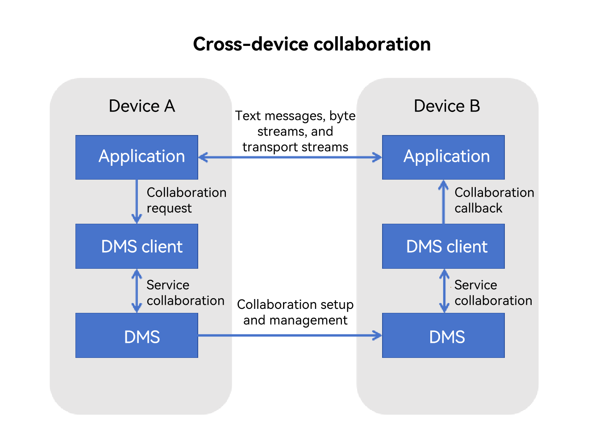

# Cross-Device Connection Management


## Introduction

Cross-device connection management allows for mutual capability assistance between devices that form a Super Device through a distributed OS, providing users with a more efficient, immersive experience compared to that of a single device. <!--Del-->For example, a camera application of the watch can start a camera function of the mobile phone to implement real-time image preview and remote photographing.<!--DelEnd-->


### Available Capabilities

- Cross-device application startup: uses the application on the local device to start the same application on another device and perform collaborative operations.
- Data interaction: implements cross-device transmission of data.<!--Del-->Such data includes text messages, byte streams, images, and transport streams (text interaction supported only for third-party applications).<!--DelEnd-->


### Typical Use Cases

The transport stream feature allows users to start the peer camera from the local camera to access capabilities such as <!--Del-->camera preview, <!--DelEnd-->text-based interaction<!--Del-->, photo reception, and remote camera shutter<!--DelEnd-->.


### Basic Concepts

Before you get started, familiarize yourself with the following concepts:

- **DMS**
  
  Distributed Management Service (DMS) is a framework that provides distributed component management capabilities.
<!--Del-->
- **Byte stream**
  
  Byte streams are data of the [ArrayBuffer](../arkts-utils/arraybuffer-object.md) type. They can be used to store binary data, for example, image or audio data.

- **Transport stream**

  Transport streams are media streams that can be used to transmit images and video streams.
<!--DelEnd-->
### Implementation Principles

Cross-device connection management is built on a distributed component management framework. It implements JS object encapsulation on the distributed component management framework and establishes sessions between applications through this framework to perform cross-device collaboration. The data-based interaction capabilities are provided by the system.

**Figure 1** Cross-device connection mechanism




### Constraints

- You need to log in with the same HUAWEI ID on different devices.

- Cross-device collaboration is supported only for UIAbility applications with the same bundle name on different devices.
<!--Del-->
- The byte stream, image, and transport stream capabilities are supported only for system applications.
<!--DelEnd-->
- After the service collaboration is complete, the collaboration status must be ended in a timely manner. If an application does not apply for a continuous task, the collaboration lifecycle will be ended when the screen is locked or the application is switched to the background for more than 5 seconds.

- The distributed component management framework does not censor the transmitted content during the collaboration process. If privacy data is involved, it is recommended that the application employs measures such as data encryption and pop-up notification to enhance information security.


## Environment Setup

### Environment Requirements

You have logged in to devices A and B with the same HUAWEI ID and the two devices are successfully networked through Bluetooth.


### Setting Up the Environment

1. Download and install DevEco Studio on the PC. For details, see [Downloading Software](https://developer.huawei.com/consumer/en/doc/harmonyos-guides-V5/ide-software-download-V5) and [Installing DevEco Studio](https://developer.huawei.com/consumer/en/doc/harmonyos-guides-V5/ide-software-install-V5). The DevEco Studio version must be 4.1 or later.
2. Update public-SDK to API 16 or later. <!--Del-->For details, see [Switching to Full SDK](../faqs/full-sdk-switch-guide.md).<!--DelEnd-->.
3. Connect device A and device B to the PC using USB cables.
4. Enable Bluetooth on device A and device B to implement networking.


### Verifying the Environment

Run the following shell command on the PC:

```shell
hdc shell
hidumper -s 4700 -a "buscenter -l remote_device_info"
```

If the networking is successful, the number of networking devices is displayed, for example, **remote device num = 1**.


## How to Develop

Cross-device connection management allows for mutual capability assistance between devices that form a Super Device through a distributed OS.


### Available APIs

The following table describes the APIs for cross-device connection management. For details, see [abilityConnectionManager](../reference/apis-distributedservice-kit/js-apis-distributed-abilityConnectionManager.md).

**Table 1** Available APIs

| API| Description|
| -------- | -------- |
| createAbilityConnectionSession(serverId:&nbsp;string,&nbsp;context:&nbsp;Context,&nbsp;peerInfo:&nbsp;peerInfo,&nbsp;connectOpt:&nbsp;ConnectOption):&nbsp;number; | Creates a session between applications.|
| destroyAbilityConnectionSession(sessionId:&nbsp;number):&nbsp;void; | Destroys a session between applications.|
| connect(sessionId:&nbsp;number):&nbsp;Promise&lt;ConnectResult&gt;; | Connects to the ability on the source side.|
| acceptConnect(sessionId:&nbsp;number,&nbsp;token:&nbsp;string):&nbsp;Promise&lt;void&gt;; | Connects to the ability on the sink side.|
| disconnect(sessionId:&nbsp;number):&nbsp;void; | Disconnects the ability connection.|
| on(type:&nbsp;'connect'&nbsp;\| &nbsp;'disconnect'&nbsp;\| &nbsp;'receiveMessage'&nbsp;\| &nbsp;'receiveData'&nbsp;\| &nbsp;'receiveImage',&nbsp;sessionId:&nbsp;number,&nbsp;callback:&nbsp;Callback&lt;EventCallbackInfo&gt;):&nbsp;void | Enable listening for <!--Del-->the **connect**, **disconnect**, **receiveMessage**, **receiveData**, and **receiveImage **<!--DelEnd-->events.|
| off(type:&nbsp;'connect'&nbsp;\| &nbsp;'disconnect'&nbsp;\| &nbsp;'receiveMessage'&nbsp;\| &nbsp;'receiveData'&nbsp;\| &nbsp;'receiveImage',&nbsp;'connect',&nbsp;sessionId:&nbsp;number,&nbsp;callback?:&nbsp;Callback&lt;EventCallbackInfo&gt;):&nbsp;void | Cancels listening for <!--Del-->the **connect**, **disconnect**, **receiveMessage**, **receiveData**, and **receiveImage **<!--DelEnd-->events.|
| sendMessage(sessionId:&nbsp;number,&nbsp;msg:&nbsp;string):&nbsp;Promise&lt;void&gt;; | Sends a text message.|
|<!--DelRow--> sendData(sessionId:&nbsp;number,&nbsp;data:&nbsp;ArrayBuffer):&nbsp;Promise&lt;void&gt;; | Sends byte streams (supported only for system applications).|
|<!--DelRow--> sendImage(sessionId:&nbsp;number,&nbsp;image:&nbsp;image.PixelMap):&nbsp;Promise&lt;void&gt;; | Sends an image (supported only for system applications).|
|<!--DelRow--> createStream(sessionId:&nbsp;number,&nbsp;param:&nbsp;StreamParam):&nbsp;Promise&lt;number&gt;; | Creates transport streams (supported only for system applications).|
|<!--DelRow--> destroyStream(sessionId:&nbsp;number):&nbsp;void; | Destroys transport streams (supported only for system applications).|


### Development Procedure

The application on device A starts and connects to the application on device B through the cross-device application management module. After the connection is successful, the applications on device A and device B register a callback listener for corresponding events through the **on** interface. The application on device A or device B calls **sendMessage**<!--Del-->, **sendData**, **sendImage**, or **createStream**<!--DelEnd--> to send text messages<!--Del-->, byte streams, or transport streams<!--DelEnd-->. The peer end performs subsequent service coordination based on the received callback.

#### Importing the AbilityConnectionManager Module File

   ```ts
   import { abilityConnectionManager } from '@kit.DistributedServiceKit';
   ```


#### Discovering a Device

The application on device A needs to discover device B and use its **netWorkId** as the input parameter of the collaboration API. You can call APIs of the distributed device management module to discover and select the peer device. For details, see [Distributed Device Management Development](devicemanager-guidelines.md).


#### Create a session between applications and set up a connection between them.

During the session and connection establishment, the applications on device A and device B perform different operations. In the subsequent development procedure, the application on device A serves as the connection initiator, while the application on device B serves as the connection receiver.

##### Device A

The application calls **createAbilityConnectionSession()** to create a session and obtain the session ID. Then, it calls **connect()** to start the ability session connection. Now, the application on device B is started.

  ```ts
  import { abilityConnectionManager, distributedDeviceManager } from '@kit.DistributedServiceKit';
  import { common } from '@kit.AbilityKit';
  import { hilog } from '@kit.PerformanceAnalysisKit';

  let dmClass: distributedDeviceManager.DeviceManager;

  function initDmClass(): void {
    try {
      dmClass = distributedDeviceManager.createDeviceManager('com.example.remotephotodemo');
    } catch (err) {
      hilog.error(0x0000, 'testTag', 'createDeviceManager err: ' + JSON.stringify(err));
    }
  }
  // Obtain the ID of device B.
  function getRemoteDeviceId(): string | undefined {
    initDmClass();
    if (typeof dmClass === 'object' && dmClass !== null) {
      hilog.info(0x0000, 'testTag', 'getRemoteDeviceId begin');
      let list = dmClass.getAvailableDeviceListSync();
      if (typeof (list) === 'undefined' || typeof (list.length) === 'undefined') {
        hilog.info(0x0000, 'testTag', 'getRemoteDeviceId err: list is null');
        return;
      }
      if (list.length === 0) {
        hilog.info(0x0000, 'testTag', 'getRemoteDeviceId err: list is empty');
        return;
      }
      return list[0].networkId;
    } else {
      hilog.info(0x0000, 'testTag', 'getRemoteDeviceId err: dmClass is null');
      return;
    }
  }
  // Define the collaboration information of device B.
  const peerInfo: abilityConnectionManager.PeerInfo = {
    deviceId: getRemoteDeviceId(),
    bundleName: 'com.example.remotephotodemo',
    moduleName: 'entry',
    abilityName: 'EntryAbility',
    serverId: 'collabTest'
  };
  const myRecord: Record<string, string> = {
    "newKey1": "value1",
  };

  const options: Record<string, string> = {
    'ohos.collabrate.key.start.option': 'ohos.collabrate.value.foreground',
  };
  // Define connection options.
  const connectOption: abilityConnectionManager.ConnectOption = {
    needSendBigData: true,
    needSendStream: false,
    needReceiveStream: true,
    options: options,
    parameters: myRecord
  };
  let context = getContext(this) as common.UIAbilityContext;
  try {
    this.sessionId = abilityConnectionManager.createAbilityConnectionSession("collabTest", context, peerInfo, connectOption);
    hilog.info(0x0000, 'testTag', 'createSession sessionId is', this.sessionId);

    abilityConnectionManager.connect(this.sessionId).then((ConnectResult) => {
      if (!ConnectResult.isConnected) {
        hilog.info(0x0000, 'testTag', 'connect failed');
        return;
      }
    }).catch(() => {
      hilog.error(0x0000, 'testTag', "connect failed");
    })

  } catch (error) {
    hilog.error(0x0000, 'testTag', error);
  }
  ```

##### Device B

After the application on device A calls **connect()**, the application on device B is started in collaboration mode, and the collaboration lifecycle function **onCollaborate()** is triggered. You can configure the **createAbilityConnectionSession()** and **acceptConnect()** calls in this API.

  ```ts
  import { AbilityConstant, UIAbility, Want } from '@kit.AbilityKit';
  import { abilityConnectionManager } from '@kit.DistributedServiceKit';
  import { hilog } from '@kit.PerformanceAnalysisKit';

  export default class EntryAbility extends UIAbility {
    onCreate(want: Want, launchParam: AbilityConstant.LaunchParam): void {
      hilog.info(0x0000, 'testTag', '%{public}s', 'Ability onCreate');
    }

    onCollaborate(wantParam: Record<string, Object>): AbilityConstant.OnCollaborateResult {
      hilog.info(0x0000, 'testTag', '%{public}s', 'on collaborate');
      let param = wantParam["ohos.extra.param.key.supportCollaborateIndex"] as Record<string, Object>
      this.onCollab(param);
      return 0;
    }

    onCollab(collabParam: Record<string, Object>) {
      const sessionId = this.createSessionFromWant(collabParam);
      if (sessionId == -1) {
        hilog.info(0x0000, 'testTag', 'Invalid session ID.');
        return;
      }
      const collabToken = collabParam["ohos.dms.collabToken"] as string;
      abilityConnectionManager.acceptConnect(sessionId, collabToken).then(() => {
        hilog.info(0x0000, 'testTag', 'acceptConnect success');
      }).catch(() => {
        hilog.error("failed");
      })
    }

    createSessionFromWant(collabParam: Record<string, Object>): number {
      let sessionId = -1;
      const peerInfo = collabParam["PeerInfo"] as abilityConnectionManager.PeerInfo;
      if (peerInfo == undefined) {
        return sessionId;
      }
 
      const options = collabParam["ConnectOption"] as abilityConnectionManager.ConnectOption;
      options.needSendBigData = true;
      options.needSendStream = true;
      options.needReceiveStream = false;
      try {
        sessionId = abilityConnectionManager.createAbilityConnectionSession("collabTest", this.context, peerInfo, options);
        AppStorage.setOrCreate('sessionId', sessionId);
        hilog.info(0x0000, 'testTag', 'createSession sessionId is' + sessionId);
      } catch (error) {
        hilog.error(0x0000, 'testTag', error);
      }
      return sessionId;
    }
  }
  ```

#### Enabling Event Listening

After the application creates a session and obtains the session ID, you can call **on()** to listen for the corresponding events and notify the listener through a callback.
<!--RP1-->
  ```ts
  import { abilityConnectionManager } from '@kit.DistributedServiceKit';
  import { hilog } from '@kit.PerformanceAnalysisKit';

  abilityConnectionManager.on("connect", this.sessionId,(callbackInfo) => {
    hilog.info(0x0000, 'testTag', 'session connect, sessionId is', callbackInfo.sessionId);
  });
  abilityConnectionManager.on("disconnect", this.sessionId,(callbackInfo) => {
    hilog.info(0x0000, 'testTag', 'session disconnect, sessionId is', callbackInfo.sessionId);
  });
  abilityConnectionManager.on("receiveMessage", this.sessionId,(callbackInfo) => {
    hilog.info(0x0000, 'testTag', 'session receiveMessage, sessionId is', callbackInfo.sessionId);
  });
  abilityConnectionManager.on("receiveData", this.sessionId,(callbackInfo) => {
    hilog.info(0x0000, 'testTag', 'session receiveData, sessionId is', callbackInfo.sessionId);
  });
  abilityConnectionManager.on("receiveImage", this.sessionId,(callbackInfo) => {
    hilog.info(0x0000, 'testTag', 'session receiveImage, sessionId is', callbackInfo.sessionId);
  });
<!--RP1End-->  ```

#### Sending Data

##### Sending Messages
After the applications are successfully connected, you can call **sendMessage()** on device A or device B to send text messages to the peer application.

  ```ts
  import { abilityConnectionManager } from '@kit.DistributedServiceKit';
  import { hilog } from '@kit.PerformanceAnalysisKit';

  abilityConnectionManager.sendMessage(this.sessionId, "message send success").then(() => {
    hilog.info(0x0000, 'testTag', "sendMessage success");
  }).catch(() => {
    hilog.error(0x0000, 'testTag', "connect failed");
  })
  ```
<!--Del-->
##### Sending Byte Streams

After the applications are successfully connected, you can call **sendData()** on device A or device B to send byte streams to the peer application. (This function is supported only for system applications.)

  ```ts
  import { abilityConnectionManager } from '@kit.DistributedServiceKit';
  import { hilog } from '@kit.PerformanceAnalysisKit';

  let textEncoder = util.TextEncoder.create("utf-8");
  const arrayBuffer  = textEncoder.encodeInto("data send success");

  abilityConnectionManager.sendData(this.sessionId, arrayBuffer.buffer).then(() => {
    hilog.info(0x0000, 'testTag', "sendMessage success");
  }).catch(() => {
    hilog.info(0x0000, 'testTag', "sendMessage failed");
  })
  ```

##### Sending Images

After the applications are successfully connected, you can call **sendImage()** on device A or device B to send images to the peer application. (This function is supported only for system applications.)

  ```ts
  import { abilityConnectionManager } from '@kit.DistributedServiceKit';
  import { hilog } from '@kit.PerformanceAnalysisKit';
  import CameraService from '../model/CameraService';
  import { photoAccessHelper } from '@kit.MediaLibraryKit';
  import { image } from '@kit.ImageKit';
  import { fileIo as fs } from '@kit.CoreFileKit';

  try {
    let photoSelectOptions = new photoAccessHelper.PhotoSelectOptions();
    photoSelectOptions.MIMEType = photoAccessHelper.PhotoViewMIMETypes.IMAGE_TYPE;
    photoSelectOptions.maxSelectNumber = 5;
    let photoPicker = new photoAccessHelper.PhotoViewPicker();
    photoPicker.select(photoSelectOptions).then((photoSelectResult) => {
      if (!photoSelectResult) {
        hilog.error(0x0000, 'testTag', 'photoSelectResult = null');
      return;
      }

      let file = fs.openSync(photoSelectResult.photoUris[0], fs.OpenMode.READ_ONLY);
      hilog.info(0x0000, 'testTag', 'file.fd:' + file.fd);

      let imageSourceApi: image.ImageSource = image.createImageSource(file.fd);
      if (imageSourceApi) {
        imageSourceApi.createPixelMap().then((pixelMap) => {
          abilityConnectionManager.sendImage(this.sessionId, pixelMap)
        });
      } else {
        hilog.info(0x0000, 'testTag', 'imageSourceApi is undefined');
      }
    })
  } catch (error) {
    hilog.error(0x0000, 'testTag', 'photoPicker failed with error: ' + JSON.stringify(error));
  }
  ```

##### Sending Transport Streams

After the applications are successfully connected, you can call **createStream()** on device A or device B to create transport streams and call **startStream()** to send the transport streams to the peer application. (This function is supported only for system applications.)

  ```ts
  import { abilityConnectionManager } from '@kit.DistributedServiceKit';
  import { hilog } from '@kit.PerformanceAnalysisKit';

  hilog.info(0x0000, 'testTag', 'startStream');
  abilityConnectionManager.createStream(sessionId ,{name: 'receive', role: 0}).then(async (streamId) => {
    let surfaceParam: abilityConnectionManager.SurfaceParam = {
      width: 640,
      height: 480,
      format: 1
    }
    let surfaceId = abilityConnectionManager.getSurfaceId(streamId, surfaceParam);
    hilog.info(0x0000, 'testTag', 'surfaceId is'+surfaceId);
    AppStorage.setOrCreate<string>('surfaceId', surfaceId);
    await CameraService.initCamera(surfaceId, 0);
    abilityConnectionManager.startStream(streamId);
  })
  ```
<!--DelEnd-->
#### Ending Collaboration

After the service collaboration is complete, the collaboration status must be ended in a timely manner. If service collaboration is required in a near future, you can call **disconnect()** to disconnect the connection between applications while retaining the session ID. This allows you to reuse the same session ID for establishing a connection next time. If service coordination is not required, you can directly call **destroyAbilityConnectionSession()** to destroy the session. In this case, the connection is automatically disconnected.

  ```ts
  import { abilityConnectionManager } from '@kit.DistributedServiceKit';
  import { hilog } from '@kit.PerformanceAnalysisKit';

  hilog.info(0x0000, 'testTag', 'disconnectRemoteAbility begin');
  if (this.sessionId == -1) {
    hilog.info(0x0000, 'testTag', 'Invalid session ID.');
  return;
  }
  abilityConnectionManager.disconnect(this.sessionId);

  hilog.info(0x0000, 'testTag', 'destroyAbilityConnectionSession called');
  abilityConnectionManager.destroyAbilityConnectionSession(this.sessionId);
  ```


### Debugging and Verification

After application development is complete, you can install the application on device A and device B. The test procedure is as follows:

1. Tap the **Connect** button of the application on device A. The application on device B is started.
2. Tap the **sendMessage** button of the application on device A. The application on device B triggers the callback of the **on()** API to receive the text strings.
<!--Del-->
3. Tap the **sendData** button of the application on device A. The application on device B triggers the callback of the **on()** API to receive the byte streams.
4. Tap the **sendImage** button of the application on device A. The application on device B triggers the callback of the **on()** API to receive the images.
5. Tap the **createStream** button of the application on device A. The application on device B triggers the callback of the **on()** API to receive the transport streams.
<!--DelEnd-->
6. Tap the **Disconnect** button of the application on device A or device B. The connection between the two devices is disconnected. The callback of the **connect()** API is triggered to report a disconnection event to the applications on both devices.

## FAQs

### What should I do if the application on device A fails to start the application on device B?

**Possible Cause**

- Devices are not networked with each other. When device A initiates a connection request, the **peerInfo.deviceId** attribute in the **createAbilityConnectionSession()** API is not correctly set.

- Multiple devices are connected to each other. When device A initiates a connection request, the **peerInfo.deviceId** attribute in the **createAbilityConnectionSession()** API is set to **deviceId** of another device, but not device B.

**Solution**

- For cause 1, enable the USB debugging function on device A and device B, and use a USB cable to connect the devices to the PC. Run the following shell command on the PC:
   
  ```shell
  hdc shell
  hidumper -s 4700 -a "buscenter -l remote_device_info"
  ```
  If **remote device num = 0** is displayed in the command output, the networking has failed. Ensure that you log in to devices using the same HUAWEI ID and connect them through Bluetooth. If the networking is successful, the number of networking devices is displayed, for example, **remote device num = 1**.

- For cause 2, add the desired to the device list to ensure that it is selected during device query and selection.

### What should I do if the ongoing service collaboration is interrupted after the application screen is locked or the application is running in the background for a period of time?

**Possible Cause**

During service collaboration, DMS keeps listening for the collaboration lifecycle. If the application screen is locked or the application is running in the background for 5 seconds, the collaboration will be ended if the application does not apply for a continuous task.

**Solution**

[Apply for a continuous task](../task-management/continuous-task.md).
