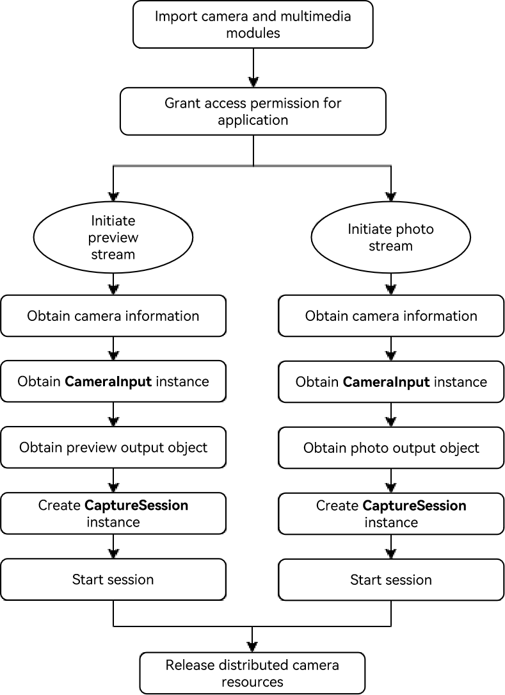

# Distributed Camera Development


## Overview

  OpenHarmony distributed camera implements collaboration across devices by breaking hardware boundaries. For example, after devices A and B running OpenHarmony are networked, the application on device A can call the camera resources of device B in real time to obtain images (preview stream, photo stream, or video stream) from device B. In addition, in-depth controls such as resolution adjustment and settings synchronization are supported on device A. Distributed camera achieves the following breakthroughs:
  - Collaborative creation with multiple users
  - Remote collaboration with experts
  - Immersive security system
  - Distributed audio and video interaction


### Basic Concepts

  Before started, you are advised to read the following topics to have a basic understanding of related functions:
  - [UIAbility Connection Development](abilityconnectmanager-guidelines.md)
  - [Camera Device Management (ArkTS)](../media/camera/camera-device-management.md)
  - [Camera Development Preparations](../media/camera/camera-preparation.md)
  - [Camera Session Management (ArkTS)](../media/camera/camera-session-management.md)
  - [Photo Capture (ArkTS)](../media/camera/camera-shooting.md)
  - [Video Recording (ArkTS)](../media/camera/camera-recording.md)


## Preparing the Environment

### Environment Requirements

  Successful networking between device A and device B.


### Environment Setup

  1. Install [DevEco Studio](https://developer.huawei.com/consumer/cn/download/deveco-studio) 5.0 or later.
  2. Update the public-SDK to API version 16 or later. For details, see [OpenHarmony SDK Upgrade Assistant](../tools/openharmony_sdk_upgrade_assistant.md).
  3. Connect device A and device B to the PC using USB cables.
  4. Connect device A and device B to the same Wi-Fi, identify each other, and start networking. For details, see [UIAbility Connection Development](abilityconnectmanager-guidelines.md#initiating-a-session-between-applications).


### Environment Verification

  Run the following shell command on the PC:

  ```shell
  hdc shell
  hidumper -s 4700 -a "buscenter -l remote_device_info"
  ```

  If the networking is successful, the number of networking devices is displayed, for example, **remote device num = 1**.


## How to Develop

  OpenHarmony pools cameras on multiple devices to provide users with the capability of using cameras across devices.

### Development Process

  The figure below shows the recommended development process.

  


### Development Procedure

#### Importing the Camera and Multimedia Modules

   ```ts
  import { camera } from '@kit.CameraKit';
  import { media } from '@kit.MediaKit';
   ```

#### Granting the Access Permission to the Application

  The application should apply for required permissions, which include but are not limited to the following:
  - For accessing the location of an image or a video: ohos.permission.MEDIA_LOCATION
  - For reading files: ohos.permission.READ_MEDIA
  - For writing files: ohos.permission.WRITE_MEDIA
  - For using camera: ohos.permission.CAMERA
  - For multi-device collaboration: ohos.permission.DISTRIBUTED_DATASYNC

  For example, you can call **requestPermissionsFromUser()** to request the corresponding permissions for the UIAbility.
  ```ts
  //EntryAbility.ets
  export default class EntryAbility extends UIAbility {
    onCreate(want, launchParam) {
      Logger.info('Sample_VideoRecorder', 'Ability onCreate,requestPermissionsFromUser');
      let permissionNames: Array<Permissions> = ['ohos.permission.MEDIA_LOCATION', 'ohos.permission.READ_MEDIA',
        'ohos.permission.WRITE_MEDIA', 'ohos.permission.CAMERA', 'ohos.permission.MICROPHONE', 'ohos.permission.DISTRIBUTED_DATASYNC'];
      abilityAccessCtrl.createAtManager().requestPermissionsFromUser(this.context, permissionNames).then((data)=> {
        console.log("testTag", data);
      })
        .catch((err : BusinessError) => {
          console.log("testTag", err.message);
        });
    }
  ```


#### Initiating the Preview Stream and Photo Stream on the Distributed Camera

#####  1. Obtaining the Camera Information of a Remote Device

  After the application networking is successful, you can use **getCameraManager()** to obtain the camera manager instance and **getSupportedCameras()** to obtain the supported camera device object.

  ```ts
  private cameras?: Array<camera.CameraDevice>;
  private cameraManager?: camera.CameraManager;
  private cameraOutputCapability?: camera.CameraOutputCapability;
  private cameraIndex: number = 0;
  private curVideoProfiles?: Array<camera.VideoProfile>;

  function initCamera(): void {
    console.info('init remote camera called');
    if (this.cameraManager) {
      console.info('cameraManager already exits');
      return;
    }
    console.info('[camera] case to get cameraManager');
    this.cameraManager = camera.getCameraManager(globalThis.abilityContext);
    if (this.cameraManager) {
      console.info('[camera] case getCameraManager success');
    } else {
      console.info('[camera] case getCameraManager failed');
      return;
    }
    this.cameras = this.cameraManager.getSupportedCameras();
    if (this.cameras) {
      console.info('[camera] case getCameras success, size ', this.cameras.length);
      for (let i = 0; i < this.cameras.length; i++) {
        let came: camera.CameraDevice = this.cameras[i];
        console.info('[came] camera json:', JSON.stringify(came));
        if (came.connectionType == camera.ConnectionType.CAMERA_CONNECTION_REMOTE) {
          this.cameraIndex = i;
          this.cameraOutputCapability = this.cameraManager.getSupportedOutputCapability(came);
          this.curVideoProfiles = this.cameraOutputCapability.videoProfiles;
          console.info('init remote camera done'); // The remote camera is successfully initialized.
          break;
        }
      }
    } else {
      console.info('[camera] case getCameras failed');
    }
  }
  ```

#####  2. Creating a CameraInput Instance

  After obtaining the **CameraManager** instance and the supported camera device object, call **createCameraInput()** to create a **CameraInput** instance.

  ```ts
  // create camera input
  async createCameraInput(): Promise<void> {
    console.log('createCameraInput called');
    if (this.cameras && this.cameras.length > 0) {
      let came: camera.CameraDevice = this.cameras[this.cameraIndex];
      console.log('[came]createCameraInput camera json:', JSON.stringify(came));
      this.cameraInput = this.cameraManager?.createCameraInput(came);
      if (this.cameraInput) {
        console.log('[camera] case createCameraInput success');
        await this.cameraInput.open().then(() => {
          console.log('[camera] case cameraInput.open() success');
        }).catch((err: Error) => {
          console.log('[camera] cameraInput.open then.error:', json.stringify(err));
        });
      } else {
        console.log('[camera] case createCameraInput failed');
        return;
      }
    }
  }
  ```

#####  3. Obtaining the PreviewOutput Object

  Use **createPreviewOutput()** to create a **PreviewOutput** object.

  ```ts
  private previewOutput?: camera.PreviewOutput;
  private avConfig: media.AVRecorderConfig = {
    videoSourceType: media.VideoSourceType.VIDEO_SOURCE_TYPE_SURFACE_YUV,
    profile: this.avProfile,
    url: 'fd://',
  }

  // create camera preview
  async createPreviewOutput(): Promise<void> {
    console.log('createPreviewOutput called');
    if (this.cameraOutputCapability && this.cameraManager) {
      this.previewProfiles = this.cameraOutputCapability.previewProfiles;
      console.log('[camera] this.previewProfiles json ', json.stringify(this.previewProfiles));
      if (this.previewProfiles[0].format === camera.CameraFormat.CAMERA_FORMAT_YUV_420_SP) {
        console.log('[camera] case format is VIDEO_SOURCE_TYPE_SURFACE_YUV');
        this.avConfig.videoSourceType = media.VideoSourceType.VIDEO_SOURCE_TYPE_SURFACE_YUV;
      } else {
        console.log('[camera] case format is VIDEO_SOURCE_TYPE_SURFACE_ES');
        this.avConfig.videoSourceType = media.VideoSourceType.VIDEO_SOURCE_TYPE_SURFACE_ES;
      }
      this.previewOutput = this.cameraManager.createPreviewOutput(this.previewProfiles[0], this.surfaceId);
      if (!this.previewOutput) {
        console.log('create previewOutput failed!');
      }
      console.log('createPreviewOutput done');
    }
  }
  ```


#####  4. Obtaining the PhotoOutput Object

  Use **createPhotoOutput()** to create a **PhotoOutput** object and **createImageReceiver()** to create an **ImageReceiver** instance.

  ```ts
  import fileio from '@ohos.fileio';

  private photoReceiver?: image.ImageReceiver;
  private photoOutput?: camera.PhotoOutput;
  private mSaveCameraAsset: SaveCameraAsset = new SaveCameraAsset('Sample_VideoRecorder');

  async getImageFileFd(): Promise<void> {
    console.info'getImageFileFd called');
    this.mFileAssetId = await this.mSaveCameraAsset.createImageFd();
    this.fdPath = 'fd://' + this.mFileAssetId.toString();
    this.avConfig.url = this.fdPath;
    console.info('ImageFileFd is: ' + this.fdPath);
    console.info('getImageFileFd done');
  }

  // close file fd
  async closeFd(): Promise<void> {
    console.info('case closeFd called');
    if (this.mSaveCameraAsset) {
      await this.mSaveCameraAsset.closeVideoFile();
      this.mFileAssetId = undefined;
      this.fdPath = undefined;
      console.info('case closeFd done');
    }
  }

  async createPhotoOutput() {
    const photoProfile: camera.Profile = {
      format: camera.CameraFormat.CAMERA_FORMAT_JPEG,
      size: {
        "width": 1280,
        "height": 720
      }
    }
    if (!this.cameraManager) {
      console.log('createPhotoOutput cameraManager is null')
    }
    if (!this.photoReceiver) {
      this.photoReceiver = image.createImageReceiver(photoProfile.size.width, photoProfile.size.height, photoProfile.format, 8)
      this.photoReceiver.on("imageArrival",()=>{
        this.photoReceiver?.readNextImage((err,image)=>{
          if (err || image === undefined) {
            console.log('photoReceiver imageArrival on error')
            return
          }
          image.getComponent(4, async (err, img) => {
            if (err || img === undefined) {
              console.log('image getComponent on error')
              return
            }
            await this.getImageFileFd()
            fileio.write(this.mFileAssetId, img.byteBuffer)
            await this.closeFd()
            await image.release()
            console.log('photoReceiver image.getComponent save success')
          })
        })
      })
        await this.photoReceiver.getReceivingSurfaceId().then((surfaceId: string) => {
          this.photoOutput = this.cameraManager?.createPhotoOutput(photoProfile, surfaceId)
          if (!this.photoOutput) {
            console.log('cameraManager.createPhotoOutput on error')
          }
          console.log('cameraManager.createPhotoOutput success')
          this.photoOutput?.on("captureStart", (err, captureId) => {
            console.log('photoOutput.on captureStart')
          })
        }).catch((err: Error) => {
          console.error('photoReceiver.getReceivingSurfaceId on error:' + err)
        })
      }
    }
  ```

#####  5. Creating a CaptureSession Instance

  Use **createCaptureSession()** to create a **CaptureSession** instance. You can call **beginConfig()** to configure a session, call **addInput()** and **addOutput()** to add **CameraInput()** and **CameraOutput()** to the session, call **commitConfig()** to submit the configuration information, and use a promise to return the result.

  ```ts
  private captureSession?: camera.CaptureSession;

  function failureCallback(error: BusinessError): Promise<void> {
    console.log('case failureCallback called,errMessage is ', json.stringify(error));
  }

  function catchCallback(error: BusinessError): Promise<void> {
    console.log('case catchCallback called,errMessage is ', json.stringify(error));
  }

  // create camera capture session
  async createCaptureSession(): Promise<void> {
    console.log('createCaptureSession called');
    if (this.cameraManager) {
      this.captureSession = this.cameraManager.createCaptureSession();
      if (!this.captureSession) {
        console.log('createCaptureSession failed!');
        return
      }
      try {
        this.captureSession.beginConfig();
        this.captureSession.addInput(this.cameraInput);
      } catch (e) {
        console.log('case addInput error:' + json.stringify(e));
      }
      try {
        this.captureSession.addOutput(this.previewOutput);
      } catch (e) {
        console.log('case addOutput error:' + json.stringify(e));
      }
      await this.captureSession.commitConfig().then(() => {
        console.log('captureSession commitConfig success');
      }, this.failureCallback).catch(this.catchCallback);
    }
  }
  ```

##### 6. Starting the Session

  Use **start()** of the **CaptureSession** instance to start the session and use a promise to return the result.

  ```ts
  // start captureSession
  async startCaptureSession(): Promise<void> {
    console.log('startCaptureSession called');
    if (!this.captureSession) {
      console.log('CaptureSession does not exists!');
      return
    }
    await this.captureSession.start().then(() => {
      console.log('case start captureSession success');
    }, this.failureCallback).catch(this.catchCallback);
  }
  ```

#### Releasing Distributed Camera Resources

  After the service collaboration is complete, the collaboration status needs to be ended in a timely manner to release distributed camera resources.

  ```ts
  // Release the camera.
  async releaseCameraInput(): Promise<void> {
    console.log('releaseCameraInput called');
    if (this.cameraInput) {
      this.cameraInput = undefined;
    }
    console.log('releaseCameraInput done');
  }

  // Release the preview.
  async releasePreviewOutput(): Promise<void> {
    console.log('releasePreviewOutput called');
    if (this.previewOutput) {
      await this.previewOutput.release().then(() => {
        console.log('[camera] case main previewOutput release called');
      }, this.failureCallback).catch(this.catchCallback);
      this.previewOutput = undefined;
    }
    console.log('releasePreviewOutput done');
  }

  // Release the video output.
  async releaseVideoOutput(): Promise<void> {
    console.log('releaseVideoOutput called');
    if (this.videoOutput) {
      await this.videoOutput.release().then(() => {
        console.log('[camera] case main videoOutput release called');
      }, this.failureCallback).catch(this.catchCallback);
      this.videoOutput = undefined;
    }
    console.log('releaseVideoOutput done');
  }

  // Stop the capture session.
  async stopCaptureSession(): Promise<void> {
    console.log('stopCaptureSession called');
    if (this.captureSession) {
      await this.captureSession.stop().then(() => {
        console.log('[camera] case main captureSession stop success');
      }, this.failureCallback).catch(this.catchCallback);
    }
    console.log('stopCaptureSession done');
  }

  // Release the capture session.
  async releaseCaptureSession(): Promise<void> {
    console.log('releaseCaptureSession called');
    if (this.captureSession) {
      await this.captureSession.release().then(() => {
        console.log('[camera] case main captureSession release success');
      }, this.failureCallback).catch(this.catchCallback);
      this.captureSession = undefined;
    }
    console.log('releaseCaptureSession done');
  }

  // Release the camera resource.
  async releaseCamera(): Promise<void> {
    console.log('releaseCamera called');
    await this.stopCaptureSession();
    await this.releaseCameraInput();
    await this.releasePreviewOutput();
    await this.releaseVideoOutput();
    await this.releaseCaptureSession();
    console.log('releaseCamera done');
  }
  ```

### Debugging and Verification

  After application development is complete, you can install the application on device A and device B. The test procedure is as follows:

  1. Device A starts the distributed camera on device B and initiates a preview. Device A can receive the preview stream.
  2. Device A starts the distributed camera on device B and takes a photo. Device A can receive the photo.

## FAQs


### What should I do if the application on device A cannot start the camera on device B?

**Possible Causes**

  Devices are not networked or are disconnected after networking.

**Solution**

  Enable USB debugging on device A and device B, and use a USB cable to connect the devices to the PC. Run the following shell command on the PC:
   
  ```shell
  hdc shell
  hidumper -s 4700 -a "buscenter -l remote_device_info"
  ```
  If **remote device num = 0** is displayed in the command output, the networking fails. In this case, disable and then enable Wi-Fi, and connect devices to the same Wi-Fi again. If the networking is successful, run the shell command again and the number of networking devices is displayed, for example, **remote device num = 1**.

<!--no_check-->