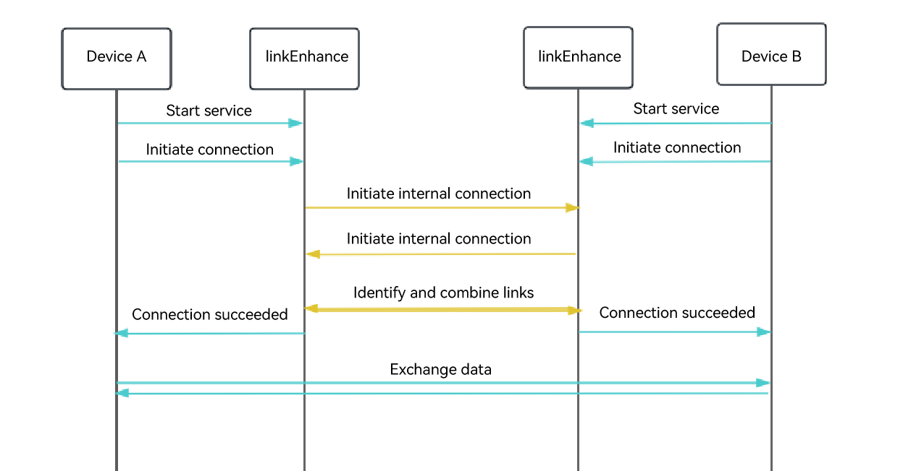

# Enhanced Connection Development

## Introduction

With the advancement of technology, a myriad of new applications emerge, and the interconnection of devices has become the norm. Consequently, reliance on network connectivity has become inevitable. However, in certain scenarios such as aviation and ocean navigation, network access is constrained, making Bluetooth one of the few viable connection methods. Nevertheless, traditional Bluetooth connections suffer from drawbacks like limited connection capacity, low connection success rates, and unstable connectivity, all of which undermine user experience.

OpenHarmony offers the enhanced connection functionality to enable cross-device connectivity, allowing devices to set up connections with each other and exchange application service data. Compared with traditional Bluetooth connections, this functionality employs a multi-channel merging algorithm to increase the number of connectable devices and boost connection stability, significantly improving user experience.

### Implementation Principles

During device interconnection, the local device identifies the peer's Bluetooth address and establishes a physical link. In cross-device scenarios, a unique multi-channel merging algorithm is applied to reduce the number of physical links while ensuring device interaction. This effectively increases the number of available connections between devices, reduces interference, and enhances communication stability.

The implementation process is as follows: 1. Enable the enhanced connection functionality on both the local and peer devices. 2. Make the local and the peer devices simultaneously initiate a connection request. 3. Identify and combine redundant physical links to reduce Bluetooth link resource consumption, increasing the number of available connections.



### Constraints

- Bluetooth must be enabled for device interconnection.

- The BLE MAC address of the peer device has been obtained through the Bluetooth advertising or scan API. For details about the APIs, see [BLE Development](../connectivity/bluetooth/ble-development-guide.md)

- Cross-device collaboration is supported only for applications with the same bundle name on different devices.

- The caller must have the **ohos.permission.DISTRIBUTED_DATASYNC** permission.

## Environment Setup

### Environment Requirements

Bluetooth is enabled on the client and server devices.

### Environment Setup

1. Install DevEco Studio 4.1 or later on the PC.
2. Update the public-SDK to API version 20 or later.
3. Connect device A and device B to the PC using USB cables.
4. Enable Bluetooth on device A and device B.

## Available APIs

The following table describes the commonly used APIs. For details, see [@ohos.distributedsched.linkEnhance](../reference/apis-distributedservice-kit/js-apis-link-enhance.md).

| API                                     | Description                                                                                              |
| ------------------------------------------ | ------------------------------------------------------------------------------------------------------ |
| connect()                                  | Initiates a connection to the peer device on the client.                                                                              |
| disconnect()                               | Disconnects from the peer device.                                                                         |
| close()                                    | Destroys a **Connection** object and unregisters all event callbacks. The **Connection** object cannot be used after this API is called.                                |
| getPeerDeviceId()                          | Obtains the device ID of the peer device.                                                                          |
| sendData(data:ArrayBuffer)                 | Sends data to the peer device.                                                                                    |
| on(type: 'connectResult')                  | Subscribes to connection events.                                                                             |
| on(type: 'disconnected')                   | Subscribes to disconnection events.                                                                                 |
| on(type: 'dataReceived')                   | Subscribes to data receiving events.                                                                                   |
| createConnection(deviceId: string,name:string)| Creates a **Connection** object.                                                                             |
| start()                                    | Starts the server.                                                                                        |   
| stop()                                     | Stops the server.                                                                                          |
| close()                                    | Destroys a **Server** object and cancels all subscribed event callbacks. The **Server** object cannot be used after this API is called.                   |
| on(type: 'acceptConnected')                | Subscribes to **acceptConnected** events.                                                                          |
| on(type: 'serverStopped')                  | Subscribes to **serverStopped** events.                                                                          |
| createServer(name: string)                 | Creates a **Server** object.                                                                                     |

## How to Develop

- After Bluetooth is enabled on the server, create a **Server** object and call **start()** to start the server so that it is in the connectable state. Then, listen for status change events through the registered event listener.
- After Bluetooth is enabled on the client, create a **Connection** object and call **connect()** to initiate a connection. Then, listen for status change events through the registered event listener.
- After the connection is successful, call **sendData** to send data.

### Server Development
1. Import the required module.
    ```ts
    import {linkEnhance} from '@kit.DistributedServiceKit';
    import { BusinessError } from '@kit.BasicServicesKit';
    ```
2. Declare the **ohos.permission.DISTRIBUTED_DATASYNC** permission in the **module.json5** file.

   ```ts
   {
     "module" : {
       "requestPermissions":[
         {
           "name" : "ohos.permission.DISTRIBUTED_DATASYNC",
           "reason": "$string:distributed_permission",
           "usedScene": {
             "abilities": [
               "MainAbility"
             ],
             "when": "inuse"
           }
         }
       ]
     }
   }
   ```
3. Create a **Server** object, start the server, and register an event listener.
    ```ts
    const TAG = 'TEST';
    // Register the server.
    linkEnhanceStart(name: string) {
      console.info(TAG + 'start server deviceId = ' + name);
      try {
      // Construct a Server object using the specified name.
      let server: linkEnhance.Server = linkEnhance.createServer(name);

        // Subscribe to connectionAccepted events and serverStopped events.
        server.on('connectionAccepted', (connection: linkEnhance.Connection): void => {
          console.info(TAG + 'serverOnCallback');
        });
        server.on('serverStopped', (reason: number): void => {
          console.info(TAG, 'serverStopped, reason= ' + reason);
        });
        # Start the server.
        server.start();
      } catch (err) {
        console.error(TAG + 'start server errCode: ' + (err as BusinessError).code + ', errMessage: ' +
        (err as BusinessError).message);
      }
    }
    ```
5. Save the **Connection** object when the connection is established.
    ```ts
    serverAcceptOnCallback = (connection: linkEnhance.Connection): void => {
      console.info(TAG + 'serverOnCallback');
      try {

        // Subscribe to disconnection events.
        connection.on('disconnected', (number: number)=> {
          console.info(TAG + 'disconnected, reason = ' + number);
        });
        // Subscribe to data receiving events.
        connection.on('dataReceived', (data: ArrayBuffer)=> {
          console.info(TAG + 'dataReceived, dataLen=' + data.byteLength);
        });

        let len = 1;
        let arraybuffer = new ArrayBuffer(len);
        // Send data to the peer end.
        connection.sendData(arraybuffer);
      } catch (err) {
        console.error(TAG + 'server on callback errCode: ' + (err as BusinessError).code + ', errMessage: ' +
        (err as BusinessError).message);
      }
    }
    ```
6. Disconnect from the peer end and destroy the **Connection** object.
    ```ts
    // Disconnect from the peer end.
    linkEnhanceDisconnect(connection: linkEnhance.Connection) {
      console.info(TAG + 'disconnect deviceId = ' + connection.getPeerDeviceId());
      try {
        connection.disconnect();
        connection.close();
      } catch (err) {
        console.error(TAG + 'disconnect errCode: ' + (err as BusinessError).code + ', errMessage: ' +
        (err as BusinessError).message);
      }
    }
    ```
7. Stop the server and destroy the **Server** object.
    ```ts
    // Stop the server.
    linkEnhanceStop(server: linkEnhance.Server) {
      console.info(TAG + 'stop server');
      try {
        server.stop();
      } catch (err) {
        console.info(TAG + 'stop server errCode: ' + (err as BusinessError).code + ', errMessage: ' +
        (err as BusinessError).message);
      }
    }
    // Stop the server and cancel all subscribed event callbacks.
    linkEnhanceClose(server: linkEnhance.Server) {
      console.info(TAG + 'close serever' );
      try {
        server.close();
      } catch (err) {
        console.error(TAG + 'close server errCode: ' + (err as BusinessError).code + ', errMessage: ' +
        (err as BusinessError).message);
      }
    }
    ```

### Client Development

1. Import the required module.
    ```ts
    import linkEnhance from '@kit.DistributedServiceKit';
    import { BusinessError } from '@kit.BasicServicesKit';
    ```
2. Declare the **ohos.permission.DISTRIBUTED_DATASYNC** permission in the **module.json5** file.
   ```ts
   {
     "module" : {
       "requestPermissions":[
         {
           "name" : "ohos.permission.DISTRIBUTED_DATASYNC",
           "reason": "$string:distributed_permission",
           "usedScene": {
             "abilities": [
               "MainAbility"
             ],
             "when": "inuse"
           }
         }
       ]
     }
   }
   ```
3. Create a **Connection** object, subscribe to connection events, and connect to the server.
    ```ts
    const TAG = "testDemo";
    // Connect to the server.
    linkEnhanceConnect(peerDeviceId: string) {
      console.info(TAG + 'connection server deviceId = ' + peerDeviceId);
      try {
        // Construct a Connection object by using peerDeviceId. The object is used for subsequent interactions.
        let connection: linkEnhance.Connection = linkEnhance.createConnection(peerDeviceId, "demo");
        // Subscribe to connection events.
        connection.on('connectResult', (data: linkEnhance.ConnectResult): void => {
          console.info(TAG + 'clientConnectResultCallback result = ' + data.success);
          if (data.success) {
            // Send data to the server.
            let len = 1;
            let arraybuffer = new ArrayBuffer(len);
            connection.sendData(arraybuffer);
          }
        });
        connection.on('disconnected', (number: number)=> {
          console.info(TAG + 'disconnected reason = ' + number);
        });
        connection.on('dataReceived', (data: ArrayBuffer)=> {
        console.info(TAG + 'dataReceived, dataLen=' + data.byteLength);
        });
        // Initiate a connection.
        connection.connect();
      } catch (err) {
        console.error(TAG + 'connect errCode: ' + (err as BusinessError).code + ', errMessage: ' +
        (err as BusinessError).message);
      }
    }
    ```
4. Disconnect from the server and destroy the **Connection** object.
    ```ts
    disconnect(connection: linkEnhance.Connection) {
      console.info(TAG + 'disconnect deviceId = ' + connection.getPeerDeviceId());
      try {
        connection.disconnect();
        connection.close();
      } catch (err) {
        console.error(TAG + 'disconnect errCode: ' + (err as BusinessError).code + ', errMessage: ' +
        (err as BusinessError).message);
      }
    }
    ```
