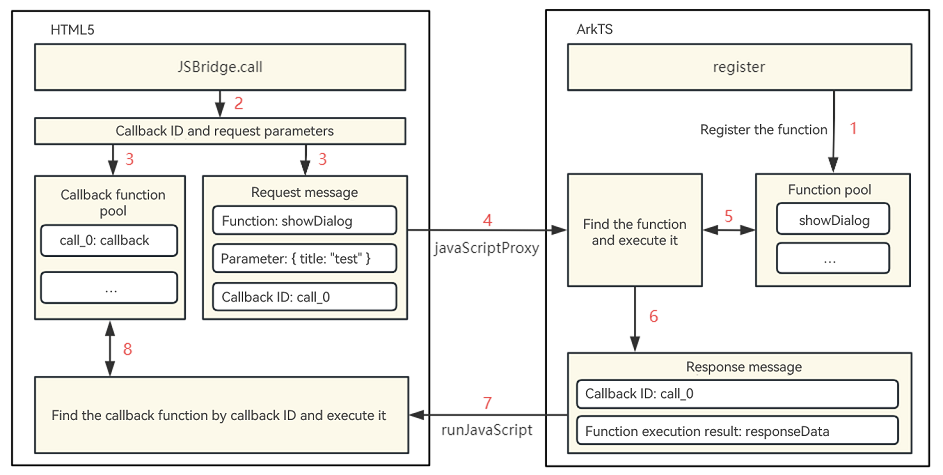

# Web Development


## How do HTML5 pages interact with ArkTS? (API version 10)

**Problem**

Currently, **javaScriptProxy** supports only synchronous invoking. This means that no execution results can be obtained for asynchronous invoking.

**Solution**

Encapsulate **javaScriptProxy** and **runJavaScript** to implement the JSBridge communication scheme. This method is applicable to the scenario where HTML5 calls native functions. Use the **Web** component **javaScriptProxy** to inject the native API to the window object of HTML5 pages, use the **runJavaScript** API to execute the JS script on HTML5 pages, and obtain the script execution result from the callback. The following figure shows the invoking process.



- Use the **javaScriptProxy** attribute of the **Web** component to register the **JSBridgeHandle** object with the HTML5 window as the native channel for HTML5 to call. When the HTML5 page starts to be loaded, the **initJSBridge()** method is called in the **onPageBegin** callback to initialize the JSBridge.
  ```
  // javaScriptProxy object
  public get javaScriptProxy() {
      return {
          object: {
              call: this.call
          },
          name: "JSBridgeHandle",
          methodList: ['call'],
          controller: this.controller,
      }
  }
  ```

  ```
  // Use the Web to load the HTML5 page.
  @Component
  struct JsProxy {
    private controller: WebviewController = new WebView.WebviewController()
    private jsBridge: JSBridge = new JSBridge(this.controller)
    build() {
      Column(){
        Web({ src: $rawfile('index.html'), controller: this.controller })
          .javaScriptProxy(this.jsBridge.javaScriptProxy)
          .onPageBegin(() => {
            this.jsBridge.initJSBridge()
          })
      }
    }
  }
  ```

- In the **initJSBridge** method, use **webviewControll.runJavaScript()** to inject the JSBridge initialization script into the HTML5 page for execution. When HTML5 is called, the **window.callID** is generated to identify the callback function, and then the callID and request parameters are transferred to the native side using **JSBridgeHandle.call**. Use **JSBridgeCallback** to receive the execution result from the native side, find the callback based on the ID and execute it, and then free the memory.
  ```
  // bridgeKey and bridgeMethod dynamically generate the entry for invoking on the HTML5 side.
  bridgeKey: string = 'JSBridge'
  bridgeMethod: string = 'call'
  // Inject the initialization script to the HTML5 side.
  public initJSBridge() {
      try {
          this.controller.runJavaScript(`
              // Receive the result from the native side and execute callback.
              function JSBridgeCallback(id, params){
                  window.JSBridgeMap[id](params)
              };
              // Declare the invoking entry.
              window.${this.bridgeKey} = {
                  ${this.bridgeMethod}(method, params, callback){
                      window.JSBridgeMap[id] = callback || (() => {});
                      JSBridgeHandle.call(method, JSON.stringify(paramsObj));
                  },
              }`)
      }
  }
  ```

- **JSBridgeHandle.call()** is the unified entry for HTML5 to call native APIs. In this method, find the matching API to call based on the name of the method called by HTML5. After the call is complete, use the **this.callback()** method to return the result to HTML5. In the callback, use **webviewControll.runJavaScript()** to call **JSBridgeCallback** of HTML5 to return the **callID** and result.
  ```
  // The call method calls the native method and receives the result.
  private call = (fun, params) => {
      try {
          const paramsObj = JSON.parse(params)
          const events = this.exposeManage.methodMap.get(fun)
          const results = []
          events.forEach(callFun => {
              results.push(callFun(paramsObj.data))
          })
          Promise.all(results.filter(i => !!i)).then(res => {
              this.callback(paramsObj.callID, res.length > 1 ? res : res[0])
          })
      }
  }
  
  // Use runJavaScript to call JSBridgeCallback to execute the callback.
  private callback(id, data) {
      this.controller.runJavaScript(`__JSBridgeCallback__("${id}", ${JSON.stringify(data)})`);
  }
  ```


## How does the return result of onUrlLoadIntercept affect onInterceptRequest in the Web component? (API version 9)

**Solution**

The operation that follows **onUrlLoadIntercept** is subject to its return result.

- If **true** is returned, the URL request is intercepted.

- If **false** is returned , the **onInterceptRequest** callback is performed.

**Reference**

[onUrlloadIntercept](../reference/apis-arkweb/ts-basic-components-web.md#onurlloadinterceptdeprecated)


## What should I do if the onKeyEvent event of the Web component is not triggered as expected? (API version 9)

**Problem**

The **onKeyEvent** event is set for the **Web** component to listen for keyboard events. However, it is not triggered when a key is pressed or lifted.

**Solution**

Currently, the **Web** component does not support the **onKeyEvent** event. To listen for keyboard events for the **Web** component, you can use the **onInterceptKeyEvent** callback function.

**Reference**

[onInterceptKeyEvent](../reference/apis-arkweb/ts-basic-components-web.md#oninterceptkeyevent9)


## What should I do if page loading fails when onInterceptRequest is called? (API version 9)

**Problem**

The **onInterceptRequest** API intercepts URLs specified by **src** and returns the custom HTML file. However, the content in the **script** tag in the HTML file is not loaded.

**Solution**

If only **setResponseData** is set for the interceptor, the kernel cannot identify the HTML file. You must also set parameters such as **setResponseEncoding**, **setResponseMimeType**, and **setResponseHeader** for the kernel to identify the HTML file.

**Example**

```
Web({ src: 'www.example.com', controller: this.controller })
  .onInterceptRequest((event) => {
    console.log('url:' + event.request.getRequestUrl())
    this.responseweb = new WebResourceResponse();
    var head1:Header = {
      headerKey:"Connection",
      headerValue:"keep-alive"
    }
    var length = this.heads.push(head1)
    this.responseweb.setResponseHeader(this.heads)
    this.responseweb.setResponseData(this.webdata)
    this.responseweb.setResponseEncoding('utf-8')
    this.responseweb.setResponseMimeType('text/html')
    this.responseweb.setResponseCode(200)
    this.responseweb.setReasonMessage('OK')
    return this.responseweb
})
```

**Reference**

[WebResourceResponse](../reference/apis-arkweb/ts-basic-components-web.md#webresourceresponse)


## How do I execute JS functions in HTML in ArkTS code? (API version 9)

**Solution**

Use the **runJavaScript** API in **WebviewController** to asynchronously execute JavaScript scripts and obtain the execution result in a callback.

> **NOTE**
> **runJavaScript** can be invoked only after **loadUrl** is executed. For example, it can be invoked in **onPageEnd**.

**Reference**

[runJavaScript](../reference/apis-arkweb/js-apis-webview.md#runjavascript)


## How do I invoke an ArkTS method on a local web page? (API version 9)

**Solution**

1. Prepare an HTML file. Below is the sample code:

   ```
   <!DOCTYPE html>
   <html lang="en">
   <head>
       <meta charset="UTF-8">
       <meta http-equiv="X-UA-Compatible" content="IE=edge">
       <meta name="viewport" content="width=device-width, initial-scale=1.0">
       <title>Document</title>
   </head>
   <body>
       <h1>Title</h1>
       <h5 id="h5"></h5>
       <h5 id = "h6"></h5>
       <button onclick="handleFromH5">Invoke ArkTS method </button>
       <script type="text/javascript">
           function handleFromH5(){
               let result = window.objName.test();
               document.getElementById('h6').innerHTML = result;
           }
       </script>
   </body>
   </html>
   ```

2. Use the **JavaScriptProxy** API in ArkTs to register the object in ArkTS with the window object of HTML5, and then use the window object to call the method in HTML5. In the following example, the **testObj** object in ArkTS is registered with the HTML5 window object under the alias **objName**. In HTML5, **window.objName** can then be used to access the object.

   ```
   // xxx.ets
   import web_webview from '@ohos.web.webview'
   @Entry
   @Component
   struct Index {
     @State message: string = 'Hello World'
     controller: web_webview.WebviewController = new web_webview.WebviewController()
     testObj = {
       test: (data1, data2, data3) => {
         console.log("data1:" + data1);
         console.log("data2:" + data2);
         console.log("data3:" + data3);
         return "AceString";
       },
       toString: () => {
         console.log('toString' + "interface instead.");
       }
     }
     build() {
       Row() {
         Column() {
           Web({ src:$rawfile('index.html'), controller:this.controller })
             .javaScriptAccess(true)
             .javaScriptProxy({
               object: this.testObj,
               name: "objName",
               methodList: ["test", "toString"],
               controller: this.controller,
            })
         }
         .width('100%')
       }
       .height('100%')
     }
   }
   ```

**Reference**

[javaScriptProxy](../reference/apis-arkweb/ts-basic-components-web.md#javascriptproxy)


## How do I set the domStorageAccess attribute of the Web component? (API version 9)

**Solution**

The **domStorageAccess** attribute sets whether to enable the DOM Storage API. By default, this feature is disabled.

**Reference**

[domStorageAccess](../reference/apis-arkweb/ts-basic-components-web.md#domstorageaccess)


## What should I do if the network status fails to be detected on the loaded HTML page? (API version 9)

**Problem**

When **window.navigator.onLine** is used on the HTML page to obtain the network status, the value is **false** no matter the network connection is set up or not.

**Solution**

Configure the permission for the application to obtain network information: ohos.permission.GET_NETWORK_INFO

**Reference**

[GET\_NETWORK\_INFO](../security/AccessToken/permissions-for-all.md#ohospermissionget_network_info)


## How do I set the UserAgent parameter through string concatenation? (API version 9)

**Solution**

By default, the value of **UserAgent** needs to be obtained through the WebviewController. Specifically, it is obtained by calling the **getUserAgent** API in a **WebviewController** object after it is bound to the **Web** component. Therefore, to set **UserAgent** through string concatenation before page loading:

1. Use @State to define the initial **UserAgent** and bind it to the **Web** component.

2. In the **onUrlLoadIntercept** callback of the **Web** component, use **WebviewController.getUserAgent()** to obtain the default **UserAgent** and update the bound **UserAgent**.

**Example**

```
import web_webview from '@ohos.web.webview'
@Entry
@Component
struct Index {
  private controller: web_webview.WebviewController = new web_webview.WebviewController()
  @State userAgentPa: string = ''
  build() {
    Row() {
      Column() {
        Web({ src: 'http://www.example.com', controller: this.controller }) // Replace the URL with the actual URL.
          .width('100%')
          .userAgent(this.userAgentPa)
          .onUrlLoadIntercept((event) => {
            let userAgent = this.controller.getUserAgent();
            this.userAgentPa = userAgent + ' 111111111'
            return false;
          })
      }
      .width('100%')
    }
    .height('100%')
  }
}
```

**Reference**

[userAgent](../reference/apis-arkweb/ts-basic-components-web.md#useragentdeprecated), [getUserAgent](../reference/apis-arkweb/js-apis-webview.md#getuseragent)


## How do I enable the Web component to return to the previous web page following a swipe gesture? (API version 9)

**Solution**

Override the **onBackPress** API to define the return logic and use **WebviewController** to determine whether to return to the previous web page.

**Example**

```
import web_webview from '@ohos.web.webview';
@Entry
@Component
struct Index {
  controller: web_webview.WebviewController = new web_webview.WebviewController();
  build() {
    Column() {
      Web({ src: 'http://www.example.com', controller: this.controller })// Replace the URL with the actual URL.
    }
  }
  onBackPress() {
    // Check whether a specific number of steps forward or backward can be performed on the current page. A positive number indicates forward, and a negative number indicates backward.
    if (this.controller.accessStep(-1)) {
      this.controller.backward(); // Return to the previous web page.
      // Execute the custom return logic.
      return true
    } else {
      // Execute the default return logic to return to the previous page.
      return false
    }
  }
}
```

**Reference**

[accessStep](../reference/apis-arkweb/js-apis-webview.md#accessstep)


## Does WebView support same-layer rendering (API version 10)?

**Solution**

1. **WebView**, **Video**, **Map**, **Camera**, **Canvas**, and **WebGL** all support same-layer rendering.
2. The **id**, **type**, **src**, **width**, **height**, and **url** attributes of web embedded tags can be transferred to native components.


## What debugging tools does WebView provide? How do I use them? (API version 10)

**Solution**

The **Web** component supports debugging of web frontend pages by using DevTools, a web frontend development and debugging tool that allows you to debug an application's frontend pages on a PC. Before you do this, use **setWebDebuggingAccess()** to enable frontend page debugging for the **Web** component and make sure the test device connected to the 2-in-1 device runs 4.1.0 or a later version.

**Reference**

[Debugging Frontend Pages by Using DevTools](../web/web-debugging-with-devtools.md)


## How do I use WebView to implement request interception? (API version 10)

**Solution**

You can call **onInterceptRequest()** to customize web page responses, file resource responses, and more. When a resource loading request is initiated on a web page, the application layer will receive the request. The application layer then constructs a local resource response and sends it to the web kernel. On receiving the response, the web kernel parses the response and loads page resources accordingly.

**Reference**

[Customizing Page Request Responses](../web/web-resource-interception-request-mgmt.md)


## How does WebView communicate with the native side? (API version 10)

**Solution**

1. For communication from the native side to the HTML5 side, use the **runJavaScript** API. For communication from the HTML5 side to the native side, use the **registerJavaScriptProy** API. Register the native method with the HTML5 side, and then from the HTML5 side call the frontend method to communicate with the native side.
2. Both **runJavaScript** and **registerJavaScriptProy** are exposed in the C API on the NDK side.
3. The **onInterceptrequest** API is used to intercept requests from the HTML5 side and return native data as a response to the HTML5 side. In this way, the implement communication between the native side and HTML5 side is implemented.

**Reference**

[runJavaScript](../reference/apis-arkweb/js-apis-webview.md#runjavascriptext10), [registerJavaScriptProxy](../reference/apis-arkweb/js-apis-webview.md#registerjavascriptproxy), [javaScriptProxy](../reference/apis-arkweb/ts-basic-components-web.md#javascriptproxy), [onInterceptRequest](../reference/apis-arkweb/ts-basic-components-web.md#oninterceptrequest9)


## What are the WebView process model and rendering mechanism? (API version 11)

**Solution**

1. Process model: one main process and multiple render processes
2. Rendering mechanism: web self-rendering


## Does the system support WebRTC? What WebRTC features are provided?

**Solution**

1. WebView provides the peer-to-peer (P2P) and audio and video streaming features in WebRTC.
2. When WebView is not used, the system provides technical support for adaptation, but not direct support for WebRTC. For example, the following are provided to work with WebRTC (RR-30030985):
   * GN + Ninja cross compilation mode in the SDK
   * Compilation samples


## How do I set the mixed content policy in WebView to load HTTP and HTTPS mixed content?

**Solution**

WebView provides the **mixedMode(mixedMode: MixedMode)** API for specifying whether to enable loading of HTTP and HTTPS mixed content. By default, loading of mixed content is disabled.

**Reference**

[mixedmode](../reference/apis-arkweb/ts-basic-components-web.md#mixedmode)


## In addition to setting the cache, is there any other way to speed up rendering in WebView?

**Solution**

You can use the **prepareForPageLoad** API to preconnect to a URL.

**Reference**

[prepareforpageload](../reference/apis-arkweb/js-apis-webview.md#prepareforpageload10)


## How do I create a Web component? How do I reuse one?

**Solution**

**Web** components can be pre-created, reclaimed, and reused through dynamic component tree mount and unmount capability provided by ArkUI.

**Reference**

[Dynamically Creating a Web Component](../web/web-page-loading-with-web-components.md#dynamically-creating-a-web-component)


## Does OpenHarmony provide JavaScript engine capabilities as other systems?

**Solution**

Yes. For details, see the reference.

**Reference**

[JSVM](../reference/common/_j_s_v_m.md)
<!--no_check-->