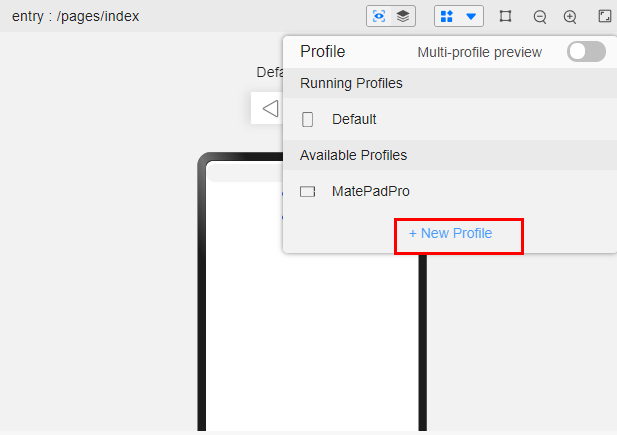

# Development Board Usage

## How do I take screenshots on a development board?

Applicable to: OpenHarmony SDK 3.2.2.5, stage model of API version 9

- Method 1: Click the screenshot button in the Control Panel from the development board UI. The screenshot is displayed in Gallery.

- Method 2: Run the screenshot script. Connect to the development board to a computer running Windows. Create a text file on the computer, copy the following script content to the file, change the file name extension to **.bat** (the HDC environment variables must be configured in advance), and click **Run**. The screenshot is saved to the same directory as the **.bat** script file.
  Example:

  
  ```
  set filepath=/data/%date:~0,4%%date:~5,2%%date:~8,2%%time:~1,1%%time:~3,2%%time:~6,2%.png
  echo %filepath%
  : pause
  hdc_std shell snapshot_display -f %filepath%
  : pause
  hdc_std file recv %filepath% .
  : pause
  ```

## How do I adjust Previewer in DevEco Studio so that the preview looks the same as what's displayed on a real RK3568 development board?

Applicable to: DevEco Studio 3.0.0.991

1. Create a profile in Previewer.
   
   

2. Set the profile parameters as follows:
   Device type : default

   Resolution: 720\*1280

   DPI: 240

## What should I do if Device Manager incorrectly identifies a development board as FT232R USB UART even when the development board already has a driver installed?

Possible cause: The USB serial driver of the development version is not installed.

Solution: Search for **FT232R USB UART**, and download and install the driver.

## How do I complete authentication when logging in to the development board?

Applicable to: OpenHarmony SDK 3.2.2.5

When connecting to the network that requires authentication, open any web page in the browser to access the authentication page.

If there is no browser on the development board, you can install the [sample browser application](https://gitee.com/openharmony/app_samples/tree/master/device/Browser).
