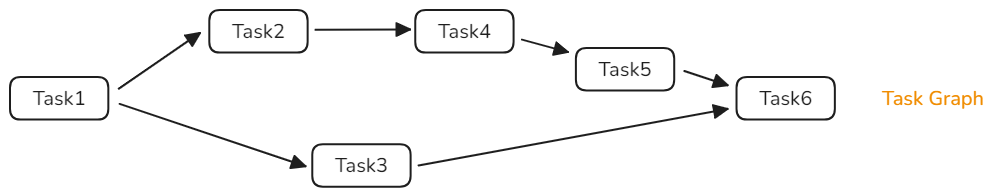

# Function Flow Runtime Paradigms

<!--Kit: Function Flow Runtime Kit-->
<!--Subsystem: Resourceschedule-->
<!--Owner: @chuchihtung; @yanleo-->
<!--Designer: @geoffrey_guo; @huangyouzhong-->
<!--Tester: @lotsof; @sunxuhao-->
<!--Adviser: @foryourself-->

To cope with fixed task execution sequence, flexible priority-based scheduling, and complex task dependencies in actual services, Function Flow Runtime (FFRT) supports three paradigms: serial queue, concurrent queue, and task graph.

## Serial Queue

The serial queue is often used for:

1. **Sequential execution**: The serial queue ensures that tasks are executed one by one in sequence, avoiding data inconsistency and errors caused by out-of-order execution.
2. **Data security**: The serial queue prevents multiple threads from competing for shared resources concurrently, ensuring data consistency and security.
3. **Task scheduling**: The serial queue can schedule the execution sequence of complex tasks. For example, it ensures that a task begins after the previous one completes when tasks with multiple dependencies are performed.
4. **Simplified development**: The serial queue is more simple and clear compared with manual mutex management and synchronization. You only need to add tasks to the queue for automatic system scheduling and execution, simplifying development and debugging.
5. **Resource management**: The serial queue can limit the number of concurrent tasks and avoid resource competition and overload, optimizing system resource usage.

For details about the development sample, see [Serial Queue (C)](ffrt-concurrency-serial-queue-c.md) or [Serial Queue (C++)](ffrt-concurrency-serial-queue-cpp.md).

## Concurrent Queue

The concurrent queue is often used for:

1. **Concurrency improvement**: The concurrent queue allows concurrent execution of multiple tasks, fully utilizing the computing capability of the multi-core processor and significantly improving the concurrency and overall performance of the system.
2. **Efficient resource utilization**: The concurrent queue can allocate tasks to available CPU cores to optimize resource usage and reduce task waiting time and resource competition.
3. **Flexible task scheduling**: The concurrent queue can schedule tasks based on priorities and QoS to ensure that key tasks can be executed in a timely manner and improve the system response speed.
4. **Resource impact prevention**: The concurrent queue can set the maximum concurrency to avoid system resource impact caused by excessive concurrent tasks, ensuring system stability and performance.

For details about the development sample, see [Concurrent Queue (C)](ffrt-concurrency-concurrent-queue-c.md) or [Concurrent Queue (C++)](ffrt-concurrency-concurrent-queue-cpp.md).

## Task Graph

The task graph is often used for:

1. **Complex task dependency**: In actual applications, tasks have complex dependencies among each other. The task graph represents task dependencies by using directed graphs to clearly manage and schedule tasks.
2. **Dynamic task scheduling**: The task graph can dynamically adjust task scheduling and dependencies and execution sequence according to the running conditions.
3. **Concurrent task execution**: The task graph allows multiple independent tasks to be executed concurrently, making full use of system computing resources and improving concurrency and execution efficiency.
4. **Structured concurrency**: The clear task lifecycles and dependencies in the task graph ensure that the creation and completion of concurrent tasks are explicit in the code structure, reducing the complexity and errors of concurrent programming.

For details about the development sample, see [Task Graph (C)](ffrt-concurrency-graph-c.md) or [Task Graph (C++)](ffrt-concurrency-graph-cpp.md).
