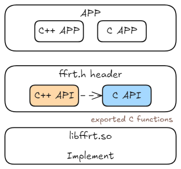

# Function Flow Runtime Development

## Overview

Function Flow Runtime (FFRT) is a task-based and data-driven concurrent programming model that allows you to develop an application by creating tasks and describing their dependencies.
Specifically, FFRT automatically and concurrently schedules and executes tasks of the application based on the task dependency status and available resources, so that you can focus on feature development.

This document provides guidance for you to implement concurrent programming based on the FFRT programming model.

## Maintenance and Test

### Timeout Monitoring

FFRT provides a queue-level and task-level timeout maintenance and test mechanism to monitor the end-to-end time for scheduling queues and tasks that carry important responsibilities in user services.

- When a task in the queue times out, the FFRT prints alarm logs and notifies the service through the callback.
- When a task times out, the FFRT prints alarm logs and calls the process-level callback function.

> **NOTE**
>
> The callback function executed when a task times out must be unique in the process and should be configured in the FFRT by the service party before the task is submitted. The callback function cannot be configured during task submission or task timeout detection.

The APIs are as follows:

| C++ API                                                                                                                                  | C API                                                                               | Description                  |
| ----------------------------------------------------------------------------------------------------------------------------------------- | ------------------------------------------------------------------------------------ | ---------------------- |
| [queue_attr::timeout](https://gitee.com/openharmony/resourceschedule_ffrt/blob/master/docs/ffrt-api-guideline-cpp.md#set-queue-timeout)   | [ffrt_queue_attr_set_timeout](ffrt-api-guideline-c.md#ffrt_queue_attr_set_timeout)   | Sets the queue timeout.    |
| [queue_attr::callback](https://gitee.com/openharmony/resourceschedule_ffrt/blob/master/docs/ffrt-api-guideline-cpp.md#set-queue-callback) | [ffrt_queue_attr_set_callback](ffrt-api-guideline-c.md#ffrt_queue_attr_set_callback) | Sets the queue timeout callback.|

### Long-Time Task Monitoring

#### Mechanism

- When the task execution reaches one second, stack printing is triggered. The stack printing interval is then changed to one minute. After 10 prints, the interval is changed to 10 minutes. After another 10 prints, the interval is changed to and fixed at 30 minutes.
- The `GetBacktraceStringByTid` API of DFX is called for stack printing. This API sends stack capture signals to the blocked thread to trigger interrupts and capture the call stack return.

#### Example

Search for the keyword **RecordSymbolAndBacktrace** in the corresponding process log. The following is an example of the corresponding log:

```txt
W C01719/ffrt: 60500:RecordSymbolAndBacktrace:159 Tid[16579] function occupies worker for more than [1]s.
W C01719/ffrt: 60501:RecordSymbolAndBacktrace:164 Backtrace:
W C01719/ffrt: #00 pc 00000000000075f0 /system/lib64/module/file/libhash.z.so
W C01719/ffrt: #01 pc 0000000000008758 /system/lib64/module/file/libhash.z.so
W C01719/ffrt: #02 pc 0000000000012b98 /system/lib64/module/file/libhash.z.so
W C01719/ffrt: #03 pc 000000000002aaa0 /system/lib64/platformsdk/libfilemgmt_libn.z.so
W C01719/ffrt: #04 pc 0000000000054b2c /system/lib64/platformsdk/libace_napi.z.so
W C01719/ffrt: #05 pc 00000000000133a8 /system/lib64/platformsdk/libuv.so
W C01719/ffrt: #06 pc 00000000000461a0 /system/lib64/chipset-sdk/libffrt.so
W C01719/ffrt: #07 pc 0000000000046d44 /system/lib64/chipset-sdk/libffrt.so
W C01719/ffrt: #08 pc 0000000000046a6c /system/lib64/chipset-sdk/libffrt.so
W C01719/ffrt: #09 pc 00000000000467b0 /system/lib64/chipset-sdk/libffrt.so
```

The log prints the task stack, Worker thread ID, and execution time of the long-time task. Find the corresponding component based on the stack to determine the blocking cause.

#### Precautions

N/A

### Running Information Dump

#### Mechanism

FFRT provides an external interface API `ffrt_dump` to dump the internal information about the running of the FFRT subsystem, including:

1. FFRT statistics: number of submitted tasks, number of running tasks, number of coroutine switching times, and number of completed tasks;
2. Worker thread information: number of Worker threads in each QoS, Worker ID, ID of the running task, task name, and task type.
3. Common task information: common tasks that are not released in the current process, dump task name and ID, and call stack information of each task.
4. Queue task information: queue tasks that are not released in the current process, dump task name and ID, and call stack information of each task.

When the current process is frozen, the DFX module proactively calls the `ffrt_dump` API to dump the FFRT information to the freeze file and store the file in the `/data/log/faultlog/faultlogger/` directory. You can directly use the task call stack information in the file to locate the frame freezing of the corresponding task.

#### Example

```txt
ready task ptr: qos 0 readptr 79 writeptr 79
ready task ptr: qos 1 readptr 360 writeptr 360
ready task ptr: qos 2 readptr 19 writeptr 19
ready task ptr: qos 3 readptr 0 writeptr 0
ready task ptr: qos 4 readptr 0 writeptr 0
ready task ptr: qos 5 readptr 65 writeptr 65
ready task ptr: qos 6 readptr 0 writeptr 0
ready task ptr: qos 7 readptr 0 writeptr 0
submit queue: readptr 24 writeptr 24
intr wake: status 255
proc status: taskCnt 23 vercnt 0sigCnt0
    |-> worker count
        qos 0: worker num:1 tid:31676
        qos 2: worker num:3 tid:51349, 28769, 28565
        qos 5: worker num:1 tid:30605
    |-> worker status
        qos 0: worker tid 31676 is running nothing
        qos 2: worker tid 51349 is running nothing
        qos 2: worker tid 28769 is running, task id 24591 name sq_CesSrvMain_12_PublishCommonEventDetailed_24591 fromTid 43928 createTime 2024-11-27 02:52:27.325248 executeTime 2024-11-27 02:52:27.326150
        qos 2: worker tid 28565 is running, task id 24611 name sq_dfx_freeze_task_queue_16_NotifyAppFaultTask_24611 fromTid 43833 createTime 2024-11-27 02:52:38.114787 executeTime 2024-11-27 02:52:38.115424
        qos 5: worker tid 30605 is running, task id 24595 name sq_AbilityManagerService_19_SubmitTaskInner_24595 fromTid 43610 createTime 2024-11-27 02:52:27.844237 executeTime 2024-11-27 02:52:27.844573
    |-> ready queue status
    |-> blocked by task dependence
        <1/1>stack: task id 3,qos 2,name AgingTask fromTid 43417 createTime 2024-11-27 01:21:39.641673 executeTime 2024-11-27 01:21:39.642290
#00 pc 0000000000065c5c /system/lib64/ndk/libffrt.so(CoYield()+560)(22be57f01a789a03813d26a19c3a4042)
#01 pc 00000000000a3268 /system/lib64/ndk/libffrt.so(ffrt::this_task::SleepUntilImpl(std::__h::chrono::time_point<std::__h::chrono::steady_clock, std::__h::chrono::duration<long long, std::__h::ratio<1l, 1000000000l>>> const&)+356)(22be57f01a789a03813d26a19c3a4042)
#02 pc 00000000000a39b4 /system/lib64/ndk/libffrt.so(ffrt_usleep+60)(22be57f01a789a03813d26a19c3a4042)
#03 pc 0000000000420de0 /system/lib64/libbms.z.so(2eb52bd03af1b9a31e14ffe60bfc39da)
#04 pc 00000000000a6a2c /system/lib64/ndk/libffrt.so(ffrt::CPUEUTask::Execute()+300)(22be57f01a789a03813d26a19c3a4042)
#05 pc 0000000000066d18 /system/lib64/ndk/libffrt.so(22be57f01a789a03813d26a19c3a4042)
```

#### Precautions

The DFX module has requirements on the processing time during freeze, which has a low probability that the information collected by `ffrt_dump` is incomplete and the freeze processing time expires. In this case, the information flushed to the disk is missing.

### Blackbox Logs

#### Mechanism

When a process crashes, the FFRT module receives signals (`SIGABRT`, `SIGBUS`, `SIGFPE`, `SIGILL`, `SIGSTKFLT`, `SIGSTOP`, `SIGSYS`, and `SIGTRAP`) and saves important running information to the faultlog, including the running task, running information and call stack information of the current Worker thread, common task information, and queue task information. You can use the information to locate the crashes.

#### Example

```txt
C01719/CameraDaemon/ffrt: 9986:operator():254 <<<=== ffrt black box(BBOX) start ===>>>
C01719/CameraDaemon/ffrt: 9987:SaveCurrent:63 <<<=== current status ===>>>
C01719/CameraDaemon/ffrt: 9988:SaveCurrent:68 signal SIGABRT triggered: source tid 5962, task id 17, qos 2, name SvrWatchdog
C01719/CameraDaemon/ffrt: 9989:SaveWorkerStatus:94 <<<=== worker status ===>>>
C01719/CameraDaemon/ffrt: 9990:SaveWorkerStatus:100 qos 0: worker tid 6410 is running nothing
C01719/CameraDaemon/ffrt: 9991:SaveWorkerStatus:100 qos 2: worker tid 5968 is running nothing
C01719/CameraDaemon/ffrt: 9992:SaveWorkerStatus:100 qos 2: worker tid 5964 is running nothing
C01719/CameraDaemon/ffrt: 9993:SaveWorkerStatus:100 qos 2: worker tid 5963 is running nothing
C01719/CameraDaemon/ffrt: 9994:SaveWorkerStatus:105 qos 2: worker tid 5962 is running task id 17 name SvrWatchdog
C01719/CameraDaemon/ffrt: 9995:SaveWorkerStatus:100 qos 2: worker tid 5967 is running nothing
C01719/CameraDaemon/ffrt: 9996:SaveWorkerStatus:100 qos 2: worker tid 5965 is running nothing
C01719/CameraDaemon/ffrt: 9997:SaveWorkerStatus:100 qos 2: worker tid 5961 is running nothing
C01719/CameraDaemon/ffrt: 9998:SaveWorkerStatus:100 qos 2: worker tid 1146 is running nothing
C01719/CameraDaemon/ffrt: 9999:SaveWorkerStatus:100 qos 2: worker tid 1145 is running nothing
C01719/CameraDaemon/ffrt: 10000:SaveWorkerStatus:100 qos 2: worker tid 5966 is running nothing
```

#### Precautions

N/A

### Tracing

#### Mechanism

During FFRT task scheduling and execution, the system traces the task status in the FFRT framework in real time. You can use the trace graphical tool to analyze whether the task behavior meets the expectation.

#### Example

1. Starting trace capture

    ```shell
    hdc shell "hitrace -t 10 -b 20480 -o /data/local/tmp/in_systrace.ftrace sched freq idle ffrt"
    # -t: specifies the trace collection duration, during which all trace records are flushed to the disk.
    # -b: specifies the size of the trace record cache. If the buffer is insufficient, some records may be overwritten and not flushed to disks.
    # -o: specifies the path for storing trace files.
    ```

2. Using a graphical tool

    Obtain the trace file from the device and use a graphical tool, for example, [Perfetto](https://perfetto.dev/), to analyze the file.

#### Precautions

You can also add traces to your service code to locate the fault. Note that in the high-frequency call process, adding traces will cause system overhead and affect service performance.

### Debug Logs

#### Mechanism

- By default, debug logs are disabled for the FFRT, but can be enabled by using commands to obtain more maintenance and test information for fault locating in the development.
- Enable the FFRT debug log function:

    ```shell
    hdc shell hilog -b DEBUG -D 0xD001719
    ```

- Restore the default FFRT INFO log level.

    ```shell
    hdc shell hilog -b INFO -D 0xD001719
    ```

#### Example

```txt
4190  5631 D C01719/neboard:EngineServiceAbility:1/ffrt: 275337:Detach:147 qos 3 thread not joinable
3257  6075 D C01719/com.ohos.sceneboard/ffrt: 513070:SetDefaultThreadAttr:148 qos apply tid[6075] level[3]
```

#### Precautions

The FFRT is the system base and supports the running of a large number of upper-layer services and frameworks. If the debug log function is enabled globally, the number of logs will exceed the threshold, which affects the log output of other modules.

## How to Develop

The following describes how to use the native APIs provided by FFRT to create parallel tasks and serial queue tasks and destroy corresponding resources.

1. Add a dynamic link library to the `CMakeLists.txt` project.

    ```txt
    libffrt.z.so
    ```

2. Include the following header files in the project.

    ```cpp
    #include "ffrt/task.h"
    #include "ffrt/mutex.h"
    #include "ffrt/shared_mutex.h"
    #include "ffrt/condition_variable.h"
    #include "ffrt/sleep.h"
    #include "ffrt/queue.h"
    #include "ffrt/loop.h"
    #include "ffrt/timer.h"
    ```

3. Encapsulate the function to be executed.

    ```cpp
    // Method 1: Use the template. C++ is supported.
    template<class T>
    struct function {
        ffrt_function_header_t header;
        T closure;
    };

    template<class T>
    void exec_function_wrapper(void* t)
    {
        auto f = reinterpret_cast<function<std::decay_t<T>>*>(t);
        f->closure();
    }

    template<class T>
    void destroy_function_wrapper(void* t)
    {
        auto f = reinterpret_cast<function<std::decay_t<T>>*>(t);
        f->closure = nullptr;
    }

    template<class T>
    inline ffrt_function_header_t* create_function_wrapper(T&& func,
        ffrt_function_kind_t kind = ffrt_function_kind_general)
    {
        using function_type = function<std::decay_t<T>>;
        static_assert(sizeof(function_type) <= ffrt_auto_managed_function_storage_size,
            "size of function must be less than ffrt_auto_managed_function_storage_size");

        auto p = ffrt_alloc_auto_managed_function_storage_base(kind);
        auto f = new (p)function_type;
        f->header.exec = exec_function_wrapper<T>;
        f->header.destroy = destroy_function_wrapper<T>;
        f->closure = std::forward<T>(func);
        return reinterpret_cast<ffrt_function_header_t*>(f);
    }

    // Method 2
    typedef struct {
        ffrt_function_header_t header;
        ffrt_function_t func;
        ffrt_function_t after_func;
        void* arg;
    } ffrt_function_wrapper_t;

    static inline void ffrt_exec_function_wrapper(void* t)
    {
       ffrt_function_wrapper_t* f = (ffrt_function_wrapper_t *)t;
       if (f->func) {
           f->func(f->arg);
       }
    }

    static inline void ffrt_destroy_function_wrapper(void* t)
    {
        ffrt_function_wrapper_t* f = (ffrt_function_wrapper_t *)t;
        if (f->after_func) {
            f->after_func(f->arg);
        }
    }

    #define FFRT_STATIC_ASSERT(cond, msg) int x(int static_assertion_##msg[(cond) ? 1 : -1])
    static inline ffrt_function_header_t *ffrt_create_function_wrapper(ffrt_function_t func,
        ffrt_function_t after_func, void* arg, ffrt_function_kind_t kind)
    {
        FFRT_STATIC_ASSERT(sizeof(ffrt_function_wrapper_t) <= ffrt_auto_managed_function_storage_size,
            size_of_function_must_be_less_than_ffrt_auto_managed_function_storage_size);

        ffrt_function_wrapper_t* f = (ffrt_function_wrapper_t *)ffrt_alloc_auto_managed_function_storage_base(kind);
        f->header.exec = ffrt_exec_function_wrapper;
        f->header.destroy = ffrt_destroy_function_wrapper;
        f->func = func;
        f->after_func = after_func;
        f->arg = arg;
        return (ffrt_function_header_t *)f;
    }

    // Example: function to be submitted for execution.
    void OnePlusForTest(void* arg)
    {
        (*static_cast<int*>(arg)) += 1;
    }
    ```

4. Set task attributes, including the QoS level and task name.

    ```cpp
    // ******Initialize the attributes of the parallel task******
    ffrt_task_attr_t attr;
    ffrt_task_attr_init(&attr);

    // ******Create a serial queue******

    // Create the attributes of the serial queue.
    ffrt_queue_attr_t queue_attr;
    // Create the handle to the serial queue.
    ffrt_queue_t queue_handle;

    // Initialize the queue attribute.
    (void)ffrt_queue_attr_init(&queue_attr);

    // Set the QoS if necessary.
    ffrt_queue_attr_set_qos(&queue_attr, static_cast<ffrt_qos_t>(ffrt_qos_inherit));
    // Set the timeout period (ms) if necessary.
    ffrt_queue_attr_set_timeout(&queue_attr, 10000);
    // Set the timeout callback if necessary.
    int x = 0;
    ffrt_queue_attr_set_callback(&queue_attr, ffrt_create_function_wrapper(OnePlusForTest, NULL, &x,
        ffrt_function_kind_queue));

    // Initialize the queue based on the attributes.
    queue_handle = ffrt_queue_create(ffrt_queue_serial, "test_queue", &queue_attr);
    ```

5. Submit the task.

    ```cpp
    int a = 0;
    // ******Parallel task******
    // Submit the parallel task without obtaining a handle.
    ffrt_submit_base(
        ffrt_create_function_wrapper(OnePlusForTest, NULL, &a, ffrt_function_kind_general), NULL, NULL, &attr);
    // Submit the parallel task and obtain a handle.
    ffrt_task_handle_t task = ffrt_submit_h_base(
        ffrt_create_function_wrapper(OnePlusForTest, NULL, &a, ffrt_function_kind_general), NULL, NULL, &attr);

    // ******Serial queue task******
    // Submit the serial queue task without obtaining a handle.
    ffrt_queue_submit(queue_handle,
        ffrt_create_function_wrapper(OnePlusForTest, NULL, &a, ffrt_function_kind_queue), NULL);
    // Submit the serial queue task and obtain a handle.
    ffrt_task_handle_t handle = ffrt_queue_submit_h(queue_handle,
        ffrt_create_function_wrapper(OnePlusForTest, NULL, &a, ffrt_function_kind_queue), NULL);

    // Call wait if you need to wait for the execution result.
    const std::vector<ffrt_dependence_t> wait_deps = {{ffrt_dependence_task, task}};
    ffrt_deps_t wait{static_cast<uint32_t>(wait_deps.size()), wait_deps.data()};
    ffrt_wait_deps(&wait);

    ffrt_queue_wait(handle);
    ```

6. (Optional) If a task does not need to be destroyed, you can submit the task through a simplified API.

    ```cpp
    int a = 0;
    // If the after_func function pointer in step 3 is NULL, you can use the simplified API to submit a task to avoid redundant task structure encapsulation.
    // ******Parallel task******
    // Submit a parallel task without a handle through a simplified API.
    ffrt_submit_f(OnePlusForTest, &a, NULL, NULL, &attr);
    // Submit a parallel task with a handle through a simplified API.
    ffrt_task_handle_t task = ffrt_submit_h_f(OnePlusForTest, &a, NULL, NULL, &attr);

    // ******Serial queue task******
    // Submit a serial queue task that does not return a handle through a simplified API.
    ffrt_queue_submit_f(queue_handle, OnePlusForTest, &a, NULL);
    // Submit a serial queue task with a handle through a simplified API.
    ffrt_task_handle_t handle = ffrt_queue_submit_h_f(queue_handle, OnePlusForTest, &a, NULL);

    // Call wait if you need to wait for the execution result.
    const std::vector<ffrt_dependence_t> wait_deps = {{ffrt_dependence_task, task}};
    ffrt_deps_t wait{static_cast<uint32_t>(wait_deps.size()), wait_deps.data()};
    ffrt_wait_deps(&wait);

    ffrt_queue_wait(handle);
    ```

7. Destroy the resources after the task is submitted.

    ```cpp
    // ******Destroy the parallel task******
    ffrt_task_attr_destroy(&attr);
    ffrt_task_handle_destroy(task);

    // ******Destroy the serial queue task******
    // Destroy the task handle and then the queue.
    ffrt_queue_attr_destroy(&queue_attr);
    ffrt_task_handle_destroy(handle);
    ffrt_queue_destroy(queue_handle);
    ```

## Suggestions

### Suggestion 1: Functional Programming

- Use pure functions and encapsulate them to express each step of the process.
- There is no global data access.
- There is no internal state reserved.
- Call the `ffrt_submit_base()` or `ffrt_submit_f()` API to submit a function in asynchronous mode.
- Use `in_deps` and `out_deps` of `ffrt_submit_base()` to specify the data objects to be accessed by the function and the access mode.
- Programmers use the `in_deps` and `out_deps` parameters to express task dependencies to ensure the correctness of program execution.

> Using pure functions helps you maximize the parallelism and avoid data races and lock abuse.
>
> In practice, you may not use pure functions in certain scenarios, with the following prerequisites:
>
> - `in_deps` and `out_deps` can ensure the correctness of program execution.
> - The lock mechanism provided by FFRT is used to protect access to global variables.

### Suggestion 2: Using FFRT APIs

- Do not use the APIs of the system thread library to create threads in FFRT tasks. Instead, use `submit` to submit tasks.
- Use the lock, condition variable, sleep, and I/O APIs provided by FFRT to replace the APIs of the system thread library.
  - Using the APIs of the system thread library may block worker threads and result in extra performance overhead.

### Suggestion 3: Deadline Mechanism

- Use FFRT APIs in processing flows that feature periodic/repeated execution.
- Use FFRT APIs in processing flows with clear time constraints and is performance critical.
- Use FFRT APIs in relatively large-granularity processing flows, such as the frame processing flow with the 16.6 ms time constraint.

### Suggestion 4: Migration from the Thread Model

- Create a thread instead of creating an FFRT task.
  - A thread is logically similar to a task without `in_deps`.
- Identify the dependency between threads and express the dependencies in `in_deps` and `out_deps` of the task.
- Decompose an intra-thread computing process into asynchronous tasks for invoking.
- Use the task dependency and lock mechanism to avoid data races of concurrent tasks.

### Suggestion 5: C++ APIs Recommended

- The FFRT C++ APIs are implemented based on the C APIs. Before using the APIs, you can manually add the C++ header file.

## Constraints

### Thread Local Variables

Risks exist when thread local variables are used in FFRT tasks. The details are as follows:

- Thread local variables include the variables defined by `thread_local` provided by C/C++ and the variables created by using `thread_local`.
- FFRT supports task scheduling. The thread to which a task is scheduled is random. Therefore, there are risks to use thread local variables, which is consistent with all other frameworks that support concurrent task scheduling.
- By default, an FFRT task runs in coroutine mode. During task execution, the coroutine may exit. When the task is resumed, the thread that executes the task may change.

### Thread Binding

- FFRT supports task scheduling. The thread to which a task is scheduled is random. Thread-bound behaviors, such as thread_idx, thread priority, and thread affinity, cannot be used in tasks.

### Synchronization Primitives in the Standard Library

A deadlock may occur when the mutex of the standard library is used in the FFRT task. You need to use the mutex provided by the FFRT. The details are as follows:

- When `lock()` is successfully executed, the mutex records the execution stack of the caller as the owner of the lock. If the caller is the current execution stack, a success message is returned to support nested lock obtaining in the same execution stack. In implementation of the standard library, the "execution stack" is represented by a thread identifier.
- When the mutex of the standard library is used in the FFRT task, if the task (coroutine) exits between the outer and inner lock and the task is resumed on the FFRT Worker thread that is different from the thread that calls `lock()` for the first time, the calling thread is not the owner and `lock()` fails to be called, the FFRT Worker thread is suspended, and `unlock()` is not executed. As a result, a deadlock occurs.

### Support for the Process `fork()` Scenario

- Create a child process in a process that does not use FFRT. FFRT can be used in the child process.
- Create a child process using `fork()` in a process that uses FFRT. FFRT cannot be used in the child process.
- Create a child process using `fork()` and `exec()` in a process that uses FFRT. FFRT can be used in the child process.

### Dynamic FFRT Deployment

- Static library deployment may cause multi-instance problems. For example, when multiple .so files loaded by the same process use FFRT in static library mode, FFRT is instantiated into multiple copies, and their behavior is unknown.

### Limited Number of Input and Output Dependencies

- For `ffrt_submit_base`, the total number of input dependencies and output dependencies of each task cannot exceed 8.
- For `ffrt_submit_h_base`, the total number of input dependencies and output dependencies of each task cannot exceed 7.
- When a parameter is used as both an input dependency and an output dependency, it is counted as one dependency. For example, if the input dependency is `{&x}` and the output dependency is also `{&x}`, then the number of dependencies is 1.

### Restrictions on Process or Thread Exit

- When a process exits, the shared resources in the process, such as the thread pool in the FFRT, have been released. **submit()** should not be called.
- When a thread exits, the thread local resources in the FFRT have been released. **submit()** should not be called for the thread that is exiting.

## Common Anti-Patterns

### After an FFRT object is initialized in the C code, you are responsible for setting the object to null or destroying the object.

- To ensure high performance, the C APIs of FFRT do not use a flag to indicate the object destruction status. You need to release resources properly. Repeatedly destroying an object will cause undefined behavior.
- Noncompliant example 1: Repeated calling of destroy() may cause unpredictable data damage.

    ```cpp
    #include <stdio.h>
    #include "ffrt/cpp/task.h"

    void abnormal_case_1()
    {
        ffrt_task_handle_t h = ffrt_submit_h_base(
            ffrt::create_function_wrapper(std::function<void()>([](){ printf("Test task running...\n"); })),
            NULL, NULL, NULL);
        // ...
        ffrt_task_handle_destroy(h);
        ffrt_task_handle_destroy(h); // Repeated release
    }
    ```

- Noncompliant example 2: No calling of destroy() may cause memory leak.

    ```cpp
    #include <stdio.h>
    #include "ffrt/cpp/task.h"

    void abnormal_case_2()
    {
        ffrt_task_handle_t h = ffrt_submit_h_base(
            ffrt::create_function_wrapper(std::function<void()>([](){ printf("Test task running...\n"); })),
            NULL, NULL, NULL);
        // ...
        // Memory leak
    }
    ```

- Recommended example: Call **destroy()** only once. You can leave it empty if necessary.

    ```cpp
    #include <stdio.h>
    #include "ffrt/cpp/task.h"

    void normal_case()
    {
        ffrt_task_handle_t h = ffrt_submit_h_base(
            ffrt::create_function_wrapper(std::function<void()>([](){ printf("Test task running...\n"); })),
            NULL, NULL, NULL);
        // ...
        ffrt_task_handle_destroy(h);
        h = nullptr; // Set the task handle variable to null if necessary.
    }
    ```

### Incorrect Variable Lifecycle

- When submitting an FFRT task, pay attention to the misuse of objects or resources during their lifecycle. These misuses may cause program breakdown, data damage, or difficult debugging.
- Noncompliant example 1: Ended variable lifecycle causes a UAF problem.

    ```cpp
    #include <unistd.h>
    #include "ffrt/cpp/task.h"

    void abnormal_case_3()
    {
        int x = 0;
        ffrt::submit([&] {
            usleep(1000); // Simulate the service processing logic.
            x++;          // The variable lifecycle may have ended, and a UAF problem may occur when the variable is accessed.
        });
    }
    ```

- Noncompliant example 2: Ended mutex lifecycle causes function exceptions.

    ```cpp
    #include <unistd.h>
    #include "ffrt/cpp/mutex.h"
    #include "ffrt/cpp/task.h"

    void abnormal_case_4()
    {
        ffrt::mutex lock;
        ffrt::submit([&] {
            lock.lock();   // When performing operations on the FFRT lock, ensure that the lifecycle of the FFRT lock is valid.
            usleep(1000);  // Simulate the service processing logic.
            lock.unlock(); // When performing operations on the FFRT lock, ensure that the lifecycle of the FFRT lock is valid.
        });
    }
    ```

## Using FFRT in DevEco Studio

### Using FFRT C API

Native Development Kit (NDK) is a toolset provided by the system. It offers native APIs that allow you to implement key application functions using C or C++ code.

The FFRT C APIs have been integrated into the NDK. You can directly use the corresponding API in DevEco Studio.

```c
#include "ffrt/task.h"
#include "ffrt/mutex.h"
#include "ffrt/shared_mutex.h"
#include "ffrt/condition_variable.h"
#include "ffrt/sleep.h"
#include "ffrt/queue.h"
#include "ffrt/loop.h"
#include "ffrt/timer.h"
#include "ffrt/type_def.h"
```

### Using FFRT C++ API

The FFRT deployment depends on the FFRT dynamic library `libffrt.so` and a group of header files. The dynamic library exports only C APIs, and C++ APIs call C APIs. In addition, C++ elements in APIs are compiled into the dynamic library based on the header files, ensuring ABI compatibility.



To use FFRT C++ APIs, you need to use the third-party library [@ppd/ffrt](https://ohpm.openharmony.cn/#/en/detail/@ppd%2Fffrt), which is officially maintained by FFRT.

Run the following command in the module directory to install the third-party library:

```shell
ohpm install @ppd/ffrt
```

You can also configure the dependencies in the `oh-package.json5` file so that the third-party library can be automatically downloaded and installed through DevEco Studio.

Add the header file search path and link dependency to the `CMakeLists.txt` file.

```cmake
# ${MODULES_PATH} indicates the installation path of the third-party library. You need to define the path or replace it with an absolute or relative path.
include_directories(${MODULES_PATH}/@ppd/ffrt/include)
target_link_libraries(${TARGET_NAME} PUBLIC libffrt.z.so)
```

Use the FFRT C++ API in the code.

```cpp
// include all C or C++ header files
#include "ffrt/ffrt.h"

// include specified header files
#include "ffrt/cpp/task.h"
#include "ffrt/cpp/mutex.h"
#include "ffrt/cpp/shared_mutex.h"
#include "ffrt/cpp/condition_variable.h"
#include "ffrt/cpp/sleep.h"
#include "ffrt/cpp/queue.h"
```

 <!--no_check--> 