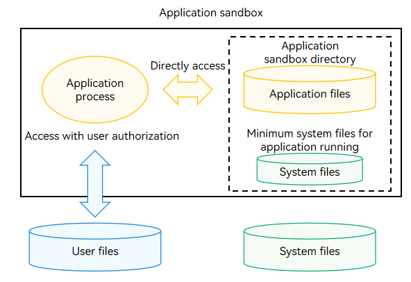
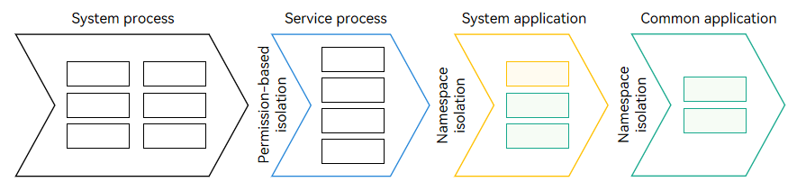
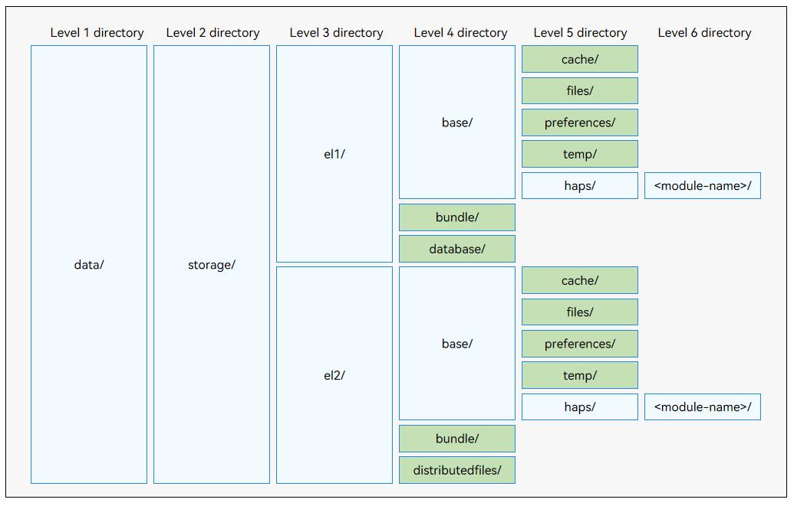

# Application Sandbox

The application sandbox is an isolation mechanism used to prevent malicious data access through path traversal. With this mechanism, only the application sandbox directory is visible to an application.

- The system provides a dedicated application sandbox directory in the internal storage to map the directory of each application. The application sandbox directory contains only the [application file directory](#application-file-directory-and-application-file-path) and the directory containing the minimum system files required for the running of the application.

- The application sandbox limits the scope of data visible to an application. Each application can access only its own application files and the system files required for its running. The application cannot access files of other applications. This ensures application file security.

- In each application sandbox directory, the application can save and process its application files in the application file directory, and can only read the system files and directories. To access [user files](user-file-overview.md), the application needs to call specific APIs and have authorization from the user.

The following figure illustrates the file access mechanism in the application sandbox.

**Figure 1** File access mechanism in the application sandbox 

## Application Sandbox Directory and Application Sandbox Path

With the application sandbox mechanism, an application is not aware of the existence and location of other applications' directories and user file directories. Even the directories visible to an application are isolated by permission and namespace to form an independent directory view and shield the physical (real) paths.

- As shown in the following figure, the application sandbox mechanism minimizes the number of directories and files visible to a common application (third-party application). In addition, the directories and file paths visible to a common application are different from those visible to a system process. The path of a file or folder in the application sandbox directory visible to a common application is called the application sandbox path.

<!--RP1-->
- The hdc shell environment is equivalent to the system process view. Therefore, the application sandbox path is different from the physical path displayed on the hdc for debugging. For details about the mappings, see [Mappings Between Application Sandbox Paths and Physical Paths](#mappings-between-application-sandbox-paths-and-physical-paths).
<!--RP1End-->

- The application sandbox paths and physical paths are not in one-to-one mappings. The application sandbox paths are always shorter than physical paths. Some physical paths do not have the corresponding application sandbox paths.

**Figure 2** Different directory views to processes and applications 

## Application File Directory and Application File Path

The application sandbox directory consists of the application file directory and system file directory.

The system file directory visible to an application is preset by OpenHarmony.

The following figure shows the application file directory structure. The path of a file or a directory in the application file directory is called the application file path. Each file path has different attributes and features.

**Figure 3** Application file directory structure 

> **NOTE**
>
> - Do not use file paths made up by level 1 to level 3 directory names. Incompatibility problems may occur if the directory names are changed in later versions.
> - Use **Context** to obtain the application file paths, including but not limited to the directories highlighted in green in **Figure 3**. For details about how to obtain the context and application file paths, see [Context (Stage Model)](../application-models/application-context-stage.md).

1. Level 1 directory **data/**: application file directory.

2. Level 2 directory **storage/**: directory for persistent files of the application.

3. There are files of different encryption levels in **el1/** and **el5/**.

    Encryption Level 1 (EL1):
     - All files are protected on the device. After the device is powered on, users can access the files protected by EL1 without identity authentication. This method is not recommended unless otherwise required.
     - The ciphertext stolen from the storage device cannot be decrypted offline.

    Encryption Level 2 (EL2):
     - On the basis of EL1, files are protected after the first user authentication. After the device is powered on, users can access the files protected by EL2 only after the first authentication. Those files are always accessible as long as the device is online. This mode is recommended by default.
     - Files cannot be read by attackers if the phone is lost after power-off.

    Encryption Level 3 (EL3):
     - Files can be created but cannot be read when the screen is locked, which is different from EL4. This mode is not required unless otherwise specified.

    Encryption Level 4 (EL4):
     - On the basis of EL2, files are protected when the device screen is locked. In this case, data protected by EL4 cannot be accessed. This mode is not required unless otherwise specified.
     - Files cannot be read by attackers if the device is stolen with screen locked.

    Encryption Level 5 (EL5):
     - On the basis of EL2, files are protected when the device screen is locked. In this case, data protected by EL5 cannot be accessed, but files can be created, read, and written. This mode is not required unless otherwise specified.
     - EL5 directories are not generated by default unless the permissions for access to the EL5 database are configured. For details, see [Using an EL5 Database](../database/encrypted_estore_guidelines.md).

   > **NOTE**
   >
   > Unless otherwise required, application data is placed in the **el2** directory for security purposes. The data that needs to be accessed before the first user authentication (such as the clock, alarm, and wallpaper data) is placed in the **el1** directory.
   >
   > You can listen for the [COMMON_EVENT_USER_UNLOCKED](../reference/apis-basic-services-kit/common_event/commonEventManager-definitions.md#common_event_user_unlocked) event to detect that the first user authentication is complete.
   >
   > For details about the operations on **el1/** and **el2/**, see [Obtaining and Modifying el Directories](../application-models/application-context-stage.md#obtaining-and-modifying-encryption-levels).

4. Level 4 and level 5 directories:
   The application's global data is stored in the **distributedfiles** directory and **files**, **cache**, **preferences**, and **temp** in **base**. You can use **ApplicationContext** to obtain the application file paths of these directories.

   Files of an OpenHarmony Ability Package (HAP) are stored in the **haps/** directory. You can use **UIAbilityContext**, **AbilityStageContext**, and **ExtensionContext** to obtain application file paths related to a HAP. When a HAP is uninstalled, the files in the **haps/** directory are automatically deleted, without affecting the files in application-level directories. An application in the development state has one or more HAPs. For details, see [Application Package Structure in Stage Model](../quick-start/application-package-structure-stage.md).

   The following table describes the application file paths and their lifecycle.

   **Table 1** Application file paths

   | Folder Name| Context Attribute Name| Type| Description|
   | -------- | -------- | -------- | -------- |
   | bundle | bundleCodeDir | Installation file directory| Directory for saving the HAPs after an application is installed. This directory is cleared when the application is uninstalled. You cannot access resource files using concatenated paths. Use [@ohos.resourceManager](../reference/apis-localization-kit/js-apis-resource-manager.md) instead. You can store the application's code resource data, including the HAPs of the application, reusable library files, and plug-ins, in this directory. The code in this directory can be dynamically loaded.|
   | base | NA | Directory for the device's files| Directory for saving the application's persistent data on the device. Subdirectories include **files/**, **cache/**, **temp/**, and **haps/**. This directory is cleared when the application is uninstalled.|
   | database | databaseDir | Database directory| Directory in **el2** for saving the files operated by the distributed database service. This directory is cleared when the application is uninstalled. This directory can be used to store the application's private database data, such as database files, in distributed scenarios only.|
   | distributedfiles | distributedFilesDir | Distributed file directory| Directory in **el2** for saving the application files that can be directly accessed across devices. This directory is cleared when the application is uninstalled. You can place the application's data used for distributed scenarios, including file sharing, file backup, and file processing across devices, in this directory. The data stored in this directory enables an application to run smoothly on multiple devices that form a Super Device.|
   | files | filesDir | Application file directory| Directory for saving the application's persistent files on the device. This directory is cleared when the application is uninstalled. You can place the application's private data, including persistent files, images, media files, and log files, in this directory. The data is stored in this directory to ensure privacy, security, and permanent validity.|
   | cache | cacheDir | Application cache file directory| Directory for caching the downloaded files of the application or saving the cache files regenerated on the device. This directory is automatically cleared when the size of the **cache** directory reaches the quota or the system storage space reaches a certain threshold. End users can also clear this directory by using a system space management application. The application needs to check whether a file still exists and determine whether to cache the file again. This directory is cleared when the application is uninstalled. You can place the cached data of the application, including offline data, cached images, database backup, and temporary files, in this directory. Data stored in this directory may be automatically deleted by the system. Therefore, do not store important data in this directory.|
   | preferences | preferencesDir | Preferences file directory| Directory for saving common application configuration and user preferences managed by ArkData APIs on the device. This directory is cleared when the application is uninstalled. For details about how to make preferences data persistent, see [Persisting Preferences Data](../database/data-persistence-by-preferences.md). You can place application preferences data, including preference files and configuration files, in this directory. This directory applies to storing only a small amount of data.|
   | temp | tempDir | Temporary file directory| Directory for saving the files generated and required during the application's runtime on the device.  This directory is cleared when the application exits. You can place temporarily generated data of the application, including cached database data and images, temporary log files, downloaded application installation packages, in this directory. The data stored in this directory can be deleted immediately after being used.|

## Mappings Between Application Sandbox Paths and Physical Paths

The read and write operations performed on an application sandbox directory are eventually performed on the files in the physical directory after address conversion. The following table lists their mappings.

In the physical paths, &lt;USERID&gt; indicates the ID of the current user, which starts from 100, and &lt;EXTENSIONPATH&gt; is moduleName-extensionName. For details about the application running in an independent Extension sandbox, see [ExtensionAbility Component](../application-models/extensionability-overview.md).

| Application Sandbox Path| Physical Path|
| -------- | -------- |
| /data/storage/el1/bundle | Application installation package directory:  **/data/app/el1/bundle/public/&lt;PACKAGENAME&gt;**|
| /data/storage/el1/base | Application directory of encryption level 1.  - Application running in a non-independent sandbox: **/data/app/el1/&lt;USERID&gt;/base/&lt;PACKAGENAME&gt;**  - Extension application running in an independent sandbox: **/data/app/el1/&lt;USERID&gt;/base/+extension-&lt;EXTENSIONPATH&gt;+&lt;PACKAGENAME&gt;**|
| /data/storage/el2/base | Application directory of encryption level 2.  - Application running in a non-independent sandbox: **/data/app/el2/&lt;USERID&gt;/base/&lt;PACKAGENAME&gt;**  - Extension application running in an independent sandbox: **/data/app/el2/&lt;USERID&gt;/base/+extension-&lt;EXTENSIONPATH&gt;+&lt;PACKAGENAME&gt;**|
| /data/storage/el1/database | Database directory of the application under **el1/**.  - Application running in a non-independent sandbox: **/data/app/el1/&lt;USERID&gt;/database/&lt;PACKAGENAME&gt;**  - Extension application running in an independent sandbox: **/data/app/el1/&lt;USERID&gt;/database/+extension-&lt;EXTENSIONPATH&gt;+&lt;PACKAGENAME&gt;**|
| /data/storage/el2/database | Database directory of the application under **el2/**.  - Application running in a non-independent sandbox: **/data/app/el2/&lt;USERID&gt;/database/&lt;PACKAGENAME&gt;**  - Extension application running in an independent sandbox: **/data/app/el2/&lt;USERID&gt;/database/+extension-&lt;EXTENSIONPATH&gt;+&lt;PACKAGENAME&gt;**|
| /data/storage/el2/distributedfiles | **/mnt/hmdfs/&lt;USERID&gt;/account/merge_view/data/&lt;PACKAGENAME&gt;**| Distributed data directory with an account under **el2/**.|
