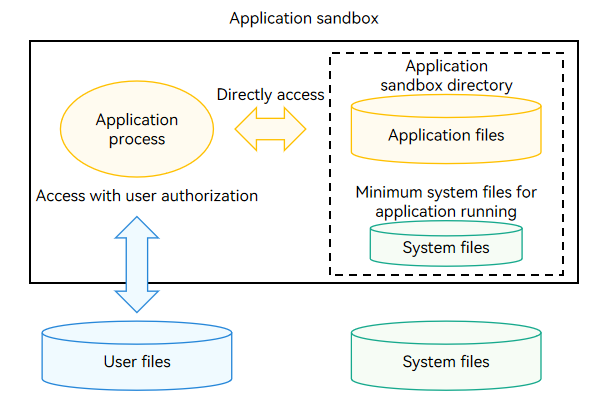
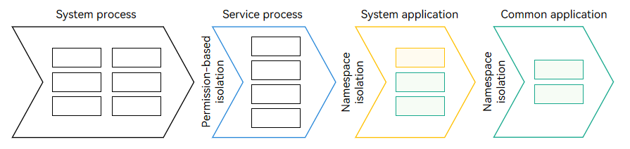
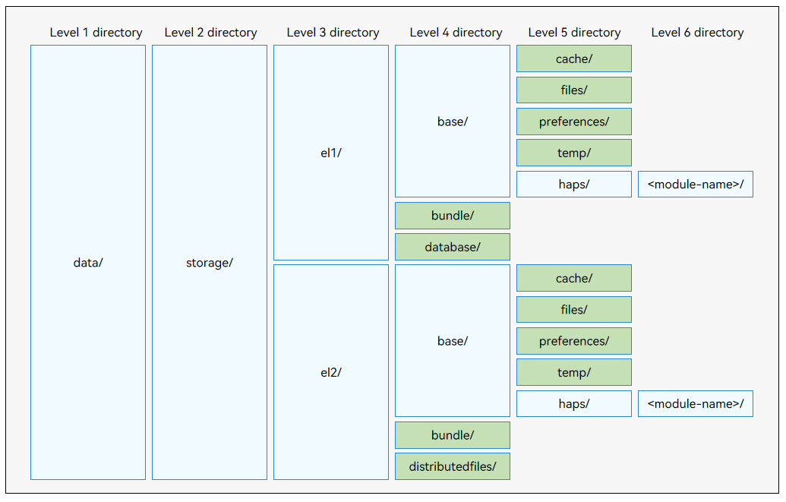

# Application Sandbox

<!--Kit: Core File Kit-->
<!--Subsystem: FileManagement-->
<!--Owner: @wangfenging -->
<!--Designer: @liveery; @zl_startup-->
<!--Tester: @liuhaonan2-->
<!--Adviser: @jinqiuheng-->
<!-- md-trans-meta sourceCommit=a4bb221ea8dcccf781d5793faa6c8f62723e3e12 translatedAt=2026-08-01T07:25:02.163Z pushedAt=2026-08-01T08:41:51.160Z -->

The application sandbox is an isolation mechanism used to prevent malicious data access through path traversal. With this mechanism, only the application sandbox directory is visible to an application.

- The system provides a dedicated application sandbox directory in the internal storage to map the directory of each application. The application sandbox directory contains only the [application file directory](#application-file-directory-and-application-file-path) and the directory containing the minimum system files required for the running of the application.

- The application sandbox limits the scope of data visible to an application. By default, each application can access only its own application files and the system files required for its running. On the device platform where all files are mounted, the File Manager application can view the data stored by other applications under the **el2/base** directory.

- In each application sandbox directory, the application can save and process its application files in the application file directory, and can only read the system files and directories. To access user files, see [User File Overview](user-file-overview.md).

The following figure illustrates the file access mechanism in the application sandbox.

**Figure 1** File access mechanism in the application sandbox 

## Application Sandbox Directory and Application Sandbox Path

With the application sandbox mechanism, an application is not aware of the existence and location of other applications' directories and user file directories. Even the directories visible to an application are isolated by permission and namespace to form an independent directory view and shield the physical (real) paths.

- As shown in the following figure, the application sandbox mechanism minimizes the number of directories and files visible to a common application (third-party application). In addition, the directories and file paths visible to a common application are different from those visible to a system process. The path of a file or folder in the application sandbox directory visible to a common application is called the application sandbox path.

<!--RP1-->

- The hdc shell environment is equivalent to the system process view. Therefore, the application sandbox path is different from the physical path displayed on the hdc for debugging. For details about the mappings, see [Mappings Between Application Sandbox Paths and Physical Paths](#mappings-between-application-sandbox-paths-and-physical-paths).

<!--RP1End-->

- The actual physical path and the sandbox path do not have a one-to-one mapping relationship. The sandbox path is always a subset of the physical paths visible from the system process perspective. Some physical paths visible from the perspective of debugging processes do not have corresponding paths in the corresponding app sandbox directory.

**Figure 2** Different directory views to processes and applications 

## Application File Directory and Application File Path

The application sandbox directory consists of the application file directory and system file directory.

The system file directory visible to an application is preset by OpenHarmony.

The following figure shows the application file directory structure. The path of a file or a directory in the application file directory is called the application file path. Each file path has different attributes and features.

**Figure 3** Application file directory structure 

> **NOTE**
>
> - Do not use file paths made up by level 1 to level 3 directory names. Incompatibility problems may occur if the directory names are changed in later versions.
> - Use **Context** to obtain the application file paths, including but not limited to the directories highlighted in green in **Figure 3**. For details about how to obtain the context and application file paths, see [Context (Stage Model)](../application-models/application-context-stage.md).

1. Level 1 directory **data/**: root directory of app files.

2. Level 2 directory **storage/**: directory for persistent files of the application.

3. There are files of different encryption levels in **el1/** to **el5/**.

    Encryption Level 1 (EL1):

     - All files are protected on the device. After the device is powered on, users can access the files protected by EL1 without identity authentication. This method is not recommended unless otherwise required.

     - The ciphertext stolen from the storage device cannot be decrypted offline.

    Encryption Level 2 (EL2):

     - On the basis of EL1, files are protected after the first user authentication. After the device is powered on, users can access the files protected by EL2 only after the first authentication. Those files are always accessible as long as the device is not powered off. This mode is recommended by default.

     - Files cannot be read by attackers if the phone is lost after power-off.

    Encryption Level 3 (EL3):

     - Files can be created but cannot be read when the screen is locked, which is different from EL4. This mode is not required unless otherwise specified.

    Encryption Level 4 (EL4):

     - On the basis of EL2, files are protected when the device screen is locked. In this case, data protected by EL4 cannot be accessed. This mode is not required unless otherwise specified.

     - Files cannot be read by attackers if the device is stolen with screen locked.

    Encryption Level 5 (EL5):

     - On the basis of EL2, files are protected when the device screen is locked. In this case, data protected by EL5 cannot be accessed, but files can be created, read, and written. This mode is not required unless otherwise specified.

     - EL5 directories are not generated by default unless the permissions for access to the EL5 database are configured. For details about the configuration, see [Using an EL5 Database (ArkTS)](../database/encrypted-estore-guidelines.md).

   > **NOTE**
   >
   > - Unless otherwise required, application data is placed in the **el2** directory for security purposes. The data that needs to be accessed before the first user authentication (such as the clock, alarm, and wallpaper data) is placed in the **el1** directory.
   >
   > - You can listen for the [COMMON_EVENT_USER_UNLOCKED](../reference/apis-basic-services-kit/common_event/commonEventManager-definitions.md#common_event_user_unlocked) event to detect that the first user authentication is complete.
   >
   > - For details about the operations on **el1/** and **el2/**, see [Obtaining and Modifying el Directories](../application-models/application-context-stage.md#obtaining-and-modifying-encryption-levels).

4. Level 4 and level 5 directories:

   The application's global data is stored in the **distributedfiles** directory and **files**, **cache**, **preferences**, and **temp** in **base**. You can use **ApplicationContext** to obtain the application file paths of these directories.

   Files of an OpenHarmony Ability Package (HAP) are stored in the **haps/** directory. You can use **UIAbilityContext**, **AbilityStageContext**, and **ExtensionContext** to obtain application file paths related to a HAP. When a HAP is uninstalled, the files in the **haps/** directory are automatically deleted, without affecting the files in application-level directories. An application in the development state has one or more HAPs. For details, see [Application Package Structure in Stage Model](../quick-start/application-package-structure-stage.md).

   The following table describes the application file paths and their lifecycle.

   **Table 1** Application file paths

   | Folder Name| Context Attribute Name| Type| Description|
   | -------- | -------- | -------- | -------- |
   | bundle | bundleCodeDir | Installation file path | Directory where the app's HAP resource packages reside after app installation; cleaned up upon app uninstallation. Do not access resource files by concatenating paths. Use the relevant APIs of [@ohos.resourceManager (Resource Management)](../reference/apis-localization-kit/js-apis-resource-manager.md) to access resources. The directory can be used for storing the app's code resource data, which mainly includes HAP resource packages installed with the app, reusable library files, and plugin resources. The code resource data stored under this path can be used for dynamic loading.|
   | base | NA | Directory for the device's files| Directory for storing persistent data on the device (the directory is cleared when the application is uninstalled). The subdirectories include **files/**, **cache/**, **temp/**, and **haps/**. You are not advised to store high-risk information such as cookies, passwords, and tokens in plaintext in this directory.|
   | database | databaseDir | Database directory| Directory in **el2** for saving the files operated by the distributed database service. This directory is cleared when the application is uninstalled. This directory can be used to store the application's private database data, such as database files, in distributed scenarios only.|
   | distributedfiles | distributedFilesDir | Distributed file path | Directory for storing distributed files under el2 encryption conditions. Files placed in this directory can be directly accessed across devices in a distributed manner; cleaned up upon app uninstallation. The directory can be used for storing data in app distributed scenarios, which mainly includes app multi-device shared files, app multi-device backup files, and app multi-device group collaboration files. Storing such data under this path makes the app more suitable for multi-device usage scenarios.  **Note:** The **.remote_share** directory under **distributedfiles** is created and managed by the system. Do not create or manipulate it. The **distributedfiles** directory supports direct operations on files on other devices. Do not delete files in this directory arbitrarily. For details, see [Sharing and Accessing Files Across Devices](file-access-across-devices.md).|
   | files | filesDir | Application file directory| Directory for saving the application's persistent files on the device. This directory is cleared when the application is uninstalled. You can place the application's private data, including persistent files, images, media files, and log files, in this directory. The data is stored in this directory to ensure privacy, security, and permanent validity.|
   | cache | cacheDir | Application cache file directory| Directory for caching the downloaded files of the application or saving the cache files regenerated on the device. This directory is automatically cleared when the size of the **cache** directory reaches the quota or the system storage space reaches a certain threshold. End users can also clear this directory by using a system space management application. The application needs to check whether a file still exists and determine whether to cache the file again. This directory is cleared when the application is uninstalled. You can place the cached data of the application, including offline data, cached images, database backup, and temporary files, in this directory. Data stored in this directory may be automatically deleted by the system. Therefore, do not store important data in this directory.|
   | preferences | preferencesDir | Preferences file directory| Directory for saving common application configuration and user preferences managed by ArkData APIs on the device. This directory is cleared when the application is uninstalled. For details about how to make preferences data persistent, see [Persisting Preferences Data](../database/data-persistence-by-preferences.md). You can place application preferences data, including preference files and configuration files, in this directory. This directory applies to storing only a small amount of data.|
   | temp | tempDir | Temporary file directory| Directory for saving the files generated and required during the application's runtime on the device.  This directory is cleared when the application exits. You can place temporarily generated data of the application, including cached database data and images, temporary log files, downloaded application installation packages, in this directory. The data stored in this directory can be deleted immediately after being used.|

## Mappings Between Application Sandbox Paths and Physical Paths

The read and write operations performed on an application sandbox directory are eventually performed on the files in the physical directory after address conversion. The following table lists their mappings.

In the physical paths, &lt;USERID&gt; indicates the ID of the current user, which starts from 100, and &lt;EXTENSIONPATH&gt; is moduleName-extensionName. For details about the application running in an independent Extension sandbox, see [ExtensionAbility Component](../application-models/extensionability-overview.md).

| Application Sandbox Path| Physical Path|
| -------- | -------- |
| /data/storage/el1/bundle | Application installation package directory:  **/data/app/el1/bundle/public/&lt;PACKAGENAME&gt;**|
| /data/storage/el1/base | Application directory of encryption level 1.  - Application running in a non-independent sandbox: **/data/app/el1/&lt;USERID&gt;/base/&lt;PACKAGENAME&gt;**  - Extension application running in an independent sandbox: **/data/app/el1/&lt;USERID&gt;/base/+extension-&lt;EXTENSIONPATH&gt;+&lt;PACKAGENAME&gt;**|
| /data/storage/el2/base | Application directory of encryption level 2.  - Application running in a non-independent sandbox: **/data/app/el2/&lt;USERID&gt;/base/&lt;PACKAGENAME&gt;**  - Extension application running in an independent sandbox: **/data/app/el2/&lt;USERID&gt;/base/+extension-&lt;EXTENSIONPATH&gt;+&lt;PACKAGENAME&gt;**|
| /data/storage/el1/database | Database directory of the application under **el1/**.  - Application running in a non-independent sandbox: **/data/app/el1/&lt;USERID&gt;/database/&lt;PACKAGENAME&gt;**  - Extension application running in an independent sandbox: **/data/app/el1/&lt;USERID&gt;/database/+extension-&lt;EXTENSIONPATH&gt;+&lt;PACKAGENAME&gt;**|
| /data/storage/el2/database | Database directory of the application under **el2/**.  - Application running in a non-independent sandbox: **/data/app/el2/&lt;USERID&gt;/database/&lt;PACKAGENAME&gt;**  - Extension application running in an independent sandbox: **/data/app/el2/&lt;USERID&gt;/database/+extension-&lt;EXTENSIONPATH&gt;+&lt;PACKAGENAME&gt;**|
| /data/storage/el2/distributedfiles | Distributed data directory with an account under **el2/**.  - Physical directory: **/mnt/hmdfs/&lt;USERID&gt;/account/merge_view/data/&lt;PACKAGENAME&gt;** |