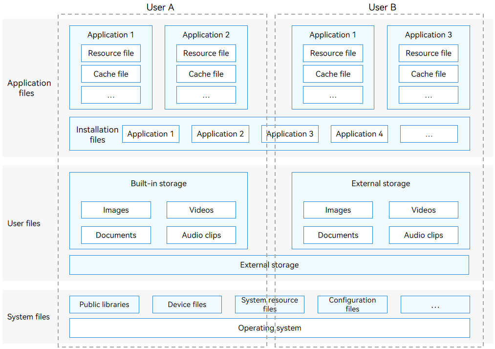
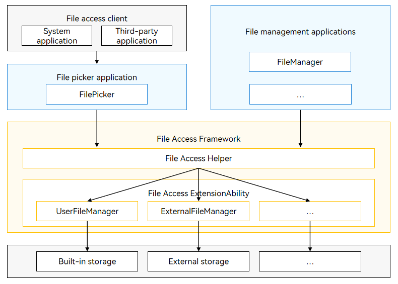

# Introduction to Core File Kit
<!--Kit: Core File Kit-->
<!--Subsystem: FileManagement-->
<!--Owner: @wangke25; @gsl_1234; @wuchengjun5-->
<!--Designer: @gsl_1234; @wangke25-->
<!--Tester: @liuhonggang123; @yue-ye2; @juxiaopang-->
<!--Adviser: @foryourself-->

Core File Kit provides capabilities for accessing and managing application files and user files. You can use the APIs provided by Core File Kit to manage, search for, and back up different types of files efficiently.

## Overview

In Core File Kit, the files are classified into the following types based on the file owner:

- [Application files](app-file-overview.md): files of an application, including the installation files, resource files, and cache files of the application.

- [User files](user-file-overview.md): files of a user who has logged in to the device. User files include the user's images, videos, audio clips, and documents.

- System files: files irrelevant to applications and users. System files include public libraries, device files, and system resource files. The system files do not need to be managed by developers and are not described in this document.

The file systems can be classified into the following types based on the file storage location (location of the data source):

- Local file system: allows access to the files stored on a device and its external storage devices (such as USB flash drives and removable hard drives). The local file system is the most basic file system and is not described in this document.

- [Distributed file system](distributed-fs-overview.md): allows access to files across devices, which include not only the local device and its external storage devices, but also the devices connected over a computer network.

**Figure 1** File classification model

## When to Use

You can use Core File Kit in any of the following scenarios:

- Access to and share of application files
- Backup and restore of application data
- Operations for selecting and saving user files
- Cross-device file access and sharing

## Available Capabilities

- Accessing application files, including viewing, creating, reading, writing, delete, moving, and copying an application file, and obtaining attributes of an application file.
- Uploading application files to a network server and downloading network resource files from a network server to the local application file directory.
- Obtaining the storage space of an application, and the total and available space of a file system.
- Sharing application files to other applications and using the files shared by other applications.
- Accessing the data backup and restore framework to customize data backup and restore behaviors, such as whether to allow backup and restore and specifying the data to be backed up, by modifying the configuration file.<!--Del-->
- Triggering data backup and restore (available only for system applications).
<!--DelEnd-->
- Accessing and managing user files with the [user file access framework](#user-file-access-framework). For example, selecting and saving user files<!--Del--> and developing a user file manager (available only for system applications)<!--DelEnd-->.
- Accessing and copying files across devices.

## Features

- Sandbox isolation:
Each application has a dedicated [sandbox directory](app-sandbox-directory.md) in the internal storage. The sandbox directory is a collection of the [application file directory](app-sandbox-directory.md#application-file-directory-and-application-file-path) and the system files required for application running. The sandbox feature stands out with the following advantages:
  - Isolation: The application sandbox provides a completely isolated environment to ensure secure access to application files.
  - Security: The application sandbox defines the minimum data visible to each application, which protects application file security.
- Application share:
Files can be shared between applications by uniform resource identifier (URI) or file descriptor (FD). The application share feature has the following advantages:
  - Portability: Files can be easily shared between applications, without the need for the user to switch between different applications.
  - High efficiency: Files can be quickly transferred between applications, which eliminates redirections and the response time.
  - Data consistency: File share between applications ensures data integrity and consistency, preventing data corruption or loss during transmission.
  - Security: File share between applications prevents files from being illegally obtained or tampered with. In addition, authorized file access further enhances file security.

## Working Principles

### Application File Access Framework

The application file access framework is implemented through [ohos.file.fs](../reference/apis-core-file-kit/js-apis-file-fs.md). You do not need to care about the internal implementation. For details about the basic file operation APIs, see [Available APIs](app-file-access.md#available-apis).

### User File Access Framework

You can use the user file access framework to access and manage user files. This framework leverages the ExtensionAbility of OpenHarmony to provide a set of methods and interfaces for accessing user files.

**Figure 2** User file access framework

- The file access client (a system application or third-party application) can access user files, for example, select a photo or save multiple documents, by starting the **FilePicker** application.

- **FilePicker**: a system prebuilt application that allows a client to select and save user files without any permission. For details, see [Selecting User Files](select-user-file.md).

- **FileManager**: You can also develop your own file picker or file manager application as required. <!--RP1-->File picker is a subset of file manager. For details about how to develop a file manager application, see [Developing a File Manager Application](dev-user-file-manager.md).<!--RP1End-->

- The user file access framework provides the following functional modules:
  - **File Access Helper**: provides APIs for the **FileManager** and **FilePicker** to access user files.
  - **File Access ExtensionAbility**: implements file access via the following services:
    - **UserFileManager**: implements management of the files on the built-in storage based on the File Access ExtensionAbility framework.
    - **ExternalFileManager**: implements management of the files on the external storage based on the File Access ExtensionAbility framework.

## Related Kits

Ability Kit: The user file access framework of Core File Kit depends on the Extension capability provided by Ability Kit and is scheduled and managed by Ability Kit.

