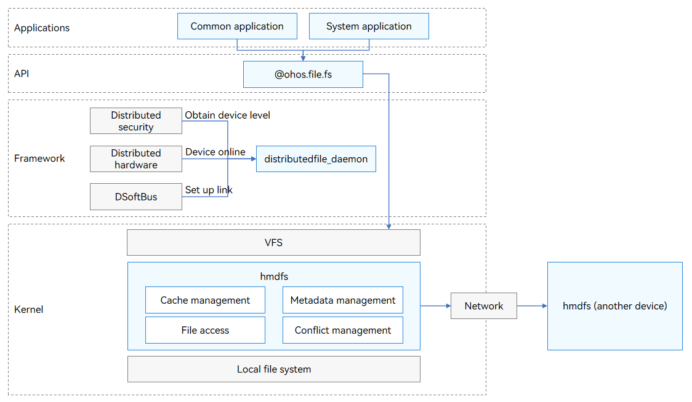

# Distributed File System Overview

OpenHarmony distributed file system (hmdfs) provides cross-device file access capabilities in the following scenarios:

- The user uses the editing software on one device to edit the files on another device.

- Music stored on a tablet can be directly viewed and played by an in-car infotainment system.

- The user uses a tablet to view the photos taken by another device.

The hmdfs provides a globally consistent access view across devices dynamically connected to a network via DSoftBus and allows you to implement high-performance read and write operations on files with low latency by using basic file system APIs.

## Distributed File System Architecture

- distributedfile_daemon: listens for device online status, establishes links over DSoftBus, and applies data transfer policies based on the security level of the device.

- hmdfs: implements a network file system in the kernel and provides cache management, file access, metadata management, and conflict resolution.
  - Cache management
    - After devices are connected to form a Virtual Device, the hmdfs provides file access capabilities, but does not proactively transmit or copy files. Active copy is required when an application needs to save data to a local directory.
    - The hmdfs ensures close-to-open cache consistency, which allows data to be flushed when a client closes a file. Then, the latest data can be read when the file is opened on any other client. The hmdfs does not ensure real-time consistency of the file content.
    - If data written at the remote end has not been flushed to the local end in a timely manner due to network problems, the file system flushes the data to the local end upon the next network access. However, if the data has been modified on the remote end, only the latest data can be flushed.
  - File access
    - OpenHarmony provides the unified [ohos.file.fs](../reference/apis-core-file-kit/js-apis-file-fs.md) APIs for accessing the local and distributed file systems.
    - The files in the local file system are accessed in overlay mode.
    - The files on another device are accessed over a synchronous network.
        > **NOTE**
        >
        > symlink is not supported.
  - Metadata management
    - In distributed networking, file creation, deletion, and modification on a device are synced to another device, at a speed subject to the network condition.
    - If a device goes offline, its data is no longer visible to other devices. However, due to the delay in sensing the device offline, the files of some offline devices may also be visible to other devices. Therefore, you need to consider the network delay in application development.
  - Conflict resolution
    - If a file name conflict occurs on the local and remote devices, the file on the remote device is renamed.
    - If a file name conflict occurs between multiple remote devices, the name of the file with the smallest device access ID is retained and the files on other devices are renamed.
    - If the directory tree already has remote files in networking scenario, a file with a duplicate file name cannot be created successfully.
    - The conflict files are renamed in "_conflict_dev_ID" format. The IDs automatically increment from 1.
    - If a local directory and a remote directory have the same name, it does not yield a conflict. The files of the two directories will be merged. For the files with the same name, the name of the file in the remote directory will be appended with "_remote_directory".
