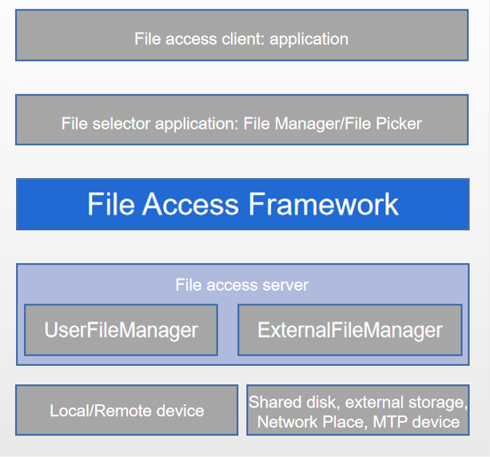

# File Access Framework Overview

On devices running OpenHarmony 3.2 (API version 9) or later, applications can access public files on the local device, remote device, and external storage device, as well as files shared by multiple users, based on the File Access Framework (FAF).

To ensure user data privacy, this framework allows users to create, open, delete, rename, and move files on the file access server only through the **File Manager** and **File Picker** applications.

The user data of an application is stored on the device even after the application is uninstalled.

If a system application needs to access public files on the local device, use [File Path Management](medialibrary-filepath-guidelines.md).

> **NOTE**
> 1. For a non-management system application, for example, **Gallery**, use the **mediaLibrary** APIs for direct file operation.
> 2. In principle, do not mix use the FAF APIs with the mediaLibrary APIs.

## FAF Mechanism
Based on the OpenHarmony [ExtensionAbility mechanism](../application-models/extensionability-overview.md), the FAF provides unified APIs for external systems. With these APIs, applications can preview and operate public files to implement their own logic.

You can visit the [source repository](https://gitee.com/openharmony/filemanagement_user_file_service) for more details.

The following figure shows the FAF-based file operation process.

**Figure 1** Hierarchy of public file operations

- **File access client**: an application that needs to access or operate public files. By starting the file selector application, it enables users to perform file operations on the UI.
- **File selector application**: a system application that allows users to access all shared datasets. You can use the FAF APIs to operate the datasets.
- **File access server**: a service that supports dataset sharing in the system. Currently, [UserFileManager](https://gitee.com/openharmony/multimedia_medialibrary_standard) and ExternalFileManager are available. UserFileManager manages datasets on local disks and distributed devices, and ExternalFileManager manages datasets on external storage devices such as SD cards and USB flash drives. You can also share your own datasets based on the FAF server configuration.

The FAF has the following features:
- Users can browse the datasets provided by all file server applications in the system, rather than those provided by a single application.
- The file access client can operate files through the file selector application, without obtaining the permission to use the FAF.
- Multiple temporarily mounted devices, such as external storage cards and distributed devices, can be accessed at the same time.

## Data Models
Data models in the FAF are transferred through URI, FileInfo, and RootInfo. For details, see [fileExtension](../reference/apis/js-apis-fileExtensionInfo.md). Applications on the file access server can use the **FileAccessExtensionAbility** APIs to securely share their data.

**Figure 2** Data flow of the public file access framework

NOTE
- In the FAF, the file access client does not directly interact with the file access server. The client only needs to have the permission to start the file selector application.
- The file selector application provides a standard document access UI for users, even if the underlying file access servers differ greatly.
