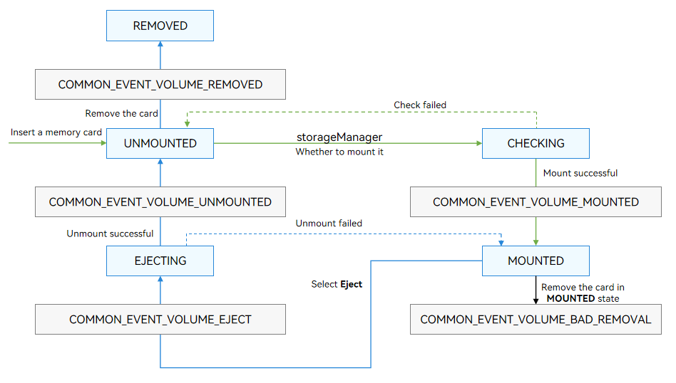

# Managing External Storage Devices (for System Applications Only)

Because external storage devices are pluggable, OpenHarmony provides functions for listening for the device insertion/removal events and mounting/unmounting an external storage device.

External storage devices are managed by the StorageManager and StorageDaemon services. StorageDaemon implements underlying listening and mount/unmount functions. StorageManager provides status change notifications and query and management of external storage devices for system applications.

**Figure 1** External storage device management 



- When an external storage device is inserted, the StorageDaemon process obtains an insertion event over netlink and creates a disk device and volume. The created volume is in the **UNMOUNTED** state.

- Then, the StorageDaemon process checks the volume. The volume transits to the **CHECKING** state.
  - If the check is successful, the StorageDaemon process mounts the volume. If the mount operation is successful, the volume state changes to **MOUNTED** and StorageManager is instructed to send the COMMON_EVENT_VOLUME_MOUNTED broadcast.
  - If the check fails, the volume state changes to **UNMOUNTED**.

- For a volume in the **MOUNTED** state:
  - If the user chooses **Eject device**, the volume state changes to **EJECTING** and COMMON_EVENT_VOLUME_EJECT is broadcast. After StorageDaemon unmounts the volume, the volume state changes to **UNMOUNTED** and COMMON_EVENT_VOLUME_UNMOUNTED is broadcast.
    <br>For a volume in the **UNMOUNTED** state, removing the device will delete the volume information and broadcast COMMON_EVENT_VOLUME_REMOVED.
  - If the user removes the device, the volume state changes to **EJECTING** and then to **UNMOUNTED**, and the broadcasts of the corresponding states are sent. After the device is removed, the volume information is deleted and the COMMON_EVENT_VOLUME_BAD_REMOVAL broadcast is sent.

## Available APIs

For details about APIs related to external storage device management, see [Volume Management](../reference/apis-core-file-kit/js-apis-file-volumemanager-sys.md).

The following table describes the broadcast related parameters.

**Table 1** Broadcast parameters

| Broadcast| Parameter| 
| -------- | -------- |
| usual.event.data.VOLUME_REMOVED | **id**: ID of the volume.<br>**diskId**: ID of the disk to which the volume belongs.| 
| usual.event.data.VOLUME_UNMOUNTED | **id**: ID of the volume.<br>**diskId**: ID of the disk to which the volume belongs.<br>**volumeState**: state of the volume.| 
| usual.event.data.VOLUME_MOUNTED | **id**: ID of the volume.<br>**diskId**: ID of the disk to which the volume belongs.<br>**volumeState**: state of the volume.<br>**fsUuid**: universally unique identifier (UUID) of the volume.<br>**path**: path where the volume is mounted.| 
| usual.event.data.VOLUME_BAD_REMOVAL | **id**: ID of the volume.<br>**diskId**: ID of the disk to which the volume belongs.| 
| usual.event.data.VOLUME_EJECT | **id**: ID of the volume.<br>**diskId**: ID of the disk to which the volume belongs.<br>**volumeState**: state of the volume.| 

## How to Develop

You can subscribe to broadcast events to observe the insertion and removal of external storage devices, and query or manage volumes based on the volume information obtained from the broadcast.

1. Apply for permissions.<br>
   Apply for the ohos.permission.STORAGE_MANAGER permission if your application needs to subscribe to volume broadcast events. For details, see [Requesting Permissions for system_basic Applications](../security/AccessToken/determine-application-mode.md#requesting-permissions-for-system_basic-applications).

2. Subscribe to broadcast events.<br>
   You can subscribe to the following events:

   - "usual.event.data.VOLUME_REMOVED": The device is removed.
   - "usual.event.data.VOLUME_UNMOUNTED": The volume is unmounted.
   - "usual.event.data.VOLUME_MOUNTED": The volume is mounted.
   - "usual.event.data.VOLUME_BAD_REMOVAL": The device is forcibly removed.
   - "usual.event.data.VOLUME_EJECT": The device is being ejected.

   ```ts
   import { commonEventManager } from '@kit.BasicServicesKit';
   import { volumeManager } from '@kit.CoreFileKit';
   import { BusinessError } from '@kit.BasicServicesKit';

   let subscriber: commonEventManager.CommonEventSubscriber;
   async function example() {
     const subscribeInfo: commonEventManager.CommonEventSubscribeInfo = {
       events: [
         "usual.event.data.VOLUME_REMOVED",
         "usual.event.data.VOLUME_UNMOUNTED",
         "usual.event.data.VOLUME_MOUNTED",
         "usual.event.data.VOLUME_BAD_REMOVAL",
         "usual.event.data.VOLUME_EJECT"
       ]
     };
     subscriber = await commonEventManager.createSubscriber(subscribeInfo);
   }
   ```

3. Obtain volume information from the broadcast.

   ```ts
   commonEventManager.subscribe(subscriber, (err: BusinessError, data: commonEventManager.CommonEventData) => {
     if (data.event === 'usual.event.data.VOLUME_MOUNTED') {
       // Manage the volume device based on the information obtained from the broadcast.
       let volId: string = data.parameters.id;
       volumeManager.getVolumeById(volId, (error: BusinessError, vol: volumeManager.Volume) => {
         if (error) {
           console.error('volumeManager getVolumeById failed for ' + JSON.stringify(error));
         } else {
           console.info('volumeManager getVolumeById successfully, the volume state is ' + vol.state);
         }
       })
     }
   })
   ```
