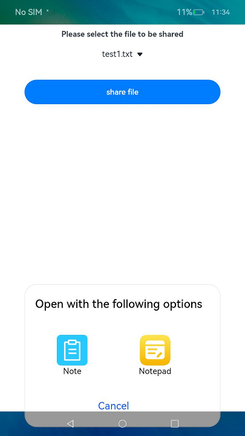

# Sharing an Application File

An application can share a file with another application based on the file descriptor (FD) or uniform resource identifier (URI) of the file. 

- URI-based file sharing: You can use [wantConstant.Flags](../reference/apis/js-apis-app-ability-wantConstant.md#wantconstantflags) to specify the read or read/write permission on the file for the target application (application with which the file is shared). The target application calls **open()** of the [ohos.file.fs](../reference/apis/js-apis-file-fs.md#fsopen) module to open the file based on the URI, and then read or write the file based on the permission granted. OpenHarmony API version 9 supports only temporary authorization. The permission on the shared file is revoked once the target application exits.
- FD-based sharing: You can use **open()** of the ohos.file.fs module to specify the read or read/write permission on the file for the target application. After parsing the FD in **Want**, the target application can read or write the file by using **read()** or **write()** API of ohos.file.fs based on the permission granted.

After the FD of a shared file is closed, the target application can no longer open the shared file. Therefore, FD-based file sharing is not recommended. This topic describes how to [share an application file](#sharing-an-application-file) and [use a shared file](#using-a-shared-file) based on the file URI.

## Shareable Application Directories

| Application Sandbox Path                            | Physical Path                                                                            | Description &emsp;&emsp;&emsp;&emsp;&emsp;&emsp;&emsp;&emsp;&emsp;&emsp;&emsp;&emsp;|
| -------                              | -------                                                                             | ---- |
| /data/storage/el1/base               | /data/app/el1/\<currentUserId\>/base/\<PackageName\>                                | Encrypted database directory under **/el1**.|
| /data/storage/el2/base               | /data/app/el2/\<currentUserId\>/base/\<PackageName\>                                | Encrypted database directory under **/el2**.|
| /data/storage/el2/distributedfiles   | /mnt/hmdfs/\<currentUserId\>/account/device_view/\<networkId\>/data/\<PackageName\> | Distributed data directory under **el2/**.|

## File URI Specifications

The file URIs are in the following format:

  **file**://&lt;bundleName&gt;/&lt;path&gt;

- **file**: indicates a file URI.

- *bundleName*: specifies the owner of the file, that is, the application that shares the file.

- *path*: specifies the application sandbox path of the file.

## Sharing an Application File

Before sharing an application file, you need to [obtain the application file path](../application-models/application-context-stage.md#obtaining-application-file-paths).

1. Obtain the application sandbox path of the file and convert it into the file URI.

   ```ts
   import UIAbility from '@ohos.app.ability.UIAbility';
   import fileuri from '@ohos.file.fileuri';
   import window from '@ohos.window';
   
   export default class EntryAbility extends UIAbility {
     onWindowStageCreate(windowStage: window.WindowStage) {
       // Obtain the application sandbox path of the file.
       let pathInSandbox = this.context.filesDir + "/test.txt";
       // Convert the application sandbox path into a URI.
       let uri = fileuri.getUriFromPath(pathInSandbox);
       // The obtained URI is file://com.example.demo/data/storage/el2/base/files/test.txt.
     }
   }
   ```

2. Set the target application and grant permissions on the file.
   Use [startAbility()](../reference/apis/js-apis-inner-application-uiAbilityContext.md#uiabilitycontextstartability) to start the target application. You need to pass in the obtained URI in **uri** of the **want** parameter, set the type of the file to share, set **action** to **ohos.want.action.sendData**, and set the granted permissions on the file in **flags**. For details, see [Want](../reference/apis/js-apis-app-ability-want.md#attributes).

   > **NOTE**
   >
   > The write permission granted includes the read permission.

   ```ts
   import fileuri from '@ohos.file.fileuri';
   import window from '@ohos.window';
   import wantConstant from '@ohos.app.ability.wantConstant';
   import UIAbility from '@ohos.app.ability.UIAbility';
   import Want from '@ohos.app.ability.Want';
   import { BusinessError } from '@ohos.base';
   
   export default class EntryAbility extends UIAbility {
     onWindowStageCreate(windowStage: window.WindowStage) {
       // Obtain the application sandbox path of the file.
       let filePath = this.context.filesDir + '/test.txt';
       // Convert the application sandbox path into a URI.
       let uri = fileuri.getUriFromPath(filePath);
       let want: Want  = {
         // Grant the read and write permissions on the shared file to the target application.
         flags: wantConstant.Flags.FLAG_AUTH_WRITE_URI_PERMISSION | wantConstant.Flags.FLAG_AUTH_READ_URI_PERMISSION,
         // Set the implicit startup rule for the target application.
         action: 'ohos.want.action.sendData',
         uri: uri,
         type: 'text/plain'
       }
       this.context.startAbility(want)
         .then(() => {
           console.info('Invoke getCurrentBundleStats succeeded.');
         })
         .catch((err: BusinessError) => {
           console.error(`Invoke startAbility failed, code is ${err.code}, message is ${err.message}`);
         });
     }
     // ...
   }
   ```
**Figure 1** Example<br>


## Using a Shared File

In the [**module.json5** file](../quick-start/module-configuration-file.md) of the target application, set **actions** to **ohos.want.action.sendData** to allow the application to receive files shared by others and set **uris** to the type of the URI to receive. In the following example, the target application receives only .txt files with **scheme** of **file**.

```json
{
  "module": {
    ...
    "abilities": [
      {
        ...
        "skills": [
          {
            ...
            "actions": [
              "ohos.want.action.sendData"
            ],
            "uris": [
              {
                "scheme": "file",
                "type": "text/plain"
              }
           ]
          }
        ]
      }
    ]
  }
}
```

After the UIAbility starts, the target application obtains **want** information via [**onCreate()**](../reference/apis/js-apis-app-ability-uiAbility.md#uiabilityoncreate) or [**onNewWant()**](../reference/apis/js-apis-app-ability-uiAbility.md#uiabilityonnewwant).

After obtaining the URI of the shared file in **want**, the target application can call **fs.open()** to open the file and then read or write the file.

```ts
// xxx.ets
import fs from '@ohos.file.fs';
import Want from '@ohos.app.ability.Want';
import { BusinessError } from '@ohos.base';

function getShareFile() {
  try {
    let want: Want = ...; // Obtain the want information sent from the application that shares the file.

    // Obtain the uri field from the want information.
    let uri = want.uri;
    if (uri == null || uri == undefined) {
      console.info('uri is invalid');
      return;
    }
    try {
      // Perform operations on the URI of the shared file as required. For example, open the URI to obtain the file object in read/write mode.
      let file = fs.openSync(uri, fs.OpenMode.READ_WRITE);
      console.info('open file successfully!');
    } catch (err) {
      let error: BusinessError = err as BusinessError;
      console.error(`Invoke openSync failed, code is ${error.code}, message is ${error.message}`);
    }
  } catch (error) {
    let err: BusinessError = error as BusinessError;
    console.error(`Invoke openSync failed, code is ${err.code}, message is ${err.message}`);
  }
}
```