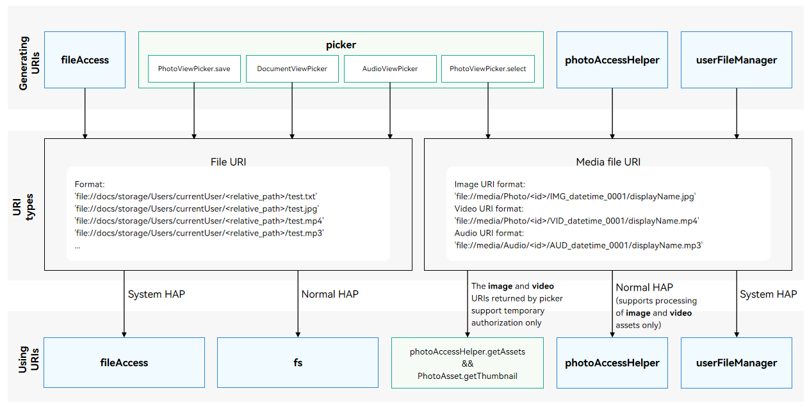

# User File URI

As a unique identifier of a user file, the uniform resource identifier (URI) is usually used to specify the user file to be accessed or modified. Avoid using part of an URI for service code development.

## URI Types

The URIs in the system can be classified into the following types:

- Document URI: URI of a file selected or saved by the file manager started by picker, or obtained via the **fileAccess** module. For details, see [Obtaining a Document URI](#obtaining-a-document-uri).
- Media file URI: URI of an image or video selected from **Gallery** by picker; URI of an image or video obtained via the **photoAccessHelper** module; URI of an image, video, or audio file obtained via the **userFileManager** module. For details, see [Obtaining a Media File URI](#obtaining-a-media-file-uri).



## Document URI

### Document URI Overview

The document URIs are in the following format:

'file://docs/storage/Users/currentUser/\<relative_path\>/test.txt'

The following table describes the fields in a document URI.

| URI Field         | Description       |
| ------------- | ------------------- |
| 'file://docs/storage/Users/currentUser/' | Indicates the root directory of the file manager.|
| '\<relative_path\>/' | Indicates the relative path of the file, for example, **Download/** and **Documents/**.|
| 'test.txt' | Indicates the name of the file stored in the user file system. The supported file types vary, depending on the file manager used. Common file types include TXT, JPG, MP4, and MP3.|

### Obtaining a Document URI

1. Call **select()** or **save()** of [DocumentViewPicker](../reference/apis-core-file-kit/js-apis-file-picker.md#documentviewpicker) to select or save a document.

2. Call **select()** or **save()** of [AudioViewPicker](../reference/apis-core-file-kit/js-apis-file-picker.md#audioviewpicker) to select or save an audio file.<!--Del-->

3. Call [@ohos.file.fileAccess](../reference/apis-core-file-kit/js-apis-fileAccess-sys.md). The [FileInfo](../reference/apis-core-file-kit/js-apis-fileAccess-sys.md#fileinfo) object contains the URI of the file or directory. Note that the APIs of [@ohos.file.fileAccess](../reference/apis-core-file-kit/js-apis-fileAccess-sys.md) can be called only by system applications. You can obtain the document URIs of the files and folders in the following directories:
   - External storage directory
   - **Docs** directory
   - **Download** directory
   - **Desktop** directory
   - **Documents** directory
   - **Share** directory of the shared disk
<!--DelEnd-->

### Using a Document URI

Applications of the normal APL can call [@ohos.file.fs](../reference/apis-core-file-kit/js-apis-file-fs.md) APIs only to access files based on document URIs. "Permission denied" will be reported if an API of other modules is used. For details about the sample code, see [Selecting Documents](./select-user-file.md#selecting-documents) and [Saving Documents](./save-user-file.md#saving-documents).<!--Del-->

Applications of the system_basic or system_core APL can call **@ohos.file.fs** and [@ohos.file.fileAccess](../reference/apis-core-file-kit/js-apis-fileAccess-sys.md) APIs to access files based on the URIs. To call **@ohos.file.fileAccess** APIs, the application must have the ohos.permission.FILE_ACCESS_MANAGER and ohos.permission.GET_BUNDLE_INFO_PRIVILEGED permissions declared in **module.json5** file. "Permission denied" will be reported if an API of other modules is used. The following example walks you through on how to use **@ohos.file.fileAccess** APIs to create a document and rename the document based on the URI.

1. Call [@ohos.file.fileAccess](../reference/apis-core-file-kit/js-apis-fileAccess-sys.md) to create a document. The URI of the document is returned.
2. Rename the document based on its URI.

```ts
import { BusinessError } from '@kit.BasicServicesKit';
import { Want } from '@kit.AbilityKit';
import { common } from '@kit.AbilityKit';
import { fileAccess } from '@kit.CoreFileKit';
// The context is passed from EntryAbility. Ensure that the return value of this.getUIContext().getHostContext() is UIAbilityContext.
let context = this.getUIContext().getHostContext() as common.UIAbilityContext; 

async function example(context: common.UIAbilityContext) {
    let fileAccessHelper: fileAccess.FileAccessHelper;
    // Obtain wantInfos by using getFileAccessAbilityInfo().
    let wantInfos: Array<Want> = [
      {
        bundleName: "com.ohos.UserFile.ExternalFileManager",
        abilityName: "FileExtensionAbility",
      },
    ]
    try {
      fileAccessHelper = fileAccess.createFileAccessHelper(context, wantInfos);
      if (!fileAccessHelper) {
        console.error("createFileAccessHelper interface returns an undefined object");
      }
      // A built-in storage directory is used as an example.
      // In the sample code, sourceUri indicates the Download directory. The URI is the URI in fileInfo.
      // Use the URI obtained.
      let sourceUri: string = "file://docs/storage/Users/currentUser/Download";
      let displayName: string = "file1.txt";
      let fileUri: string;
      try {
        // Create a document. The URI of the document created is returned.
        fileUri = await fileAccessHelper.createFile(sourceUri, displayName);
        if (!fileUri) {
          console.error("createFile return undefined object");
        }
        console.info("createFile success, fileUri: " + JSON.stringify(fileUri));
        // Rename the document. The URI of the renamed document is returned.
        let renameUri = await fileAccessHelper.rename(fileUri, "renameFile.txt");
        console.info("rename success, renameUri: " + JSON.stringify(renameUri));
      } catch (err) {
        let error: BusinessError = err as BusinessError;
        console.error("createFile failed, errCode:" + error.code + ", errMessage:" + error.message);
      }
    } catch (err) {
      let error: BusinessError = err as BusinessError;
      console.error("createFileAccessHelper failed, errCode:" + error.code + ", errMessage:" + error.message);
    }
  }
```
<!--DelEnd-->

## Media File URI

### Media File URI Overview

The URI format varies depending on the media file type.

Image URI format:

- 'file://media/Photo/\<id\>/IMG_datetime_0001/displayName.jpg'

Video URI format:

- 'file://media/Photo/\<id>/VID_datetime_0001/displayName.mp4'

Audio file URI format:

- 'file://media/Audio/\<id>/AUD_datetime_0001/displayName.mp3'

The following table describes the fields in a media file URI.

| URI Field         | Description       |
| ------------- | ------------------- |
| 'file://media' | Indicates a URI of a media file.|
| 'Photo' | Indicates a URI of an image or video.|
| 'Audio' | Indicates a URI of an audio file.|
| '\<id>' | Indicates the ID of the file after being processed in multiple tables in the database. It is not the value in the **file_id** column in the table. Do not use this ID to query a file in the database.|
| 'IMG_datetime_0001' | Indicates the name of the image stored in the user file system without the file name extension.|
| 'VID_datetime_0001' | Indicates the name of the video stored in the user file system without the file name extension.|
| 'AUD_datetime_0001' | Indicates the name of the audio file stored in the user file system without the file name extension.|
|<!--DelRow--> 'displayName.jpg' | Indicates the image name displayed. You can use [userFileManager.commitModify](../reference/apis-core-file-kit/js-apis-userFileManager-sys.md#commitmodify) to rename it. Note that the URI of the new image name is also changed.|
|<!--DelRow--> 'displayName.mp4' | Indicates the video name displayed. You can use [userFileManager.commitModify](../reference/apis-core-file-kit/js-apis-userFileManager-sys.md#commitmodify) to rename it. Note that the URI of the new video name is also changed.|
|<!--DelRow--> 'displayName.mp3' | Indicates the audio file name displayed. You can use [userFileManager.commitModify](../reference/apis-core-file-kit/js-apis-userFileManager-sys.md#commitmodify) to rename it. Note that the URI of the new audio name is also changed.|

### Obtaining a Media File URI

1. Call [PhotoViewPicker of PhotoAccessHelper](../reference/apis-media-library-kit/arkts-apis-photoAccessHelper-PhotoViewPicker.md) to select media files. The URIs of the selected files are returned.

2. Call [getAssets](../reference/apis-media-library-kit/arkts-apis-photoAccessHelper-PhotoAccessHelper.md#getassets) or [createAsset](../reference/apis-media-library-kit/arkts-apis-photoAccessHelper-PhotoAccessHelper.md#createasset) API in [photoAccessHelper](../reference/apis-media-library-kit/arkts-apis-photoAccessHelper.md) to obtain the URIs of the selected files.<!--Del-->

3. Call [getPhotoAssets](../reference/apis-core-file-kit/js-apis-userFileManager-sys.md#getphotoassets), [getAudioAssets](../reference/apis-core-file-kit/js-apis-userFileManager-sys.md#getaudioassets), [createAudioAsset](../reference/apis-core-file-kit/js-apis-userFileManager-sys.md#createaudioasset10), or [createPhotoAsset](../reference/apis-core-file-kit/js-apis-userFileManager-sys.md#createphotoasset) of [userFileManager](../reference/apis-core-file-kit/js-apis-userFileManager-sys.md).
<!--DelEnd-->

### Using a Media File URI

Applications of the normal APL can call [photoAccessHelper](../reference/apis-media-library-kit/arkts-apis-photoAccessHelper.md) APIs to process media files based on their URI. For details about the sample code, see [Obtaining an Image or Video by URI](../media/medialibrary/photoAccessHelper-photoviewpicker.md#obtaining-an-image-or-video-by-uri). To call the API, the application must have the ohos.permission.READ_IMAGEVIDEO permission.<!--Del-->

Applications of the system_basic or system_core APL can call **photoAccessHelper** and [userFileManager](../reference/apis-core-file-kit/js-apis-userFileManager-sys.md) APIs to process media files based on their URI. For details about how to use the APIs, see the API reference document.
<!--DelEnd-->

If you do not want to request the permission for a normal application, call [PhotoViewPicker of PhotoAccessHelper](../reference/apis-media-library-kit/arkts-apis-photoAccessHelper-PhotoViewPicker.md) to obtain the file URI and call [photoAccessHelper.getAssets](../reference/apis-media-library-kit/arkts-apis-photoAccessHelper-PhotoAccessHelper.md#getassets) to obtain the **PhotoAsset** object based on the URI. Based on the **PhotoAsset** object, you can use [getThumbnail](../reference/apis-media-library-kit/arkts-apis-photoAccessHelper-PhotoAsset.md#getthumbnail) to obtain the image thumbnail or use [get](../reference/apis-media-library-kit/arkts-apis-photoAccessHelper-PhotoAsset.md#get) to obtain information from [PhotoKeys](../reference/apis-media-library-kit/arkts-apis-photoAccessHelper-e.md#photokeys).

The following information can be obtained from **PhotoKeys** through temporary authorization:

| Name         | Value             | Description                                                      |
| ------------- | ------------------- | ---------------------------------------------------------- |
| URI           | 'uri'                 | URI of the file.                                                  |
| PHOTO_TYPE    | 'media_type'           | Type of the media file.                                             |
| DISPLAY_NAME  | 'display_name'        | File name displayed.                                                  |
| SIZE          | 'size'                | Size of the file.                                                  |
| DATE_ADDED    | 'date_added'          | Unix timestamp when the file was added, in seconds.           |
| DATE_MODIFIED | 'date_modified'       | Unix timestamp when the file content (not the file name) was last modified, in seconds.  |
| DURATION      | 'duration'            | Duration, in ms.                                   |
| WIDTH         | 'width'               | Image width, in pixels.                                   |
| HEIGHT        | 'height'              | Image height, in pixels.                                     |
| DATE_TAKEN    | 'date_taken'          | Unix timestamp when the photo was taken, in seconds.               |
| ORIENTATION   | 'orientation'         | Orientation of the image file.                                            |
| TITLE         | 'title'               | Title in the file.                                                  |

The following example shows how to obtain the thumbnail and file information based on the media file URI with temporary authorization.

```ts
import { photoAccessHelper } from '@kit.MediaLibraryKit';
import { BusinessError } from '@kit.BasicServicesKit';
import { dataSharePredicates } from '@kit.ArkData';

// Define an array of URIs to hold the URIs returned by PhotoViewPicker.select.
let uris: Array<string> = [];
// The context is passed from EntryAbility. Ensure that the return value of this.getUIContext().getHostContext() is UIAbilityContext.
let context = this.getUIContext().getHostContext() as common.UIAbilityContext; 

// Call PhotoViewPicker.select to select an image.
async function photoPickerGetUri(context: common.UIAbilityContext) {
  try {  
    let PhotoSelectOptions = new photoAccessHelper.PhotoSelectOptions();
    PhotoSelectOptions.MIMEType = photoAccessHelper.PhotoViewMIMETypes.IMAGE_TYPE;
    PhotoSelectOptions.maxSelectNumber = 1;
    let photoPicker = new photoAccessHelper.PhotoViewPicker();
    photoPicker.select(PhotoSelectOptions).then((PhotoSelectResult: photoAccessHelper.PhotoSelectResult) => {
      console.info('PhotoViewPicker.select successfully, PhotoSelectResult uri: ' + JSON.stringify(PhotoSelectResult));
      uris = PhotoSelectResult.photoUris;
    }).catch((err: BusinessError) => {
      console.error(`PhotoViewPicker.select failed with err, code is ${err.code}, message is ${err.message}`);
    });
  } catch (error) {
    let err: BusinessError = error as BusinessError;
    console.error(`PhotoViewPicker failed with err, code is ${err.code}, message is ${err.message}`);
  }
}

async function uriGetAssets() {
try {
    let phAccessHelper = photoAccessHelper.getPhotoAccessHelper(context);
    let predicates: dataSharePredicates.DataSharePredicates = new dataSharePredicates.DataSharePredicates();
    // Configure search criteria to query the image based on the URI returned by PhotoViewPicker.select.
    predicates.equalTo('uri', uris[0]);
    let fetchOption: photoAccessHelper.FetchOptions = {
      fetchColumns: [photoAccessHelper.PhotoKeys.WIDTH, photoAccessHelper.PhotoKeys.HEIGHT, photoAccessHelper.PhotoKeys.TITLE, photoAccessHelper.PhotoKeys.DURATION],
      predicates: predicates
    };
    let fetchResult: photoAccessHelper.FetchResult<photoAccessHelper.PhotoAsset> = await phAccessHelper.getAssets(fetchOption);
    // Obtain the PhotoAsset object corresponding to the URI. The file information is obtained from the PhotoAsset object.
    const asset: photoAccessHelper.PhotoAsset = await fetchResult.getFirstObject();
    console.info('asset displayName: ', asset.displayName);
    console.info('asset uri: ', asset.uri);
    console.info('asset photoType: ', asset.photoType);
    console.info('asset width: ', asset.get(photoAccessHelper.PhotoKeys.WIDTH));
    console.info('asset height: ', asset.get(photoAccessHelper.PhotoKeys.HEIGHT));
    console.info('asset title: ' + asset.get(photoAccessHelper.PhotoKeys.TITLE));
    // Obtain the thumbnail.
    asset.getThumbnail((err, pixelMap) => {
      if (err == undefined) {
        console.info('getThumbnail successful ' + JSON.stringify(pixelMap));
      } else {
        console.error('getThumbnail fail', err);
      }
    });
  } catch (error){
    console.error(`uriGetAssets failed with err, code is ${error.code}, message is ${error.message}`);
  }
}
```
<!--Del-->
## Copying A File by URI (for System Applications Only)

To copy a file to the specified directory based on the URI, perform the following:

1. Call [createFileAccessHelper](../reference/apis-core-file-kit/js-apis-fileAccess-sys.md#fileaccesscreatefileaccesshelper) to create a **fileAccessHelper** instance.

2. Obtain **srcUri** of the file to copy.

3. Obtain **destUri** of the file.

4. Obtain the alternative file name **fileName**.

5. Call helper.[copyFile](../reference/apis-core-file-kit/js-apis-fileAccess-sys.md#copyfile11)(srcUri, destUri, fileName) to copy the file to the specified directory.

Sample code:

```ts
import { BusinessError } from '@kit.BasicServicesKit';
import { Want } from '@kit.AbilityKit';
import { common } from '@kit.AbilityKit';
import { fileAccess } from '@kit.CoreFileKit';

// The context is passed from EntryAbility. Ensure that the return value of this.getUIContext().getHostContext() is UIAbilityContext.
let context = this.getUIContext().getHostContext() as common.UIAbilityContext; 
async function example(context: common.UIAbilityContext) {
    let fileAccessHelper: fileAccess.FileAccessHelper;
    // Obtain wantInfos by using getFileAccessAbilityInfo().
    let wantInfos: Array<Want> = [
      {
        bundleName: "com.ohos.UserFile.ExternalFileManager",
        abilityName: "FileExtensionAbility",
      },
    ]
    try {
      fileAccessHelper = fileAccess.createFileAccessHelper(context, wantInfos);
      if (!fileAccessHelper) {
        console.error("createFileAccessHelper interface returns an undefined object");
      }
      // A built-in storage directory is used as an example.
      // In the sample code, sourceUri indicates the Download directory. The URI is the URI in fileInfo.
      // Use the URI obtained.
      let sourceUri: string = "file://docs/storage/Users/currentUser/Download/one.txt";
      // URI of the directory to which the file is copied.
      let destUri: string = "file://docs/storage/Users/currentUser/Documents";
      // File name to use if a file name conflict occurs.
      let displayName: string = "file1.txt";
      // URI of the file to return. 
      let fileUri: string;
      try {
        // Copy a file and return the URI of the file generated.
        fileUri = await fileAccessHelper.copyFile(sourceUri, destUri, displayName);
        if (!fileUri) {
          console.error("copyFile return undefined object");
        }
        console.info("copyFile success, fileUri: " + JSON.stringify(fileUri));
      } catch (err) {
        let error: BusinessError = err as BusinessError;
        console.error("copyFile failed, errCode:" + error.code + ", errMessage:" + error.message);
      }
    } catch (err) {
      let error: BusinessError = err as BusinessError;
      console.error("createFileAccessHelper failed, errCode:" + error.code + ", errMessage:" + error.message);
    }
  }
```
<!--DelEnd-->

<!--no_check-->