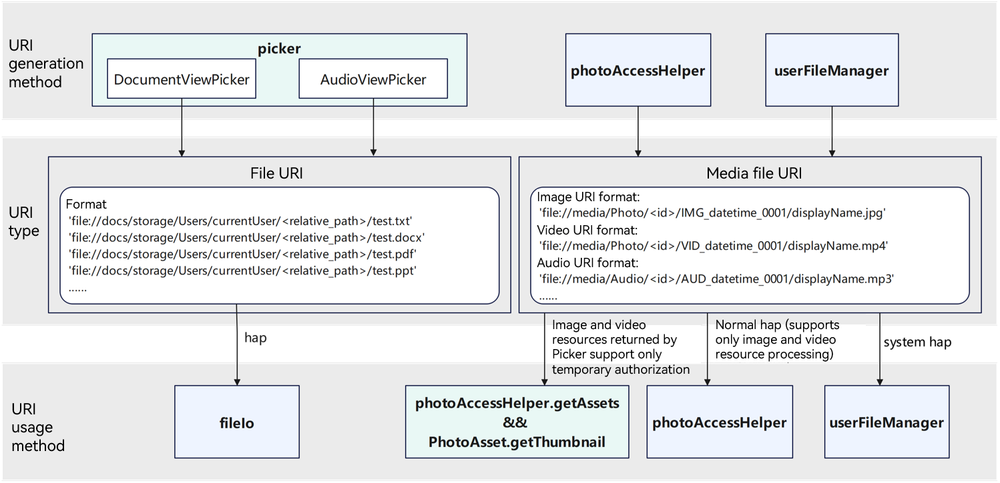

# User File URI

<!--Kit: Core File Kit-->
<!--Subsystem: FileManagement-->
<!--Owner: @gzhuangzhuang-->
<!--Designer: @wang_zhangjun; @chenxi0605-->
<!--Tester: @zsyztt; @yue-ye2; @fuwei-->
<!--Adviser: @jinqiuheng-->
<!-- md-trans-meta sourceCommit=3afe01b8f5d863a620be98d6d8501c3267bd2e42 translatedAt=2026-08-01T07:29:31.412Z pushedAt=2026-08-01T11:33:45.062Z -->

As a unique identifier of a user file, the uniform resource identifier (URI) is usually used to specify the user file to be accessed or modified. Avoid using part of a URI for service code development.

## URI Types

URIs can be classified into the following types:

- Document URI: Returned when you select or save a file through the file manager opened by picker. For details about the acquisition method, see [Obtaining a Document URI](#obtaining-a-document-uri).

- Media file URI: URI of an image or video selected from **Gallery** by picker; URI of an image or video obtained via the **photoAccessHelper** module; URI of an image, video, or audio file obtained via the **userFileManager** module. For details, see [Obtaining a Media File URI](#obtaining-a-media-file-uri).



## Document URI

### Overview

The document URIs are in the following format:

'file://docs/storage/Users/currentUser/\<relative_path\>/test.txt'

The following table describes the fields in a document URI.

| URI Field         | Description       |
| ------------- | ------------------- |
| 'file://docs/storage/Users/currentUser/' | Root directory of the file manager.|
| '\<relative_path\>/' | Relative path of the file, for example, **Download/** and **Documents/**.|
| 'test.txt' | Name of the file stored in the user file system. The supported file types vary depending on the file manager used. Common file types include TXT, JPG, MP4, and MP3.|

### Obtaining a Document URI

1. Call [DocumentViewPicker](../reference/apis-core-file-kit/js-apis-file-picker.md#documentviewpicker) to select or save a file, which returns the URI of the selected or saved file.

2. Call [AudioViewPicker](../reference/apis-core-file-kit/js-apis-file-picker.md#audioviewpicker) to select or save an audio file, which returns the URI of the selected or saved file.

### Using a Document URI

Apps can use this type of URI for further processing through [file management](../reference/apis-core-file-kit/js-apis-file-fs.md). For sample code, see [Selecting Documents](./select-user-file.md#selecting-documents) and [Saving Documents](./save-user-file.md#saving-documents) in the picker documentation.

## Media File URI

### Overview

The URI format varies depending on the media file type.

Image URI format:

- 'file://media/Photo/\<id\>/IMG_datetime_0001/displayName.jpg'

Video URI format:

- 'file://media/Photo/\<id>/VID_datetime_0001/displayName.mp4'

Audio URI format:

- 'file://media/Audio/\<id>/AUD_datetime_0001/displayName.mp3'

The following table describes the fields in a media file URI.

| URI Field         | Description       |
| ------------- | ------------------- |
| 'file://media' | URI of a media file.|
| 'Photo' | URI of an image or video.|
| 'Audio' | URI of an audio file.|
| '\<id>' | ID of the file after being processed in multiple tables in the database. It is not the value in the **file_id** column in the table. Do not use this ID to query files in the database.|
| 'IMG_datetime_0001' | Name of the image stored in the user file system without the file name extension.|
| 'VID_datetime_0001' | Name of the video stored in the user file system without the file name extension.|
| 'AUD_datetime_0001' | Name of the audio file stored in the user file system without the file name extension.|
|<!--DelRow--> 'displayName.jpg' | Indicates the displayName of an image file shown externally. Renaming via the [photoAccessHelper.PhotoAsset.commitModify](../reference/apis-media-library-kit/arkts-apis-photoAccessHelper-PhotoAsset.md#commitmodify) API modifies this value. Note that the URI also changes after this value is modified. |
|<!--DelRow--> 'displayName.mp4' | Indicates the displayName of a video file shown externally. Renaming via the [photoAccessHelper.PhotoAsset.commitModify](../reference/apis-media-library-kit/arkts-apis-photoAccessHelper-PhotoAsset.md#commitmodify) API modifies this value. Note that the URI also changes after this value is modified. |
|<!--DelRow--> 'displayName.mp3' | Indicates the displayName of an audio file shown externally. Renaming via the [photoAccessHelper.PhotoAsset.commitModify](../reference/apis-media-library-kit/arkts-apis-photoAccessHelper-PhotoAsset.md#commitmodify) API modifies this value. Note that the URI also changes after this value is modified. |

### Obtaining a Media File URI

1. Use [PhotoViewPicker](../reference/apis-media-library-kit/arkts-apis-photoAccessHelper-PhotoViewPicker.md) of PhotoAccessHelper to select image and video resources, which returns the URIs of the selected images and videos.

2. Call [getAssets](../reference/apis-media-library-kit/arkts-apis-photoAccessHelper-PhotoAccessHelper.md#getassets) or [createAsset](../reference/apis-media-library-kit/arkts-apis-photoAccessHelper-PhotoAccessHelper.md#createasset) in the [photoAccessHelper](../reference/apis-media-library-kit/arkts-apis-photoAccessHelper.md) module to obtain the URI of the corresponding media file.

3. Use [AudioViewPicker](../reference/apis-core-file-kit/js-apis-file-picker.md#audioviewpicker) of Picker to select and save audio file resources, which returns the URI of the selected or saved audio file.

### Using a Media File URI

Apps of the normal level can use this type of URI for further processing through the [photoAccessHelper](../reference/apis-media-library-kit/arkts-apis-photoAccessHelper.md) module. For sample code, see [Obtaining an Image or Video by URI](../media/medialibrary/photoAccessHelper-photoviewpicker.md#obtaining-an-image-or-video-by-uri) in the media resource usage guide. This API requires the read permission for the album management module ([ohos.permission.READ_IMAGEVIDEO](../media/medialibrary/photoAccessHelper-overview.md#capabilities)). Pay attention to whether the app has this permission during use. <!--Del-->

In addition to using the photoAccessHelper module as described above, apps of the system_basic level and above can also use this type of URI for further processing through the [userFileManager](../reference/apis-core-file-kit/js-apis-userFileManager-sys.md) module. For details about how to use the APIs, see the API documentation.

<!--DelEnd-->

If a normal-level app does not want to request permissions, it can use the URI obtained through [PhotoViewPicker](../reference/apis-media-library-kit/arkts-apis-photoAccessHelper-PhotoViewPicker.md) of PhotoAccessHelper via temporary authorization, and call the [photoAccessHelper.getAssets](../reference/apis-media-library-kit/arkts-apis-photoAccessHelper-PhotoAccessHelper.md#getassets) API to obtain the PhotoAsset object corresponding to the URI. The PhotoAsset object obtained in this way allows you to call the [getThumbnail](../reference/apis-media-library-kit/arkts-apis-photoAccessHelper-PhotoAsset.md#getthumbnail) method to obtain the thumbnail, and use the [get](../reference/apis-media-library-kit/arkts-apis-photoAccessHelper-PhotoAsset.md#get) API to read some information from [PhotoKeys](../reference/apis-media-library-kit/arkts-apis-photoAccessHelper-e.md#photokeys).

The following information can be obtained from **PhotoKeys** through temporary authorization:

| Name         | Value             | Description                                                      |
| ------------- | ------------------- | ---------------------------------------------------------- |
| URI           | 'uri'                 | URI of the file.                                                  |
| PHOTO_TYPE    | 'media_type'           | Type of the media file.                                             |
| DISPLAY_NAME  | 'display_name'        | File name displayed.                                                  |
| SIZE          | 'size'                | Size of the file.                                                  |
| DATE_ADDED    | 'date_added'          | Unix timestamp when the file was added, in seconds.           |
| DATE_MODIFIED | 'date_modified'       | Unix timestamp when the file content (not the file name) was last modified, in seconds.  |
| DURATION      | 'duration'            | Duration, in milliseconds.                                   |
| WIDTH         | 'width'               | Image width, in pixels.                                   |
| HEIGHT        | 'height'              | Image height, in pixels.                                     |
| DATE_TAKEN    | 'date_taken'          | Unix timestamp when the photo was taken, in seconds.               |
| ORIENTATION   | 'orientation'         | Orientation of the image file.                                            |
| TITLE         | 'title'               | Title in the file.                                                  |

The following example shows how to obtain the thumbnail and file information based on the media file URI with temporary authorization.

<!-- @[import_get_uri_assets](https://gitcode.com/openharmony/applications_app_samples/blob/master/code/DocsSample/CoreFile/UserFile/UserFileURI/entry/src/main/ets/pages/Index.ets) -->    

``` TypeScript
import { BusinessError } from '@kit.BasicServicesKit';
// ...
import { common } from '@kit.AbilityKit';
// ...
import { dataSharePredicates } from '@kit.ArkData';
// ...
import { photoAccessHelper } from '@kit.MediaLibraryKit';

// Define a URI array to receive the URIs returned by PhotoViewPicker.select.
let uris: string[] = [];

// ...

// Call PhotoViewPicker.select to select an image.
async function photoPickerGetUri() {
  try {
    let photoSelectOptions = new photoAccessHelper.PhotoSelectOptions();
    photoSelectOptions.MIMEType = photoAccessHelper.PhotoViewMIMETypes.IMAGE_TYPE;
    // Set the maximum number of images that can be selected to 1.
    photoSelectOptions.maxSelectNumber = 1;
    let photoPicker = new photoAccessHelper.PhotoViewPicker();
    // Wait for the user to select an image.
    let photoSelectResult: photoAccessHelper.PhotoSelectResult = await photoPicker.select(photoSelectOptions);
    console.info('PhotoViewPicker.select successfully, PhotoSelectResult uri: ' + JSON.stringify(photoSelectResult));
    uris = photoSelectResult.photoUris;
  } catch (err) {
    let error: BusinessError = err as BusinessError;
    console.error(`PhotoViewPicker failed with err, code is ${error.code}, message is ${error.message}`);
  }
}

// Obtain the context within the component.
async function uriGetAssets(context: common.UIAbilityContext): Promise<string> {
  // Check whether the uris array is empty.
  if (uris.length === 0) {
    throw new Error('No URIs available');
  }
  try {
    let phAccessHelper = photoAccessHelper.getPhotoAccessHelper(context);
    let predicates: dataSharePredicates.DataSharePredicates = new dataSharePredicates.DataSharePredicates();
    // Configure search criteria to query the image based on the URI returned by PhotoViewPicker.select.
    predicates.equalTo('uri', uris[0]);
    let fetchOption: photoAccessHelper.FetchOptions = {
      fetchColumns: [photoAccessHelper.PhotoKeys.WIDTH, photoAccessHelper.PhotoKeys.HEIGHT,
        photoAccessHelper.PhotoKeys.TITLE, photoAccessHelper.PhotoKeys.DURATION],
      predicates: predicates
    };
    let fetchResult: photoAccessHelper.FetchResult<photoAccessHelper.PhotoAsset> =
      await phAccessHelper.getAssets(fetchOption);
    // Obtain the PhotoAsset object corresponding to the URI. The file information is obtained from the PhotoAsset object.
    const asset: photoAccessHelper.PhotoAsset = await fetchResult.getFirstObject();
    console.info('asset displayName: ', asset.displayName);
    console.info('asset uri: ', asset.uri);
    console.info('asset photoType: ', asset.photoType);
    console.info('asset width: ', asset.get(photoAccessHelper.PhotoKeys.WIDTH));
    console.info('asset height: ', asset.get(photoAccessHelper.PhotoKeys.HEIGHT));
    console.info('asset title: ' + asset.get(photoAccessHelper.PhotoKeys.TITLE));
    // Obtain the thumbnail.
    asset.getThumbnail((err, pixelMap) => {
      if (err == undefined) {
        console.info('getThumbnail successful ' + JSON.stringify(pixelMap));
      } else {
        console.error('getThumbnail fail', err);
      }
    });
    // ...
  } catch (error) {
    console.error(`uriGetAssets failed with err, code is ${error.code}, message is ${error.message}`);
    return 'ReadMediaUriFail';
  }
  return 'ReadMediaUriFail';
}
```