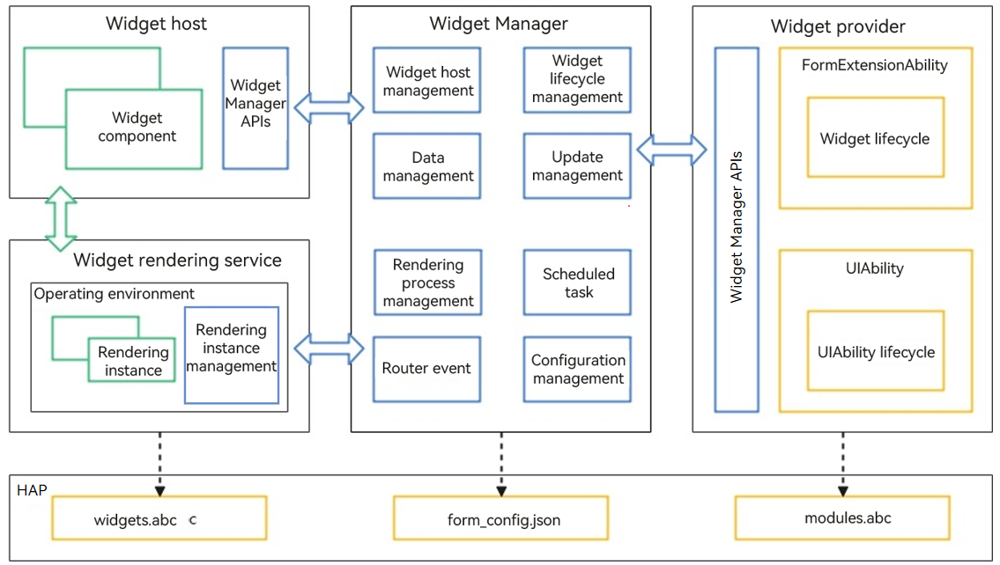
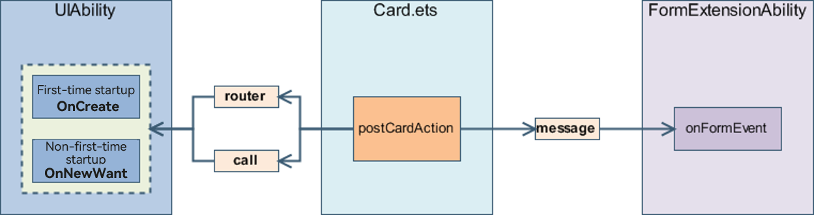

# ArkTS Widget Overview
This section describes how to develop an ArkTS widget based on the declarative paradigm.

## Highlights
1. Unified development paradigm

    - ArkTS widgets share the same declarative UI development framework as application pages. This means that the page layouts can be directly reused in widgets, improving development experience and efficiency. For details, see Figure 1.

    **Figure 1** Comparison of widget project structures  
    

2. Enhanced widget capabilities

    - Animation: ArkTS widgets support the [property animation](../reference/apis-arkui/arkui-ts/ts-animatorproperty.md) and [explicit animation](../reference/apis-arkui/arkui-ts/ts-explicit-animation.md) capabilities, which can be leveraged to deliver a more engaging experience.
    - Custom drawing: ArkTS widgets allow you to draw graphics with the [Canvas](../reference/apis-arkui/arkui-ts/ts-components-canvas-canvas.md) component to present information more vividly.
    - Logic code execution: The capability to run logic code in widgets means that service logic can be self-closed in widgets, expanding the use cases of widgets.

## How to Implement

- Widget host: an application that displays the widget content and controls the widget location. Only the system application can function as a widget host.

- Widget provider: an application that provides the widget content and controls the widget content, component layout, and component tap events.

- Widget Manager: a resident agent that manages widgets in the system. It provides [formProvider](../reference/apis-form-kit/js-apis-app-form-formProvider.md)<!--Del--> and [formHost](../reference/apis-form-kit/js-apis-app-form-formHost-sys.md)<!--DelEnd--> as well as the APIs for widget management, usage, and periodic updates.

- Widget rendering service: a service that manages widget rendering instances. Widget rendering instances are bound to the <!--Del-->[<!--DelEnd-->FormComponent<!--Del-->](../reference/apis-arkui/arkui-ts/ts-basic-components-formcomponent-sys.md)<!--DelEnd--> on the widget host on a one-to-one basis. The widget rendering service runs the widget page code **widgets.abc** for rendering based on the widget information configured in **form_config.json**, and sends the rendered data to the corresponding <!--Del-->[<!--DelEnd-->FormComponent<!--Del-->](../reference/apis-arkui/arkui-ts/ts-basic-components-formcomponent-sys.md)<!--DelEnd--> on the widget host.

**Figure 2** Implementation principles of ArkTS widgets 

**Figure 3** Working principles of the ArkTS widget rendering service 

Unlike JS widgets, ArkTS widgets support logic code execution. The widget page code **widgets.abc** is executed by the widget rendering service, which is managed by the Widget Manager. Each widget component of a widget host corresponds to a rendering instance in the widget rendering service. Rendering instances of a widget provider run in the same ArkTS virtual machine operating environment, and rendering instances of different widget providers run in different ArkTS virtual machine operating environments. In this way, the resources and state data are isolated between widgets of different widget providers. During development, pay attention to the use of the **globalThis** object. Use one **globalThis** object for widgets from the same widget provider, and different **globalThis** objects for widgets from different widget providers.

## ArkTS Widget Types
ArkTS widgets are classified into dynamic widgets and static widgets.

Compared with dynamic widgets, static widgets have the same overall running framework and rendering process. The main difference is that after the widget rendering service renders the widget content, the widget host uses the last frame of rendered data as a static image, and the widget rendering instance releases all running resources of the widget to save memory. As such, frequent updating of static widgets causes continuous creation and destruction of resources, resulting in increased power consumption. 

| Widget Type| Supported Capability| Scenario| Pros and Cons|
| ------- | ------ | ------- | ------- | 
| Static widget| Limited to UI components and layout capabilities.| Suitable for presenting static information (with a stable UI), allowing navigation to a specific UIAbility via the **FormLink** component.| Offers basic functionality with efficient memory management.|
| Dynamic widget| Common event and custom animation capabilities in addition to UI components and layout capabilities.| Suitable for scenarios requiring complex logic and interactions, such as updating images or content on a widget.| Provides enhanced capabilities at the cost of high memory overhead.|

### Dynamic Widget
For dynamic ArkTS widgets, the [postCardAction](../reference/apis-arkui/js-apis-postCardAction.md#postcardaction) API is provided for interaction between the widget internal and the provider application. Currently, this API supports the router, message, and call events and can be called only in the widget.

**Figure 4** Implementation principles of dynamic widget events 

Dynamic widget events are used in the following scenarios:
- router event: used to redirect to a specified UIAbility, enabling the functionality of navigating from a widget to an internal application page after a widget is touched. For non-system applications, this redirection is limited to their own UIAbilities.
- call event: used to launch a specified UIAbility to the background, after which the UIAbility can request the corresponding background continuous task to complete functionalities such as music playback.
- message event: used to launch the FormExtensionAbility, which then notifies the application via the **onFormEvent** callback, thereby fulfilling the functionality of passing messages to the application after a widget is touched.

### Static Widget
The **FormLink** component is provided for interactions between static widgets and widget providers. It supports three types of events: router, message, and call.
See [FormLink](../reference/apis-arkui/arkui-ts/ts-container-formlink.md).

## Constraints
Compared with JS widgets, ArkTS widgets provide more capabilities, but they are also more prone to malicious behavior. To account for the impact on the widget host – typically the home screen, ArkTS widgets are subject to the following restrictions:

- Currently, widgets can be developed only based on ArkUI. Cross-platform development is not supported.

- When importing modules, you can import only the modules marked with "supported in ArkTS widgets." If an API that is not supported is used, the widget loading is abnormal.

- [HAR](../quick-start/har-package.md) can be imported, but [HSP](../quick-start/in-app-hsp.md) cannot.

- The native programming language cannot be used for development, and the native .so file cannot be loaded.

- Only partial components, events, animations, data management, state management, and API capabilities of the [declarative paradigm](../ui/arkts-ui-development-overview.md) are supported. For APIs that can be used in ArkTS widgets, the following description will be added: "Widget capability: This API can be used in ArkTS widgets since API version *x*."

- The event processing of the widget is independent of that of the widget host. To prevent gesture conflicts, avoid using swipers in the widget when the widget host supports left and right swipes.

In addition, ArkTS widgets do not support the following features:

- Instant preview

- Breakpoint debugging

- Hot reload

- setTimeOut

