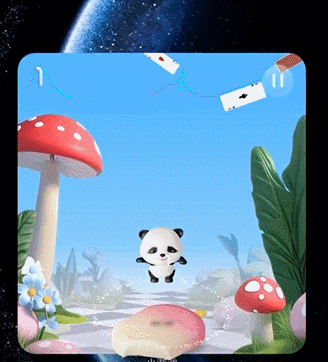

# Developing a Fun-based Widget

Currently, fun-based widgets support mini-games developed with quick games. This kind of widget is in the inactive state by default. When a user taps the widget, it switches to the active state and the game begins. During the game, users can tap the pause icon to pause the game. In the paused state, users can resume the game by tapping the resume icon or end the game by tapping the stop icon.
## Basic Concepts

Fun-based widgets can be in one of the following states: active (game running), paused (game paused), and inactive (game ended).

### Active State

In this state, the widget UI is carried by the mini-game page developed by the widget provider using quick games. The system supports an "overflow" effect, allowing game content to render beyond the widget rendering area.

**Figure 1** Fun-based widget in the active state

### Paused State

In this state, the widget UI is carried by the content in **widgetCard.ets** of the widget provider. Meanwhile, the system renders the resume and stop icons on the widget by default.

**Figure 2** Fun-based widget in the paused state

### Inactive State

In this state, the widget behaves like a common widget, complying with the existing widget development specifications. The widget UI is carried by the content in **widgetCard.ets**.

**Figure 3** Fun-based widget in the inactive state

## Constraints

1. When a user interacts with a widget, for example, by tapping, long-pressing, or dragging, the interactive target area is always the same size as the widget rendering area. Even if the animation rendering area extends beyond the widget rendering area, the excess part is only used for UI display and does not respond to interactive events.
2. In the active state, interactive events within the widget's rendering area are responded to by the mini-game page developed by the widget provider. In other states, interactive events are responded to by the common widget developed by the widget provider.
3. At a time, only one widget can be in the active or paused state for fun-based interactions. When a user taps a widget to activate it, all other fun-based widgets are automatically switched to the inactive state.
4. For details about other design specifications and restrictions, see "Developing a Creative Widget".

## How to Develop

For details about how to develop game content, see "Developing a Game Widget".

For details about on-device widget configuration and development, see [the configuration of fun-based widgets](arkts-ui-widget-configuration.md#funinteractionparams-field).
