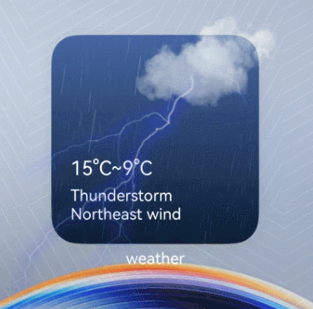

# Overview of Interactive Widgets

Interactive widgets dynamically display static information or images and facilitate human-machine interaction, thereby enhancing information notifications, shallow interactions, and the overall playability experience.

## Scenarios

There are two types of interactive widgets: fun-based widget and scene-based widget.

### Fun-based Widget

Users can tap a fun-based widget to play mini games. Currently, this feature can be developed only based on quick games. For details, see [Developing a Fun-based Widget](arkts-ui-liveform-funinteraction-development.md).

**Figure 1** Example of a fun-based widget

### Scene-based Widget

Scene-based widgets support scene animations. For example, a weather widget activates and triggers its weather animation effect when the weather changes to a thunderstorm. Once the animation ends, the widget reverts to its original display. For details, see [Overview of Scene-based Widgets](arkts-ui-liveform-sceneanimation-overview.md).

**Figure 2** Example of a scene-based widget

## Constraints
- As an enhancement of the widget functionality, interactive widgets cannot overly depend on animations.
<!--RP1--><!--RP1End-->
