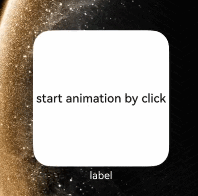

# Developing a Scene-based Widget

This document describes the development of a scene-based widget, covering the UI for both inactive and active states, as well as the configuration file.

## Available APIs

The following table lists the key APIs for a scene-based widget.

**Table 1** Main APIs

| API                                                                                                                                                                                                | Description                |
|-----------------------------------------------------------------------------------------------------------------------------------------------------------------------------------------------------|--------------------|
| [onLiveFormCreate(liveFormInfo: LiveFormInfo, session: UIExtensionContentSession): void](../reference/apis-form-kit/js-apis-app-form-LiveFormExtensionAbility.md#onliveformcreate)                  | Called when a widget UI object is created.  |
| [onLiveFormDestroy(liveFormInfo: LiveFormInfo): void](../reference/apis-form-kit/js-apis-app-form-LiveFormExtensionAbility.md#onliveformdestroy)                                                    | Called when a widget UI object is destroyed and related resources are cleared. |
| [formProvider.requestOverflow(formId: string, overflowInfo: formInfo.OverflowInfo): Promise&lt;void&gt;](../reference/apis-form-kit/js-apis-app-form-formProvider.md#formproviderrequestoverflow20) | Called by the widget provider to request interactive widget animations.  |
| [formProvider.cancelOverflow(formId: string): Promise&lt;void&gt;](../reference/apis-form-kit/js-apis-app-form-formProvider.md#formprovidercanceloverflow20)                                        | Called by the widget provider to cancel interactive widget animations.|

## How to Develop

### Widget UI in Active State

1. Create an interactive widget.

    Create an interactive widget through [LiveFormExtensionAbility](../reference/apis-form-kit/js-apis-app-form-LiveFormExtensionAbility.md) and load the widget page.
    ```ts
    // entry/src/main/ets/myliveformextensionability/MyLiveFormExtensionAbility.ets
    import { formInfo, LiveFormInfo, LiveFormExtensionAbility } from '@kit.FormKit';
    import { UIExtensionContentSession } from '@kit.AbilityKit';

    export default class MyLiveFormExtensionAbility extends LiveFormExtensionAbility {
      onLiveFormCreate(liveFormInfo: LiveFormInfo, session: UIExtensionContentSession) {
        let storage: LocalStorage = new LocalStorage();
        storage.setOrCreate('session', session);

        // Obtain widget information.
        let formId: string = liveFormInfo.formId;
        storage.setOrCreate('formId', formId);
        let formRect: formInfo.Rect = liveFormInfo.rect;
        storage.setOrCreate('formRect', formRect);
        let borderRadius: number = liveFormInfo.borderRadius;
        storage.setOrCreate('borderRadius', borderRadius);
        console.log(`MyLiveFormExtensionAbility onSessionCreate formId: ${formId}, borderRadius: ${borderRadius}` +
          `, formRect: ${JSON.stringify(formRect)}`);

        // Load the interactive page.
        session.loadContent('myliveformextensionability/pages/MyLiveFormPage', storage);
      }

      onLiveFormDestroy(liveFormInfo: LiveFormInfo) {
        console.log(`MyLiveFormExtensionAbility onDestroy`);
      }
    };
    ```

2. Implement an interactive widget page.
    ```ts
    // entry/src/main/ets/myliveformextensionability/pages/MyLiveFormPage.ets
    import { formInfo, formProvider } from '@kit.FormKit';
    import { Constants } from '../../common/Constants';

    const ANIMATION_RECT_SIZE: number = 100;
    const END_SCALE: number = 1.5;
    const END_TRANSLATE: number = -300;

    @Entry
    @Component
    struct MyLiveFormPage {
      @State columnScale: number = 1.0;
      @State columnTranslate: number = 0.0;

      private uiContext: UIContext | undefined = undefined;
      private storageForMyLiveFormPage: LocalStorage | undefined = undefined;
      private formId: string | undefined = undefined;
      private formRect: formInfo.Rect | undefined = undefined;
      private formBorderRadius: number | undefined = undefined;

      aboutToAppear(): void {
        this.uiContext = this.getUIContext();
        if (!this.uiContext) {
          console.warn("no uiContext");
          return;
        }
        this.initParams();
      }

      private initParams(): void {
        this.storageForMyLiveFormPage = this.uiContext?.getSharedLocalStorage();
        this.formId = this.storageForMyLiveFormPage?.get<string>('formId');
        this.formRect = this.storageForMyLiveFormPage?.get<formInfo.Rect>('formRect');
        this.formBorderRadius = this.storageForMyLiveFormPage?.get<number>('borderRadius');
      }

      // Execute the animation.
      private runAnimation(): void {
        this.uiContext?.animateTo({
          duration: Constants.OVERFLOW_DURATION,
          curve: Curve.Ease
        }, () => {
          this.columnScale = END_SCALE;
          this.columnTranslate = END_TRANSLATE;
        });
      }

      build() {
        Stack() {
          // Background component, whose size is the same as that of a common widget.
          Column()
            .width(this.formRect ? this.formRect.width : 0)
            .height(this.formRect ? this.formRect.height : 0)
            .borderRadius(this.formBorderRadius ? this.formBorderRadius : 0)
            .backgroundColor('#2875F5')

          Stack()
            .width(ANIMATION_RECT_SIZE)
            .height(ANIMATION_RECT_SIZE)
            .backgroundColor(Color.White)
            .scale({
              x: this.columnScale,
              y: this.columnScale,
            })
            .translate({
              y: this.columnTranslate
            })
            .onAppear(() => {
              // Execute the animation when the page is displayed.
              this.runAnimation();
            })

          // Tap the button to call the formProvider.cancelOverflow API to interrupt the current overflow animation and switch the widget to the inactive state.
          Button('Cancel the animation forcibly')
            .backgroundColor(Color.Grey)
            .onClick(() => {
              if (!this.formId) {
                console.log('MyLiveFormPage formId is empty, cancel overflow failed');
                return;
              }
              console.log('MyLiveFormPage cancel overflow animation');
              formProvider.cancelOverflow(this.formId);
            })
        }
        .width('100%')
        .height('100%')
      }
    }
    ```

3. Configure LiveFormExtensionAbility for interactive widgets.

    Configure LiveFormExtensionAbility in [extensionAbilities](../quick-start/module-configuration-file.md#extensionabilities) of the **module.json5** file.
    ```ts
    // entry/src/main/module.json5
        ...
        "extensionAbilities": [
          {
            "name": "MyLiveFormExtensionAbility",
            "srcEntry": "./ets/myliveformextensionability/MyLiveFormExtensionAbility.ets",
            "description": "MyLiveFormExtensionAbility",
            "type": "liveForm"
          }
        ]
        ...
    ```

    At the same time, declare the interactive widget page in the **main_pages.json** file.

    ```ts
    // entry/src/main/resources/base/profile/main_pages.json
    {
      "src": [
        "pages/Index",
        "myliveformextensionability/pages/MyLiveFormPage"
      ]
    }
    ```

### Widget UI in Inactive State

1. Implement a widget page in the inactive state.

    The page development process of a widget in the inactive state is the same as that of a common widget and is completed in **widgetCard.ets**, which is automatically generated when a widget is created. For details about the widget creation process, see [Creating an ArkTS Widget](arkts-ui-widget-creation.md). On the inactive widget page, request the widget animation when the widget is tapped.
    ```ts
    // entry/src/main/ets/widget/pages/WidgetCard.ets
    @Entry
    @Component
    struct WidgetCard {
      build() {
        Row() {
          Column() {
            Text('Tap to trigger interactive widget animation')
              .fontSize($r('app.float.font_size'))
              .fontWeight(FontWeight.Medium)
              .fontColor($r('sys.color.font_primary'))
          }
          .width('100%')
        }
        .height('100%')
        .onClick(() => {
          // When a widget is tapped, send a message to EntryFormAbility and call formProvider.requestOverflow in the onFormEvent callback to request the widget animation.
          postCardAction(this, {
            action: 'message',
            abilityName: 'EntryFormAbility',
            params: {
              message: 'requestOverflow'
            }
          });
        })
      }
    }
    ```

2. Configure the **form_config.json** file.

    Add the **sceneAnimationParams** configuration item to the **form_config.json** file.
    ```ts
    // entry/src/main/resources/base/profile/form_config.json
    {
      "forms": [
        {
          "name": "widget",
          "displayName": "$string:widget_display_name",
          "description": "$string:widget_desc",
          "src": "./ets/widget/pages/WidgetCard.ets",
          "uiSyntax": "arkts",
          "window": {
            "designWidth": 720,
            "autoDesignWidth": true
          },
          "colorMode": "auto",
          "isDefault": true,
          "updateEnabled": true,
          "scheduledUpdateTime": "10:30",
          "updateDuration": 1,
          "defaultDimension": "2*2",
          "supportDimensions": [
            "2*2"
          ],
          "formConfigAbility": "ability://EntryAbility",
          "dataProxyEnabled": false,
          "isDynamic": true,
          "transparencyEnabled": false,
          "metadata": [],
          "sceneAnimationParams": {
            "abilityName": "MyLiveFormExtensionAbility"
          }
        }
      ]
    }
    ```

### Interactive Widget Animation

1. Trigger interactive widget animations.

    When adding a widget to the home screen, the interactive widget can obtain the actual widget dimension through the **wantParams** parameter in the [onUpdateForm](../reference/apis-form-kit/js-apis-app-form-formExtensionAbility.md#formextensionabilityonupdateform) lifecycle callback. The widget provider calculates the animation request range based on this dimension, in vp. For details about the calculation rules, see the [constraints on widget parameter request](arkts-ui-liveform-sceneanimation-overview.md#parameter-request).
    ```ts
    // entry/src/main/ets/entryformability/EntryFormAbility.ets
    import {
      formInfo,
      formProvider,
      FormExtensionAbility,
    } from '@kit.FormKit';
    import { BusinessError } from '@kit.BasicServicesKit';
    import { preferences } from '@kit.ArkData';
    import { Constants } from '../common/Constants';
    import { Utils } from '../common/Utils';

    const DB_NAME: string = 'myStore'

    export default class EntryFormAbility extends FormExtensionAbility {
      onUpdateForm(formId: string, wantParams?: Record<string, Object>) {
        // When a widget is added to the home screen, the **wantParams** is not empty and will provide the widget dimension information.
        if (wantParams) {
          this.saveFormSize(formId, wantParams);
        }
      }

      // Parse the dimension of the widget and save it to the database.
      private saveFormSize(formId: string, wantParams: Record<string, Object>) {
        let width = 0;
        let height = 0;
        width = wantParams['ohos.extra.param.key.form_width_vp'] as number;
        height = wantParams['ohos.extra.param.key.form_height_vp'] as number;
        console.log(`onUpdateForm, formId: ${formId}, size:[${width}, ${height}]`);
        let promise: Promise<preferences.Preferences> = preferences.getPreferences(this.context, DB_NAME);

        // Write the dimension to the database.
        Utils.writeFormSize(promise, formId, width, height);
      }

      // Read the dimension from the database.
      private async getFormSize(formId: string): Promise<number[]> {
        let storeDB: preferences.Preferences =  await preferences.getPreferences(this.context, DB_NAME);
        let formCardInfo: string[] = await Utils.readFormSize(formId, storeDB);
        return [Number.parseFloat(formCardInfo[0]), Number.parseFloat(formCardInfo[1])];
      }

      async onFormEvent(formId: string, message: string) {
        let shortMessage: string = JSON.parse(message)['message'];

        // Trigger the interactive widget animation when the received message is requestOverflow.
        if (shortMessage === 'requestOverflow') {
          let sizeInfo = await this.getFormSize(formId);
          this.requestOverflow(formId, sizeInfo[0], sizeInfo[1]);
          return;
        }
      }

      private requestOverflow(formId: string, formWidth: number, formHeight: number): void {
        if (formWidth <= 0 || formHeight <= 0) {
          console.log('requestOverflow failed, form size is not correct.');
          return;
        }

        // Calculate the animation rendering area of the widget based on the dimension.
        let left: number = -Constants.OVERFLOW_LEFT_RATIO * formWidth;
        let top: number = -Constants.OVERFLOW_TOP_RATIO * formHeight;
        let width: number = Constants.OVERFLOW_WIDTH_RATIO * formWidth;
        let height: number = Constants.OVERFLOW_HEIGHT_RATIO * formHeight;
        let duration: number = Constants.OVERFLOW_DURATION;

        // Request an interactive widget animation.
        try {
          formProvider.requestOverflow(formId, {
            area: { left: left, top: top, width: width, height: height },
            duration: duration
          }).then(() => {
            console.log('requestOverflow requestOverflow succeed');
          }).catch((error: BusinessError) => {
            console.log(`requestOverflow requestOverflow catch error` + `, code: ${error.code}, message: ${error.message}`);
          })
        } catch (e) {
          console.log(`requestOverflow call requestOverflow catch error` + `, code: ${e.code}, message: ${e.message}`);
        }
      }
    }
    ```

2. Implement the tool functions of the interactive widget animation.

    ```ts
    // entry/src/main/ets/common/Utils.ets
    import { preferences } from '@kit.ArkData';
    import { BusinessError } from '@kit.BasicServicesKit';

    export class Utils {
      // Write the widget dimension to the database.
      public static writeFormSize(promise: Promise<preferences.Preferences>, formId: string, width: number,
        height: number): void {
        promise.then(async (storeDB: preferences.Preferences) => {
          console.log('writeCardInfoSizeToDB, Succeeded to get preferences.');
          await storeDB.put('width_' + formId, `${width}`);
          await storeDB.put('height_' + formId, `${height}`);
          await storeDB.flush();
        }).catch((err: BusinessError) => {
          console.log(`writeCardInfoSizeToDB, Failed to get preferences. ${JSON.stringify(err)}`);
        });
      }

      // Read widget information from the database.
      public static async readFormSize(formId: string, storeDB: preferences.Preferences): Promise<string[]> {
        try {
          let widthInfo = await storeDB.get('width_' + formId, '-1');
          let heightInfo = await storeDB.get('height_' + formId, '-1');
          console.log(`Succeeded to get cardInfo: ${widthInfo}, ${heightInfo}`);
          return [widthInfo.toString(), heightInfo.toString()];
        } catch(err) {
          console.log(`Failed to get preferences. ${JSON.stringify(err)}`);
          return [''];
        }
      }
    }
    ```

    ```ts
    // entry/src/main/ets/common/Constants.ets
    // Develop animation-related constants.
    export class Constants {
      // The interactive widget animation is out of range. Left offset percentage = Offset value/Widget width
      public static readonly OVERFLOW_LEFT_RATIO: number = 0.1;

      // The interactive widget animation is out of range. Top offset percentage = Offset value/Widget height
      public static readonly OVERFLOW_TOP_RATIO: number = 0.15;

      // The interactive widget animation is out of range. The width is enlarged by percentage.
      public static readonly OVERFLOW_WIDTH_RATIO: number = 1.2;

      // The interactive widget animation is out of range. The height is enlarged by percentage.
      public static readonly OVERFLOW_HEIGHT_RATIO: number = 1.3;

      // The interactive widget animation is out of range. Specify the animation duration.
      public static readonly OVERFLOW_DURATION: number = 3500;
    }
    ```

## Effect
The following is a demo developed based on the code examples in this document. When the demo is executed, the [formProvider.cancelOverflow](../reference/apis-form-kit/js-apis-app-form-formProvider.md#formprovidercanceloverflow20) API is called to interrupt the current overflow animation and the widget is switched to the inactive state.

