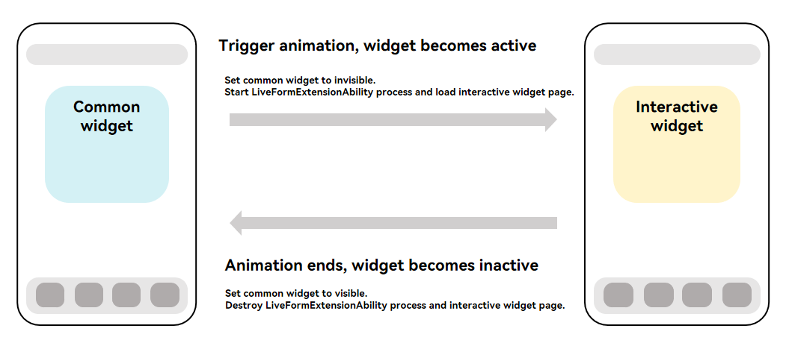
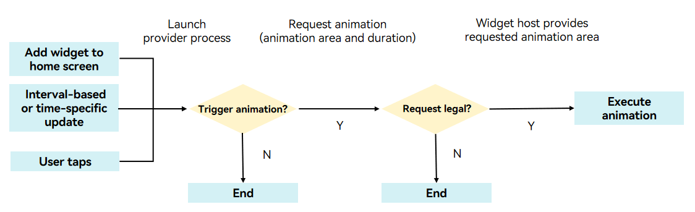
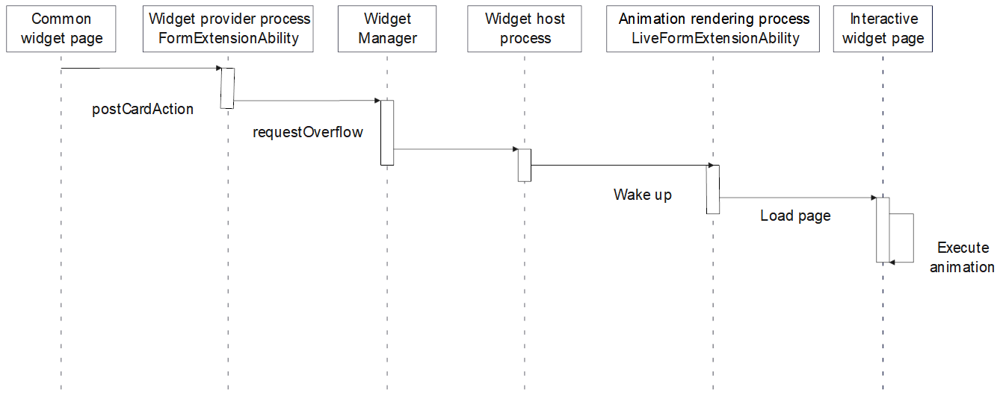
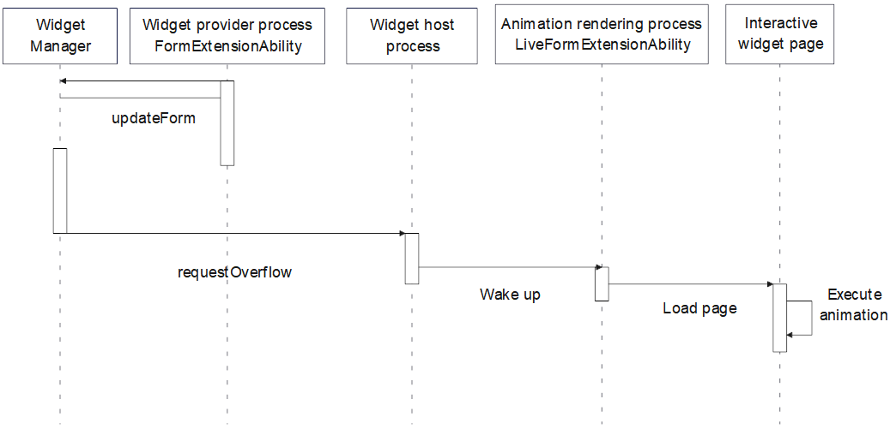
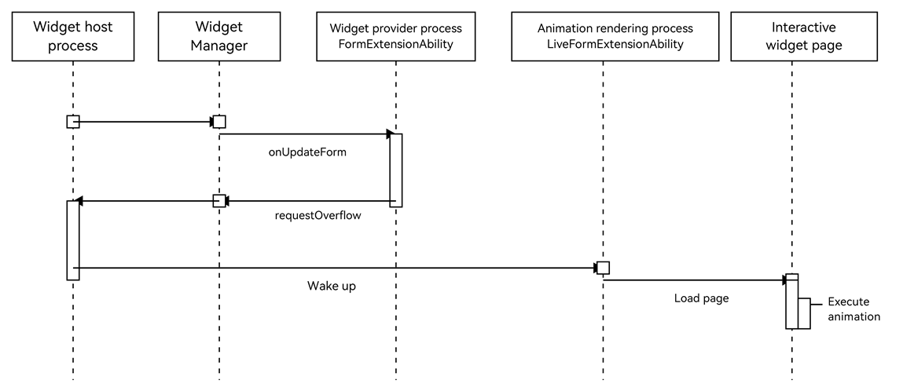
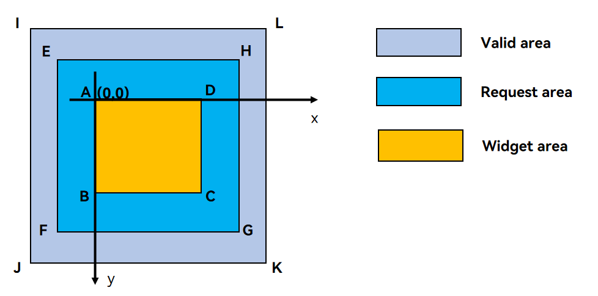
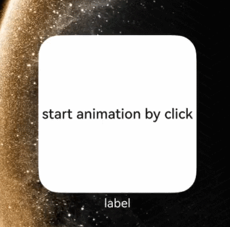

# Developing a Scene-based Widget

<!--Kit: Form Kit-->
<!--Subsystem: Ability-->
<!--Owner: @Qian-Win-->
<!--Designer: @cx983299475-->
<!--Tester: @mahailong123456-->
<!--Adviser: @HelloShuo-->
<!-- md-trans-meta sourceCommit=8a286fbea0ee5d2c6d221cb5d7465a62e5dae282 translatedAt=2026-08-15T01:50:01.438Z pushedAt=2026-08-15T07:54:18.479Z -->

Starting from API version 20, scene animation interaction type interactive cards support triggering card-specific effects in specific scenarios. For example, you can choose to extend the animation rendering area beyond the card's own rendering area to create an "overflow" effect. This document provides development guidance for scene animation interaction type interactive cards, including the concepts of scene animation interaction type interactive cards, constraints and limitations, development of the card inactive state and active state UI, and development of the card configuration file.

## Basic Concepts

A scene-based widget can be in either active state or inactive state. The widget animation can be triggered when the widget data is interval-based or time-specific updated, or when users interact with the widget (for instance, by tapping). The widget switches to the active state when the animation starts and reverts to the inactive state once the animation ends.

**Inactive state**: In this state, the widget behaves the same as a common widget and follows the existing widget development specifications. The widget UI is rendered based on the content in **widgetCard.ets** provided by the widget provider.

**Active state**: indicates the rendering state of interactive card animation. In this state, the card UI is rendered by the page corresponding to the [LiveFormExtensionAbility](../reference/apis-form-kit/js-apis-app-form-LiveFormExtensionAbility.md) developed by the card provider.

**Figure 1** Switching interactive widget states



**Figure 2** Process of triggering an interactive widget animation



## Implementation Principle

You can call the [formProvider.requestOverflow](../reference/apis-form-kit/js-apis-app-form-formProvider.md#formproviderrequestoverflow20) API to trigger animations on interactive widgets, for example, when a user taps the widget. The typical timing diagram is as follows.

**Figure 3** Timing diagram of animations triggered by a tap



**Figure 4** Timing diagram in interval-based and time-specific updates



**Figure 5** Timing diagram of interactive widget animation triggered by shaking



## Constraints

### Supported Scenarios

1. Currently, the interactive widget animation takes effect only on a single widget with [FormLocation](../reference/apis-form-kit/js-apis-app-form-formInfo.md#formlocation20) set to **DESKTOP**.

2. Due to the impact on performance and power consumption, only some models are supported. If a model is not supported, the error code [801](../reference/errorcode-universal.md#801-api-not-supported) is reported.

### Parameter Request

1. The maximum valid animation duration that an interactive widget can request is 3500 ms. When the countdown ends, the widget switches back to the inactive state.<!--Del-->System applications additionally support long-time activated widgets, with no limit on the animation duration. For details, see [Developing a Scene-based Widget (for System Applications)](arkts-ui-liveform-sceneanimation-development-sys.md).<!--DelEnd-->

2. A single widget's animation triggered by interval-based and time-specific updates can occur up to 50 times a day.

3. As illustrated, rectangle ABCD denotes the widget's rendering area, whereas rectangle IJKL indicates the maximum animation area the widget can request. The centers of the two rectangles are aligned. The dimensions meet the requirements described in the following table.

| Card Style | Length of JK | Length of IJ |
|-------|---------------|---------------|
| 1 * 2 | No more than 150% of the length of AD. | No more than 200% of the length of AB. |
| 2 * 2 | No more than 150% of the length of AD. | No more than 150% of the length of AB. |
| 2 * 4 | No more than 125% of the length of AD. | No more than 150% of the length of AB. |
| 4 * 4 | No more than 125% of the length of AD. | No more than 125% of the length of AB. |
| 6 * 4 | No more than 125% of the length of AD. | No more than 110% of the length of AB. |

**Figure 6** Rules for requesting the interactive widget overflow area



Example: On a device, a 2×2 widget measures 158vp × 158vp. Referring to the figure above:

(1) AD = 158 vp, AB = 158 vp, IJ = 158\*1.5 = 237 vp, JK = 158\*1.5 = 237 vp.

(2) Points I and A are horizontally 39.5vp apart and vertically 39.5vp apart.

Thus, with A as the origin (X-axis positive to the right, Y-axis positive downward), the valid coordinates for point E in Figure 5 can be (-20, -20). The valid lengths for sides EF and EH can both be 200vp.

The interactive widget can call the [formProvider.getFormRect](../reference/apis-form-kit/js-apis-app-form-formProvider.md#formprovidergetformrect20) API to obtain its dimensions and relative coordinate position in the window. The widget provider uses this information to calculate the animation request range. When calculating coordinates, use point A in the figure above as the origin (0, 0) and compute the corresponding parameters for rectangle EFGH, in vp.

When [formProvider.requestOverflow](../reference/apis-form-kit/js-apis-app-form-formProvider.md#formproviderrequestoverflow20) is called, the animation rendering area (rectangle EFGH) described in [overflowInfo](../reference/apis-form-kit/js-apis-app-form-formInfo.md#overflowinfo20) must meet the following requirements:

1. It contains the widget (rectangle ABCD).

2. It does not exceed rectangle IJKL (rectangle IJKL completely contains rectangle EFGH).<!--Del-->This applies only to third-party applications.<!--DelEnd-->

### Power Consumption

1. When a device enters the power-saving mode, interactive widgets do not respond to animation effect requests.

2. When the device's thermal level reaches HOT, it no longer responds to animation requests triggered by non-tap operations; when the thermal level reaches OVERHEATED, it no longer responds to any animation requests. For details, see [ThermalLevel](../reference/apis-basic-services-kit/js-apis-thermal.md#thermallevel).

### Animation Request

1. At a time, only one widget executes the interactive widget animation.

2. When a user actively triggers an animation effect for an interactive widget (for example, via a tap), this request takes priority. At this point, the current widget switches to the active state and runs the animation, while other widgets switch to the inactive state.

3. Other triggering modes, for example, triggering an animation via the widget interval-based or time-specific data update mechanism, follow the first-come, first-served principle. The system processes only the first valid animation request. Other requests return a failure and are not cached.

4. Other valid operations (such as tapping an application or widget, swiping pages, pulling down to access full search, dual-center, dragging a widget, and long pressing a widget) on the home screen will interrupt the current animation, and the widget will become inactive again.<!--Del-->System applications can suspend some operations on the home screen by configuring the suspend gesture. For details, see [Developing a Scene-based Widget (for System Applications)](arkts-ui-liveform-sceneanimation-development-sys.md).<!--DelEnd-->

5. The interactive widget does not respond to the events that exceed the animation rendering area (rectangle ABCD in Figure 6).

6. For details about the restrictions on the interactive widget in the active state, see [LiveFormExtensionAbility](../reference/apis-form-kit/js-apis-app-form-LiveFormExtensionAbility.md).

## Available APIs

The following table lists the key APIs for a scene-based widget.

**Table 1** Main APIs

| API                                                                                                                                                                                                | Description                |
|-----------------------------------------------------------------------------------------------------------------------------------------------------------------------------------------------------|--------------------|
| [onLiveFormCreate(liveFormInfo: LiveFormInfo, session: UIExtensionContentSession): void](../reference/apis-form-kit/js-apis-app-form-LiveFormExtensionAbility.md#onliveformcreate)                  | Called when a widget UI object is created.  |
| [onLiveFormDestroy(liveFormInfo: LiveFormInfo): void](../reference/apis-form-kit/js-apis-app-form-LiveFormExtensionAbility.md#onliveformdestroy)                                                    | Called when a widget UI object is destroyed and related resources are cleared. |
| [LiveFormExtensionContext](../reference/apis-form-kit/js-apis-application-LiveFormExtensionContext.md)                  | Context of LiveFormExtensionAbility, which is inherited from ExtensionContext.|
| [startAbilityByLiveForm(want: Want): Promise&lt;void&gt;](../reference/apis-form-kit/js-apis-application-LiveFormExtensionContext.md#startabilitybyliveform)| Called to start the widget provider (application) page.|
| [formProvider.requestOverflow(formId: string, overflowInfo: formInfo.OverflowInfo): Promise&lt;void&gt;](../reference/apis-form-kit/js-apis-app-form-formProvider.md#formproviderrequestoverflow20) | Called by the widget provider to request interactive widget animations.  |
| [formProvider.cancelOverflow(formId: string): Promise&lt;void&gt;](../reference/apis-form-kit/js-apis-app-form-formProvider.md#formprovidercanceloverflow20)                                        | Called by the widget provider to cancel interactive widget animations.|
| [formProvider.getFormRect(formId: string): Promise&lt;formInfo.Rect&gt;](../reference/apis-form-kit/js-apis-app-form-formProvider.md#formprovidergetformrect20)                                        | Called by the widget provider to query the widget position and dimensions.|

## How to Develop

### Widget UI in Active State

1. Create an interactive widget.

    Create an interactive widget through [LiveFormExtensionAbility](../reference/apis-form-kit/js-apis-app-form-LiveFormExtensionAbility.md) and load the widget page.

    <!-- @[liveform_LiveFormExtensionAbility](https://gitcode.com/openharmony/applications_app_samples/blob/master/code/DocsSample/Form/FormLiveDemo/entry/src/main/ets/myliveformextensionability/MyLiveFormExtensionAbility.ets) -->

    ``` TypeScript
    // entry/src/main/ets/myliveformextensionability/MyLiveFormExtensionAbility.ets
    import { formInfo, LiveFormExtensionAbility, LiveFormInfo } from '@kit.FormKit';
    import { UIExtensionContentSession } from '@kit.AbilityKit';
    import { hilog } from '@kit.PerformanceAnalysisKit';
    
    const DOMAIN = 0x0000;
    
    export default class MyLiveFormExtensionAbility extends LiveFormExtensionAbility {
      onLiveFormCreate(liveFormInfo: LiveFormInfo, session: UIExtensionContentSession) {
        let storage: LocalStorage = new LocalStorage();
        storage.setOrCreate('context', this.context);
        storage.setOrCreate('session', session);
        let formId: string = liveFormInfo.formId;
        storage.setOrCreate('formId', formId);
    
        // Obtain the rounded corner information of the widget.
        let borderRadius: number = liveFormInfo.borderRadius;
        storage.setOrCreate('borderRadius', borderRadius);
    
        // The liveFormInfo.rect field indicates the position and dimensions of the widget relative to the active UI.
        let formRect: formInfo.Rect = liveFormInfo.rect;
        storage.setOrCreate('formRect', formRect);
        hilog.info(DOMAIN, 'testTag', `MyLiveFormExtensionAbility onLiveFormCreate formId: ${formId}` +
          `, borderRadius: ${borderRadius}, formRectInfo: ${JSON.stringify(formRect)}`);
    
        // Load the interactive page.
        session.loadContent('myliveformextensionability/pages/MyLiveFormPage', storage);
      }
    
      onLiveFormDestroy(liveFormInfo: LiveFormInfo) {
        hilog.info(DOMAIN, 'testTag', `MyLiveFormExtensionAbility onDestroy`);
      }
    };
    ```

2. Implement an interactive widget page.

   <!-- @[liveform_MyLiveFormPage](https://gitcode.com/openharmony/applications_app_samples/blob/master/code/DocsSample/Form/FormLiveDemo/entry/src/main/ets/myliveformextensionability/pages/MyLiveFormPage.ets) --> 

   ``` TypeScript
   // entry/src/main/ets/myliveformextensionability/pages/MyLiveFormPage.ets
   import { formInfo, formProvider } from '@kit.FormKit';
   import { BusinessError } from '@kit.BasicServicesKit';
   import { common } from '@kit.AbilityKit';
   // For details about how to implement constants, see "Implement the tool functions of the interactive widget animation."
   import { Constants } from '../../common/Constants';
   import { hilog } from '@kit.PerformanceAnalysisKit';
   
   const ANIMATION_RECT_SIZE: number = 100;
   const END_SCALE: number = 1.5;
   const END_TRANSLATE: number = -300;
   const DOMAIN = 0x0000;
   
   @Entry
   @Component
   struct MyLiveFormPage {
     @State columnScale: number = 1.0;
     @State columnTranslate: number = 0.0;
     private uiContext: UIContext | undefined = undefined;
     private storageForMyLiveFormPage: LocalStorage | undefined = undefined;
     private formId: string | undefined = undefined;
     private formRect: formInfo.Rect | undefined = undefined;
     private formBorderRadius: number | undefined = undefined;
     private liveFormContext: common.LiveFormExtensionContext | undefined = undefined;
   
     aboutToAppear(): void {
       this.uiContext = this.getUIContext();
       if (!this.uiContext) {
         hilog.error(DOMAIN, 'testTag', 'no uiContext');
         return;
       }
       this.initParams();
     }
   
     private initParams(): void {
       this.storageForMyLiveFormPage = this.uiContext?.getSharedLocalStorage();
       this.formId = this.storageForMyLiveFormPage?.get<string>('formId');
       this.formRect = this.storageForMyLiveFormPage?.get<formInfo.Rect>('formRect');
       this.formBorderRadius = this.storageForMyLiveFormPage?.get<number>('borderRadius');
       this.liveFormContext = this.storageForMyLiveFormPage?.get<common.LiveFormExtensionContext>('context');
     }
   
     // Execute the animation.
     private runAnimation(): void {
       this.uiContext?.animateTo({
         duration: Constants.OVERFLOW_DURATION,
         curve: Curve.Ease
       }, () => {
         this.columnScale = END_SCALE;
         this.columnTranslate = END_TRANSLATE;
       });
     }
   
     private startAbilityByLiveForm(): void {
       try {
         // Replace the Want information with the actual one.
         this.liveFormContext?.startAbilityByLiveForm({
           bundleName: 'com.samples.formlivedemo',
           abilityName: 'EntryAbility',
         })
           .then(() => {
             hilog.info(DOMAIN, 'testTag', 'startAbilityByLiveForm succeed');
           })
           .catch((err: BusinessError) => {
             hilog.error(DOMAIN, 'testTag',
               `startAbilityByLiveForm failed, code is ${err?.code}, message is ${err?.message}`);
           });
       } catch (e) {
         hilog.error(DOMAIN, 'testTag', `startAbilityByLiveForm failed, code is ${e?.code}, message is ${e?.message}`);
       }
     }
   
     build() {
       Stack({ alignContent: Alignment.TopStart }) {
         // The background component has the same size as a common widget.
         Column()
           .width(this.formRect ? this.formRect.width : 0)
           .height(this.formRect ? this.formRect.height : 0)
           .offset({
             x: this.formRect ? this.formRect.left : 0,
             y: this.formRect ? this.formRect.top : 0,
           })
           .borderRadius(this.formBorderRadius ? this.formBorderRadius : 0)
           .backgroundColor('#2875F5')
         Stack() {
           this.buildContent();
         }
         .width('100%')
         .height('100%')
       }
       .width('100%')
       .height('100%')
       .onClick(() => {
         hilog.info(DOMAIN, 'testTag', 'MyLiveFormPage click to start ability');
         if (!this.liveFormContext) {
           hilog.info(DOMAIN, 'testTag', 'MyLiveFormPage liveFormContext is empty');
           return;
         }
         this.startAbilityByLiveForm();
       })
     }
   
     @Builder
     buildContent() {
       Stack()
         .width(ANIMATION_RECT_SIZE)
         .height(ANIMATION_RECT_SIZE)
         .backgroundColor(Color.White)
         .scale({
           x: this.columnScale,
           y: this.columnScale,
         })
         .translate({
           y: this.columnTranslate
         })
         .onAppear(() => {
           // Execute the animation when the page is displayed.
           this.runAnimation();
         })
       // Define $r('app.string.button_cancel') in the corresponding resource file string.json.
       Button($r('app.string.button_cancel'))
         .backgroundColor(Color.Grey)
         .onClick(() => {
           if (!this.formId) {
             hilog.info(DOMAIN, 'testTag', 'MyLiveFormPage formId is empty, cancel overflow failed');
             return;
           }
           hilog.info(DOMAIN, 'testTag', 'MyLiveFormPage cancel overflow animation');
           formProvider.cancelOverflow(this.formId);
         })
     }
   }
   ```

3. Configure LiveFormExtensionAbility for interactive widgets.

    Configure LiveFormExtensionAbility in [extensionAbilities](../quick-start/module-configuration-file.md#extensionabilities) of the **module.json5** file.

    <!-- @[liveform_moudlejson5](https://gitcode.com/openharmony/applications_app_samples/blob/master/code/DocsSample/Form/FormLiveDemo/entry/src/main/module.json5) --> 

    ``` JSON5
    // entry/src/main/module.json5
    // ...
        "extensionAbilities": [
          // ...
          {
            "name": "MyLiveFormExtensionAbility",
            "srcEntry": "./ets/myliveformextensionability/MyLiveFormExtensionAbility.ets",
            "description": "MyLiveFormExtensionAbility",
            "type": "liveForm"
          }
        ],
        // ...
    ```

    Declare the interactive widget page in the **main_pages.json** file.

    ```ts
    // entry/src/main/resources/base/profile/main_pages.json
    {
      "src": [
        "pages/Index",
        "myliveformextensionability/pages/MyLiveFormPage"
      ]
    }
    ```

### Widget UI in Inactive State

1. Implement a widget page in the inactive state.

    The page development process of a widget in the inactive state is the same as that of a common widget and is completed in **widgetCard.ets**, which is automatically generated when a widget is created. For details about the widget creation process, see [Creating an ArkTS Widget](arkts-ui-widget-creation.md). On the inactive widget page, request the widget animation when the widget is tapped.

    <!-- @[liveform_WidgetCard](https://gitcode.com/openharmony/applications_app_samples/blob/master/code/DocsSample/Form/FormLiveDemo/entry/src/main/ets/widget/pages/WidgetCard.ets) --> 

    ``` TypeScript
    // entry/src/main/ets/widget/pages/WidgetCard.ets
    @Entry
    @Component
    struct WidgetCard {
      build() {
        Row() {
          Column() {
            // Define $r('app.string.liveform_click1') in the corresponding resource file string.json.
            Text($r('app.string.liveform_click1'))
              // Replace $r('app.float.font_size') with the actual resource or value.
              .fontSize($r('app.float.font_size'))
              .fontWeight(FontWeight.Medium)
              // Replace $r('sys.color.font_primary') with the actual resource or value.
              .fontColor($r('sys.color.font_primary'))
          }
          .width('100%')
        }
        .height('100%')
        .onClick(() => {
          // When a widget is tapped, send a message to EntryFormAbility and call formProvider.requestOverflow in the onFormEvent callback to request the widget animation.
          postCardAction(this, {
            action: 'message',
            abilityName: 'EntryFormAbility',
            params: {
              message: 'requestOverflow'
            }
          });
        })
      }
    }
    ```

2. Configure the **form_config.json** file.

    Add the **sceneAnimationParams** configuration item to the **form_config.json** file.

    ```ts
    // entry/src/main/resources/base/profile/form_config.json
    {
      "forms": [
        {
          "name": "widget",
          "displayName": "$string:widget_display_name",
          "description": "$string:widget_desc",
          "src": "./ets/widget/pages/WidgetCard.ets",
          "uiSyntax": "arkts",
          "window": {
            "designWidth": 720,
            "autoDesignWidth": true
          },
          "colorMode": "auto",
          "isDefault": true,
          "updateEnabled": true,
          "scheduledUpdateTime": "10:30",
          "updateDuration": 1,
          "defaultDimension": "2*2",
          "supportDimensions": [
            "2*2"
          ],
          "formConfigAbility": "ability://EntryAbility",
          "dataProxyEnabled": false,
          "isDynamic": true,
          "transparencyEnabled": false,
          "metadata": [],
          "sceneAnimationParams": {
            "abilityName": "MyLiveFormExtensionAbility"
          }
        }
      ]
    }
    ```   

### Interactive Widget Animation

1. Trigger interactive widget animations.

    Call the [formProvider.requestOverflow](../reference/apis-form-kit/js-apis-app-form-formProvider.md#formproviderrequestoverflow20) API, and specify the animation request range, animation duration, and whether to use the default switching animation provided by the system. For details, see [formInfo.OverflowInfo](../reference/apis-form-kit/js-apis-app-form-formInfo.md#overflowinfo20). You can call the [formProvider.getFormRect](../reference/apis-form-kit/js-apis-app-form-formProvider.md#formprovidergetformrect20) API to obtain the dimensions and position of the interactive widget in the window. The widget provider calculates the animation request range (in vp) based on these dimensions. For details about the calculation rules, see the [constraints on widget parameter request](#parameter-request).

    <!-- @[liveform_EntryFormAbility](https://gitcode.com/openharmony/applications_app_samples/blob/master/code/DocsSample/Form/FormLiveDemo/entry/src/main/ets/entryformability/EntryFormAbility.ets) -->

    ``` TypeScript
    // entry/src/main/ets/entryformability/EntryFormAbility.ets
    import { FormExtensionAbility, formInfo, formProvider } from '@kit.FormKit';
    import { BusinessError } from '@kit.BasicServicesKit';
    // For details about how to implement constants, see "Implement the tool functions of the interactive widget animation."
    import { Constants } from '../common/Constants';
    import { hilog } from '@kit.PerformanceAnalysisKit';
    
    const TAG: string = 'EntryFormAbility';
    const DOMAIN_NUMBER: number = 0xFF00;
    
    export default class EntryFormAbility extends FormExtensionAbility {
      async onFormEvent(formId: string, message: string) {
        let shortMessage: string = JSON.parse(message)['message'];
    
        // Trigger the interactive widget animation when the received message is requestOverflow.
        if (shortMessage === 'requestOverflow') {
          let formRect: formInfo.Rect = await formProvider.getFormRect(formId);
          this.requestOverflow(formId, formRect.width, formRect.height);
          return;
        }
      }
    
      private requestOverflow(formId: string, formWidth: number, formHeight: number): void {
        if (formWidth <= 0 || formHeight <= 0) {
          hilog.info(DOMAIN_NUMBER, TAG, 'requestOverflow failed, form size is not correct.');
          return;
        }
    
        // Calculate the animation rendering area of the widget based on the dimension.
        let left: number = -Constants.OVERFLOW_LEFT_RATIO * formWidth;
        let top: number = -Constants.OVERFLOW_TOP_RATIO * formHeight;
        let width: number = Constants.OVERFLOW_WIDTH_RATIO * formWidth;
        let height: number = Constants.OVERFLOW_HEIGHT_RATIO * formHeight;
        let duration: number = Constants.OVERFLOW_DURATION;
    
        // Request an interactive widget animation.
        try {
          formProvider.requestOverflow(formId, {
            // Animation request range
            area: {
              left: left,
              top: top,
              width: width,
              height: height
            },
            // Animation duration
            duration: duration,
            // Specify whether to use the default switching animation provided by the system.
            useDefaultAnimation: true,
          }).then(() => {
            hilog.info(DOMAIN_NUMBER, TAG, 'requestOverflow requestOverflow succeed');
          }).catch((error: BusinessError) => {
            hilog.info(DOMAIN_NUMBER, TAG, `requestOverflow requestOverflow catch error` + `,
              code: ${error.code}, message: ${error.message}`);
          })
        } catch (e) {
          hilog.info(DOMAIN_NUMBER, TAG, `requestOverflow call requestOverflow catch error` + `,
            code: ${e.code}, message: ${e.message}`);
        }
      }
    }
    ```

2. Implement the tool functions of the interactive widget animation.

   <!-- @[liveform_Constants](https://gitcode.com/openharmony/applications_app_samples/blob/master/code/DocsSample/Form/FormLiveDemo/entry/src/main/ets/common/Constants.ets) --> 

   ``` TypeScript
   // entry/src/main/ets/common/Constants.ets
   // Develop animation-related constants.
   export class Constants {
     // The interactive widget animation is out of range. Left offset percentage = Offset value/Widget width
     public static readonly OVERFLOW_LEFT_RATIO: number = 0.1;
     // The interactive widget animation is out of range. Top offset percentage = Offset value/Widget height
     public static readonly OVERFLOW_TOP_RATIO: number = 0.15;
     // The interactive widget animation is out of range. The width is enlarged by percentage.
     public static readonly OVERFLOW_WIDTH_RATIO: number = 1.2;
     // The interactive widget animation is out of range. The height is enlarged by percentage.
     public static readonly OVERFLOW_HEIGHT_RATIO: number = 1.3;
     // The interactive widget animation is out of range. Specify the animation duration.
     public static readonly OVERFLOW_DURATION: number = 3500;
   }
   ```

3. Configure the resource file **string.json**.

    ```json5
    {
        "string": [
          // ...
          {
            "name": "liveform_click1",
            "value": "Trigger an interactive widget animation."
          },
          {
            "name": "button_cancel",
            "value": "Cancel the animation forcibly."
          }
        ]
    }
    ```

## Effect

The following is a demo developed based on the code examples in this document. When the demo is executed, the [formProvider.cancelOverflow](../reference/apis-form-kit/js-apis-app-form-formProvider.md#formprovidercanceloverflow20) API is called to interrupt the current overflow animation and the widget is switched to the inactive state.

