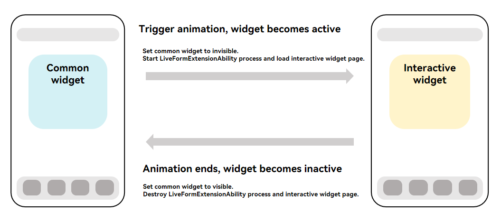
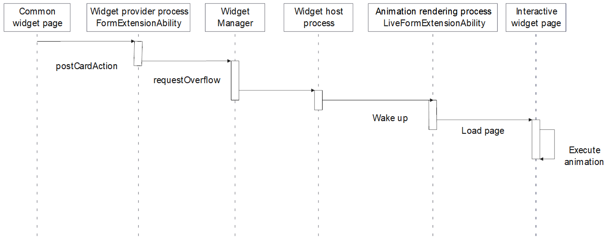
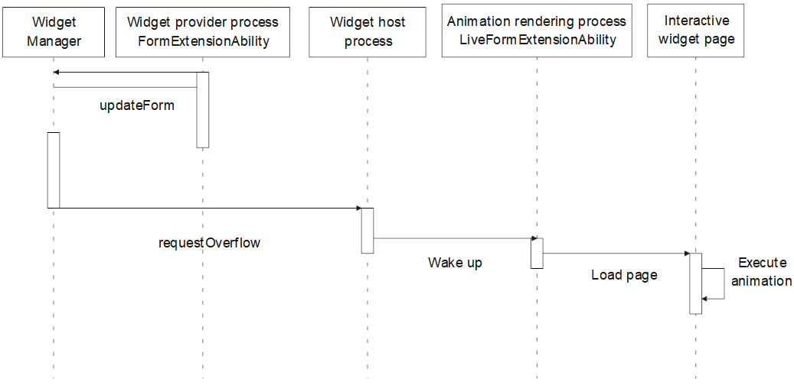
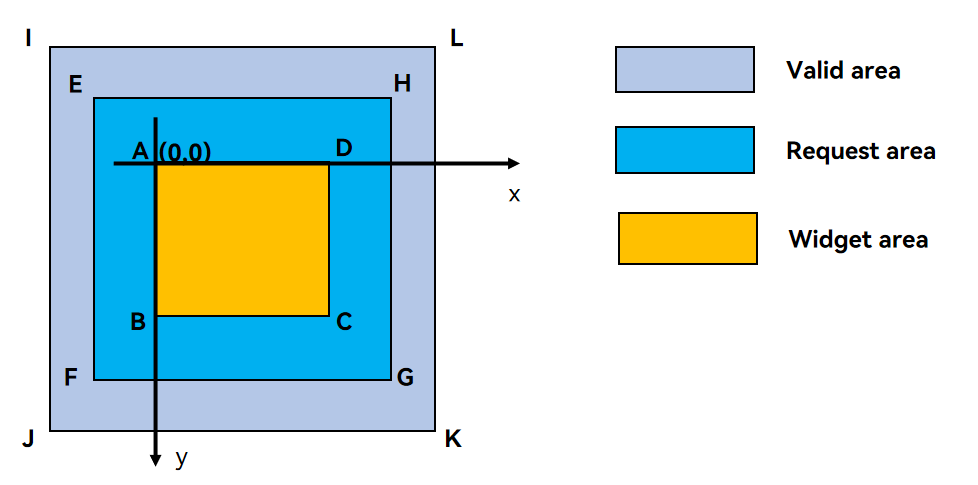

# Overview of Scene-based Widgets

Scene-based widgets support special effects. For example, you can choose to extend the animation beyond the widget rendering area to create an "overflow" effect.

## Basic Concepts

A scene-based widget can be in either active state or inactive state. The widget animation can be triggered when the widget data is interval-based or time-specific updated, or when users interact with the widget (for instance, by tapping). The widget switches to the active state when the animation starts and reverts to the inactive state once the animation ends.

**Inactive state**: The widget is like a common widget and complies with the existing widget development specifications. The widget UI is carried by the content in **widgetCard.ets** of the widget provider.

**Active state**: The interactive widget is rendered. The widget UI is rendered on the page of the [LiveFormExtensionAbility](../reference/apis-form-kit/js-apis-app-form-LiveFormExtensionAbility.md) developed by the widget provider. For details, see [Developing a Scene-based Widget](arkts-ui-liveform-sceneanimation-development.md).

**Figure 1** Switching interactive widget states

**Figure 2** Process of triggering an interactive widget animation

## How to Implement

You can call the [formProvider.requestOverflow](../reference/apis-form-kit/js-apis-app-form-formProvider.md#formproviderrequestoverflow20) API to trigger animations on interactive widgets, for example, when a user taps the widget. The typical timing diagram is as follows.

**Figure 3** Timing diagram of animations triggered by a tap

The following figure shows the timing diagram in interval-based and time-specific updates.

**Figure 4** Timing diagram in interval-based and time-specific updates

## Constraints

### Parameter Request
1. The maximum valid duration of the overflow animation is 3500 ms. When the countdown ends, the widget switches back to the inactive state. <!--Del-->This applies only to third-party applications.<!--DelEnd-->
2. A single widget's animation triggered by interval-based and time-specific updates can occur up to 50 times a day.
3. As illustrated, rectangle ABCD denotes the widget's rendering area, whereas rectangle IJKL indicates the maximum animation area the widget can request. The centers of the two rectangles are aligned. The dimensions meet the requirements described in the following table.

| Dimension | Length of JK| Length of IJ| 
|-------|---------------|---------------|
| 1 * 2 | No greater than 150% of the length of AD.| No greater than 200% of the length of AB.|
| 2 * 2 | No greater than 150% of the length of AD.| No greater than 150% of the length of AB.|
| 2 * 4 | No greater than 125% of the length of AD.| No greater than 150% of the length of AB.|
| 4 * 4 | No greater than 125% of the length of AD.| No greater than 125% of the length of AB.|
| 6 * 4 | No greater than 125% of the length of AD.| No greater than 110% of the length of AB.|

**Figure 5** Rules for requesting the animation area

Example: On a device, a 2×2 widget measures 158vp × 158vp. Referring to the figure above:
1. AD = 158vp, AB = 158vp, IJ = 158 × 1.5 = 237vp, IL = 158 × 1.5 = 237vp
2. Points I and A are horizontally 39.5vp apart and vertically 39.5vp apart.

Thus, with A as the origin (X-axis positive to the right, Y-axis positive downward), the valid coordinates for point E in Figure 5 can be (-20, -20). The valid lengths for sides EF and EH can both be 200vp.

You can call the [formProvider.getFormRect](../reference/apis-form-kit/js-apis-app-form-formProvider.md#formprovidergetformrect20) API to obtain the dimensions and position of the interactive widget in the window. The widget provider calculates the animation request range based on this dimension. For coordinate calculations, point A in the figure is used as the origin (0,0), and the parameters corresponding to rectangle EFGH are calculated, with units in vp.

When [formProvider.requestOverflow](../reference/apis-form-kit/js-apis-app-form-formProvider.md#formproviderrequestoverflow20) is called, the animation rendering area (rectangle EFGH) described in [overflowInfo](../reference/apis-form-kit/js-apis-app-form-formInfo.md#overflowinfo20) must meet the following requirements:
1. It contains the widget (rectangle ABCD).
2. It does not exceed rectangle IJKL (rectangle IJKL completely contains rectangle EFGH). <!--Del-->This applies only to third-party applications.<!--DelEnd-->

For details, see [Developing a Scene-based Widget](arkts-ui-liveform-sceneanimation-development.md).

### Power Consumption
1. When a device enters the power-saving mode, interactive widgets do not respond to animation effect requests.
2. When the device's thermal level reaches WARM, it no longer responds to animation requests triggered by non-tap operations; when the thermal level reaches OVERHEATED, it no longer responds to any animation requests. For details, see [ThermalLevel](../reference/apis-basic-services-kit/js-apis-thermal.md#thermallevel).

### Animation Request
1. At a time, only one widget executes the scene animation.
2. When a user actively triggers an animation effect for an interactive widget (for example, via a tap), this request takes priority. At this point, the current widget switches to the active state and runs the animation, while other widgets switch to the inactive state.
3. Other triggering modes, for example, triggering an animation via interval-based or time-specific update, are based on the first-come, first-served principle. The system processes only the first valid animation request. Other requests return failure and no cache is performed.
4. Other valid operations (such as tapping an application or widget, swiping pages, pulling down to access full search, dual-center, dragging a widget, and long pressing a widget) on the home screen will interrupt the current animation, and the widget will become inactive again. <!--Del-->System applications can suspend some operations on the home screen by configuring the suspend gesture. For details, see [Developing a Scene-based Widget (for System Applications)](arkts-ui-liveform-sceneanimation-development-sys.md).<!--DelEnd-->
5. The interactive widget does not respond to the events that exceed the animation rendering area (rectangle ABCD in Figure 5).
6. For details about the restrictions on the interactive widget in the active state, see [LiveFormExtensionAbility](../reference/apis-form-kit/js-apis-app-form-LiveFormExtensionAbility.md).
