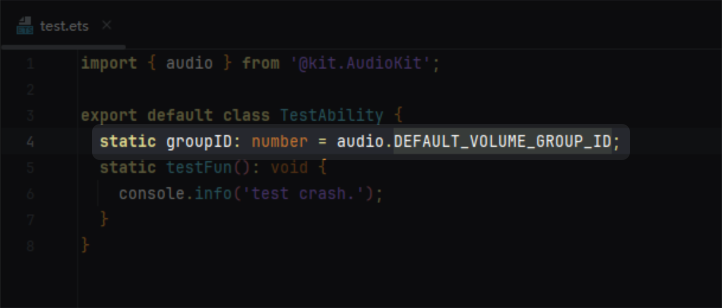

# ArkTS Widget Adaptation FAQs

<!--Kit: Form Kit-->
<!--Subsystem: Ability-->
<!--Owner: @Qian-Win-->
<!--Designer: @cx983299475-->
<!--Tester: @mahailong123456-->
<!--Adviser: @HelloShuo-->
<!-- md-trans-meta sourceCommit=8ab9874d54f8c367c583074e1d2f36e4d070727b translatedAt=2026-08-03T02:24:46.641Z pushedAt=2026-08-03T03:34:59.299Z -->

## Using V2 Decorators for State Management in ArkTS Widgets

ArkTS widget development supports the V2 decorator syntax (such as [\@ObservedV2](../ui/state-management/arkts-new-observedV2-and-trace.md) and [\@ComponentV2](../ui/state-management/arkts-create-custom-components.md#componentv2)). You are advised to use V2 decorators to replace the V1 syntax for state management, so as to achieve better component rendering performance and state synchronization capabilities.

For details about the syntax differences, migration procedure, and sample code, see [V1 to V2 Migration Overview](../ui/state-management/arkts-v1-v2-migration.md).

<!--RP1--><!--RP1End-->

## Adapting ArkTS Widgets to Dark Mode

The system currently supports both light and dark display modes. To provide a better user experience and ensure visual consistency between widgets and pages, ArkTS widgets support light and dark mode adaptation. For details, see [Implementing Dark and Light Mode Adaptation](../ui/ui-dark-light-color-adaptation.md).

## App Crash Caused by Importing particleAbility, audio, camera, media, or backgroundTaskManager Modules

### Symptom

After importing `particleAbility`, `audio`, `camera`, `media`, or `backgroundTaskManager`, the app crashes, and the `FaultLog` points to the relevant call line. 
 
The code line corresponding to the error is as follows: 

### Possible Causes

The `FormExtensionAbility` of ArkTS widgets does not support loading the above modules. For details, see [@ohos.app.form.FormExtensionAbility](../reference/apis-form-kit/js-apis-app-form-formExtensionAbility.md). Forcibly loading these modules results in an `undefined` object, which causes a JS crash when used.

### Solution

Check the import chain of `FormExtensionAbility`, and separate the files that involve the above modules from the files used by the ArkTS widget to prevent them from being loaded by `FormExtensionAbility`.