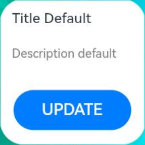

# Transferring Messages to an Application (message Event)

<!--Kit: Form Kit-->
<!--Subsystem: Ability-->
<!--Owner: @Qian-Win-->
<!--Designer: @cx983299475-->
<!--Tester: @mahailong123456-->
<!--Adviser: @HelloShuo-->
<!-- md-trans-meta sourceCommit=a08d450b4f575e3d4749ddeef9dd32275ec0a19e translatedAt=2026-08-03T02:24:42.054Z pushedAt=2026-08-03T06:40:34.229Z -->

On the widget page, you can trigger a message event via the [postCardAction](../reference/apis-arkui/js-apis-postCardAction.md#postcardaction-1) API to launch the [FormExtensionAbility](../reference/apis-form-kit/js-apis-app-form-formExtensionAbility.md). The FormExtensionAbility then notifies the application through the [onFormEvent](../reference/apis-form-kit/js-apis-app-form-formExtensionAbility.md#formextensionabilityonformevent) callback. This process enables the functionality of passing messages to the application after a widget is touched. Subsequently, the FormExtensionAbility refreshes the widget content. Below is a simple example.

> **NOTE**
>
> This topic describes development for dynamic widgets. For static widgets, see [FormLink](../reference/apis-arkui/arkui-ts/ts-container-formlink.md).

- On the widget page, register the **onClick** event callback of the button and call the **postCardAction** API in the callback to trigger the message event to start the FormExtensionAbility. Use [LocalStorageProp](../ui/state-management/arkts-localstorage.md#localstorageprop) to decorate the widget data to be updated.

    <!-- @[update_by_message_card](https://gitcode.com/openharmony/applications_app_samples/blob/master/code/DocsSample/ApplicationModels/StageServiceWidgetCards/entry/src/main/ets/updatebymessage/pages/UpdateByMessageCard.ets) --> 

    ``` TypeScript
    // entry/src/main/ets/updatebymessage/pages/UpdateByMessageCard.ets
    let storageUpdateByMsg = new LocalStorage();
    
    @Entry(storageUpdateByMsg)
    @Component
    struct UpdateByMessageCard {
      // Replace $r('app.string.default_title') and $r('app.string.DescriptionDefault') with the resource files you use.
      @LocalStorageProp('title') title: ResourceStr = $r('app.string.default_title');
      @LocalStorageProp('detail') detail: ResourceStr = $r('app.string.DescriptionDefault');
    
      build() {
        Column() {
          Column() {
            Text(this.title)
              .fontColor('#FFFFFF')
              .opacity(0.9)
              .fontSize(14)
              .margin({ top: '8%', left: '10%' })
            Text(this.detail)
              .fontColor('#FFFFFF')
              .opacity(0.6)
              .fontSize(12)
              .margin({ top: '5%', left: '10%' })
          }.width('100%').height('50%')
          .alignItems(HorizontalAlign.Start)
    
          Row() {
            // ...
            Button() {
              // Replace $r('app.string.update') with the resource file you use.
              Text($r('app.string.update'))
                .fontColor('#45A6F4')
                .fontSize(12)
            }
            .width(120)
            .height(32)
            .margin({ top: '30%', bottom: '10%' })
            .backgroundColor('#FFFFFF')
            .borderRadius(16)
            .onClick(() => {
              postCardAction(this, {
                action: 'message',
                params: { msgTest: 'messageEvent' }
              });
            })
          }.width('100%').height('40%')
          .justifyContent(FlexAlign.Center)
        }
        .width('100%')
        .height('100%')
        .alignItems(HorizontalAlign.Start)
        // Replace $r('app.media.CardEvent') with the resource file you use.
        .backgroundImage($r('app.media.CardEvent'))
        .backgroundImageSize(ImageSize.Cover)
      }
    }
    ```

- Import related modules to **EntryFormAbility.ets**.

    ```TypeScript
    // entry/src/main/ets/entryformability/EntryFormAbility.ts
    import { formBindingData, FormExtensionAbility, formProvider } from '@kit.FormKit';
    import { Configuration, Want } from '@kit.AbilityKit';
    import { BusinessError } from '@kit.BasicServicesKit';
    import { hilog } from '@kit.PerformanceAnalysisKit';
    ``` 

- Call the [updateForm](../reference/apis-form-kit/js-apis-app-form-formProvider.md#formproviderupdateform) API to update the widget in the **onFormEvent** callback of the FormExtensionAbility.

    <!-- @[update_form_interface](https://gitcode.com/openharmony/applications_app_samples/blob/master/code/DocsSample/ApplicationModels/StageServiceWidgetCards/entry/src/main/ets/entryformability/EntryFormAbility.ts) --> 

    ``` TypeScript
    // entry/src/main/ets/entryformability/EntryFormAbility.ts
    const TAG: string = 'EntryFormAbility';
    const DOMAIN_NUMBER: number = 0xFF00;
    
    export default class EntryFormAbility extends FormExtensionAbility {
      // ...
      onFormEvent(formId: string, message: string): void {
        // If the widget supports event triggering, override this method and implement the trigger.
        hilog.info(DOMAIN_NUMBER, TAG, `FormAbility onFormEvent, formId = ${formId}, message: ${message}`);
    
        class FormDataClass {
          title: string = 'Title Update.'; // It matches the widget layout.
          detail: string = 'Description update success.'; // It matches the widget layout.
        }
    
        // Replace it with the actual widget data.
        let formData = new FormDataClass();
        let formInfo: formBindingData.FormBindingData = formBindingData.createFormBindingData(formData);
        formProvider.updateForm(formId, formInfo).then(() => {
          hilog.info(DOMAIN_NUMBER, TAG, 'FormAbility updateForm success.');
        }).catch((error: BusinessError) => {
          hilog.error(DOMAIN_NUMBER, TAG, `Operation updateForm failed. Cause: ${JSON.stringify(error)}`);
        });
      }
    
      // ...
    }
    
    ```

  The figure below shows the effect.

  | Initial State                                               | Tap to Refresh                                             |
  | ------------------------------------------------------- | ----------------------------------------------------- |
  |  |  |