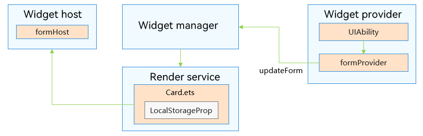
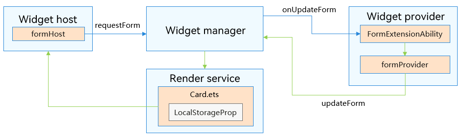
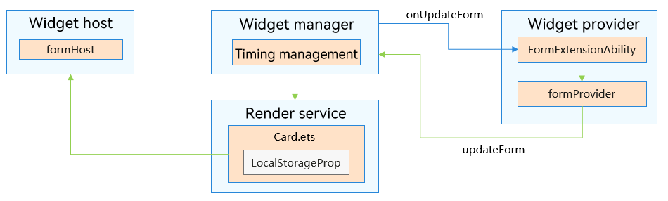

# Overview of ArkTS Widget Update
<!--Kit: Form Kit-->
<!--Subsystem: Ability-->
<!--Owner: @cx983299475-->
<!--Designer: @xueyulong-->
<!--Tester: @chenmingze-->
<!--Adviser: @Brilliantry_Rui-->

Both the widget host (for example, the home screen) and the widget provider can trigger updates to the widget page. Moreover, the widget framework notifies the widget provider of updates according to the scheduled information. Therefore, widget updates include active updates initiated by the widget provider, active updates initiated by the widget host, and interval-based or time-specific updates. In all these update modes, the widget provider is responsible for pushing the widget data to be updated.

## Widget Data Interaction

The ArkTS Widget Manager supports the data interaction between the widget provider (for example, applications) and widget. The widget transfers data to the widget provider through [postCardAction](../reference/apis-arkui/js-apis-postCardAction.md#postcardaction-1), and the widget provider can transfer data to the widget through [updateForm](../reference/apis-form-kit/js-apis-app-form-formProvider.md#formproviderupdateform). After the widget provider transfers data to the widget, the data can be used for page update.

The widget provider and widget are independent of each other. Therefore, data can be transferred only through [LocalStorageProp](../ui/state-management/arkts-localstorage.md#localstorageprop), and the **getContext** method cannot be used. After the widget provider pushes data, the widget UI receives it via **LocalStorageProp**, and converts the received data to a string.

## Page Update Modes

Widgets can be updated actively or passively based on the triggering mode.

### Active Update

Active updates include the updates triggered by the widget provider and the widget host. For details, see [Active Update of ArkTS Widgets](arkts-ui-widget-active-refresh.md).

**Figure 1** Flowchart of active update by the widget provider

If there is a need to update widget data, the widget provider, as long as it is running, can proactively update the widget using the [updateForm](../reference/apis-form-kit/js-apis-app-form-formProvider.md#formproviderupdateform) API provided by formProvider.

**Figure 2** Flowchart of active update by the widget host

If changes in system language or color scheme are detected, the widget host, as long as it is running, can proactively request to update the widget using the **requestForm** API provided by formHost. The Widget Manager then instructs the widget provider to complete the update.

### Passive Update

Passive update includes interval-based update and time-specific update<!--Del-->, and conditional update<!--DelEnd-->. For details, see [Passive Update of ArkTS Widgets](arkts-ui-widget-passive-refresh.md).

Interval-based update: The widget content will be automatically updated at the specified interval by calling [onUpdateForm](../reference/apis-form-kit/js-apis-app-form-formExtensionAbility.md#formextensionabilityonupdateform).

Time-specific update: The widget content will be automatically updated at a designated time every day.

<!--Del-->
Conditional update: The widget is updated when a certain condition is met. Currently, it is triggered when the network status of a device changes from unavailable to available.
<!--DelEnd-->

**Figure 3** Flowchart of interval-based and time-specific updates by the widget provider

Based on the scheduled update information configured by the widget provider, the widget manager determines whether to instruct the provider to update the widget, considering factors such as timing information, widget visibility status, and the number of updates.

## Constraints

1. The widget provider is only allowed to update its own widgets.

2. The widget host is only allowed to update the widgets added to it.
