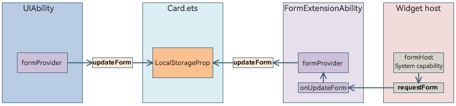

# Widget Data Interaction

The ArkTS widget framework provides the [updateForm](../reference/apis-form-kit/js-apis-app-form-formProvider.md#updateform) and **requestForm** APIs to proactively trigger widget updates. You can use [LocalStorageProp](../quick-start/arkts-localstorage.md#localstorageprop) to check the widget data to be updated.

| API | System Capability | Constraints |
| -------- | -------- | -------- |
| updateForm | No | 1. Invoked by the widget provider. 2. Allows only the widget provider to update its own widgets. |
| requestForm | Yes | 1. Invoked by the widget host. 2. Allows only the widget host to update the widgets added to it. |

The following are the typical use cases of widget updates:

- [Configuring a Widget to Update Periodically](arkts-ui-widget-update-by-time.md)
- [Updating Local and Online Images in the Widget](arkts-ui-widget-image-update.md)
- [Updating Widget Content by State](arkts-ui-widget-update-by-status.md)
