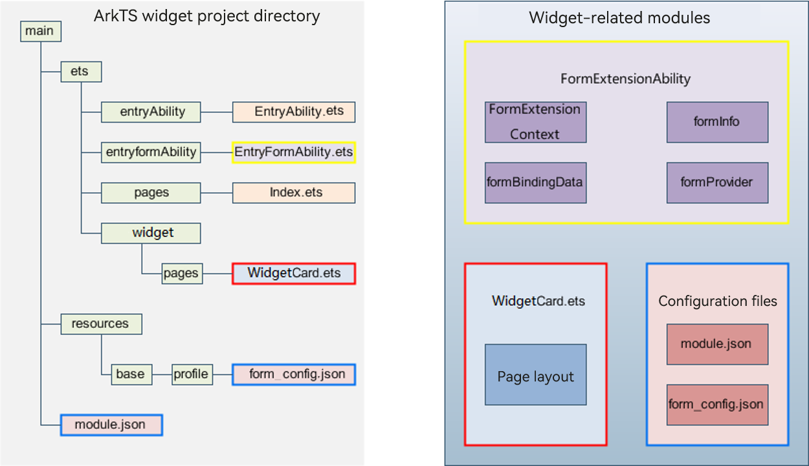

# ArkTS Widget Related Modules

**Figure 1** ArkTS widget related modules

- [FormExtensionAbility](../reference/apis-form-kit/js-apis-app-form-formExtensionAbility.md): provides lifecycle callbacks invoked when a widget is created, destroyed, or updated.

- [FormExtensionContext](../reference/apis-form-kit/js-apis-inner-application-formExtensionContext.md): provides context for FormExtensionAbilities. You can use the APIs of this module to start FormExtensionAbilities.

- [formProvider](../reference/apis-form-kit/js-apis-app-form-formProvider.md): provides APIs related to the widget provider. You can use the APIs to update a widget, set the next update time for a widget, obtain widget information, and request a widget release.

- [formInfo](../reference/apis-form-kit/js-apis-app-form-formInfo.md): provides types and enums related to the widget information and state.

- [formBindingData](../reference/apis-form-kit/js-apis-app-form-formBindingData.md): provides APIs for widget data binding. You can use the APIs to create a **FormBindingData** object and obtain related information.

- [Page layout (WidgetCard.ets)](arkts-ui-widget-page-overview.md): provides APIs for the declarative UI paradigm.
  - [Capabilities exclusive to ArkTS widgets](arkts-ui-widget-event-overview.md): include the **postCardAction** API used for interaction between the widget internal and the provider application and can be called only in the widget.
  - [ArkTS widget capability list](arkts-ui-widget-page-overview.md#page-capabilities-supported-by-arkts-widgets): contain the APIs, components, events, attributes, and lifecycle callbacks that can be used in ArkTS widgets.

- [Widget configuration](arkts-ui-widget-configuration.md): includes FormExtensionAbility configuration and widget configuration.
  - Configure the FormExtensionAbility information under **extensionAbilities** in the [module.json5 file](../quick-start/module-configuration-file.md).
  - Configure the widget configuration information (**WidgetCard.ets**) in the [form_config.json](arkts-ui-widget-configuration.md) file in **resources/base/profile**.
