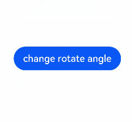
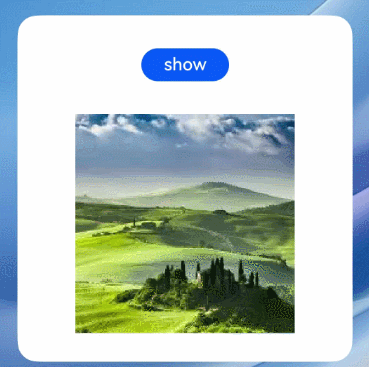

# Using Animations in ArkTS Widgets


To make your ArkTS widgets more engaging, you can apply animations to it, including [explicit animation](../reference/apis-arkui/arkui-ts/ts-explicit-animation.md), [property animation](../reference/apis-arkui/arkui-ts/ts-animatorproperty.md), and [component transition](../reference/apis-arkui/arkui-ts/ts-transition-animation-component.md). Just note the following restrictions when using the animations in ArkTS widgets.

**Table 1** Restrictions on animation parameters

| Name| Description| Description|
| -------- | -------- | -------- |
| duration | Animation playback duration| The maximum value is 1 second. If a larger value is set, the animation is still played for 1 second.|
| tempo | Animation playback speed.| Do not set this parameter in the widget. Use the default value 1.|
| delay | Animation delay duration.| Do not set this parameter in the widget. Use the default value 0.|
| iterations | Number of times that the animation is played.| Do not set this parameter in the widget. Use the default value 1.|

>**NOTE**
>
>Static widgets do not support animations.

## Component Animation
The following sample code uses the [animation](../reference/apis-arkui/arkui-ts/ts-animatorproperty.md) API to implement the animation effect of button rotation.




```ts
// entry/src/main/ets/widget/pages/WidgetCard.ets
@Entry
@Component
struct AnimationCard {
  @State rotateAngle: number = 0;

  build() {
    Row() {
      Button('change rotate angle')
        .height('20%')
        .width('90%')
        .margin('5%')
        .onClick(() => {
          this.rotateAngle = (this.rotateAngle === 0 ? 90 : 0);
        })
        .rotate({ angle: this.rotateAngle })
        .animation({
          curve: Curve.EaseOut,
          playMode: PlayMode.Normal,
        })
    }.height('100%').alignItems(VerticalAlign.Center)
  }
}
```
## Transition Animation
The following sample code uses the [transition](../reference/apis-arkui/arkui-ts/ts-transition-animation-component.md) API to implement the animation effect of image appearance and disappearance.



```ts
// entry/src/main/ets/widget/pages/WidgetCard.ets
@Entry
@Component
struct TransitionEffectExample1 {
  @State flag: boolean = true;
  @State show: string = 'show';

  build() {
    Column() {
      Button(this.show).width(80).height(30).margin(30)
        .onClick(() => {
          // Tap the button to show or hide the image.
          if (this.flag) {
            this.show = 'hide';
          } else {
            this.show = 'show';
          }
          this.flag = !this.flag;
        })
      if (this.flag) {
        // Apply the same transition effect to the appearance and disappearance of the image.
        // When the image appears, it changes from the state where the opacity is 0 and the rotation angle is 180° around the z-axis to the state where the opacity is 1 and the rotation angle is 0°. The durations of the opacity and rotation animations are both 1000 ms.
        // When the image disappears, it changes from the state where the opacity is 1 and the rotation angle is 0° to the state where the opacity is 0 and the rotation angle is 180° around the z-axis. The durations of the opacity and rotation animations are both 1000 ms.
        Image($r('app.media.testImg')).width(200).height(200)
          .transition(TransitionEffect.OPACITY.animation({ duration: 1000, curve: Curve.Ease }).combine(
            TransitionEffect.rotate({ z: 1, angle: 180 })
          ))
      }
    }.width('100%')
  }
}
```
