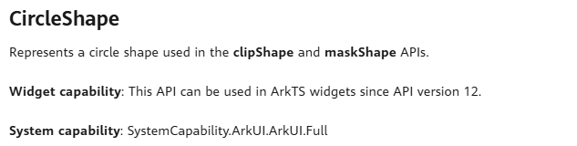

# Widget Page Capability Overview

ArkTS widgets are developed using the general <!--RP1--> [ArkTS language](../quick-start/arkts-get-started.md)<!--RP1End-->. You can use the [declarative paradigm](../ui/arkts-ui-development-overview.md) to develop ArkTS widget pages.
The following widget pages are automatically generated by a DevEco Studio template. You can adjust the pages based on the real-world service scenarios.

## Page Capabilities Supported by ArkTS Widgets

ArkTS widgets have all capabilities of JS widgets, and support animations, custom drawing, and support capabilities auch as components, events, animations, data management, and status management of [declarative paradigm](../ui/arkts-ui-development-overview.md).

For APIs that can be used in ArkTS widgets, the tag **Widget capability** is added. Since API version x, these APIs can be used in ArkTS widgets. Pay attention to the capability differences in the widget scenario.

For example, the following description indicates that CircleShape can be used in ArkTS widgets. 

