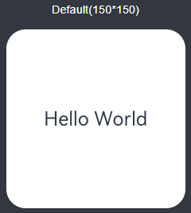

# Overview of ArkTS Widget UI Development

<!--Kit: Form Kit-->
<!--Subsystem: Ability-->
<!--Owner: @Qian-Win-->
<!--Designer: @cx983299475-->
<!--Tester: @mahailong123456-->
<!--Adviser: @HelloShuo-->
<!-- md-trans-meta sourceCommit=a08d450b4f575e3d4749ddeef9dd32275ec0a19e translatedAt=2026-08-03T02:28:51.192Z pushedAt=2026-08-03T07:06:36.410Z -->

ArkTS widgets are developed using the general <!--RP1-->[ArkTS language](../quick-start/arkts-get-started.md)<!--RP1End-->. You can use the [ArkTS-based declarative development paradigm](../ui/arkts-ui-development-overview.md) to develop ArkTS widget pages.

The following widget pages are automatically generated by a DevEco Studio template. You can adjust the pages based on the real-world service scenarios.

## Page Capabilities Supported by ArkTS Widgets

ArkTS widgets possess all capabilities of JS widgets and have additionally introduced animation and custom drawing capabilities. They support some components, events, animations, data management, and state management capabilities within the [ArkTS-based declarative development paradigm](../ui/arkts-ui-development-overview.md).

For APIs that can be used in ArkTS widgets, a description (for example) will be added as follows: "Widget capability: This API can be used in ArkTS widgets since API version 12." Pay attention to the capability differences in the widget scenario.

For example, the following description indicates that CircleShape can be used in ArkTS widgets. 

