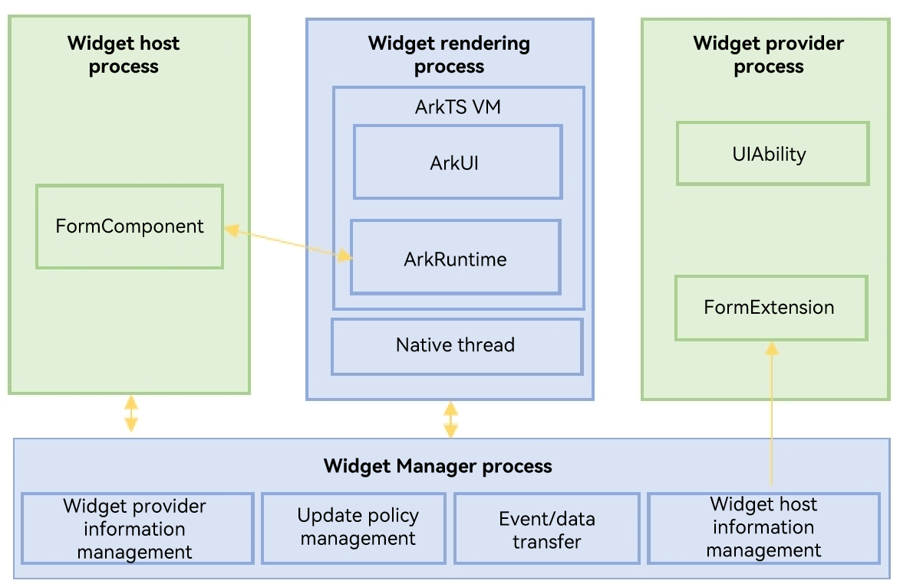

# ArkTS Widget Process Model
This section describes the processes of a widget from creation to display. For details, see the figure below.

**Figure 1** Widget process model  

- Widget host process: a host process that displays the widget UI, for example, the home screen process.
- Widget rendering process: a process that loads and renders widget UIs in the system. All widgets are rendered in the same process, and different widget UIs are isolated by VMs.
- Widget Manager process: a System Service ([SA](../application-models/serviceability-overview.md)) for unifying the widget lifecycle.
- Widget provider process: an application process that provides widgets, including the main process running the UIAbility of the application and the independent [FormExtensionAbility](../reference/apis-form-kit/js-apis-app-form-formExtensionAbility.md) process of the widget. The memory of the two processes is isolated, but they share the same file sandbox.
