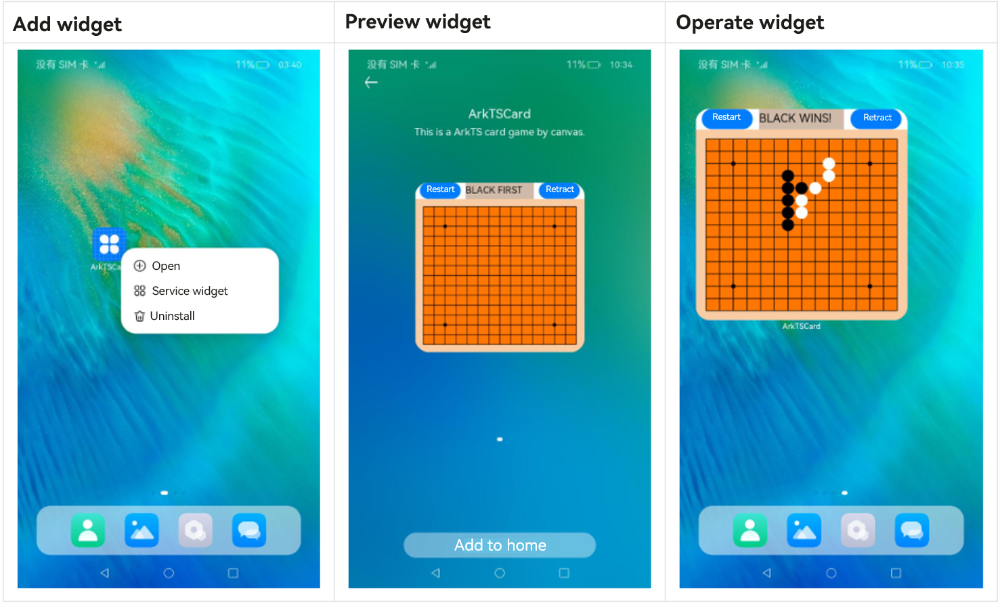
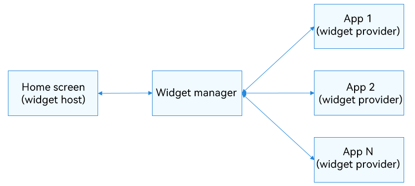

# About This Kit

<!--Kit: Form Kit-->
<!--Subsystem: Ability-->
<!--Owner: @Qian-Win-->
<!--Designer: @cx983299475-->
<!--Tester: @mahailong123456-->
<!--Adviser: @HelloShuo-->
<!-- md-trans-meta sourceCommit=3edaa5b1ef57ca1c685062ffe3ecc4ab1a1eab51 translatedAt=2026-08-03T02:28:50.537Z pushedAt=2026-08-03T07:41:46.685Z -->

Form Kit provides a development framework and APIs for embedding app information on the home screen<!--RP3--><!--RP3End-->. It allows you to extract important information or frequently used operations from an app into service widgets (widgets for short). By adding widgets to the home screen<!--RP3--><!--RP3End-->, you can achieve convenient information display and direct service access.

## Scenarios for Widget Usage

- Supported device types: phones, tablets, PCs/2-in-1 devices, TVs, wearables, and head units. Lightweight smart wearable devices do not support this Kit.

- Supported application types: Widgets can be developed in both applications and atomic services.

- Supported positions: Users can add widgets to the home screen <!--RP3--><!--RP3End-->. Widgets cannot be embedded in common applications.

- To use a widget:

1. Touch and hold an application icon on the home screen to display the shortcut menu.

2. Tap <!--Del-->**Service**<!--DelEnd-->**widget**, go to the widget management page, and preview the widget.

3. Tap the **Add to home** button. You can then view<!--Del--> and operate<!--DelEnd--> the widget on the home screen.

**Figure 1** Typical procedure of using a widget 

<!--RP2-->

<!--RP2End-->

## Widget Architecture

**Figure 2** Widget architecture 

**Fundamental Concepts in Widget Usage Scenarios**

- Widget host: an application that displays the widget content and controls the widget location. It enables direct user interactions and manages widget addition, deletion, and display. An example is the home screen in the preceding figure.

- Widget provider: an application or atomic service that provides the widget. It is responsible for implementing the widget features, including designing the UI, updating data, and handling click interactions.

- Widget manager: a system service within the operating system that manages all widget information on the device. As a bridge between widget providers and hosts, it offers capabilities such as querying, adding, and deleting widget information to the hosts, and provides notifications like widget addition, deletion, refresh, and click events to the providers.

## Features

- Information display: Key information from applications or atomic services is displayed on the home screen as widgets. The information can be updated periodically so that users can view relevant information at any time.

- Instant service access: Users can perform quick actions by touching buttons within the widget and can also navigate to the corresponding functional pages of the application or atomic service, achieving seamless one-step service access.

## Development Modes

**Model Selection**

The system currently supports two application development models: stage and FA. Consequently, Form Kit accommodates both models for widget development, with a preference for the stage model.

**UI Development Paradigm Selection**

- The stage model allows for two UI development paradigms for widgets: ArkTS-based declarative development paradigm (for developing ArkTS widgets) and web-like development paradigm (for developing JS widgets).

- The FA model supports only the development of JS widgets with the web-like development paradigm.

ArkTS widgets and JS widgets have different implementation principles and features. The following table lists the differences in capabilities.

| Category        | JS Widget   | ArkTS Widget |
| ------------ | --------- | ---------- |
| Development paradigm    | Web-like paradigm| Declarative paradigm|
| Component capability    | Supported     | Supported      |
| Layout capability    | Supported     | Supported      |
| Event capability    | Supported     | Supported      |
| Custom animation  | Not supported   | Supported      |
| Custom drawing  | Not supported   | Supported      |
| Logic code execution| Not supported   | Supported      |

## Related Kits

- Ability Kit: Form Kit relies on the Extension abilities of Ability Kit for its internal implementation and interacts with Ability Kit during lifecycle scheduling.

- ArkUI: Form Kit widget providers can use some components, events, animations, and state management capabilities provided by ArkUI on their pages.

<!--RP1--><!--RP1End-->