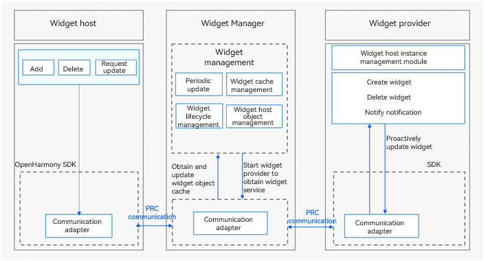

# JS Widget Overview

JS widgets, developed using a web-like paradigm (HML + CSS + JSON), now support two [application models](../application-models/application-models.md): the FA model and the stage model. For details, see [Developing a JS Widget (Stage Model)](js-ui-widget-development.md) and [Developing a JS Widget (FA Model)](widget-development-fa.md). When developing a new widget, you are advised to use the ArkTS declarative syntax to build UIs. For details about the differences between the declarative paradigm and web-like paradigm, see [Introduction to ArkUI](../ui/arkui-overview.md).

## How to Implement

Below shows the working principles of the widget framework.

**Figure 1** Working principles

The widget host consists of the following modules:

- Widget usage: provides operations such as creating, deleting, or updating a widget.

- Communication adapter: provided by the SDK for communication with the Widget Manager. It sends widget-related operations to the Widget Manager.

The Widget Manager consists of the following modules:

- Periodic update: starts a scheduled task based on the update policy to periodically update a widget after it is added to the Widget Manager.

- Cache manager: caches view information of a widget after it is added to the Widget Manager. This enables the cached data to be directly returned when the widget is obtained next time, greatly reducing the latency.

- Lifecycle manager: suspends update when a widget is switched to the background or is blocked, and updates and/or clears widget data during upgrade and deletion.

- Object manager: manages RPC objects of the widget host. It is used to verify requests from the widget host and process callbacks after the widget update.

- Communication adapter: communicates with the widget host and provider through RPCs.

The widget provider consists of the following modules:

- Widget service: implemented by the widget provider developer to process requests on widget creation, update, and deletion, and to provide corresponding widget services.

- Instance manager: implemented by the widget provider developer for persistent management of widget instances allocated by the Widget Manager.

- Communication adapter: provided by the SDK for communication with the Widget Manager. It pushes update data to the Widget Manager.

> **NOTE**
> 
> You only need to develop the widget provider. The system automatically handles the work of the widget host and Widget Manager.
