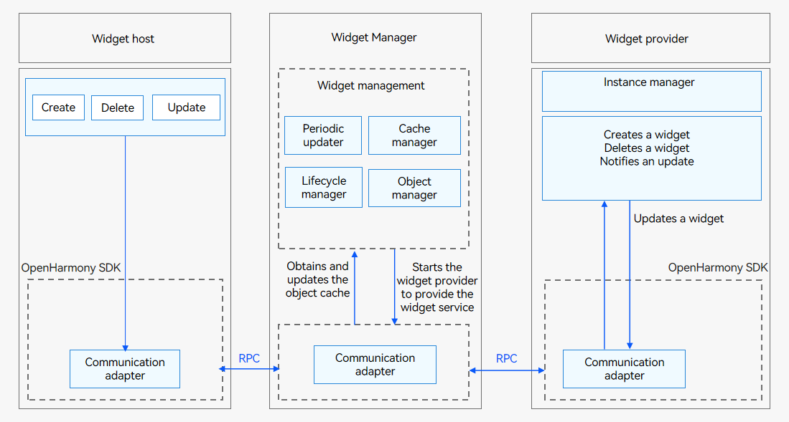

# Service Widget Development in FA Model


## Widget Overview

A service widget (also called widget) is a set of UI components that display important information or operations specific to an application. It provides users with direct access to a desired application service, without the need to open the application first.

A widget usually appears as a part of the UI of another application (which currently can only be a system application) and provides basic interactive features such as opening a UI page or sending a message.

Before you get started, it would be helpful if you have a basic understanding of the following concepts:

- Widget host: an application that displays the widget content and controls the widget location.

- Widget Manager: a resident agent that provides widget management features such as periodic widget updates.

- Widget provider: an atomic service that provides the widget content to display and controls how widget components are laid out and how they interact with users.


## Working Principles

Figure 1 shows the working principles of the widget framework.

**Figure 1** Widget framework working principles in the FA model



The widget host consists of the following modules:

- Widget usage: provides operations such as creating, deleting, or updating a widget.

- Communication adapter: provided by the OpenHarmony SDK for communication with the Widget Manager. It sends widget-related operations to the Widget Manager.

The Widget Manager consists of the following modules:

- Periodic updater: starts a scheduled task based on the update policy to periodically update a widget after it is added to the Widget Manager.

- Cache manager: caches view information of a widget after it is added to the Widget Manager to directly return the cached data when the widget is obtained next time. This reduces the latency greatly.

- Lifecycle manager: suspends update when a widget is switched to the background or is blocked, and updates and/or clears widget data during upgrade and deletion.

- Object manager: manages RPC objects of the widget host. It is used to verify requests from the widget host and process callbacks after the widget update.

- Communication adapter: communicates with the widget host and provider through RPCs.

The widget provider consists of the following modules:

- Widget service: implemented by the widget provider developer to process requests on widget creation, update, and deletion, and to provide corresponding widget services.

- Instance manager: implemented by the widget provider developer for persistent management of widget instances allocated by the Widget Manager.

- Communication adapter: provided by the OpenHarmony SDK for communication with the Widget Manager. It pushes update data to the Widget Manager.

> **NOTE**
>
> You only need to develop the widget provider. The system automatically handles the work of the widget host and Widget Manager.


## Available APIs

The **FormAbility** has the following APIs.

| API| Description|
| -------- | -------- |
| onCreate(want: Want): formBindingData.FormBindingData | Called to notify the widget provider that a widget has been created.|
| onCastToNormal(formId: string): void | Called to notify the widget provider that a temporary widget has been converted to a normal one.|
| onUpdate(formId: string): void | Called to notify the widget provider that a widget has been updated.|
| onVisibilityChange(newStatus: Record&lt;string, number&gt;): void | Called to notify the widget provider of the change in widget visibility.|
| onEvent(formId: string, message: string): void | Called to instruct the widget provider to receive and process a widget event.|
| onDestroy(formId: string): void | Called to notify the widget provider that a widget has been destroyed.|
| onAcquireFormState?(want: Want): formInfo.FormState | Called to instruct the widget provider to receive the status query result of a widget.|
| onShare?(formId: string): {[key: string]: any} | Called by the widget provider to receive shared widget data.|
| onShareForm?(formId:&nbsp;string):&nbsp;Record&lt;string,&nbsp;Object&gt; | Called by the widget provider to receive shared widget data. You are advised to use this API, instead of **onShare()**. If this API is implemented, **onShare()** will not be triggered.|

The **FormProvider** class has the following APIs. For details, see [FormProvider](../reference/apis-form-kit/js-apis-app-form-formProvider.md).


| API| Description|
| -------- | -------- |
| setFormNextRefreshTime(formId: string, minute: number, callback: AsyncCallback&lt;void&gt;): void;| Sets the next refresh time for a widget. This API uses an asynchronous callback to return the result.|
| setFormNextRefreshTime(formId: string, minute: number): Promise&lt;void&gt;;| Sets the next refresh time for a widget. This API uses a promise to return the result.|
| updateForm(formId: string, formBindingData: FormBindingData, callback: AsyncCallback&lt;void&gt;): void; | Updates a widget. This API uses an asynchronous callback to return the result.|
| updateForm(formId: string, formBindingData: FormBindingData): Promise&lt;void&gt;; | Updates a widget. This API uses a promise to return the result.|


The **FormBindingData** class has the following APIs. For details, see [FormBindingData](../reference/apis-form-kit/js-apis-app-form-formBindingData.md).


| API| Description|
| -------- | -------- |
| createFormBindingData(obj?: Object \ string): FormBindingData| | Creates a **FormBindingData** object.|


## How to Develop

The widget provider development based on the [FA model](../application-models/fa-model-development-overview.md) involves the following key steps:

- [Implementing Widget Lifecycle Callbacks](#implementing-widget-lifecycle-callbacks): Develop the **FormAbility** lifecycle callback functions.

- [Configuring the Widget Configuration File](#configuring-the-widget-configuration-file): Configure the application configuration file **config.json**.

- [Persistently Storing Widget Data](#persistently-storing-widget-data): Perform persistent management on widget information.

- [Updating Widget Data](#updating-widget-data): Call **updateForm()** to update the information displayed on a widget.

- [Developing the Widget UI Page](#developing-the-widget-ui-page): Use HML+CSS+JSON to develop a JS widget UI page.

- [Developing Widget Events](#developing-widget-events): Add the router and message events for a widget.


### Implementing Widget Lifecycle Callbacks

To create a widget in the FA model, implement the widget lifecycle callbacks. For details about how to generate a service widget template, see <!--RP1-->[Creating a Service Widget](https://developer.huawei.com/consumer/en/doc/harmonyos-guides-V5/ide-service-widget-V5)<!--RP1End-->.

1. Import related modules to **form.ts**.
   
    ```ts
    import type featureAbility from '@ohos.ability.featureAbility';
    import type Want from '@ohos.app.ability.Want';
    import formBindingData from '@ohos.app.form.formBindingData';
    import formInfo from '@ohos.app.form.formInfo';
    import formProvider from '@ohos.app.form.formProvider';
    import dataPreferences from '@ohos.data.preferences';
    import hilog from '@ohos.hilog';
    ```

2. Implement the widget lifecycle callbacks in **form.ts**.
   
    ```ts
    const TAG: string = '[Sample_FAModelAbilityDevelop]';
    const domain: number = 0xFF00;
    
    const DATA_STORAGE_PATH: string = 'form_store';
    let storeFormInfo = async (formId: string, formName: string, tempFlag: boolean, context: featureAbility.Context): Promise<void> => {
      // Only the widget ID (formId), widget name (formName), and whether the widget is a temporary one (tempFlag) are persistently stored.
      let formInfo: Record<string, string | number | boolean> = {
        'formName': 'formName',
        'tempFlag': 'tempFlag',
        'updateCount': 0
      };
      try {
        const storage = await dataPreferences.getPreferences(context, DATA_STORAGE_PATH);
        // Put the widget information.
        await storage.put(formId, JSON.stringify(formInfo));
        hilog.info(domain, TAG, `storeFormInfo, put form info successfully, formId: ${formId}`);
        await storage.flush();
      } catch (err) {
        hilog.error(domain, TAG, `failed to storeFormInfo, err: ${JSON.stringify(err as Error)}`);
      }
    };
    
    let deleteFormInfo = async (formId: string, context: featureAbility.Context) => {
      try {
        const storage = await dataPreferences.getPreferences(context, DATA_STORAGE_PATH);
        // Delete the widget information.
        await storage.delete(formId);
        hilog.info(domain, TAG, `deleteFormInfo, del form info successfully, formId: ${formId}`);
        await storage.flush();
      } catch (err) {
        hilog.error(domain, TAG, `failed to deleteFormInfo, err: ${JSON.stringify(err)}`);
      }
    }
    
    class LifeCycle {
      onCreate: (want: Want) => formBindingData.FormBindingData = (want) => ({ data: '' });
      onCastToNormal: (formId: string) => void = (formId) => {
      };
      onUpdate: (formId: string) => void = (formId) => {
      };
      onVisibilityChange: (newStatus: Record<string, number>) => void = (newStatus) => {
        let obj: Record<string, number> = {
          'test': 1
        };
        return obj;
      };
      onEvent: (formId: string, message: string) => void = (formId, message) => {
      };
      onDestroy: (formId: string) => void = (formId) => {
      };
      onAcquireFormState?: (want: Want) => formInfo.FormState = (want) => (0);
      onShareForm?: (formId: string) => Record<string, Object> = (formId) => {
        let obj: Record<string, number> = {
          'test': 1
        };
        return obj;
      };
    }
    
    let obj: LifeCycle = {
      onCreate(want: Want) {
        hilog.info(domain, TAG, 'FormAbility onCreate');
        if (want.parameters) {
          let formId = String(want.parameters['ohos.extra.param.key.form_identity']);
          let formName = String(want.parameters['ohos.extra.param.key.form_name']);
          let tempFlag = Boolean(want.parameters['ohos.extra.param.key.form_temporary']);
          // Persistently store widget data for subsequent use, such as instance acquisition and update.
          // Implement this API based on project requirements.
          hilog.info(domain, TAG, 'FormAbility onCreate' + formId);
          storeFormInfo(formId, formName, tempFlag, this.context);
        }
  
        // Called when the widget is created. The widget provider should return the widget data binding class.
        let obj: Record<string, string> = {
          'title': 'titleOnCreate',
          'detail': 'detailOnCreate'
        };
        let formData: formBindingData.FormBindingData = formBindingData.createFormBindingData(obj);
        return formData;
      },
      onCastToNormal(formId: string) {
        // Called when the widget host converts the temporary widget into a normal one. The widget provider should do something to respond to the conversion.
        hilog.info(domain, TAG, 'FormAbility onCastToNormal');
      },
      onUpdate(formId: string) {
        // Override this method to support scheduled updates, periodic updates, or updates requested by the widget host.
        hilog.info(domain, TAG, 'FormAbility onUpdate');
        let obj: Record<string, string> = {
          'title': 'titleOnUpdate',
          'detail': 'detailOnUpdate'
        };
        let formData: formBindingData.FormBindingData = formBindingData.createFormBindingData(obj);
        // Call the updateForm() method to update the widget. Only the data passed through the input parameter is updated. Other information remains unchanged.
        formProvider.updateForm(formId, formData).catch((error: Error) => {
          hilog.error(domain, TAG, 'FormAbility updateForm, error:' + JSON.stringify(error));
        });
      },
      onVisibilityChange(newStatus: Record<string, number>) {
        // Called when the widget host initiates an event about visibility changes. The widget provider should do something to respond to the notification. This callback takes effect only for system applications.
        hilog.info(domain, TAG, 'FormAbility onVisibilityChange');
      },
      onEvent(formId: string, message: string) {
        // If the widget supports event triggering, override this method and implement the trigger.
        let obj: Record<string, string> = {
          'title': 'titleOnEvent',
          'detail': 'detailOnEvent'
        };
        let formData: formBindingData.FormBindingData = formBindingData.createFormBindingData(obj);
        // Call the updateForm() method to update the widget. Only the data passed through the input parameter is updated. Other information remains unchanged.
        formProvider.updateForm(formId, formData).catch((error: Error) => {
          hilog.error(domain, TAG, 'FormAbility updateForm, error:' + JSON.stringify(error));
        });
        hilog.info(domain, TAG, 'FormAbility onEvent');
      },
      onDestroy(formId: string) {
        // Delete widget data.
        hilog.info(domain, TAG, 'FormAbility onDestroy');
        // Delete the persistent widget instance data.
        // Implement this API based on project requirements.
        deleteFormInfo(formId, this.context);
      },
      onAcquireFormState(want: Want) {
        hilog.info(domain, TAG, 'FormAbility onAcquireFormState');
        return formInfo.FormState.READY;
      }
    };
  
    export default obj;
    ```

> **NOTE**
>
> FormAbility cannot reside in the background. Therefore, continuous tasks cannot be processed in the widget lifecycle callbacks.

### Configuring the Widget Configuration File

The widget configuration file is named **config.json**. Find the **config.json** file for the widget and edit the file depending on your need.

- The **js** module in the **config.json** file provides JavaScript resources of the widget. The internal structure is described as follows: 
    | Name| Description| Data Type| Initial Value Allowed|
  | -------- | -------- | -------- | -------- |
  | name | Name of a JavaScript component. The default value is **default**.| String| No|
  | pages | Route information about all pages in the JavaScript component, including the page path and page name. The value is an array, in which each element represents a page. The first element in the array represents the home page of the JavaScript FA.| Array| No|
  | window | Window-related configurations.| Object| Yes|
  | type | Type of the JavaScript component. The value can be:<br>**normal**: indicates an application instance.<br>**form**: indicates a widget instance.| String| Yes (initial value: **normal**)|
  | mode | Development mode of the JavaScript component.| Object| Yes (initial value: left empty)|

  Example configuration:

  
  ```json
  "js": [
    // ...
    {
      "name": "widget",
      "pages": [
        "pages/index/index"
      ],
      "window": {
        "designWidth": 720,
        "autoDesignWidth": true
    	},
        "type": "form"
      }
    ]
  ```
  
- The **abilities** module in the **config.json** file corresponds to **FormAbility** of the widget. The internal structure is described as follows:
    | Name| Description| Data Type| Initial Value Allowed|
  | -------- | -------- | -------- | -------- |
  | name | Class name of a widget. The value is a string with a maximum of 127 bytes.| String| No|
  | description | Description of the widget. The value can be a string or a resource index to descriptions in multiple languages. The value is a string with a maximum of 255 bytes.| String| Yes (initial value: left empty)|
  | isDefault | Whether the widget is a default one. Each ability has only one default widget.<br>**true**: The widget is the default one.<br>**false**: The widget is not the default one.| Boolean| No|
  | type | Type of the widget. The value can be:<br>**JS**: indicates a JavaScript-programmed widget.| String| No|
  | colorMode | Color mode of the widget.<br>**auto**: The widget adopts the auto-adaptive color mode.<br>**dark**: The widget adopts the dark color mode.<br>**light**: The widget adopts the light color mode.| String| Yes (initial value: **auto**)|
  | supportDimensions | Grid styles supported by the widget.<br>**1 * 2**: indicates a grid with one row and two columns.<br>**2 * 2**: indicates a grid with two rows and two columns.<br>**2 * 4**: indicates a grid with two rows and four columns.<br>**4 * 4**: indicates a grid with four rows and four columns.| String array| No|
  | defaultDimension | Default grid style of the widget. The value must be available in the **supportDimensions** array of the widget.| String| No|
  | updateEnabled | Whether the widget can be updated periodically.<br>**true**: The widget can be updated at a specified interval (**updateDuration**) or at the scheduled time (**scheduledUpdateTime**). **updateDuration** takes precedence over **scheduledUpdateTime**.<br>**false**: The widget cannot be updated periodically.| Boolean| No|
  | scheduledUpdateTime | Scheduled time to update the widget. The value is in 24-hour format and accurate to minute.<br>**updateDuration** takes precedence over **scheduledUpdateTime**. If both are specified, the value specified by **updateDuration** is used.| String| Yes (initial value: **0:0**)|
  | updateDuration | Interval to update the widget. The value is a natural number, in the unit of 30 minutes.<br>If the value is **0**, this field does not take effect.<br>If the value is a positive integer *N*, the interval is calculated by multiplying *N* and 30 minutes.<br>**updateDuration** takes precedence over **scheduledUpdateTime**. If both are specified, the value specified by **updateDuration** is used.| Number| Yes (initial value: **0**)|
  | formConfigAbility | Link to a specific page of the application. The value is a URI.| String| Yes (initial value: left empty)|
  | formVisibleNotify | Whether the widget is allowed to use the widget visibility notification.| String| Yes (initial value: left empty)|
  | jsComponentName | Component name of the widget. The value is a string with a maximum of 127 bytes.| String| No|
  | metaData | Metadata of the widget. This field contains the array of the **customizeData** field.| Object| Yes (initial value: left empty)|
  | customizeData | Custom information about the widget.| Object array| Yes (initial value: left empty)|

  Example configuration:

  
  ```json
  "abilities": [
    // ...
    {
      "name": ".FormAbility",
      "srcPath": "FormAbility",
      "description": "$string:FormAbility_desc",
      "icon": "$media:icon",
      "label": "$string:FormAbility_label",
      "type": "service",
      "formsEnabled": true,
      "srcLanguage": "ets",
      "forms": [
        {
          "jsComponentName": "widget",
          "isDefault": true,
          "scheduledUpdateTime": "10:30",
          "defaultDimension": "2*2",
          "name": "widget",
          "description": "This is a service widget.",
          "colorMode": "auto",
          "type": "JS",
          "formVisibleNotify": true,
          "supportDimensions": [
            "2*2"
          ],
          "updateEnabled": true,
          "updateDuration": 1
        }
      ]
    },
    // ...
  ]
  ```


### Persistently Storing Widget Data

A widget provider is usually started when it is needed to provide information about a widget. The Widget Manager supports multi-instance management and uses the widget ID to identify an instance. If the widget provider supports widget data modification, it must persistently store the data based on the widget ID, so that it can access the data of the target widget when obtaining, updating, or starting a widget. You should override **onDestroy** to implement widget data deletion.


```ts
const TAG: string = '[Sample_FAModelAbilityDevelop]';
const domain: number = 0xFF00;

const DATA_STORAGE_PATH: string = 'form_store';
let storeFormInfo = async (formId: string, formName: string, tempFlag: boolean, context: featureAbility.Context): Promise<void> => {
  // Only the widget ID (formId), widget name (formName), and whether the widget is a temporary one (tempFlag) are persistently stored.
  let formInfo: Record<string, string | number | boolean> = {
    'formName': 'formName',
    'tempFlag': 'tempFlag',
    'updateCount': 0
  };
  try {
    const storage = await dataPreferences.getPreferences(context, DATA_STORAGE_PATH);
    // Put the widget information.
    await storage.put(formId, JSON.stringify(formInfo));
    hilog.info(domain, TAG, `storeFormInfo, put form info successfully, formId: ${formId}`);
    await storage.flush();
  } catch (err) {
    hilog.error(domain, TAG, `failed to storeFormInfo, err: ${JSON.stringify(err as Error)}`);
  }
};

let deleteFormInfo = async (formId: string, context: featureAbility.Context) => {
  try {
    const storage = await dataPreferences.getPreferences(context, DATA_STORAGE_PATH);
    // Delete the widget information.
    await storage.delete(formId);
    hilog.info(domain, TAG, `deleteFormInfo, del form info successfully, formId: ${formId}`);
    await storage.flush();
  } catch (err) {
    hilog.error(domain, TAG, `failed to deleteFormInfo, err: ${JSON.stringify(err)}`);
  }
}

// ...
  onCreate(want: Want) {
    hilog.info(domain, TAG, 'FormAbility onCreate');
    if (want.parameters) {
      let formId = String(want.parameters['ohos.extra.param.key.form_identity']);
      let formName = String(want.parameters['ohos.extra.param.key.form_name']);
      let tempFlag = Boolean(want.parameters['ohos.extra.param.key.form_temporary']);
      // Persistently store widget data for subsequent use, such as instance acquisition and update.
      // Implement this API based on project requirements.
      hilog.info(domain, TAG, 'FormAbility onCreate' + formId);
      storeFormInfo(formId, formName, tempFlag, this.context);
    }

    // Called when the widget is created. The widget provider should return the widget data binding class.
    let obj: Record<string, string> = {
      'title': 'titleOnCreate',
      'detail': 'detailOnCreate'
    };
    let formData: formBindingData.FormBindingData = formBindingData.createFormBindingData(obj);
    return formData;
  },
// ...

let deleteFormInfo = async (formId: string, context: featureAbility.Context): Promise<void> => {
  try {
    const storage = await dataPreferences.getPreferences(context, DATA_STORAGE_PATH);
    // Delete the widget information.
    await storage.delete(formId);
    hilog.info(domain, TAG, `deleteFormInfo, del form info successfully, formId: ${formId}`);
    await storage.flush();
  } catch (err) {
    hilog.error(domain, TAG, `failed to deleteFormInfo, err: ${JSON.stringify(err)}`);
  }
};

// ...
    // Override onDestroy to implement widget data deletion.
  onDestroy(formId: string) {
    // Delete widget data.
    hilog.info(domain, TAG, 'FormAbility onDestroy');
    // Delete the persistent widget instance data.
    // Implement this API based on project requirements.
    deleteFormInfo(formId, this.context);
  }
// ...
```

For details about how to implement persistent data storage, see [Application Data Persistence Overview](../database/app-data-persistence-overview.md).

The **Want** object passed in by the widget host to the widget provider contains a flag that specifies whether the requested widget is normal or temporary.

- Normal widget: a widget persistently used by the widget host, for example, a widget added to the home screen.

- Temporary widget: a widget temporarily used by the widget host, for example, the widget displayed when you swipe up on a widget application.

Converting a temporary widget to a normal one: After you swipe up on a widget application, a temporary widget is displayed. If you touch the pin button on the widget, it is displayed as a normal widget on the home screen.

Data of a temporary widget will be deleted on the Widget Manager if the widget framework is killed and restarted. The widget provider, however, is not notified of the deletion and still keeps the data. Therefore, the widget provider needs to clear the data of temporary widgets proactively if the data has been kept for a long period of time. If the widget host has converted a temporary widget into a normal one, the widget provider should change the widget data from temporary storage to persistent storage. Otherwise, the widget data may be deleted by mistake.


### Updating Widget Data

When an application initiates a scheduled or periodic update, the application obtains the latest data and calls **updateForm()** to update the widget.


```ts
const TAG: string = '[Sample_FAModelAbilityDevelop]';
const domain: number = 0xFF00;

onUpdate(formId: string) {
  // Override this method to support scheduled updates, periodic updates, or updates requested by the widget host.
  hilog.info(domain, TAG, 'FormAbility onUpdate');
  let obj: Record<string, string> = {
    'title': 'titleOnUpdate',
    'detail': 'detailOnUpdate'
  };
  let formData: formBindingData.FormBindingData = formBindingData.createFormBindingData(obj);
  // Call the updateForm() method to update the widget. Only the data passed through the input parameter is updated. Other information remains unchanged.
  formProvider.updateForm(formId, formData).catch((error: Error) => {
    hilog.error(domain, TAG, 'FormAbility updateForm, error:' + JSON.stringify(error));
  });
}
```


### Developing the Widget UI Page

You can use the web-like paradigm (HML+CSS+JSON) to develop JS widget pages. This section describes how to develop a page shown below.


> **NOTE**
>
> In the FA model, only the JavaScript-based web-like development paradigm is supported when developing the widget UI.

- HML: uses web-like paradigm components to describe the widget page information.
  
  ```html
  <div class="container">
      <stack>
          <div class="container-img">
              <image src="/common/widget.png" class="bg-img"></image>
              <image src="/common/rect.png" class="bottom-img"></image>
          </div>
          <div class="container-inner">
              <text class="title" onclick="routerEvent">{{title}}</text>
              <text class="detail_text" onclick="messageEvent">{{detail}}</text>
          </div>
      </stack>
  </div>
  ```
  
- CSS: defines style information about the web-like paradigm components in HML.
  
  ```css
  .container {
      flex-direction: column;
      justify-content: center;
      align-items: center;
  }
  
  .bg-img {
      flex-shrink: 0;
      height: 100%;
      z-index: 1;
  }
  
  .bottom-img {
      position: absolute;
      width: 150px;
      height: 56px;
      top: 63%;
      background-color: rgba(216, 216, 216, 0.15);
      filter: blur(20px);
      z-index: 2;
  }
  
  .container-inner {
      flex-direction: column;
      justify-content: flex-end;
      align-items: flex-start;
      height: 100%;
      width: 100%;
      padding: 12px;
  }
  
  .title {
      font-family: HarmonyHeiTi-Medium;
      font-size: 14px;
      color: rgba(255,255,255,0.90);
      letter-spacing: 0.6px;
  }

  .detail_text {
      font-family: HarmonyHeiTi;
      font-size: 12px;
      color: rgba(255,255,255,0.60);
      letter-spacing: 0.51px;
      text-overflow: ellipsis;
      max-lines: 1;
      margin-top: 6px;
  }
  ```
  
- JSON: defines data and event interaction on the widget UI page.
  
  ```json
  {
    "data": {
      "title": "TitleDefault",
      "detail": "TextDefault"
    },
    "actions": {
      "routerEvent": {
        "action": "router",
        "abilityName": "com.samples.famodelabilitydevelop.MainAbility",
        "params": {
          "message": "add detail"
        }
      },
      "messageEvent": {
        "action": "message",
        "params": {
          "message": "add detail"
        }
      }
    }
  }
  ```


### Developing Widget Events

You can set router and message events for components on a widget. The router event applies to ability redirection, and the message event applies to custom click events. The key steps are as follows:

1. Set the **onclick** field in the HML file to **routerEvent** or **messageEvent**, depending on the **actions** settings in the JSON file.

2. Set the router event.
   - **action**: **"router"**, which indicates a router event.
   - **abilityName**: name of the ability to redirect to (PageAbility component in the FA model and UIAbility component in the stage model). For example, the default UIAbility name created by DevEco Studio in the FA model is com.example.entry.EntryAbility.
   - **params**: custom parameters passed to the target ability. Set them as required. The value can be obtained from **parameters** in **want** used for starting the target ability. For example, in the lifecycle function **onCreate** of the EntryAbility in the FA model, **featureAbility.getWant()** can be used to obtain **want** and its **parameters** field.

3. Set the message event.
   - **action**: **"message"**, which indicates a message event.
   - **params**: custom parameters of the message event. Set them as required. The value can be obtained from **message** in the widget lifecycle function **onEvent**.

The following is an example:

- HML file:
  
  ```html
  <div class="container">
      <stack>
          <div class="container-img">
              <image src="/common/widget.png" class="bg-img"></image>
              <image src="/common/rect.png" class="bottom-img"></image>
          </div>
          <div class="container-inner">
              <text class="title" onclick="routerEvent">{{title}}</text>
              <text class="detail_text" onclick="messageEvent">{{detail}}</text>
          </div>
      </stack>
  </div>
  ```
  
- CSS file:
  
  ```css
  .container {
      flex-direction: column;
      justify-content: center;
      align-items: center;
  }
  
  .bg-img {
      flex-shrink: 0;
      height: 100%;
      z-index: 1;
  }
  
  .bottom-img {
      position: absolute;
      width: 150px;
      height: 56px;
      top: 63%;
      background-color: rgba(216, 216, 216, 0.15);
      filter: blur(20px);
      z-index: 2;
  }
  
  .container-inner {
      flex-direction: column;
      justify-content: flex-end;
      align-items: flex-start;
      height: 100%;
      width: 100%;
      padding: 12px;
  }
  
  .title {
      font-family: HarmonyHeiTi-Medium;
      font-size: 14px;
      color: rgba(255,255,255,0.90);
      letter-spacing: 0.6px;
  }

  .detail_text {
      font-family: HarmonyHeiTi;
      font-size: 12px;
      color: rgba(255,255,255,0.60);
      letter-spacing: 0.51px;
      text-overflow: ellipsis;
      max-lines: 1;
      margin-top: 6px;
  }
  ```
  
- JSON file:
  
  ```json
  {
    "data": {
      "title": "TitleDefault",
      "detail": "TextDefault"
    },
    "actions": {
      "routerEvent": {
        "action": "router",
        "abilityName": "com.samples.famodelabilitydevelop.MainAbility",
        "params": {
          "message": "add detail"
        }
      },
      "messageEvent": {
        "action": "message",
        "params": {
          "message": "add detail"
        }
      }
    }
  }
  ```
